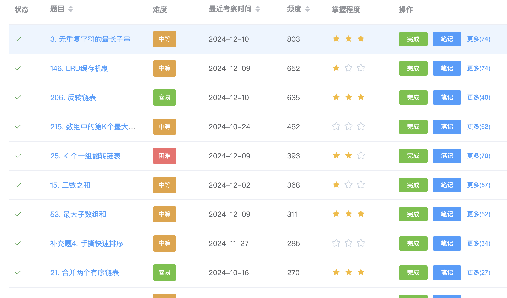
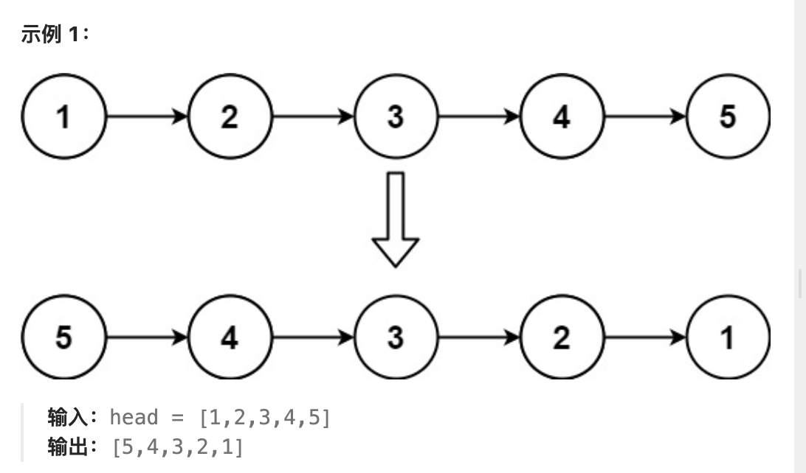
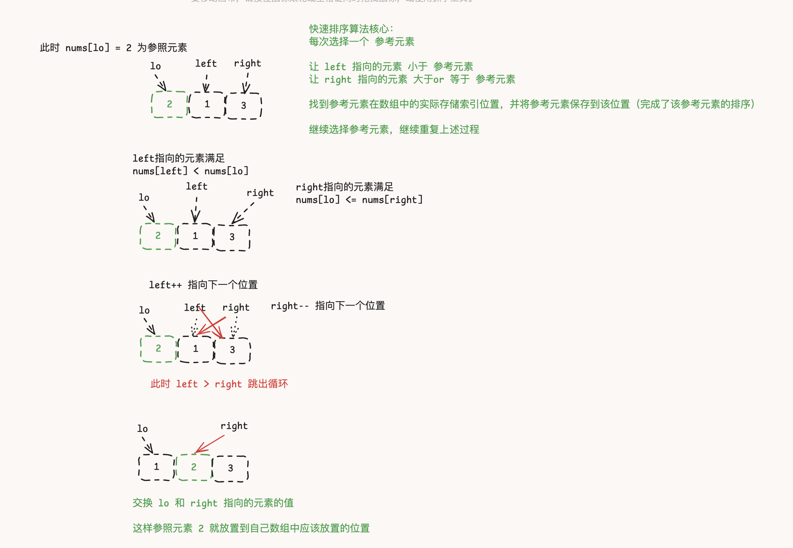
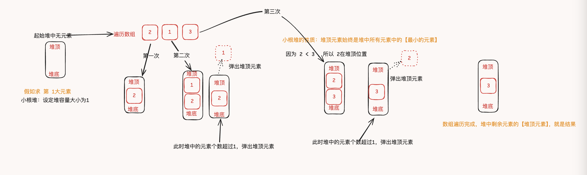
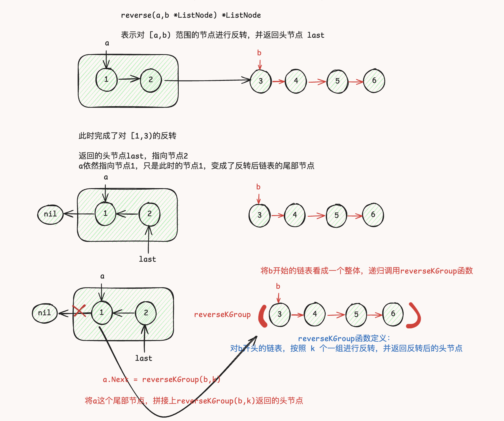
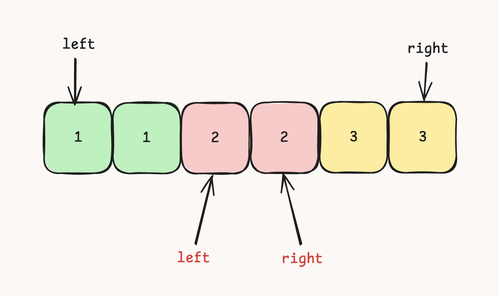
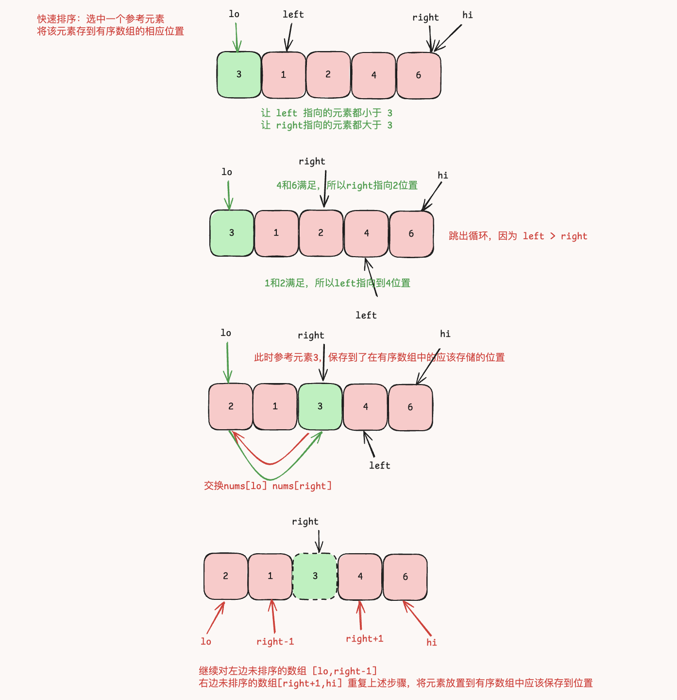
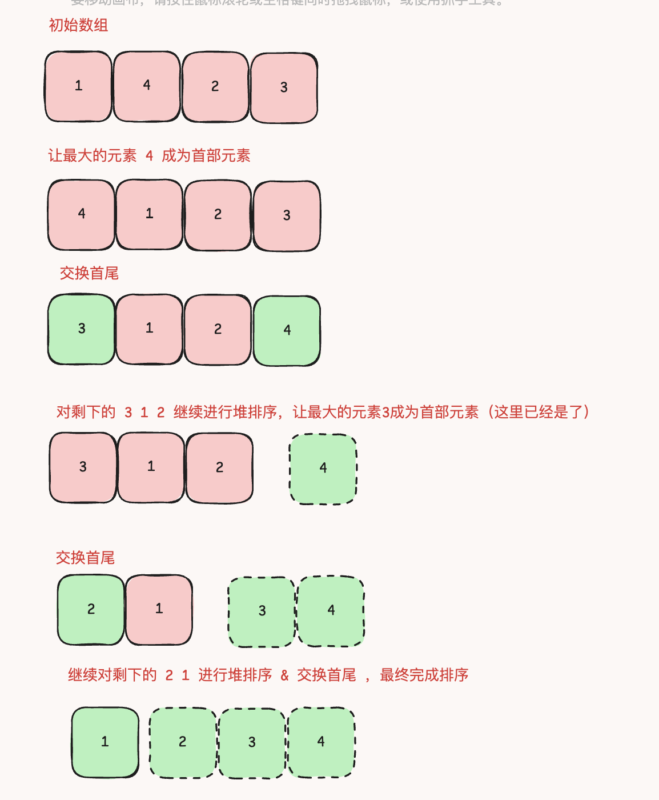
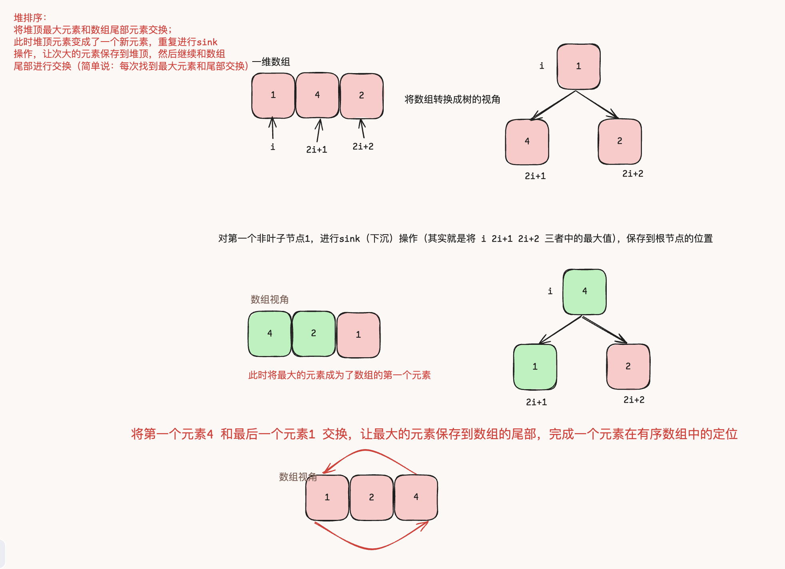

[TOC]

# 前言

学习新知识的核心就在于 **重复 + 重复 + 重复**

本人也是从一无所知开始尝试刷算法，中间断断续续痛苦/纠结/无能狂怒。第1次的时候，整人是蒙圈的，看着别人的标准答案慢慢的摸索算法的含义，那真是一支笔一杯茶，一道力扣刷一天。当重复到第5次的时候，开始有些感觉了，看到题目的标题，就可以立刻回想到题目的大概的解题方向，但是很多细节还是脑袋一团浆糊，那就继续重复，当到了第8次的时候，突然就觉得就是这样的，很容易记住呀，不过如此呀。

刷题（本质就是背诵）我们的目的就是要去面试，所以题目尽可能的要选择命中率高的题库去刷，而不是力扣的题目从第一题开始，意义不大。当背诵了300道题目以后，去面试的时候，只要考算法题目，我其实很兴奋的（因为背的很熟悉），刷过的题目的命中率还挺高的。

大家不要把算法题想象的过于高大上，既然是题目，那就是有答案和解题套路的。背诵答案 + 总结解题套路，同类型的题目即使你题目都看的懵懵懂懂，都有可能蒙出来。

本文章题目都是来源于 https://codetop.cc/home  里面考察频度高的题目，都是面试后人工标记出来的（面试命中率高）。我写这个文章的目的，就是提供一份参考答案，包括代码每行的含义，以及通用的套路。因为一旦理解了，按照自己的方式去记忆会容易很多。
只需要用这个网站作为题目**是否做过**的标记即可（因为笔记功能要收费），自己的答案直接保存在力扣官方刷题网站上



这里还有一份适合小白的算法书  https://www.hello-algo.com/  在Github上还挺火的。我个人觉得也可拿来扫下盲，或者刷题遇到理解上的困难可以拿来看看。


# 解题套路

解题套路可以先简单看下，当遇到相关的题目，可以回来再细细品味

## 滑动窗口解题套路

- 定义 `left right := 0,0` 指向起始位置 `0`
- 让 `right`不断的右移，当遇到不符合题意的条件`condition`，停止移动 `right`
- 然后开始让`left`不断右移，直到条件`condition`得到满足，继续重复👆的步骤，右移`right`
- 当 `right`越界，全部结束

动态规划套路伪代码

```go
nums := []int{1,2,3,4,5,6}
func main() {
  
  //1. 定义 `left right := 0,0` 指向起始位置 `0`
  left, right := 0,0
  
  // right 越界结束
  for right < len(nums) {
    
    // 2.不断移动 right
    val := nums[right]
    right++ 
    
    // do something.....
    
    // 3.当 condition 不符合题意的时候，移动 left，直到满足题意，跳出 condition
    for  condition {
      val := nums[left]
      left++
    }
    
    //.......
  }
}
```

滑动窗口解题套路主要流程是包括

- `left right`的定义 
-  `condition`条件的选取（这个要结合题意）
- 以及两个`for`循环


## 动态规划解题套路

动态规划难点就是在于递推关系的发现，这个只能从具体的题目中来感受。如果说理解+ 背诵题目的话，其实动态规划的题目又是最容易记忆和理解的

- 明确`dp`数组的定义
- 明确 `dp[i]`和 `dp[i-1]`之间递推关系的定义(这个是动态规划的难点，其实说白了，就是要根据题意，找`dp[i]`和 `dp[i-1]`的关系 )，形式上看起来和高中学过的函数推到关系是一摸一样的，比如 `f(x) = f(x-1) + f(x-2)`

在实现代码的时候包括三个方面：

- 创建`dp`数组
- 初始化`dp`数组（需要特殊处理的值）
- 遍历 `nums`数组，实现一般性的递推关系

伪代码

```go
func main() {
  nums := []int{1,2,3,4}
  
  //1.定义 dp 数组
  
  dp := make([]int,len(nums))
  
  //2. 初始化 dp 数组（根据题目要求也可能不需要这一步骤）
  
  for k := range dp {
    dp[k] = 1
  }
  
  //3. 遍历 `nums`数组，实现一般性的递推关系
  
  for i := 0;i < len(nums);i++ {
    dp[i] = dp[i-1] + 1 // 比如：这里的递推关系为：前一个的 dp[i-1]的基础上，加1
  }
  
  //......
}
```

有一道动态规划最简单的入门题目 斐波那契数  https://leetcode.cn/problems/fei-bo-na-qi-shu-lie-lcof/ 可以来体会下上面说的套路

LCR 126. 斐波那契数

**斐波那契数** （通常用 `F(n)` 表示）形成的序列称为 **斐波那契数列** 。该数列由 **0** 和 **1** 开始，后面的每一项数字都是前面两项数字的和。也就是：

> F(0) = 0
>
> F(1) = 1
>
> F(n) = F(n - 1) + F(n - 2)，其中 n > 1

给定 `n` ，请计算 `F(n)` 。答案需要取模 1e9+7(1000000007) ，如计算初始结果为：1000000008，请返回 1。

思路：

- `dp`定义： 在 `i`位置的数字和 `dp[i]`
- `dp`递推关系：每一项数字都是前面两项数字的和，所以有 `dp[i] = dp[i-1] + dp[i-2]`

其实，题目已经直接给出了 递推关系 `F(n) = F(n-1)+F(n-2)`，但是大部分的题目是不会给出，需要我们结合题目自己是思考这个递推关系。

```go
func fib(n int) int {
    
  	//1. 定义 dp 数组
    dp := make([]int,n+1)
  	
    for i := 0; i <= n;i++ {
      	// 2. 初始化 （需要特殊处理的值）
        if i == 0 {
            dp[i] = 0
        } else if i == 1 { // 2. 初始化 （需要特殊处理的值）
            dp[i] = 1
        } else{
          	// 3. 递推关系 实现
             dp[i] = (dp[i-1] + dp[i-2]) % 1000000007 // 这个是题目要求【取模】
        }
    }
  	// 4. 返回 F(n) 的结果，即 dp[n]
    return dp[n]    
}
```


# CodeTop参考答案

## 3.无重复字符的最长字串 （滑动窗口）

给定一个字符串 `s` ，请你找出其中不含有重复字符的 **最长 子串** 的长度

```
示例1
输入: s = "abcabcbb"
输出: 3 
解释: 因为无重复字符的最长子串是 "abc"，所以其长度为 3。
```

思路：

- 理解**子串**的含义：**子字符串** **是字符串中连续的** **非空** **字符序列。** 比如：`abc`的字串 `abc ab bc`等，但是 `ac`就不是字串，因为`a`和`c`并不连续，中间间隔了`b`
- 滑动窗口：保证 `left right`之间的字符没有重复出现。用`win`记录字符出现的次数，当`conditon`为 `win`中当某个字符出现次数 `>1`，保持 `right`不变，移动 `left`直至条件重新成立。

```go
func lengthOfLongestSubstring(s string) int {
    //滑动窗口【左右边界】
    left,right := 0,0

    // 记录窗口中字符出现的次数
    win := make(map[byte]int)

    result := 0
		
  	// 匿名函数，求最大值
    max := func (a ,b int) int {
        if a > b {
            return a
        }
        return b
    }
  
  	
    for right < len(s) {
				// 移动右边界+1
        ch := s[right] 
        right++ 
      	// 窗口中字符出现的次数+1
        win[ch]++
      	
	
        for win[ch] > 1 { //当字符出现的次数多于1次，说明滑动窗口中存在重复字符，不符合题意；需要移动左边界，把重复字符删掉，保证滑动窗口的字符数量都是1个，满足题意
            d := s[left]
            left++
            win[d]--
        }

        // 当前窗口中的字符数量
        result = max(result,right-left)
    }
    return result
}

```


## 146. LRU缓存

请你设计并实现一个满足 [LRU (最近最少使用) 缓存](https://baike.baidu.com/item/LRU) 约束的数据结构。

实现 `LRUCache` 类：

- `LRUCache(int capacity)` 以 **正整数** 作为容量 `capacity` 初始化 LRU 缓存
- `int get(int key)` 如果关键字 `key` 存在于缓存中，则返回关键字的值，否则返回 `-1` 。
- `void put(int key, int value)` 如果关键字 `key` 已经存在，则变更其数据值 `value` ；如果不存在，则向缓存中插入该组 `key-value` 。如果插入操作导致关键字数量超过 `capacity` ，则应该 **逐出** 最久未使用的关键字。

函数 `get` 和 `put` 必须以 `O(1)` 的平均时间复杂度运行。

思路：

- LRU是Least Recently Used的缩写，即最近最少使用，是一种常用的[页面置换算法](https://baike.baidu.com/item/页面置换算法/7626091?fromModule=lemma_inlink)，选择最近最久未使用的页面予以淘汰。该算法赋予每个[页面](https://baike.baidu.com/item/页面/5544813?fromModule=lemma_inlink)一个访问字段，用来记录一个页面自上次被访问以来所经历的时间 t，当须淘汰一个页面时，选择现有页面中其 t 值最大的，即最近最少使用的页面予以淘汰。（也就是当需要淘汰数据的时候，选择最久没有被使用的数据淘汰，刚刚使用的数据不要淘汰）
- 记忆点：两个数据结构 `map +  list `， `map`用于快速的判断`key`是否存在并获取到值，`list`用于记录【刚被访问】和【很久没访问】的数组，当需要淘汰数据的时候，直接从链表尾部淘汰即可。

```go
type LRUCache struct {
  	m map[int]*list.Element // 为了满足，题目要求的 o(1)的平均时间复杂度
    l *list.List // 链表：【刚被访问】数据在链表头部，【很久没访问】数据在链表尾部（当需要淘汰时，尾部的数据直接删除）
    cap int // 容量
}


type Data struct {
    Key int
    Value int
}

// 构造 LRUCache 对象
func Constructor(capacity int) LRUCache {
    cache := LRUCache{}
    cache.m = make(map[int]*list.Element,capacity)
    cache.l = list.New()
    cache.cap = capacity
    return cache
}

// Get 获取
func (this *LRUCache) Get(key int) int {
  	// 存在
    if v,ok := this.m[key];ok { 
      	//移动到头部（因为刚被访问了）
        this.l.MoveToFront(v)
      	//返回当前值
        return v.Value.(Data).Value
    }
  	// 不存在直接返回 -1
    return -1
}


// Put 修改
func (this *LRUCache) Put(key int, value int)  {
  	// 不存在
    if v,ok := this.m[key];!ok {
      	// 容量已经满了～～
        if this.cap == this.l.Len() { 
          	// 删除最久没访问的（也就是链表尾部元素）
            data := this.l.Remove(this.l.Back())
          	// 同时 map 中也要删除
            delete(this.m,data.(Data).Key) 
        }
        //新增（刚被访问过）
        e := this.l.PushFront(Data{key,value})
        this.m[key] = e

    }else { // 存在
      	// 修改数值
        v.Value = Data{key,value} 
      	// 同时移动到头部（刚被访问过）
        this.l.MoveToFront(v)
    }
}
```


## 206. 反转链表

给你单链表的头节点 `head` ，请你反转链表，并返回反转后的链表。



思路：

- **对于递归算法，最重要的就是明确递归函数的定义**。具体来说，我们的 `reverseList` 函数定义是这样的：**输入一个节点 `head`，将「以 `head` 为起点」的链表反转，并返回反转之后的【头结点】**。

```go
// 递归算法 reverseList 函数的定义：将「以 head 为起点」的链表反转，并返回反转之后的【头结点】
func reverseList(head *ListNode) *ListNode {
  	// 当没有节点 or 只有一个节点的时候，直接返回head
    if head == nil || head.Next == nil {
        return head
    }
		
  	// 这里表示：将「以 head.Next 为起点」的链表反转，并返回反转之后的【头结点】
    last := reverseList(head.Next)
    head.Next.Next = head
    head.Next = nil
    return res
}
```


- 对于**迭代算法**，我们只需要定义一个前驱节点 `pre`，每次用当前节点`cur`替换 前驱节点`pre`

```go
func reverseList(head *ListNode) *ListNode {
  	// 前驱节点 pre
    var pre *ListNode = nil
    
    for head != nil {

        temp := head.Next // 临时保存后缀节点

        head.Next = pre //将head.Next 指向pre
        pre = head //  head 变成新的前驱节点pre

        head = temp // 继续下一个节点
    }
    return pre
}
```


## 215. 数组中的第K个最大元素

给定整数数组 `nums` 和整数 `k`，请返回数组中第  `k` 个最大的元素。请注意，你需要找的是数组排序后的第 `k` 个最大的元素，而不是第 `k` 个不同的元素。你必须设计并实现时间复杂度为 `O(n)` 的算法解决此问题。

```
示例 1:

输入: [3,2,1,5,6,4], k = 2
输出: 5

```

思路:

- 第一种解法：利用**快速排序**算法，找到第 `k`个最大的元素

```go
func findKthLargest(nums []int, k int) int {

    //求第k大的元素，假如数组按照正序已经排列好了，那么第k大元素的索引位置为：len(nums)-k

    targetIndex := len(nums) - k

    lo,hi := 0,len(nums)-1

    for {
      	// 先确定某一个元素的索引位置
        idx := quickSort(nums,lo,hi) 
      	// 如果索引位置和 预期的targetIndex相同，说明找到了该元素
        if targetIndex == idx {
            return nums[idx]
        } else if targetIndex < idx { // 想找的元素索引位于左边，收缩 hi
            hi = idx-1
        } else { // 想找的元素索引位于右边，收缩 lo
            lo = idx+1
        }
    }

    return 0
}

// quickSort 快速排序，找一个参照元素v，使左边的元素都小于v，右边的元素都大于等于v，从而确定v在数组中的存储索引位置
func quickSort(nums []int ,lo,hi int) int {
    
    v := nums[lo] // 参照元素值

    left := lo+1
    right := hi
  	
  	// 保证 left <= right 的前提下
    for left <= right {
      	
      	// 让left指向的元素都要比v小
        for left <= right && v > nums[left] { 
            left++
        }
				// 让right指向的元素都要比v大or相等
        for left <= right && v <= nums[right] { 
            right--
        }
      	
        if left > right {
            break
        }

        // 执行到这里，说明left和right的元素不满足 nums[left] < v <= nums[right] 即left小right大的规则，交换left和right，重新满足条件
        nums[left],nums[right] = nums[right],nums[left]
    }

    // 最后交换 lo和right 例如 2 13，执行到这里，left指向 3 right指向 1，最后需要交换1和2的位置
    nums[lo],nums[right] = nums[right],nums[lo]
    return right
}
```



- 第二个种解法：利用**小根堆**，保持堆中元素的数量最多 K 个。当超过 K 个元素，弹出堆顶元素，遍历数组中的所有元素，并经过 小根堆的过滤。当所有元素遍历完成后，堆顶元素就是第K大的元素

```go
// 利用小根堆，堆大小设定为k。遍历数组，将元素直接保存到堆中；保证的堆大小维持在 <=k
// 当所有的元素经过堆以后，最后堆堆顶元素就是结果
type MinHeap struct {
    data []int
}

func (m *MinHeap)Swap(i,j int) {
    m.data[i],m.data[j] = m.data[j],m.data[i]
}

func(m *MinHeap)Len() int {
    return len(m.data)
}

func (m *MinHeap)Less(i,j int) bool {
    return m.data[i] < m.data[j]
}

func (m *MinHeap)Push(x any) {
    m.data = append(m.data,x.(int))
}

func (m *MinHeap)Pop() any {
    x := m.data[len(m.data)-1]
    m.data = m.data[:len(m.data)-1]
    return x
}

func (m *MinHeap)Top() int {
    return m.data[0]
}

func findKthLargest(nums []int, k int) int {
    minH := &MinHeap{}
    heap.Init(minH)
  	// 遍历数组
    for _ , num := range nums {
      	// 保存到小根堆中
        heap.Push(minH,num)
      	// 当元素个数超过 k
        for minH.Len() > k {
            heap.Pop(minH) // 删除堆顶元素
        }
    }
    return minH.Top() // 最终结果，就是小根堆的堆顶元素值
}
```

下图表示演示了， 数组 `2 1 3` 求第 1 大元素的过程




## 25. K个一组翻转链表

给你链表的头节点 `head` ，每 `k` 个节点一组进行翻转，请你返回修改后的链表。`k` 是一个正整数，它的值小于或等于链表的长度。如果节点总数不是 `k` 的整数倍，那么请将最后剩余的节点保持原有顺序。你不能只是单纯的改变节点内部的值，而是需要实际进行节点交换。

思路：

- 按照 长度k截取一段链表，然后将这段链表进行反转。【反转前的链表的头节点，变成了反转后的链表的尾部节点】
- 继续对后续的链表递归调用 `reverseKGroup(head *ListNode, k int) *ListNode`，并且进行拼接



```go
// reverseKGroup 函数定义： 按照k个一组，反转从 head 开始的链表，并返回反转后的链表的头节点
func reverseKGroup(head *ListNode, k int) *ListNode {
    a,b := head,head
    //截取一个长度为k的链表
    for i :=0;i < k;i++{
      	// 说明不够k个一组，那就不需要反转
        if b == nil { 
            return head
        }
        b = b.Next
    }
  
  	//翻转链表 [a,b) 注意不包括节点b
    last := reverse(a,b)
  	// 对 [a,b) 进行反转以后，此时的节点 a，就是反转后的链表的最后一个尾部节点（因为：一开始a是第一个头节点）
    a.Next = reverseKGroup(b,k)
    return last
}

//翻转指定范围 [a,b)链表,返回头节点
func reverse(a,b *ListNode) *ListNode {
    var pre *ListNode = nil
    for a != b {
        temp := a.Next

        a.Next = pre
        pre = a
        a = temp
    }
    return pre
}
```


## 15. 三数之和

给你一个整数数组 `nums` ，判断是否存在三元组 `[nums[i], nums[j], nums[k]]` 满足 `i != j`、`i != k` 且 `j != k` ，同时还满足 `nums[i] + nums[j] + nums[k] == 0` 。请你返回所有和为 `0` 且不重复的三元组。

**注意：**答案中不可以包含重复的三元组。

思路：

- 先给数组从小到大排序，然后双指针 `left` 和 `right` 分别在数组开头和结尾，这样就可以控制 `nums[left]` 和 `nums[right]` 这两数之和的大小：
- 如果你想让它俩的和大一些，就让 `left++`，如果你想让它俩的和小一些，就让 `right--`
- 基于两数之和可以得到一个万能函数 `nSumTarget`，扩展出 n 数之和的一般解法



```go
func threeSum(nums []int) [][]int {
  	//1. 对数组进行排序
    sort.Ints(nums)
    return nSumTarget(nums,3,0,0)
}

// nums: 数组
// n： n数之和
// start： 数组遍历的边界
// target：目标和
func nSumTarget(nums []int, n int ,start int, target int) [][]int{
    size := len(nums)
    var result [][]int
    if n < 2 || size < n { // 最低求两数之和 or 数组中数据个数不能小于n
        return result
    } else if n == 2 {//求两数和
      	// left 左边界 right 右边界
        left,right := start,size-1
        for left < right {

            leftValue := nums[left]
            rightValue := nums[right]
          	//左右位置的两数和
            sum := leftValue + rightValue

            if sum < target { // 求的sum值，比目标和偏小，增大left
                for left <right && nums[left] == leftValue {
                    left++
                }
            } else if sum > target { // 求的sum值，比目标和偏大，减小right
                for left < right && nums[right] == rightValue {
                    right--
                }
            } else {
              	// 找到一组 leftValue 和 rightValue
                result = append(result,[]int{leftValue,rightValue})
              	// 题目要求不能重复
                for left <right && nums[left] == leftValue {
                    left++
                }
                for left < right && nums[right] == rightValue {
                    right--
                }
            }
        }
    }else {
        for i := start;i<size;i++{ //固定一个数值，求剩下的两个数值
            sub := nSumTarget(nums,n-1,i+1,target-nums[i])
            //对结果整合
            for _,v := range sub {
                v = append(v,nums[i])//追加当前数值，组成n数之和
                result = append(result,v)
            }
            //判断下一个数值是否和当前值重复（一样）
            for i+1 < size && nums[i] == nums[i+1]{
                i++
            }
        }
    }

    return result
}
```


## 53. 最大子数组和

给你一个整数数组 `nums` ，请你找出一个具有最大和的连续子数组（子数组最少包含一个元素），返回其最大和。

**子数组**：是数组中的一个连续部分。

思路：

- `dp` 数组的定义：**以 `nums[i]` 为结尾的「最大子数组和」为 `dp[i]`。**

- `dp`数组递推关系为： `dp[i] = max(0,dp[i-1]) + num[i]`

  `dp[i]` 有两种「选择」，要么与前面的相邻子数组`dp[i-1]`连接，形成一个和更大的子数组；要么不与前面的子数组连接，自己单独一个元素，作为一个子数组。

```go
func maxSubArray(nums []int) int {
	
  // 1. 构建dp数组
	dp := make([]int, len(nums))
  // 2.初始化：根据定义，第一个元素的最大子数组和，就是第一个元素值
	dp[0] = nums[0]
  
  // result 记录最大子数组和
  result := nums[0] 

	// 3.应用递推关系：针对每个元素i作为结尾，求以元素i结尾的最大子数组和
	for i := 1; i < len(nums); i++ {
    // 如果dp[i-1]为负数，当前元素本身就是最大和（也就是不需要和前面其他元素进行连接）；
    dp[i] = max(dp[i-1],0) + nums[i] 
		result = max( result , dp[i] )
	}
	return result
}

func max(a, b int) int {
	if a > b {
		return a
	}
	return b
}
```


## 912. 排序数组

给你一个整数数组 `nums`，请你将该数组升序排列。你必须在 **不使用任何内置函数** 的情况下解决问题，时间复杂度为 `O(nlog(n))`，并且空间复杂度尽可能小。

思路：

这里提供必考的**3种排序算法**

> 快速排序

**快速排序是先将一个元素排好序，然后再将剩下的元素排好序**。

```go
func sortArray(nums []int) []int {
    //快速排序
    quickSort(nums,0,len(nums)-1)
    return nums
}

func quickSort(nums []int, lo ,hi int) {
    if lo >= hi { //相当于只有一个数，或者越界，就不用比较了
        return
    }

    //1.选择一个数，作为参考元素
    val := nums[lo]

    //2.左右起始索引
    left := lo + 1
    right := hi

    //3.使左边nums[left]比val小   右边nums[right]比val大
    for left <= right {
        for left <= right && nums[left] < val { //ums[left]记录比val小的数据索引
            left++
        }

        for left <= right && nums[right] >= val {//nums[right]记录比val大的数据索引
            right--
        }
        if left > right {
            break
        }
        // 执行到这里，说明 nums[left]比 val 大， nums[right] 比val 小（也就是不满足上面的条件）
        // 交换 left 和 right，让 left right 指向的元素继续满足条件
        nums[left],nums[right] = nums[right],nums[left]
    }
    //交换 lo 和right，这样nums[lo]这个元素已经排序完成，保存在了 right 索引位置
    nums[lo],nums[right] = nums[right],nums[lo]

  	// 递归调用 quickSort，让[lo,right-1] [right+1,hi] 两个子数组也都有序。
    //左边数组
    quickSort(nums,lo,right-1)
    //右边数组
    quickSort(nums,right+1,hi)
    return 
}
```



> 归并排序


```go
var temp []int = nil
func sortArray(nums []int) []int {

    //归并排序
    temp = make([]int,len(nums)) //临时数组，用来临时存储merge后的有序结果
    sort(nums,0,len(nums)-1)
    return nums
}

// sort 函数定义：对数组nums范围[lo,hi]排序，并使之有序
func sort(nums []int ,lo int,hi int) {
    if lo == hi { //单个元素就不用排序了
        return
    }
    mid := lo + (hi-lo)/2//将数组一分为二
    sort(nums,lo,mid)//对左边排序
    sort(nums,mid+1,hi)//对右边排序
    merge(nums,lo,mid,hi) //合并左右 有序数组
}

//合并有序数组
func merge(nums []int,lo int ,mid int,hi int) {

    left := lo //左边有序数组起始点
    right := mid+1//右边有序数组起始点

    for i := lo;i <= hi;i++ { //总共[lo,hi]个元素
        if left == mid+1 { //左边全部遍历完
            temp[i] = nums[right]
            right++
        } else if right == hi+1 { //右边全部遍历完
            temp[i] = nums[left]
            left++
        } else if nums[left] > nums[right]{ // 优先合并小的元素
            temp[i] = nums[right]
            right++
        } else {
            temp[i] = nums[left]
            left++
        }
    }
    //将临时数组中的数组temp，复制到 nums中
    for i:= lo;i<=hi;i++{
        nums[i] = temp[i]
    }
}
```


> 堆排序


利用的下沉操作sink，将数组最大元素移动到数组首部，然后和尾部元素交换（尾部元素就不用再管了，因为已经有序了）此时尾部就是最大的值；然后对剩下的数组元素进行下沉操作；保证次大的元素，成为新的首部元素；继续和尾部交换（注意这里的尾部不是最后一个，是倒数第二个了）



```go
func sortArray(nums []int) []int {
   
    length := len(nums)
  	// 1.一开始需要针对数组，进行初始化操作,从第一个非叶子节点开始
    for i := length/2-1;i >= 0;i-- {  // 倒着遍历
        sink(nums,i,length) 
    }
  	// 2.上面初始化完成后，保证了数组中的最大值，已经成为数组的第一个元素

    for i := length-1;i >= 0;i-- {
        // 交换首部和尾部元素
        nums[0],nums[i] = nums[i],nums[0]
        length-- // 上面交换以后，尾部元素就是最大的有序元素了；只需要对前面剩余的length-1长度的元素进行排序，需要排序的长度变短了，这也就是为什么倒序遍历的原因（因为最后一个元素已经处理好了）
        // 对首部元素进行下沉操作（因为首部元素经过上面的交互，已经变成了一个新元素，不一定是次大的元素）
        sink(nums,0,length)
    }

    return nums
}


// 下沉操作，就是比较节点的和左右节点的大小关系；找出三个节点中的最大的索引值
func sink(nums []int ,idx ,len int) {
    for leftIdx(idx) < len { // 目的：如果左边的索引都越界了，右边的索引肯定也越界了
        maxIdx := idx

        // 注意：这里的用的是 nums[maxIdx]
        if leftIdx(idx) < len && nums[maxIdx] < nums[leftIdx(idx)] { // 左边的元素比较大
            maxIdx = leftIdx(idx)
        }   

        if rightIdx(idx) < len && nums[maxIdx] < nums[rightIdx(idx)] {
            maxIdx = rightIdx(idx)
        }

        // maxIdx的目的：为了记录最大的索引是哪个
        if maxIdx == idx { // 说明自己就是最大的那个，不需要下沉了(maxIdx在这里有种指针的感觉)
            break
        }

        // 交换数值
        nums[maxIdx],nums[idx] = nums[idx],nums[maxIdx]
      	// 继续进行下沉操作
        idx = maxIdx 
    }
}

func leftIdx(idx int) int {
    return idx *2 +1
}

func rightIdx(idx int) int {
    return idx*2+2
}
```

