[TOC]

# 前言

> 多学一分钟，女友都不同，把障碍变成机会，把问题变成可能。

学习新知识的核心就在于 **重复 + 重复 + 重复**

本人也是从一无所知开始尝试刷算法，中间断断续续痛苦/纠结/无能狂怒。第1次的时候，整人是蒙圈的，看着别人的标准答案慢慢的摸索算法的含义，那真是一支笔一杯茶，一道力扣刷一天。当重复到第5次的时候，开始有些感觉了，看到题目的标题，就可以立刻回想到题目的大概的解题方向，但是很多细节还是脑袋一团浆糊，那就继续重复，当到了第8次的时候，突然就觉得就是这样的，很容易记住呀，不过如此呀。

刷题（本质就是背诵）我们的目的就是要去面试，所以题目尽可能的要选择命中率高的题库去刷，而不是力扣的题目从第一题开始，意义不大。当背诵了300道题目以后，去面试的时候，只要考算法题目，我其实很兴奋的（因为背的很熟悉），刷过的题目的命中率还挺高的。

大家不要把算法题想象的过于高大上，既然是题目，那就是有答案和解题套路的。背诵答案 + 总结解题套路，同类型的题目即使你题目都看的懵懵懂懂，都有可能蒙出来。

本文章题目都是来源于 https://codetop.cc/home  里面考察频度高的题目，都是面试后人工标记出来的（面试命中率高）。我写这个文章的目的，就是提供一份参考答案，包括代码每行的含义，以及通用的套路。因为一旦理解了，按照自己的方式去记忆会容易很多。
只需要用这个网站作为题目**是否做过**的标记即可（因为笔记功能要收费），自己的答案直接保存在力扣官方刷题网站上


这里还有一份适合小白的算法书  https://www.hello-algo.com/  在Github上还挺火的。我个人觉得也可拿来扫下盲，或者刷题遇到理解上的困难可以拿来看看。


# 解题套路

解题套路可以先简单看下，当遇到相关的题目，可以回来再细细品味。建议还是先直接刷题。

## 二分搜索算法

在有序数组`nuns`中搜索 `target` 并返回索引，如果没有搜索到返回`-1`。

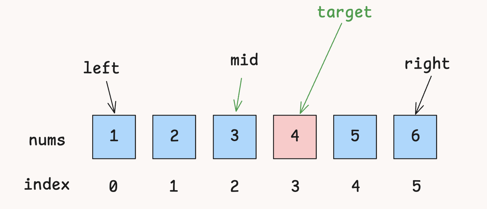

比如我们要搜索 `target = 4`此时`left = 0 right = 5` 计算得到的`mid = 2`

由图可知，`target > nums[2]`位于索引`mid=2`的右侧位置，说明`[1,2,3]`数据没有再搜索的必要（相当于切掉了一半的搜索数据量），只需要继续搜索 `[mid+1:right]`范围内的数据即可。也就是让 `left = mid+1`即 `left= 3 right = 5`，继续进行搜索的过程，直到找到数据或越界。

二分搜索算法的好处，在于每一次`for`循环搜索，可以剔除一半的数据量，让算法更快的趋近于目标值。

一般题目要求算法的时间复杂度`O(log2)`就要想到二分搜索算法

```go
func search(nums []int,target int) int{
  
  left,right := 0,len(nums)-1
  
  for left <= right {
    
    mid := left +(right-left)/2
    if nums[mid] == target{ // 找 target ，返回索引mid
      return mid
    } else if target < nums[mid] { // 说明 target位于 索引mid的左侧，收缩 right
      right = mid -1
    } else { // 说明 target位于 索引mid的右侧，收缩 left
      left = mid + 1
    }
  }
  // 没找到
  return -1
}
```


## 二叉树遍历套路

```go
// 前序遍历套路
func preOrder(root *TreeNode){
  if root == nil {
    return
  }
  
  fmt.Println(root.Val)
  
  preOrder(root.Left)
  preOrder(root.Right)
} 

// 中序遍历套路
func preOrder(root *TreeNode){
  if root == nil {
    return
  }
 
  preOrder(root.Left)
  fmt.Println(root.Val)
  preOrder(root.Right)
}

// 后序遍历套路
func preOrder(root *TreeNode){
  if root == nil {
    return
  }
  
  preOrder(root.Left)
  preOrder(root.Right)
  fmt.Println(root.Val)
  
}
```


## 滑动窗口解题套路

- 定义 `left right := 0,0` 指向起始位置 `0`
- 让 `right`不断的右移，当遇到不符合题意的条件`condition`，停止移动 `right`
- 然后开始让`left`不断右移，直到条件`condition`得到满足，继续重复👆的步骤，右移`right`
- 当 `right`越界，全部结束

动态规划套路伪代码

```go
nums := []int{1,2,3,4,5,6}
func main() {
  
  //1. 定义 `left right := 0,0` 指向起始位置 `0`
  left, right := 0,0
  
  // right 越界结束
  for right < len(nums) {
    
    // 2.不断移动 right
    val := nums[right]
    right++ 
    
    // do something.....
    
    // 3.当 condition 不符合题意的时候，移动 left，直到满足题意，跳出 condition
    for  condition {
      val := nums[left]
      left++
    }
    
    //.......
  }
}
```

滑动窗口解题套路主要流程是包括

- `left right`的定义 
-  `condition`条件的选取（这个要结合题意）
- 以及两个`for`循环


## 动态规划解题套路

动态规划难点就是在于递推关系的发现，这个只能从具体的题目中来感受。如果说理解+ 背诵题目的话，其实动态规划的题目又是最容易记忆和理解的

- 明确`dp`数组的定义
- 明确 `dp[i]`和 `dp[i-1]`之间递推关系的定义(这个是动态规划的难点，其实说白了，就是要根据题意，找`dp[i]`和 `dp[i-1]`的关系 )，形式上看起来和高中学过的函数推到关系是一摸一样的，比如 `f(x) = f(x-1) + f(x-2)`

在实现代码的时候包括三个方面：

- 创建`dp`数组
- 初始化`dp`数组（需要特殊处理的值）
- 遍历 `nums`数组，实现一般性的递推关系

伪代码

```go
func main() {
  nums := []int{1,2,3,4}
  
  //1.定义 dp 数组
  
  dp := make([]int,len(nums))
  
  //2. 初始化 dp 数组（根据题目要求也可能不需要这一步骤）
  
  for k := range dp {
    dp[k] = 1
  }
  
  //3. 遍历 `nums`数组，实现一般性的递推关系
  
  for i := 0;i < len(nums);i++ {
    dp[i] = dp[i-1] + 1 // 比如：这里的递推关系为：前一个的 dp[i-1]的基础上，加1
  }
  
  //......
}
```

有一道动态规划最简单的入门题目 斐波那契数  https://leetcode.cn/problems/fei-bo-na-qi-shu-lie-lcof/ 可以来体会下上面说的套路

LCR 126. 斐波那契数

**斐波那契数** （通常用 `F(n)` 表示）形成的序列称为 **斐波那契数列** 。该数列由 **0** 和 **1** 开始，后面的每一项数字都是前面两项数字的和。也就是：

> F(0) = 0
>
> F(1) = 1
>
> F(n) = F(n - 1) + F(n - 2)，其中 n > 1

给定 `n` ，请计算 `F(n)` 。答案需要取模 1e9+7(1000000007) ，如计算初始结果为：1000000008，请返回 1。

思路：

- `dp`定义： 在 `i`位置的数字和 `dp[i]`
- `dp`递推关系：每一项数字都是前面两项数字的和，所以有 `dp[i] = dp[i-1] + dp[i-2]`

其实，题目已经直接给出了 递推关系 `F(n) = F(n-1)+F(n-2)`，但是大部分的题目是不会给出，需要我们结合题目自己是思考这个递推关系。

```go
func fib(n int) int {
    
  	//1. 定义 dp 数组
    dp := make([]int,n+1)
  	
    for i := 0; i <= n;i++ {
      	// 2. 初始化 （需要特殊处理的值）
        if i == 0 {
            dp[i] = 0
        } else if i == 1 { // 2. 初始化 （需要特殊处理的值）
            dp[i] = 1
        } else{
          	// 3. 递推关系 实现
             dp[i] = (dp[i-1] + dp[i-2]) % 1000000007 // 这个是题目要求【取模】
        }
    }
  	// 4. 返回 F(n) 的结果，即 dp[n]
    return dp[n]    
}
```


## 回溯算法代码套路

- 回溯算法：每一层选择一个元素，剩下的元素留给下一层选择，一层一层的进行选择，直到将所有的情况遍历完成

打个比方：

有 A B  C 三个苹果，有小明和小王 2个同学，各选择一个苹果。

如果小明先选择 A 苹果，那么小王只能选择B 或者 C 苹果；

如果小明选择 B 苹果，那么小王只能选择 A 或者 C 苹果；

如果小明选择 C 苹果，那么小王只能选择 A 或者 B 苹果。

可以看到，小明在选中一个苹果后，小王只能在剩下的苹果中选择一个留给自己（因为另一个已经被小明占用了）

回溯算法，就是在穷尽所有的情况，在 `backtrack`的 `for`循环中选中一个元素，剩下的的元素（通过 `start`来圈定）就留给 下一个 `backtrack`函数进行选择。

`start`不是必须的，有些题目可能需要在全部里面选择（比如，小明先选择 A 苹果，那么小王可以 选择A 或者 B 或者 C 苹果），有些需要在 `start`圈定的范围内选择（小明先选择 A 苹果，那么小王只能选择B 或者 C 苹果）

伪代码

```go
/*
nums  数组
start 遍历数组的起始位置（这个要根据题意，有时不需要）
trace 记录回溯的结果
*/
func backtrack(nums []int , start int, trace []int) {
  
  // 结束条件
  if condition {
    return
  }
  
  for i := start;i < len(nums);i++ {
    
    // 当前选择
    trace = append(trace,nums[i])
    
    // 继续下一轮的回溯
    backtrack(nums,i+1,trace)
    
    // 撤销当前选择
    trace = trace[:len(trace)-1]
  }
}
```

`start`用来限定每次 `backtrace`函数，能选择的元素范围

`trace = append(trace,nums[i])`在当前层选中元素`nums[i]`，剩下的元素留给下层的回溯`backtrack`选择

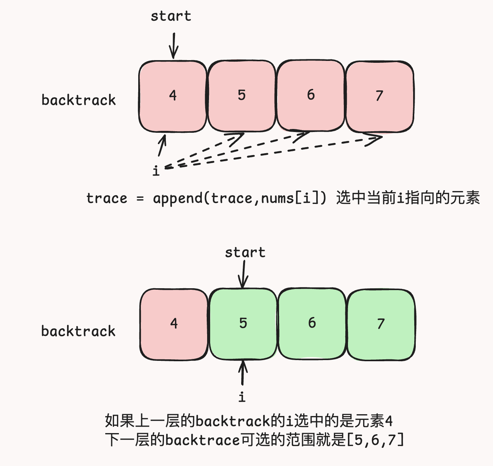

这里举例一个题目：

在数组`nums=[1,2]`中找出满足元素之和为`target=3`的【排列】，元素不能重复使用。

直接肉眼看，可知：包括 `[1,2] [2,1]` 两个结果

通用的代码模板如下：

```go
// 判断元素是否重复使用
var used []int = make([]int,len(nums))

func backtrack(nums []int, target int, trace []int){
    
    for i := 0; i < len(nums);i++ {

        // 判断当前nums[i]是否可以选择（因为元素不能重复使用）
        if userd[i] {
            continue
        }        

        // 选择
        trace = append(trace,nums[i])
        used[i] = true

        // 表示当前元素nums[i]选择以后，下一层调用 backtrack时，for循环选择的范围依然是[0:len(nums)-1]
        backtrack(nums,target,trace)


        //撤销
        trace = trace[:len(trace)-1]
        used[i] = false
    }
}
```

在数组`nums=[1,2]`中找出满足元素之和为`target=3`的【组合】，元素不能重复使用。

直接肉眼看，可知：包括 `[1,2]` 一个结果

通用的代码模板如下：

```go

func backtrack(nums []int,start, target int, trace []int){
    
    for i := start; i < len(nums);i++ {

        // 选择
        trace = append(trace,nums[i])
        
        // 表示当前元素nums[i]选择以后，下一层调用 backtrack时，for循环选择的范围变成了[i+1:len(nums)-1]
        backtrack(nums,i+1,target,trace)


        //撤销
        trace = trace[:len(trace)-1]
    }
}
```

体会下带 `start`和不带 `start`的区别；在体会下元素不能重复的时候区别。

# CodeTop参考答案


## 3.无重复字符的最长字串 （滑动窗口）

给定一个字符串 `s` ，请你找出其中不含有重复字符的 **最长 子串** 的长度

```
示例1
输入: s = "abcabcbb"
输出: 3 
解释: 因为无重复字符的最长子串是 "abc"，所以其长度为 3。
```

思路：

- 理解**子串**的含义：**子字符串** **是字符串中连续的** **非空** **字符序列。** 比如：`abc`的字串 `abc ab bc`等，但是 `ac`就不是字串，因为`a`和`c`并不连续，中间间隔了`b`
- 滑动窗口：保证 `left right`之间的字符没有重复出现。用`win`记录字符出现的次数，当`conditon`为 `win`中当某个字符出现次数 `>1`，保持 `right`不变，移动 `left`直至条件重新成立。

```go
func lengthOfLongestSubstring(s string) int {
    //滑动窗口【左右边界】
    left,right := 0,0

    // 记录窗口中字符出现的次数
    win := make(map[byte]int)

    result := 0
		
  	// 匿名函数，求最大值
    max := func (a ,b int) int {
        if a > b {
            return a
        }
        return b
    }
  
  	
    for right < len(s) {
				// 移动右边界+1
        ch := s[right] 
        right++ 
      	// 窗口中字符出现的次数+1
        win[ch]++
      	
	
        for win[ch] > 1 { //当字符出现的次数多于1次，说明滑动窗口中存在重复字符，不符合题意；需要移动左边界，把重复字符删掉，保证滑动窗口的字符数量都是1个，满足题意
            d := s[left]
            left++
            win[d]--
        }

        // 当前窗口中的字符数量
        result = max(result,right-left)
    }
    return result
}

```


## 146. LRU缓存

请你设计并实现一个满足 [LRU (最近最少使用) 缓存](https://baike.baidu.com/item/LRU) 约束的数据结构。

实现 `LRUCache` 类：

- `LRUCache(int capacity)` 以 **正整数** 作为容量 `capacity` 初始化 LRU 缓存
- `int get(int key)` 如果关键字 `key` 存在于缓存中，则返回关键字的值，否则返回 `-1` 。
- `void put(int key, int value)` 如果关键字 `key` 已经存在，则变更其数据值 `value` ；如果不存在，则向缓存中插入该组 `key-value` 。如果插入操作导致关键字数量超过 `capacity` ，则应该 **逐出** 最久未使用的关键字。

函数 `get` 和 `put` 必须以 `O(1)` 的平均时间复杂度运行。

思路：

- LRU是Least Recently Used的缩写，即最近最少使用，是一种常用的[页面置换算法](https://baike.baidu.com/item/页面置换算法/7626091?fromModule=lemma_inlink)，选择最近最久未使用的页面予以淘汰。该算法赋予每个[页面](https://baike.baidu.com/item/页面/5544813?fromModule=lemma_inlink)一个访问字段，用来记录一个页面自上次被访问以来所经历的时间 t，当须淘汰一个页面时，选择现有页面中其 t 值最大的，即最近最少使用的页面予以淘汰。（也就是当需要淘汰数据的时候，选择最久没有被使用的数据淘汰，刚刚使用的数据不要淘汰）
- 记忆点：两个数据结构 `map +  list `， `map`用于快速的判断`key`是否存在并获取到值，`list`用于记录【刚被访问】和【很久没访问】的数组，当需要淘汰数据的时候，直接从链表尾部淘汰即可。

```go
type LRUCache struct {
  	m map[int]*list.Element // 为了满足，题目要求的 o(1)的平均时间复杂度
    l *list.List // 链表：【刚被访问】数据在链表头部，【很久没访问】数据在链表尾部（当需要淘汰时，尾部的数据直接删除）
    cap int // 容量
}


type Data struct {
    Key int
    Value int
}

// 构造 LRUCache 对象
func Constructor(capacity int) LRUCache {
    cache := LRUCache{}
    cache.m = make(map[int]*list.Element,capacity)
    cache.l = list.New()
    cache.cap = capacity
    return cache
}

// Get 获取
func (this *LRUCache) Get(key int) int {
  	// 存在
    if v,ok := this.m[key];ok { 
      	//移动到头部（因为刚被访问了）
        this.l.MoveToFront(v)
      	//返回当前值
        return v.Value.(Data).Value
    }
  	// 不存在直接返回 -1
    return -1
}


// Put 修改
func (this *LRUCache) Put(key int, value int)  {
  	// 不存在
    if v,ok := this.m[key];!ok {
      	// 容量已经满了～～
        if this.cap == this.l.Len() { 
          	// 删除最久没访问的（也就是链表尾部元素）
            data := this.l.Remove(this.l.Back())
          	// 同时 map 中也要删除
            delete(this.m,data.(Data).Key) 
        }
        //新增（刚被访问过）
        e := this.l.PushFront(Data{key,value})
        this.m[key] = e

    }else { // 存在
      	// 修改数值
        v.Value = Data{key,value} 
      	// 同时移动到头部（刚被访问过）
        this.l.MoveToFront(v)
    }
}
```


## 206. 反转链表

给你单链表的头节点 `head` ，请你反转链表，并返回反转后的链表。


思路：

- **对于递归算法，最重要的就是明确递归函数的定义**。具体来说，我们的 `reverseList` 函数定义是这样的：**输入一个节点 `head`，将「以 `head` 为起点」的链表反转，并返回反转之后的【头结点】**。

```go
// 递归算法 reverseList 函数的定义：将「以 head 为起点」的链表反转，并返回反转之后的【头结点】
func reverseList(head *ListNode) *ListNode {
  	// 当没有节点 or 只有一个节点的时候，直接返回head
    if head == nil || head.Next == nil {
        return head
    }
		
  	// 这里表示：将「以 head.Next 为起点」的链表反转，并返回反转之后的【头结点】
    last := reverseList(head.Next)
    head.Next.Next = head
    head.Next = nil
    return res
}
```


- 对于**迭代算法**，我们只需要定义一个前驱节点 `pre`，每次用当前节点`cur`替换 前驱节点`pre`

```go
func reverseList(head *ListNode) *ListNode {
  	// 前驱节点 pre
    var pre *ListNode = nil
    
    for head != nil {

        temp := head.Next // 临时保存后缀节点

        head.Next = pre //将head.Next 指向pre
        pre = head //  head 变成新的前驱节点pre

        head = temp // 继续下一个节点
    }
    return pre
}
```


## 215. 数组中的第K个最大元素

给定整数数组 `nums` 和整数 `k`，请返回数组中第  `k` 个最大的元素。请注意，你需要找的是数组排序后的第 `k` 个最大的元素，而不是第 `k` 个不同的元素。你必须设计并实现时间复杂度为 `O(n)` 的算法解决此问题。

```
示例 1:

输入: [3,2,1,5,6,4], k = 2
输出: 5

```

思路:

- 第一种解法：利用**快速排序**算法，找到第 `k`个最大的元素

```go
func findKthLargest(nums []int, k int) int {

    //求第k大的元素，假如数组按照正序已经排列好了，那么第k大元素的索引位置为：len(nums)-k

    targetIndex := len(nums) - k

    lo,hi := 0,len(nums)-1

    for {
      	// 先确定某一个元素的索引位置
        idx := quickSort(nums,lo,hi) 
      	// 如果索引位置和 预期的targetIndex相同，说明找到了该元素
        if targetIndex == idx {
            return nums[idx]
        } else if targetIndex < idx { // 想找的元素索引位于左边，收缩 hi
            hi = idx-1
        } else { // 想找的元素索引位于右边，收缩 lo
            lo = idx+1
        }
    }

    return 0
}

// quickSort 快速排序，找一个参照元素v，使左边的元素都小于v，右边的元素都大于等于v，从而确定v在数组中的存储索引位置
func quickSort(nums []int ,lo,hi int) int {
    
    v := nums[lo] // 参照元素值

    left := lo+1
    right := hi
  	
  	// 保证 left <= right 的前提下
    for left <= right {
      	
      	// 让left指向的元素都要比v小
        for left <= right && v > nums[left] { 
            left++
        }
				// 让right指向的元素都要比v大or相等
        for left <= right && v <= nums[right] { 
            right--
        }
      	
        if left > right {
            break
        }

        // 执行到这里，说明left和right的元素不满足 nums[left] < v <= nums[right] 即left小right大的规则，交换left和right，重新满足条件
        nums[left],nums[right] = nums[right],nums[left]
    }

    // 最后交换 lo和right 例如 2 13，执行到这里，left指向 3 right指向 1，最后需要交换1和2的位置
    nums[lo],nums[right] = nums[right],nums[lo]
    return right
}
```


- 第二个种解法：利用**小根堆**，保持堆中元素的数量最多 K 个。当超过 K 个元素，弹出堆顶元素，遍历数组中的所有元素，并经过 小根堆的过滤。当所有元素遍历完成后，堆顶元素就是第K大的元素

```go
// 利用小根堆，堆大小设定为k。遍历数组，将元素直接保存到堆中；保证的堆大小维持在 <=k
// 当所有的元素经过堆以后，最后堆堆顶元素就是结果
type MinHeap struct {
    data []int
}

func (m *MinHeap)Swap(i,j int) {
    m.data[i],m.data[j] = m.data[j],m.data[i]
}

func(m *MinHeap)Len() int {
    return len(m.data)
}

func (m *MinHeap)Less(i,j int) bool {
    return m.data[i] < m.data[j]
}

func (m *MinHeap)Push(x any) {
    m.data = append(m.data,x.(int))
}

func (m *MinHeap)Pop() any {
    x := m.data[len(m.data)-1]
    m.data = m.data[:len(m.data)-1]
    return x
}

func (m *MinHeap)Top() int {
    return m.data[0]
}

func findKthLargest(nums []int, k int) int {
    minH := &MinHeap{}
    heap.Init(minH)
  	// 遍历数组
    for _ , num := range nums {
      	// 保存到小根堆中
        heap.Push(minH,num)
      	// 当元素个数超过 k
        for minH.Len() > k {
            heap.Pop(minH) // 删除堆顶元素
        }
    }
    return minH.Top() // 最终结果，就是小根堆的堆顶元素值
}
```

下图表示演示了， 数组 `2 1 3` 求第 1 大元素的过程


## 25. K个一组翻转链表

给你链表的头节点 `head` ，每 `k` 个节点一组进行翻转，请你返回修改后的链表。`k` 是一个正整数，它的值小于或等于链表的长度。如果节点总数不是 `k` 的整数倍，那么请将最后剩余的节点保持原有顺序。你不能只是单纯的改变节点内部的值，而是需要实际进行节点交换。

思路：

- 按照 长度k截取一段链表，然后将这段链表进行反转。【反转前的链表的头节点，变成了反转后的链表的尾部节点】
- 继续对后续的链表递归调用 `reverseKGroup(head *ListNode, k int) *ListNode`，并且进行拼接


```go
// reverseKGroup 函数定义： 按照k个一组，反转从 head 开始的链表，并返回反转后的链表的头节点
func reverseKGroup(head *ListNode, k int) *ListNode {
    a,b := head,head
    //截取一个长度为k的链表
    for i :=0;i < k;i++{
      	// 说明不够k个一组，那就不需要反转
        if b == nil { 
            return head
        }
        b = b.Next
    }
  
  	//翻转链表 [a,b) 注意不包括节点b
    last := reverse(a,b)
  	// 对 [a,b) 进行反转以后，此时的节点 a，就是反转后的链表的最后一个尾部节点（因为：一开始a是第一个头节点）
    a.Next = reverseKGroup(b,k)
    return last
}

//翻转指定范围 [a,b)链表,返回头节点
func reverse(a,b *ListNode) *ListNode {
    var pre *ListNode = nil
    for a != b {
        temp := a.Next

        a.Next = pre
        pre = a
        a = temp
    }
    return pre
}
```


## 15. 三数之和

给你一个整数数组 `nums` ，判断是否存在三元组 `[nums[i], nums[j], nums[k]]` 满足 `i != j`、`i != k` 且 `j != k` ，同时还满足 `nums[i] + nums[j] + nums[k] == 0` 。请你返回所有和为 `0` 且不重复的三元组。

**注意：**答案中不可以包含重复的三元组。

思路：

- 先给数组从小到大排序，然后双指针 `left` 和 `right` 分别在数组开头和结尾，这样就可以控制 `nums[left]` 和 `nums[right]` 这两数之和的大小：
- 如果你想让它俩的和大一些，就让 `left++`，如果你想让它俩的和小一些，就让 `right--`
- 基于两数之和可以得到一个万能函数 `nSumTarget`，扩展出 n 数之和的一般解法


```go
func threeSum(nums []int) [][]int {
  	//1. 对数组进行排序
    sort.Ints(nums)
    return nSumTarget(nums,3,0,0)
}

// nums: 数组
// n： n数之和
// start： 数组遍历的边界
// target：目标和
func nSumTarget(nums []int, n int ,start int, target int) [][]int{
    size := len(nums)
    var result [][]int
    if n < 2 || size < n { // 最低求两数之和 or 数组中数据个数不能小于n
        return result
    } else if n == 2 {//求两数和
      	// left 左边界 right 右边界
        left,right := start,size-1
        for left < right {

            leftValue := nums[left]
            rightValue := nums[right]
          	//左右位置的两数和
            sum := leftValue + rightValue

            if sum < target { // 求的sum值，比目标和偏小，增大left
                for left <right && nums[left] == leftValue {
                    left++
                }
            } else if sum > target { // 求的sum值，比目标和偏大，减小right
                for left < right && nums[right] == rightValue {
                    right--
                }
            } else {
              	// 找到一组 leftValue 和 rightValue
                result = append(result,[]int{leftValue,rightValue})
              	// 题目要求不能重复
                for left <right && nums[left] == leftValue {
                    left++
                }
                for left < right && nums[right] == rightValue {
                    right--
                }
            }
        }
    }else {
        for i := start;i<size;i++{ //固定一个数值，求剩下的两个数值
            sub := nSumTarget(nums,n-1,i+1,target-nums[i])
            //对结果整合
            for _,v := range sub {
                v = append(v,nums[i])//追加当前数值，组成n数之和
                result = append(result,v)
            }
            //判断下一个数值是否和当前值重复（一样）
            for i+1 < size && nums[i] == nums[i+1]{
                i++
            }
        }
    }

    return result
}
```


## 53. 最大子数组和

给你一个整数数组 `nums` ，请你找出一个具有最大和的连续子数组（子数组最少包含一个元素），返回其最大和。

**子数组**：是数组中的一个连续部分。

思路：

- `dp` 数组的定义：**以 `nums[i]` 为结尾的「最大子数组和」为 `dp[i]`。**

- `dp`数组递推关系为： `dp[i] = max(0,dp[i-1]) + num[i]`

  `dp[i]` 有两种「选择」，要么与前面的相邻子数组`dp[i-1]`连接，形成一个和更大的子数组；要么不与前面的子数组连接，自己单独一个元素，作为一个子数组。

```go
func maxSubArray(nums []int) int {
	
  // 1. 构建dp数组
	dp := make([]int, len(nums))
  // 2.初始化：根据定义，第一个元素的最大子数组和，就是第一个元素值
	dp[0] = nums[0]
  
  // result 记录最大子数组和
  result := nums[0] 

	// 3.应用递推关系：针对每个元素i作为结尾，求以元素i结尾的最大子数组和
	for i := 1; i < len(nums); i++ {
    // 如果dp[i-1]为负数，当前元素本身就是最大和（也就是不需要和前面其他元素进行连接）；
    dp[i] = max(dp[i-1],0) + nums[i] 
		result = max( result , dp[i] )
	}
	return result
}

func max(a, b int) int {
	if a > b {
		return a
	}
	return b
}
```


## 912. 排序数组

给你一个整数数组 `nums`，请你将该数组升序排列。你必须在 **不使用任何内置函数** 的情况下解决问题，时间复杂度为 `O(nlog(n))`，并且空间复杂度尽可能小。

思路：

这里提供必考的**3种排序算法**

> 快速排序

**快速排序是先将一个元素排好序，然后再将剩下的元素排好序**。

```go
func sortArray(nums []int) []int {
    //快速排序
    quickSort(nums,0,len(nums)-1)
    return nums
}

func quickSort(nums []int, lo ,hi int) {
    if lo >= hi { //相当于只有一个数，或者越界，就不用比较了
        return
    }

    //1.选择一个数，作为参考元素
    val := nums[lo]

    //2.左右起始索引
    left := lo + 1
    right := hi

    //3.使左边nums[left]比val小   右边nums[right]比val大
    for left <= right {
        for left <= right && nums[left] < val { //ums[left]记录比val小的数据索引
            left++
        }

        for left <= right && nums[right] >= val {//nums[right]记录比val大的数据索引
            right--
        }
        if left > right {
            break
        }
        // 执行到这里，说明 nums[left]比 val 大， nums[right] 比val 小（也就是不满足上面的条件）
        // 交换 left 和 right，让 left right 指向的元素继续满足条件
        nums[left],nums[right] = nums[right],nums[left]
    }
    //交换 lo 和right，这样nums[lo]这个元素已经排序完成，保存在了 right 索引位置
    nums[lo],nums[right] = nums[right],nums[lo]

  	// 递归调用 quickSort，让[lo,right-1] [right+1,hi] 两个子数组也都有序。
    //左边数组
    quickSort(nums,lo,right-1)
    //右边数组
    quickSort(nums,right+1,hi)
    return 
}
```


> 归并排序


```go
var temp []int = nil
func sortArray(nums []int) []int {

    //归并排序
    temp = make([]int,len(nums)) //临时数组，用来临时存储merge后的有序结果
    sort(nums,0,len(nums)-1)
    return nums
}

// sort 函数定义：对数组nums范围[lo,hi]排序，并使之有序
func sort(nums []int ,lo int,hi int) {
    if lo == hi { //单个元素就不用排序了
        return
    }
    mid := lo + (hi-lo)/2//将数组一分为二
    sort(nums,lo,mid)//对左边排序
    sort(nums,mid+1,hi)//对右边排序
    merge(nums,lo,mid,hi) //合并左右 有序数组
}

//合并有序数组
func merge(nums []int,lo int ,mid int,hi int) {

    left := lo //左边有序数组起始点
    right := mid+1//右边有序数组起始点

    for i := lo;i <= hi;i++ { //总共[lo,hi]个元素
        if left == mid+1 { //左边全部遍历完
            temp[i] = nums[right]
            right++
        } else if right == hi+1 { //右边全部遍历完
            temp[i] = nums[left]
            left++
        } else if nums[left] > nums[right]{ // 优先合并小的元素
            temp[i] = nums[right]
            right++
        } else {
            temp[i] = nums[left]
            left++
        }
    }
    //将临时数组中的数组temp，复制到 nums中
    for i:= lo;i<=hi;i++{
        nums[i] = temp[i]
    }
}
```

> 堆排序

利用的下沉操作sink，将数组最大元素移动到数组首部，然后和尾部元素交换（尾部元素就不用再管了，因为已经有序了）此时尾部就是最大的值；然后对剩下的数组元素进行下沉操作；保证次大的元素，成为新的首部元素；继续和尾部交换（注意这里的尾部不是最后一个，是倒数第二个了）


```go
func sortArray(nums []int) []int {
   
    length := len(nums)
  	// 1.一开始需要针对数组，进行初始化操作,从第一个非叶子节点开始
    for i := length/2-1;i >= 0;i-- {  // 倒着遍历
        sink(nums,i,length) 
    }
  	// 2.上面初始化完成后，保证了数组中的最大值，已经成为数组的第一个元素

    for i := length-1;i >= 0;i-- {
        // 交换首部和尾部元素
        nums[0],nums[i] = nums[i],nums[0]
        length-- // 上面交换以后，尾部元素就是最大的有序元素了；只需要对前面剩余的length-1长度的元素进行排序，需要排序的长度变短了，这也就是为什么倒序遍历的原因（因为最后一个元素已经处理好了）
        // 对首部元素进行下沉操作（因为首部元素经过上面的交互，已经变成了一个新元素，不一定是次大的元素）
        sink(nums,0,length)
    }

    return nums
}


// 下沉操作，就是比较节点的和左右节点的大小关系；找出三个节点中的最大的索引值
func sink(nums []int ,idx ,len int) {
    for leftIdx(idx) < len { // 目的：如果左边的索引都越界了，右边的索引肯定也越界了
        maxIdx := idx

        // 注意：这里的用的是 nums[maxIdx]
        if leftIdx(idx) < len && nums[maxIdx] < nums[leftIdx(idx)] { // 左边的元素比较大
            maxIdx = leftIdx(idx)
        }   

        if rightIdx(idx) < len && nums[maxIdx] < nums[rightIdx(idx)] {
            maxIdx = rightIdx(idx)
        }

        // maxIdx的目的：为了记录最大的索引是哪个
        if maxIdx == idx { // 说明自己就是最大的那个，不需要下沉了(maxIdx在这里有种指针的感觉)
            break
        }

        // 交换数值
        nums[maxIdx],nums[idx] = nums[idx],nums[maxIdx]
      	// 继续进行下沉操作
        idx = maxIdx 
    }
}

func leftIdx(idx int) int {
    return idx *2 +1
}

func rightIdx(idx int) int {
    return idx*2+2
}
```


## 21.合并两个有序链表

将两个升序链表合并为一个新的 **升序** 链表并返回。新链表是通过拼接给定的两个链表的所有节点组成的。 

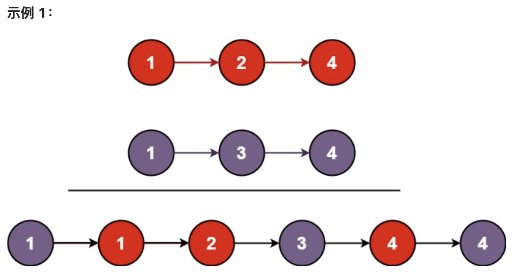

思路：

这个算法的逻辑类似于「拉拉链」，`list1, list1` 类似于拉链两侧的锯齿，指针 `cur` 就好像拉链的拉索，将两个有序链表合并。

**代码中还用到一个链表的算法题中是很常见的「虚拟头节点」技巧，也就是 `dummy` 节点**，它相当于是个占位符，可以避免处理空指针的情况，降低代码的复杂性。

```go
func mergeTwoLists(list1 *ListNode, list2 *ListNode) *ListNode {
  	// 1.定义虚拟头结点
    var dummy *ListNode = &ListNode{Val : 0,Next:nil}
    cur := dummy
		
  	//2. 将两个链表中，值小的一个节点拼接到 cur 后面
    for list1 != nil && list2 != nil {
        if list1.Val <= list2.Val {
            cur.Next = list1
            list1 = list1.Next
        } else {
            cur.Next = list2
            list2 = list2.Next
        }
         cur = cur.Next
    }
		//3. 假如两个链表一个长 or 一个短，会导致其中一个链表还有剩余节点，直接拼接到cur后面即可
    if list1 != nil {
        cur.Next = list1
    }

    if list2 != nil {
        cur.Next = list2
    }
		//4. 返回dummy节点的下一个节点，才是要求的结果
    return dummy.Next
}
```


## 5. 最长回文子串

给你一个字符串 `s`，找到 `s` 中最长的 回文 子串。

思路：

**寻找回文串的问题核心思想是：从中间开始向两边扩散来判断回文串**

```go
for 0 <= i < len(s):
    找到以 s[i] 为中心的回文串
    更新答案
```

找回文串的关键技巧是传入两个指针 `l` 和 `r` 向两边扩散，因为这样实现可以同时处理回文串长度为奇数和偶数的情况。

```go
for 0 <= i < len(s):
    // 找到以 s[i] 为中心的回文串
    palindrome(s, i, i)
    // 找到以 s[i] 和 s[i+1] 为中心的回文串
    palindrome(s, i, i + 1)
    更新答案
```

比如 `abba`的最长回文子串是 `abba` 如果只是以一个字符`s[i]`作为中心查找，该字符串是查不到回文串的。

```go
func longestPalindrome(s string) string {

	var result string

	for i := 0; i < len(s); i++ {

		s1 := isPalidrome(s, i, i)
		if len(s1) > len(result) {
			result = s1
		}

		s2 := isPalidrome(s, i, i+1)
		if len(s2) > len(result) {
			result = s2
		}
	}

	return result
}

func isPalidrome(s string, left, right int) string {

	for left >= 0 && right <= len(s)-1  && s[left] == s[right] {
			left--
			right++
	}
	return string(s[left+1 : right])
}
```


## 102. 二叉树的层序遍历

给你二叉树的根节点 `root` ，返回其节点值的 **层序遍历** 。 （即逐层地，从左到右访问所有节点）。

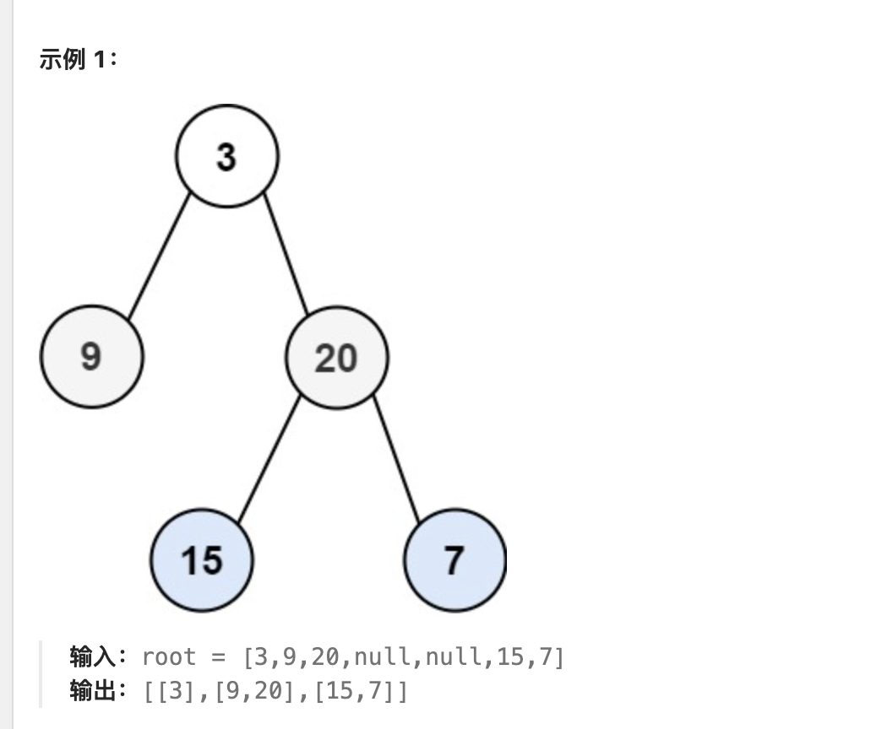

思路：

这题就是固定的解法套路，没有技巧，全靠记忆

```go
func levelOrder(root *TreeNode) [][]int {
    
    result := [][]int{}
  	//1. 判断是否为空树
    if root == nil {
        return result
    }
  	//2. 定义数组，保存根节点
    saveKey := []*TreeNode{}
    saveKey = append(saveKey,root) 
		//3. 判断是否为空
    for len(saveKey) != 0 { 
      	//4. 确定本次的边界
        count := len(saveKey) 
        temp := []int{}
        for i := 0;i< count;i++ { 
          	//5.把边界内的数值取出，并保存下来。
            temp = append(temp,saveKey[i].Val)
          	//6.注意这里，不为nil才保存到 saveKey中
            if saveKey[i].Left != nil {
                saveKey = append(saveKey,saveKey[i].Left)
            }
            if saveKey[i].Right != nil {
                saveKey = append(saveKey,saveKey[i].Right)
            }
        }
        result = append(result,temp)
      	//7.从 count截断 saveKey，剩下的就是下层的节点
        saveKey = saveKey[count:]
    }
    return result
}
```


## 1.两数之和

给定一个整数数组 `nums` 和一个整数目标值 `target`，请你在该数组中找出 **和为目标值** *`target`* 的那 **两个** 整数，并返回它们的数组下标。你可以假设每种输入只会对应一个答案，并且你不能使用两次相同的元素。你可以按任意顺序返回答案。

思路：

- 简单说，数组其实可以理解为一个「索引 -> 值」的哈希表映射，而我们又建立一个「值 -> 索引」的映射即可完成此题。

```go
func twoSum(nums []int, target int) []int {
    //利用map实现
    m := make(map[int]int) //key表示数值 value表示索引值
    
    for k,v := range nums {
      	// target-v查找哈希表，判断是否已经存在该值
        if index ,ok := m[target-v];ok {
            return []int{k,index}
        }
      	// 保存 值->索引
        m[v] = k
    }
    return nil
}
```


## 33.搜索旋转排序数组

整数数组 `nums` 按升序排列，数组中的值 **互不相同** 。

在传递给函数之前，`nums` 在预先未知的某个下标 `k`（`0 <= k < nums.length`）上进行了 **旋转**，使数组变为 `[nums[k], nums[k+1], ..., nums[n-1], nums[0], nums[1], ..., nums[k-1]]`（下标 **从 0 开始** 计数）。例如， `[0,1,2,4,5,6,7]` 在下标 `3` 处经旋转后可能变为 `[4,5,6,7,0,1,2]` 。

给你 **旋转后** 的数组 `nums` 和一个整数 `target` ，如果 `nums` 中存在这个目标值 `target` ，则返回它的下标，否则返回 `-1` 。

你必须设计一个时间复杂度为 `O(log n)` 的算法解决此问题。

思路：

- 题目要求时间复杂度`O(log n)` 那就要想到二分法

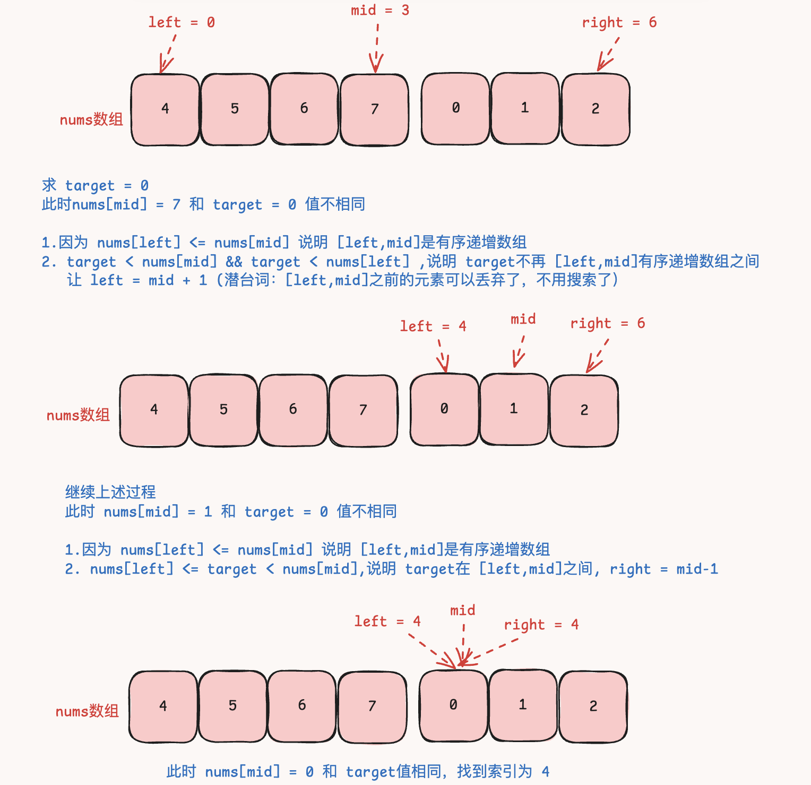

```go
func search(nums []int, target int) int {
    //！！！ 二分法查找；需要画图理解
    left , right := 0,len(nums)-1
    for left <= right {
        mid := left + (right-left)/2

        if nums[mid] == target { // 找到 target
            return mid
        } else if nums[left] <= nums[mid] { // 说明 [left,mid] 是有序递增的子数组
            if nums[left] <= target && target < nums[mid]  {//2. target 位于 [left,mid]有序递增数组中
                right = mid-1 // 收缩右边界（其实就是丢弃右边的子数组）
            }else {
                left = mid+1
            }
        }else { //说明 [mid,right] 是有序递增的子数组
            if nums[mid] < target && target <= nums[right] { // target位于 [mid,right]有序递增数组中
                left = mid+1  // 收缩左边界（其实就是丢弃左边的子数组）
            }else {
                right = mid-1
            }
        }
    }
    return -1
}
```


## 200.岛屿数量

给你一个由 `'1'`（陆地）和 `'0'`（水）组成的的二维网格，请你计算网格中岛屿的数量。岛屿总是被水包围，并且每座岛屿只能由水平方向和/或竖直方向上相邻的陆地连接形成。此外，你可以假设该网格的四条边均被水包围。

思路：

- 用 DFS 算法解决岛屿题目是最常见的，每次遇到一个岛屿中的陆地，就用 DFS 算法吧这个岛屿「淹掉」。

```go
func numIslands(grid [][]byte) int {
    m := len(grid)
    n := len(grid[0])
    result := 0
  	// 对二维数组进行遍历
    for i := 0;i < m;i++ {
        for j := 0;j < n ;j++ {
          	// 一旦发现一个陆地
            if grid[i][j] == '1' { 
                result++
              	// 就将和该 grid[i][j] 陆地相连接的陆地，全部淹没掉
                dfs(grid,i,j)
            }
        }
    }

    return result
}

// 深度优先算法，
func dfs(grid [][]byte,i,j int) {
    m := len(grid)
    n := len(grid[0])
    if i < 0 || j < 0 || i >= m || j >= n { //越界检测
        return
    }
		// 说明当前是水
    if grid[i][j] == '0' {
        return
    }
  	// 执行到这里，说明你是陆地
    grid[i][j] = '0' //淹没掉陆地
    dfs(grid,i-1,j) //上
    dfs(grid,i+1,j) //下 
    dfs(grid,i,j+1) //右
    dfs(grid,i,j-1) //左
}
```


## 121.买卖股票的最佳时机

给定一个数组 `prices` ，它的第 `i` 个元素 `prices[i]` 表示一支给定股票第 `i` 天的价格。你只能选择 **某一天** 买入这只股票，并选择在 **未来的某一个不同的日子** 卖出该股票。设计一个算法来计算你所能获取的最大利润。

返回你可以从这笔交易中获取的最大利润。如果你不能获取任何利润，返回 `0` 。

思路：

买卖股票类的题目有一套**通用的解题方案**：

- `dp`数组定义：

> `dp[i][k][0 or 1]` 
>
> `0 <= i <= n - 1, 1 <= k <= K`      
>
>   n 为天数，大 K 为完成交易数的上限，0 和 1 代表是否持有股票

所以，`dp[i][k][0 or 1]` 的含义就是：在从 `0`到 `i`天，完成了`k`笔交易，不持有`0` or 持有 `1`股票，能获取的最大利润

- `dp`的递推关系定义：

```go

dp[i][k][0] = max(dp[i-1][k][0], dp[i-1][k][1] + prices[i])
//dp[i][k][0] 表示 从 0 到 第i天，完成k笔交易，不持有股票，能获取的最大利润
分成两种情况：
// dp[i-1][k][0] 								表示 从 0 到i-1天（也就是前一天），也没有持有股票
// dp[i-1][k][1] + prices[i]  	表示 从 0 到i-1天（也就是前一天），持有了股票，但是今天选择卖出，那么今天不就不持有股票了


dp[i][k][1] = max(dp[i-1][k][1], dp[i-1][k-1][0] - prices[i])
// dp[i][k][1]  表示从 0 到第i天，完成k笔交易，持有股票，能获取的最大利润
分成两种情况：
// dp[i-1][k][1] 							 	表示从 0 到 i-1天（也就是前一天），也持有股票
// dp[i-1][k-1][0] - prices[i] 	表示从 0 到 i-1天（也就是前一天），未持有了股票，但是今天选择买入，那么不就持有股票了。因为是今天买入股票，完成了一笔交易，今天的交易次数是k的前提下，那么前一天的交易次数就是 k-1


最终答案：因为要求最大利润，那只有不持有股票的利润最大 dp[n-1][k][0] （从 0到 n-1，完成了k笔交易后，不持有股票）
```

本题答案：

注意理解这句话的含义：【你只能选择 **某一天** 买入这只股票，并选择在 **未来的某一个不同的日子** 卖出该股票】，意思就是只进行一次交易，能获取的最大利润是多少。（不需要考虑之前的历史交易行为，因为只有一次交易，那也就是没有其他的历史交易行为）

- 对于上面的`dp`递推模板，可以省略 `k`，因为只有一次交易
- `dp[i][k][1] = max(dp[i-1][k][1], dp[i-1][k-1][0] - prices[i])`对于这个递推关系，我们需要去掉`dp[i-1][k-1][0]`，将递推关系变为：`dp[i][k][1] = max(dp[i-1][k][1],  - prices[i])`，因为带上`dp[i-1][k-1][0]`就表示要考虑之前的历史交易行为。如果想不明白为什么，先理解下`dp`的定义：表示从 0 到 i-1天（也就是前一天），未持有了股票（为啥没有持有股票？可能是因为本来就没有持有过，也可能是之前持有了，到了第`i-1`天卖掉了，等价于没有持有了），如果是第二种卖掉了，导致的没有持有，说明之前有过历史的交易行为。那就不能算是题目限定的，只能有一次交易行为了。

```go
func maxProfit(prices []int) int {
  	// 1. 构建二维 dp数组
    n := len(prices) //n天
    dp := make([][]int,n)
    for k,_ := range dp {
        // 每天只有两种选择 【0不持有 1持有】
        dp[k] = make([]int,2)
    }

    //状态转移方程
    /*
        dp[i][0 or 1] 表示到第i天时候，选择（持有或不持有股票）能获取到的最大利润；
        dp[i][0] = max(dp[i-1][0], dp[i-1][1] + price[i]) // 卖出
        dp[i][1] = max(dp[i-1][1], -price[i]) //买入
    */

    for i := 0;i < n; i++ {
      	//2. 特殊处理
        if i - 1 == -1 {
            dp[i][0] = 0
            dp[i][1] = -prices[i]
        } else {
            dp[i][0] = max(dp[i-1][0], dp[i-1][1] + prices[i])
            // 核心在于：只能有一次买卖行为；在第i天持有股票，那说明之前就一直持有 dp[i-1][1]
            // 或者，之前一直都没有持有，今天第i天是【第一次】交易行为；
            // 如果带上 dp[i-1][0] 表示：有考虑之前的历史交易行为（题目限定只有一次交易行为）
            dp[i][1] = max(dp[i-1][1], -prices[i]) 
        }
    }
		//因为要求最大利润，那肯定是不持有最大利润最大
    return dp[n-1][0] 
}

func max( a,b int) int {
    if a > b {
        return a
    }
    return b
}
```


## 46.全排列

给定一个不含重复数字的数组 `nums` ，返回其 *所有可能的全排列* 。你可以 **按任意顺序** 返回答案。

```
示例1:
输入：nums = [1,2,3]
输出：[[1,2,3],[1,3,2],[2,1,3],[2,3,1],[3,1,2],[3,2,1]]
```

思路：

- 可以参考下👆回溯算法解题模板

因为是求排列，每选择一个元素后，下一个 `backtrack`从**所有的元素**中（所以不需要 `start`来圈定选择范围）再选择下一个元素，为了避免同一个元素重复被选中，用`used`记录元素是否已经被选过。

```go

var result [][]int
func permute(nums []int) [][]int {
    result = [][]int{} //清空结果
  	// 记录是否已经使用过
    used := make([]bool,len(nums))
    trace := make([]int,0)
  	//回溯算法
    backtrack(nums,trace,used)
    return result
}

//回溯算法
func backtrack (nums []int,trace []int , used []bool)  {

    if len(trace) == len(nums) { //trace记录路径
        temp := make([]int,len(trace)) //golang 这个要注意，切片需要复制一个出来
        copy(temp,trace)
        result = append(result,temp)
        return
    }
    // 排列，每次都从头开始选择
    for i := 0;i < len(nums);i++ {
        
        if used[i] { //当前值已经选择过了，跳过
            continue
        }

        trace = append(trace,nums[i]) //选择
        used[i] = true

        backtrack(nums,trace,used)

        trace = trace[:len(trace)-1]//撤销选择
        used[i] = false
    } 

}
```


## 88.合并两个有序数组

给你两个按 **非递减顺序** 排列的整数数组 `nums1` 和 `nums2`，另有两个整数 `m` 和 `n` ，分别表示 `nums1` 和 `nums2` 中的元素数目。请你 **合并** `nums2` 到 `nums1` 中，使合并后的数组同样按 **非递减顺序** 排列。

**注意：**最终，合并后数组不应由函数返回，而是存储在数组 `nums1` 中。为了应对这种情况，`nums1` 的初始长度为 `m + n`，其中前 `m` 个元素表示应合并的元素，后 `n` 个元素为 `0` ，应忽略。`nums2` 的长度为 `n` 。

思路：

- 很像前文中讲过的 [21. 合并两个有序链表](https://leetcode.cn/problems/merge-two-sorted-lists)，这里让你合并两个有序数组。
- 对于单链表来说，我们直接用双指针从头开始合并即可，但对于数组来说会出问题。因为题目让我直接把结果存到 `nums1` 中，而 `nums1` 的开头有元素，如果我们无脑复制单链表的逻辑，会覆盖掉 `nums1` 的原始元素，导致错误。但 `nums1` 后面是空的呀，所以这道题需要我们稍微变通一下：**将双指针初始化在数组的尾部，然后从后向前进行合并**，这样即便覆盖了 `nums1` 中的元素，这些元素也必然早就被用过了，不会影响答案的正确性。

```go
func merge(nums1 []int, m int, nums2 []int, n int)  {
    //双指针：从数组的尾部，向前合并
    left,right := m-1,n-1 //都指向尾部
    pos := m+n-1
    for left >= 0 && right >= 0 {
        if nums1[left] >= nums2[right] { // 选择大的，放入尾部
            nums1[pos] = nums1[left]
            pos--
            left--
        } else {
            nums1[pos] = nums2[right]
            pos--
            right--
        }
    }
  	// right 还有剩余，直接复制
    for right >=0 {
        nums1[pos] = nums2[right]
        pos--
        right--
    }
    return 
}
```


## 20.有效的括号

给定一个只包括 `'('`，`')'`，`'{'`，`'}'`，`'['`，`']'` 的字符串 `s` ，判断字符串是否有效。

有效字符串需满足：

1. 左括号必须用相同类型的右括号闭合。
2. 左括号必须以正确的顺序闭合。
3. 每个右括号都有一个对应的相同类型的左括号。

思路：

- 栈是一种先进后出的数据结构，处理括号问题的时候尤其有用。

- 假设字符串中只有圆括号 **（）**，如果想让括号字符串有效，那么必须做到：

  **每个右括号 `)` 的左边必须有一个左括号 `(` 和它匹配**。

  比如说字符串 `()))((` 中，中间的两个右括号**左边**就没有左括号匹配，所以这个括号组合是无效的。

- 利用栈，保证完成匹配的括号，不会存在在栈中，最后栈中剩下的就是没有完成匹配的；

```go
func isValid(s string) bool {
  	// 初始
    stack := make([]byte,0)
  	// 遍历字符
    for i := 0;i< len(s);i++ {  
      	// 如果栈不为空，判断栈顶括号 和 当前括号是否匹配
        if len(stack) != 0 && isPair(stack[len(stack)-1],s[i]) {
            stack = stack[:len(stack)-1] // 出栈
        } else {
            stack = append(stack,s[i]) // 否则，当前的括号才能入栈
        }
    }
  	// 栈为空，说明括号都完全匹配
    if len(stack) == 0 {
        return true
    }
  	// 比如 ({)}
    return false
}

func isPair(a,b byte) bool {
    if a == '(' && b == ')' {
        return true
    }

    if a == '[' && b == ']' {
        return true
    }

    if a == '{' && b == '}' {
        return true
    }

    return false
}
```


## 141.环形链表

给你一个链表的头节点 `head` ，判断链表中是否有环。

如果链表中有某个节点，可以通过连续跟踪 `next` 指针再次到达，则链表中存在环。 为了表示给定链表中的环，评测系统内部使用整数 `pos` 来表示链表尾连接到链表中的位置（索引从 0 开始）。**注意：`pos` 不作为参数进行传递** 。仅仅是为了标识链表的实际情况。

*如果链表中存在环* ，则返回 `true` 。 否则，返回 `false` 。

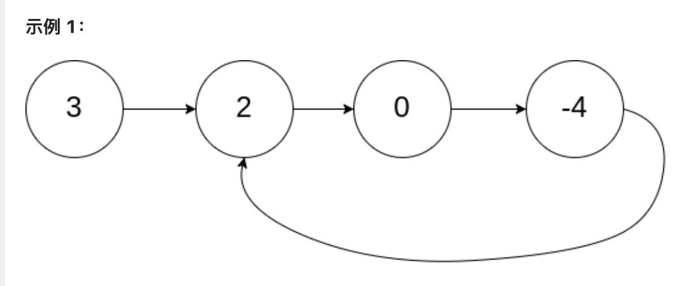

思路：

经典题目了，使用双指针技巧中的快慢指针，每当慢指针 `slow` 前进一步，快指针 `fast` 就前进两步。如果 `fast` 最终遇到空指针，说明链表中没有环；如果 `fast` 最终和 `slow` 相遇，那肯定是 `fast` 超过了 `slow` 一圈，说明链表中含有环。

```go
func hasCycle(head *ListNode) bool {
    //快慢指针
    slow,fast := head,head
  	// 表示 fast 能够跳跃两步。如果 fast == nil(空节点) 或者 fast.Next == nil（只有fast这一个节点，没有后续节点）
    for fast != nil && fast.Next != nil {
        slow = slow.Next
        fast = fast.Next.Next
        if slow == fast {
            return true
        }
    }
    return false
}
```


## 103.二叉树的锯齿形层序遍历

给你二叉树的根节点 `root` ，返回其节点值的 **锯齿形层序遍历** 。（即先从左往右，再从右往左进行下一层遍历，以此类推，层与层之间交替进行）。

思路：

- 这题和上面的层序遍历是一样的，只是多了一个元素值存储的方向的控制 `flag`

```go
func zigzagLevelOrder(root *TreeNode) [][]int {

    result := [][]int{}
  	// 空树
    if root == nil {
        return result
    }

    //和层序遍历一样
    nodes := []*TreeNode{}
    nodes = append(nodes,root)

    flag := true //控制结果 放入的方向

    for len(nodes) != 0 {
        count := len(nodes) // 节点数量

        temp := []int{}
        for i := 0;i < count;i++ {  

            if flag { // 保存在尾部（正序）
                temp = append(temp,nodes[i].Val)
            } else {
              	// 保存在头部（倒序）
                temp = append([]int{nodes[i].Val},temp...)
            }

            // left不为空
            if nodes[i].Left != nil {
                nodes = append(nodes,nodes[i].Left)
            }
						// right 不为空
            if nodes[i].Right != nil {
                nodes = append(nodes,nodes[i].Right)
            }
        }
      	// 切换方向
        flag = !flag
        result = append(result,temp)
        nodes = nodes[count:] //count之前的需要舍弃
    }
    return result
}
```


## 235.二叉树的最近公共祖先

给定一个二叉树, 找到该树中两个指定节点的最近公共祖先。

[百度百科](https://baike.baidu.com/item/最近公共祖先/8918834?fr=aladdin)中最近公共祖先的定义为：“对于有根树 T 的两个节点 p、q，最近公共祖先表示为一个节点 x，满足 x 是 p、q 的祖先且 x 的深度尽可能大（**一个节点也可以是它自己的祖先**）。

思路：

- 给出递归函数的定义：给该函数输入三个参数 `root`，`p`，`q`，它会返回一个节点：
- 情况 1，如果 `p` 和 `q` 都在以 `root` 为根的树中，那么 `left` 和 `right` 一定分别是 `p` 和 `q`。
- 情况 2，如果 `p` 和 `q` 都不在以 `root` 为根的树中，直接返回 `null`。
- 情况 3，如果 `p` 和 `q` 只有一个存在于 `root` 为根的树中，函数返回该节点。

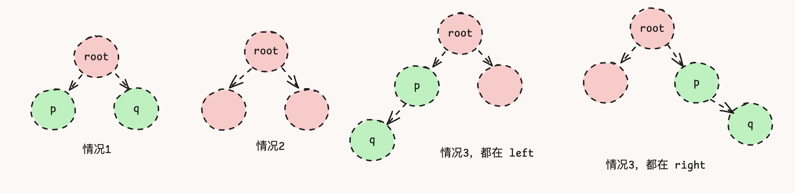

```go
// 给该函数输入三个参数 `root`，`p`，`q`，它会返回一个节点 
func lowestCommonAncestor(root, p, q *TreeNode) *TreeNode {
   	
     if root == p || root == q || root == nil{
         return root
     }

     left := lowestCommonAncestor(root.Left,p,q)
     right := lowestCommonAncestor(root.Right,p,q)
		 // p q 分别位于 root 的 left right 中
     if left != nil && right != nil {
         return root
     }
		 // p q 都位于 left
     if left != nil {
         return left
     }
		 // p q 都位于 right
     if right != nil {
         return right
     }
     // p q 不在 root 树中
     return nil
}
```

## 92.反转链表 II

给你单链表的头指针 `head` 和两个整数 `left` 和 `right` ，其中 `left <= right` 。请你反转从位置 `left` 到位置 `right` 的链表节点，返回 **反转后的链表** 。

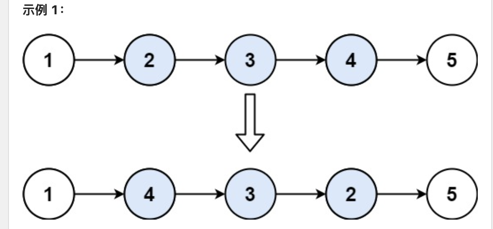

思路：

- 递归解法：

  迭代解法很简单，用一个 for 循环即可，但这道题经常用来考察递归思维，让你用纯递归的形式来解决。

  要想真正理解递归操作链表的代码思路，关键点还是要明确递归函数的定义，推导出递归翻转前 `N` 个节点的算法，最后改写出递归翻转区间内的节点的解法代码

  

  ```go
  // 翻转left，right之间的链表
  func reverseBetween(head *ListNode, left int, right int) *ListNode {
      //先找到【翻转的第一个起始节点】，才开始真正的翻转
      if left == 1 {
          return reverseN(head,right)
      }
      //说明当前节点，不需要翻转。当前节点的尾部，拼接翻转后链表的头部
      head.Next = reverseBetween(head.Next,left-1,right-1)
      return head
  }
  
  var successor *ListNode = nil
  // 从head开始，翻转n个节点，返回链表的头节点
  func reverseN(head *ListNode,  n int) *ListNode {
      if n == 1 {  //说明当前是最后一个节点
          successor = head.Next // 记录后续节点
          return head
      }
  		
    	// 从head.Next 开始，翻转n-1个节点，返回链表的头节点
      last := reverseN(head.Next,n-1)
    	// 对head节点反转（反转后head节点就变成了最后一个节点）
      head.Next.Next = head 
      head.Next = successor
  
      return last
  }
  
  ```

  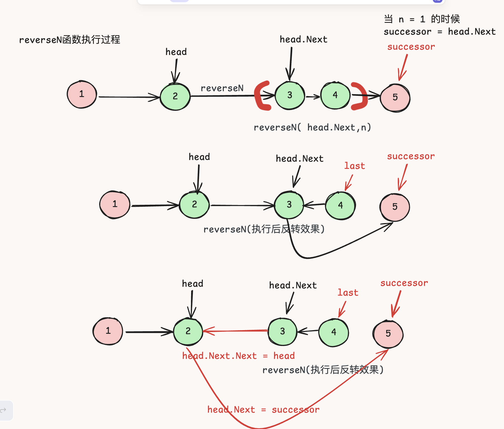

- 迭代解法：

  > dummy 定义虚拟节点
  >
  > 遍历整个链表，cur指向正在访问的节点，i 记录指向的节点是第几个。如果cur指向的节点不是要反转的节点，不断的追加到p.Next同时p也不断的移动
  >
  > 如果cur指向的节点是要反转的节点，不断的追加到p.Next同时p 不移动
  >
  > leftNode 用来记录第一个反转的节点（因为反转后，第一个节点，变成反转后的最后一个节点），如上中的节点2，变成反转后最后一个节点

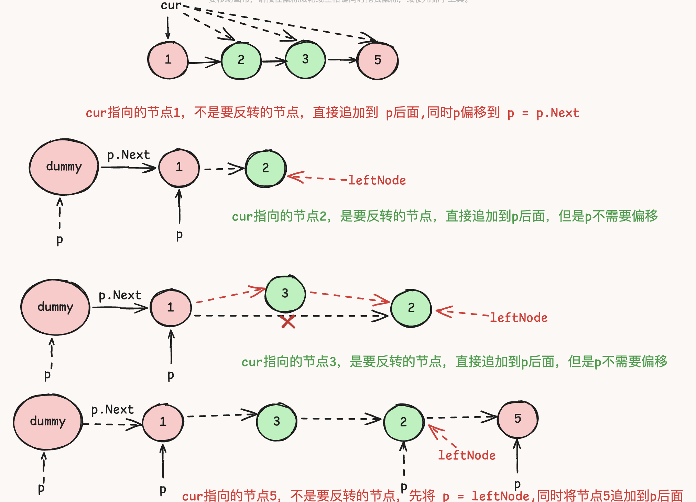

```go
func reverseBetween(head *ListNode, left int, right int) *ListNode {
    // 虚拟节点
    dummy := &ListNode{}
    p := dummy 
    // 表示当前 cur指向的是第几个节点
    i := 1
    cur := head

    var leftNode *ListNode

    // 遍历链表中的每一个节点
    for cur != nil {
        // 将下一个节点记录来下
        temp := cur.Next
        if  left <=i && i <= right { // 进入到反转范围的节点
            // 将节点保存在p后面，但是p不移动
            cur.Next = p.Next
            p.Next = cur

            // 记录第一个反转的节点
            if i == left {
                leftNode = cur
            }
            // 最后让p指向第一个反转的节点（因为已经成为了最后一个节点）
            if i == right {
                p = leftNode
            }
        } else { // 不是要反转的节点
            // 将节点保存在p后面，但是p也跟着移动
            p.Next = cur
            p = p.Next
            p.Next = nil // 让p的后续节点为nil，特例：[3,5] left= 2 right = 2
        }
        // 跳到，下一个节点
        i++
        cur = temp
    }
    return dummy.Next
}
```


## 23.合并K个升序链表

给你一个链表数组，每个链表都已经按升序排列。请你将所有链表合并到一个升序链表中，返回合并后的链表。

思路：

- 类型于归并排序，将链表数组切分称两个子数组，分别对子数组排序，然后将排序后的两个子数组进行`merge`成一个大的有序数组

```go
func mergeKLists(lists []*ListNode) *ListNode {
  	// 这里lists的长度可能为0
    if len(lists) == 0 {
        return nil
    }
    return sortK(lists,0,len(lists)-1) 
}

//定义：对【left，right】之间的链表排序，返回有序链表头节点
func sortK( lists []*ListNode,left,right int) *ListNode {
    if left == right {
        return lists[left]
    }
  	// 切分成两个子数组，分别排序
    mid := left +(right-left)/2
    l := sortK(lists,left,mid)
    r := sortK(lists,mid+1,right)
  	// 合并两个有序链表
    return merge(l,r)
}
//对两个有序链表合并，返回头节点
func merge(l,r *ListNode) *ListNode {
  	//虚拟头节点
    dummy := &ListNode{Val:0,Next:nil} 

    p := dummy

    for l != nil && r != nil {
        if l.Val < r.Val {
            p.Next = l
            l = l.Next
        } else {
            p.Next = r
            r = r.Next
        }
        p = p.Next
    }
    
    if l != nil {
        p.Next = l
    }

    if r != nil {
        p.Next = r
    }
    return dummy.Next
}
```


## 54.螺旋矩阵

给你一个 `m` 行 `n` 列的矩阵 `matrix` ，请按照 **顺时针螺旋顺序** ，返回矩阵中的所有元素。

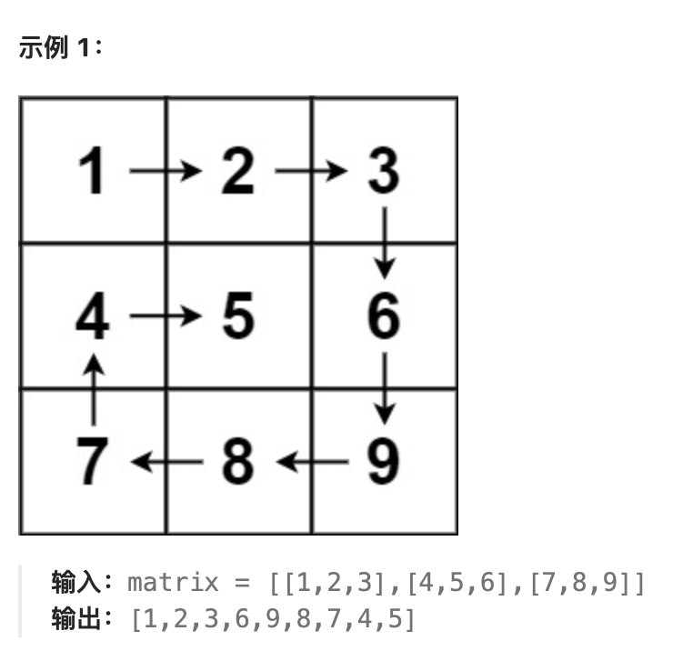

思路：

本质就是对二维数组的遍历，先横向遍历，再竖向遍历（一直反复进行）。注意的点：范围不要越界。

```go
func spiralOrder(matrix [][]int) []int {
    m := len(matrix)
    n := len(matrix[0])

    top,end := 0, m-1
    left,right := 0,n-1
    var result []int
		// 结束条件 result已经保存了所有的元素
    for len(result) < m * n {

        if top <= end { //上下边界不越界 
            //遍历top，从left 到right
            for i := left; i <= right;i++ {
                result = append(result,matrix[top][i])
            }
            top++ // 顶部下移
        }

        if left <= right {
            //遍历right，从top到end
            for i := top;i <= end;i++ {
                result = append(result, matrix[i][right])
            }
            right-- //右边左移
        }
        
        if top <= end {
            //遍历end，从right到left
            for i := right;i >= left;i-- {
                result = append(result,matrix[end][i])
            }
            end-- //底部上移
        }
        
        if left <= right {
            //遍历left，从end到top
            for i := end;i >= top;i-- {
                result = append(result,matrix[i][left])
            }
            left++  
        }
    }
    return result
}
```


## 300.最长递增子序列

给你一个整数数组 `nums` ，找到其中最长严格递增子序列的长度。

**子序列** 是由数组派生而来的序列，删除（或不删除）数组中的元素而不改变其余元素的顺序。例如，`[3,6,2,7]` 是数组 `[0,3,1,6,2,2,7]` 的子序列

思路：

- `dp` 数组的定义：`dp[i]` 表示以 `nums[i]` 这个数结尾的最长递增子序列的长度。

  那么 `dp` 数组中最大值，就是最长的递增子序列长度。

- 递推关系： `if nums[i] > nums[i-1]  dp[i] = max(dp[i],dp[i-1] + 1)`

```go
func lengthOfLIS(nums []int) int {
    //定义dp[i] 为以nums[i]为结尾，最大子序列【长度】

    dp := make([]int,len(nums))
    var result int
		// 默认每次元素就是一个子序列
    for k,_ := range dp {
        dp[k] = 1
    }

    for i := 0;i < len(nums);i++ {

        for j := 0;j < i;j++ { //和i之前的所有dp都对比一下[0, i-1]

            if nums[i] > nums[j] { //判断尾部数值大小
                dp[i] = max(dp[i],dp[j]+1)
            }
        }

        // 每个i位置处的最长递增子序列的长度中【最大值】
        result = max(result,dp[i])
    }
    return result
}

func max(a,b int)int{
    if a > b {
        return a
    }
    return b
}
```


## 415.字符串相加

给定两个字符串形式的非负整数 `num1` 和`num2` ，计算它们的和并同样以字符串形式返回。

你不能使用任何內建的用于处理大整数的库（比如 `BigInteger`）， 也不能直接将输入的字符串转换为整数形式。

思路：

- 双指针，分别指向字符串的尾部字符
- `carry`记录进位

```go
func addStrings(num1 string, num2 string) string {

    // 这题和二进制相加一样的解法，只是一个是十进制，一个是二进制

    l1 := len(num1)-1
    l2 := len(num2)-1

    carry  := 0
    result := ""
  	// 注意：条件是【或】的关系
    for l1 >= 0 || l2 >= 0 || carry != 0 {
        sum := carry
        if l1 >= 0 {
            sum += int(num1[l1] - '0')
            l1--
        }
        if l2 >= 0 {
            sum += int(num2[l2] - '0')
            l2--
        }
        result = string(sum % 10 + '0') + result // 余数拼接到result前面
        carry = sum / 10
    }
    return result
}
```


## 160.相交链表

给你两个单链表的头节点 `headA` 和 `headB` ，请你找出并返回两个单链表相交的起始节点。如果两个链表不存在相交节点，返回`null`。

图示两个链表在节点 `c1` 开始相交**：**

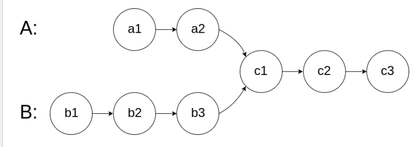

题目数据 **保证** 整个链式结构中不存在环。

**注意**，函数返回结果后，链表必须 **保持其原始结构** 

思路：

**解决这个问题的关键是，通过某些方式，让 `p1` 和 `p2` 能够同时到达相交节点 `c1`。**

如果用两个指针 `p1` 和 `p2` 分别在两条链表上前进，我们可以让 `p1` 遍历完链表 `A` 之后开始遍历链表 `B`，让 `p2` 遍历完链表 `B` 之后开始遍历链表 `A`，这样相当于「逻辑上」两条链表接在了一起。

如果这样进行拼接，就可以让 `p1` 和 `p2` 同时进入公共部分，也就是同时到达相交节点 `c1`：

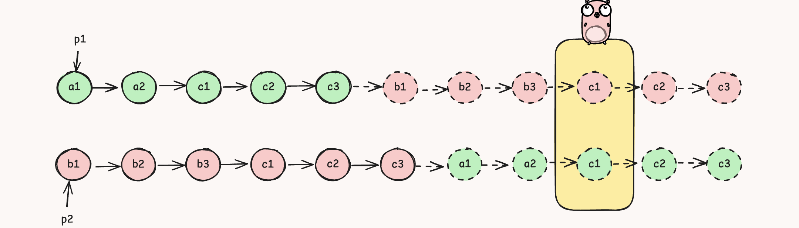

```go
func getIntersectionNode(headA, headB *ListNode) *ListNode {

    p1,p2 := headA,headB

    for p1 != p2 {
        if p1 == nil {
            p1 = headB
        } else {
            p1 = p1.Next
        }

        if p2 == nil {
            p2 = headA
        } else {
            p2 = p2.Next
        }
    }
    return p1
}

```

- 这里再提供另外一种方案

思路：

- 将两个链表首尾串联起来（物理上串联，上面的解法是逻辑上串联）
- 利用快慢指针，判断是否存在环
- 如果存在环，`fast`移动的距离是 2倍的 `slow`（因为`fast`一次移动2步，`slow`一次移动1步，如果相遇了，说明`fast`移动的距离是`slow`的2倍）
- 重置 `slow = headA`，同时移动 `slow fast`直到相遇，就是相交点。

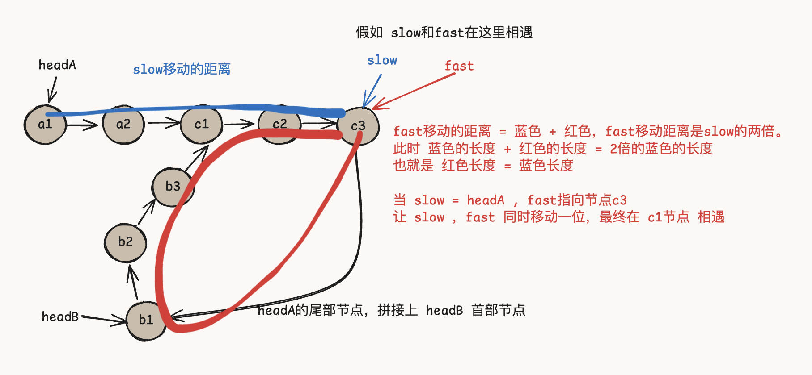

```go
func getIntersectionNode1(headA, headB *ListNode) *ListNode {
    //1.找到A链表最后一个节点
    q := headA

    for q.Next != nil {
        q = q.Next
    }
    //2.此时q指向链表A的最后一个节点，拼接A链表 + B链表
    q.Next = headB

    //3.快慢指针，判断是否有环
    slow,fast := headA,headA

    for fast != nil && fast.Next != nil {
        slow = slow.Next
        fast = fast.Next.Next

        if slow == fast {//有环
            break
        }
    }

    //4. 执行到这里，并且fast == nil || fast.Next== nil，说明上面的for循环，不是因为有环结束的，是因为无环
    if fast == nil || fast.Next == nil {
     	 q.Next = nil //!!!断开两个链表(题目要求必须保持原来的结构)
        return nil
    }

    //5.有环，找到环的起始点
    slow = headA
    for slow != fast {
        slow = slow.Next
        fast = fast.Next
    }
  	// !!!断开两个链表(题目要求必须保持原来的结构)
    q.Next = nil

    return slow

}
```


## 143.重排链表

给定一个单链表 `L` 的头节点 `head` ，单链表 `L` 表示为：

```
L0 → L1 → … → Ln - 1 → Ln
```

请将其重新排列后变为：

```
L0 → Ln → L1 → Ln - 1 → L2 → Ln - 2 → …
```

不能只是单纯的改变节点内部的值，而是需要实际的进行节点交换。

思路：

- 先利用快慢指针将链表切分称两个子链表 `l1 l2`
- 对 `l2`进行反转
- 最后将 `l1 l2`节点交错的拼接到一起

```go
/**
 * Definition for singly-linked list.
 * type ListNode struct {
 *     Val int
 *     Next *ListNode
 * }
 */
func reorderList(head *ListNode)  {
    // 无节点 or 单个节点
    if head == nil || head.Next == nil {
        return
    }
    //快慢指针，找到中点
    fast,slow := head,head
    for fast != nil && fast.Next != nil {
        slow = slow.Next
        fast = fast.Next.Next
    }

    //!!!注意这个细节
    l1 := head // 子链表 l1
    l2 := slow.Next //中点的下一个节点，作为子链表 l2 起始节点
    slow.Next = nil //为了让l1尾部指向 nil 节点
  
    //翻转链表 l2
    l2 = reverseList(l2)
  
    //合并链表
    for l1 != nil && l2 != nil {
        l1Next := l1.Next
        l2Next := l2.Next

        l1.Next = l2
        l1 = l1Next

        l2.Next = l1 // l2指向l1 (此时 l1 = l1Next 已经移位了一步)
        l2 = l2Next
    }
}

// 翻转链表
func reverseList(head *ListNode) *ListNode {
    if head == nil || head.Next == nil {
        return head
    }
   
    last := reverseList(head.Next)
    head.Next.Next = head
    head.Next = nil
    return last 
}
```


## 56.合并区间

以数组 `intervals` 表示若干个区间的集合，其中单个区间为 `intervals[i] = [start, end]` 。请你合并所有重叠的区间，并返回 *一个不重叠的区间数组，该数组需恰好覆盖输入中的所有区间* 。

思路：

- 一个区间可以表示为 `[start, end]`，先按区间的 `start` 排序：
- **显然，对于几个相交区间合并后的结果区间 `x`，`x.start`的值 一定是这些相交区间中 `start` 最小的，`x.end` 一定是这些相交区间中 `end` 最大的**：

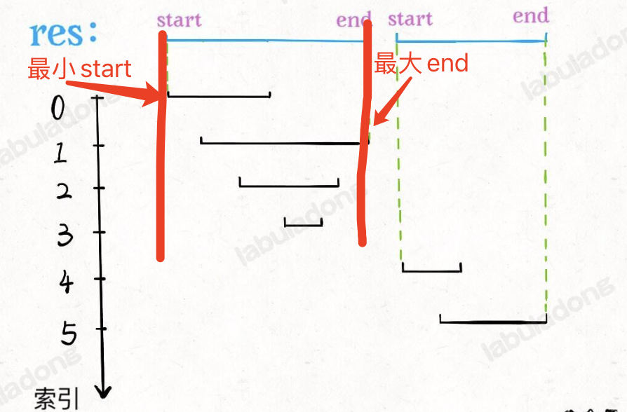

```go
func merge(intervals [][]int) [][]int {
		// 按照 start 正序排列
    sort.Slice(intervals, func(i, j int) bool {
		return intervals[i][0] < intervals[j][0]
	})

    var result [][]int
    pre := intervals[0] //前一个切片

    for index := 1 ; index < len(intervals); index++ {
        cur := intervals[index] //当前切片
        
      	// 当前切片头部 cur[0] <= 前一个切片尾部pre[1] 【有交集】
        if cur[0] <= pre[1] {
            pre[1] = max(pre[1],cur[1]) //合并两个为一个，用尾部较大的值，作为合并后的区间尾部 pre[1]
        } else { //当前cur 和pre没有交集，将pre保存起来，同时cur作为pre
            result = append(result,pre)
            pre = cur
        }
    }
		// 最后记得，将pre保存到 result一份
    result = append(result,pre)
    return result
}

func max(a,b int)int{
    if a > b {
        return a
    }
    return b
}
```


## 42.接雨水

给定 `n` 个非负整数表示每个宽度为 `1` 的柱子的高度图，计算按此排列的柱子，下雨之后能接多少雨水。

思路：

- 对于任意一个位置 `i`，能够装的水为：

```go
water[i] = 		// 左右两边的最高值的最小值 -  height[i]
							min(
  						// 0到i的最高值
  						max(height[0..i]) , 
  						// i 到 end的最高值
  						max(height[i..end])  )   - height[i]
```

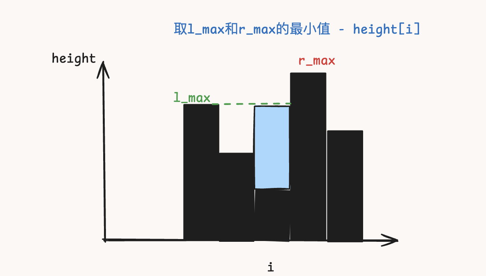

```go
func trap(height []int) int {
    ///！！！思路：答案理解起来比较容易，第一次做估计很难想到；

    //从左到右遍历[0...i]，求左边每个位置i的最高高度，l_dp[i] = max(height[i],l_dp[i-1]) 
    //从右到左遍历[i...end ]，求右边每个位置i的最高高度，r_dp[i] = max(height[i],r_dp[i+1])

    l_dp := make([]int,len(height)) // 从[0..i],求当前位置i，柱子的最高高度
    l_dp[0] = height[0]
    for i := 1;i < len(height);i++ {
        l_dp[i] = max(height[i],l_dp[i-1]) // l_dp[i-1]前一个柱子的最高高度
    }

    r_dp := make([]int,len(height)) //从 [i...end]，求当前位置i，柱子的最高高度
    r_dp[len(height)-1] = height[len(height)-1]

    for i := len(height)-2;i >= 0;i-- {
        r_dp[i] = max(height[i],r_dp[i+1])
    }

    result := 0
    for i := 0;i < len(height);i++ {
        result += min(l_dp[i],r_dp[i]) - height[i] //左边的最高高度 和 右边的最高高度，取最小值，减去当前的高度，表示当前位置可以保存到水量
    }
    return result
}

func min( a,b int) int{
    if a < b {
        return a
    }
    return b
}

func max( a,b int) int{
    if a > b {
        return a
    }
    return b
}
```


## 142.环形链表

给定一个链表的头节点  `head` ，返回链表开始入环的第一个节点。 *如果链表无环，则返回 `null`。*

如果链表中有某个节点，可以通过连续跟踪 `next` 指针再次到达，则链表中存在环。 为了表示给定链表中的环，评测系统内部使用整数 `pos` 来表示链表尾连接到链表中的位置（**索引从 0 开始**）。如果 `pos` 是 `-1`，则在该链表中没有环。**注意：`pos` 不作为参数进行传递**，仅仅是为了标识链表的实际情况。

**不允许修改** 链表。


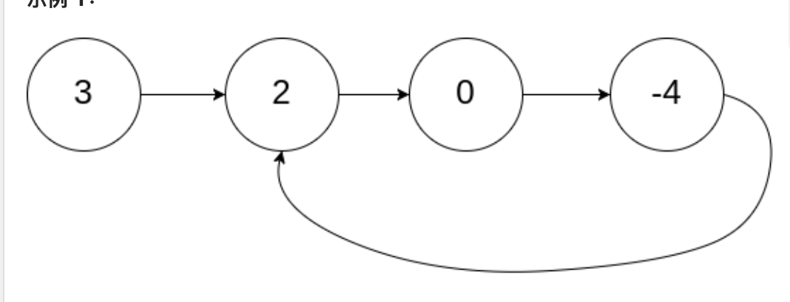

思路：

我们假设快慢指针相遇时，慢指针 `slow` 走了 `k` 步，那么快指针 `fast` 一定走了 `2k` 步：

因为 `fast` 一次跳跃距离为`2` ，`slow` 一次跳跃距离为 `1`

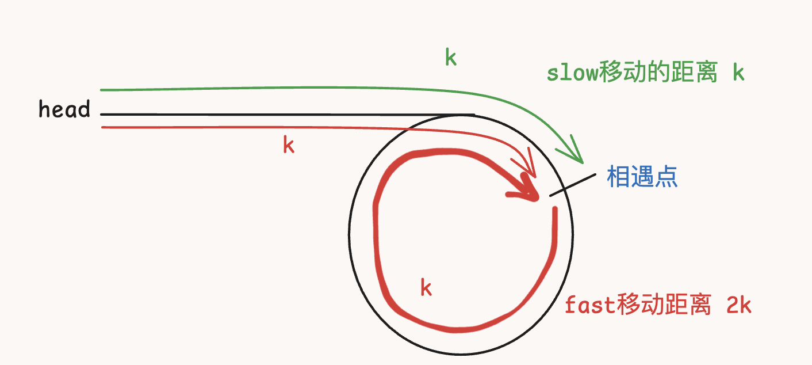

假设【相遇点】距环【相交点】的距离为 `m`，那么结合下图的 `slow` 指针，环的【相交点】距头结点 `head` 的距离为 `k - m`，也就是说如果从 `head` 前进 `k - m` 步就能到达环起点。

巧的是，如果从【相遇点】继续前进 `k - m` 步，也恰好到达环【相交点】：

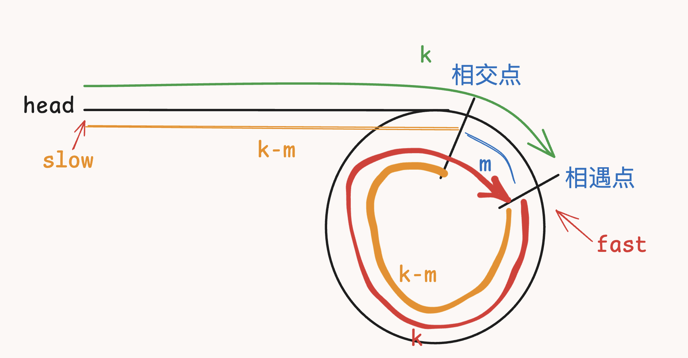

所以，只要我们把快慢指针中的任一个重新指向 `head`，然后两个指针同速前进，`k - m` 步后一定会相遇，相遇之处就是环的起点了。

```go
/**
 * Definition for singly-linked list.
 * type ListNode struct {
 *     Val int
 *     Next *ListNode
 * }
 */
func detectCycle(head *ListNode) *ListNode {
   
    //1.判断是否有环
    fast,slow := head,head
    for fast != nil && fast.Next != nil {
        
        fast = fast.Next.Next
        slow = slow.Next
        if fast == slow {
            break
        }
    }
    //2.说明没有环
    if fast == nil || fast.Next == nil {
        return nil
    }

    //3.说明有环，需要找到环的起始位置
    slow = head
    for slow != fast {
        fast = fast.Next
        slow = slow.Next
    }

    return slow

}
```


## 124. 二叉树中的最大路经和

二叉树中的 **路径** 被定义为一条节点序列，序列中每对相邻节点之间都存在一条边。同一个节点在一条路径序列中 **至多出现一次** 。该路径 **至少包含一个** 节点，且不一定经过根节点。

**路径和** 是路径中各节点值的总和。给你一个二叉树的根节点 `root` ，返回其 **最大路径和** 。

思路：

- 【从root为起点的最大路径】

这题在于递归函数的定义：`func oneSideMax(root *TreeNode) int `：从`root`为起点的最大路径和

不管`root.Val`是正还是负，从`root`节点出发（初始值`root.Val`），如果左节点`leftMax`是负值，只会使路经和值更小，也就是`left `不能作为路经 ；如果右节点`rightMax`是正数，可以使从`root`为起点的最大路径和变的更大，因此`right`可以作为路径

换句话说：从`root`出发的路经和，就是在`root.Val`值的基础上，上调或不变，如果`leftMax`为负值，那就是下调。不可能作为从`root`出发的最大路径。

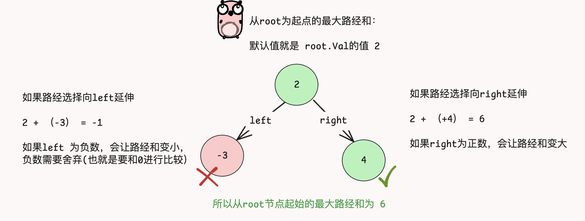

-   但是题目要求的是：【经过root】的最大路径和，注意和上面的区别，一个是从 root出发，题目要求的是经过 root 。

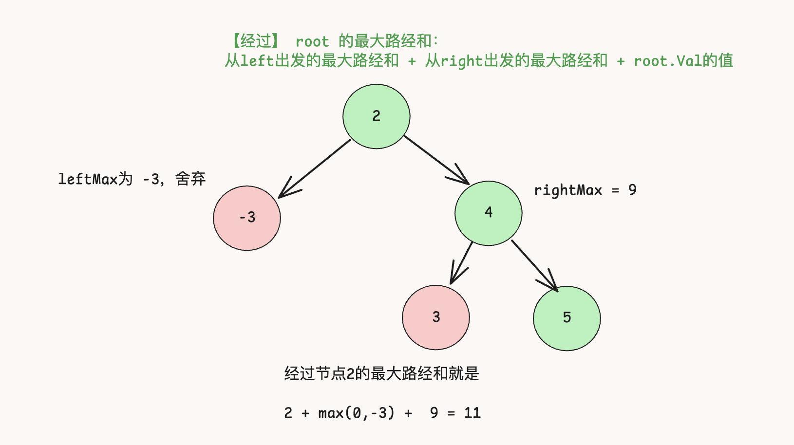

```go
/**
 * Definition for a binary tree node.
 * type TreeNode struct {
 *     Val int
 *     Left *TreeNode
 *     Right *TreeNode
 * }
 */

var result int = math.MinInt
// 【从root为起点的最大路径】 与  【经过root的最大路径和，是两种不同的含义】需要体会下
func maxPathSum(root *TreeNode) int {

    result = math.MinInt
    if root == nil {
        return 0
    }
    oneSideMax(root)
    return result
}

// oneSideMax 函数定义：从root为起点的最大路径和
func oneSideMax(root *TreeNode) int {
    if root == nil {
        return 0
    }
  
    //这点比较绕
    leftMax := max(0,oneSideMax(root.Left)) //oneSideMax(root.Left)以root.Left为起点的最大路径和，结果可能是【正】或【负】，负数舍弃
    rightMax := max(0,oneSideMax(root.Right))
  
    

  // 经过root的最大路径和（从 left节点出发的最大路经和leftMax + 从 right节点出发的最大路经和 rightMax + 当前的值 root.Val )
    result = max(result,root.Val+leftMax+rightMax) 
		
 		 // 从root出发的最大路径和
    return max(leftMax,rightMax)+root.Val 
}

func max(a,b int)int{
    if a > b {
        return a
    }
    return b
}
```


## 72. 编辑距离

给你两个单词 `word1` 和 `word2`， *请返回将 `word1` 转换成 `word2` 所使用的最少操作数* 。

你可以对一个单词进行如下三种操作：

- 插入一个字符
- 删除一个字符
- 替换一个字符

思路：

解决两个字符串的动态规划问题，一般都是用两个指针 `i, j` 分别指向两个字符串的最后，然后一步步往前走，缩小问题的规模。

对于每对字符 `s1[i]` 和 `s2[j]`，可以有四种操作：

```
if s1[i] == s2[j]:
    啥都别做（skip）
    i, j 同时向前移动
else:
    三选一：
        插入（insert）
        删除（delete）
        替换（replace）
```

- `dp`数组定义： `i`和`j`表示字符串长度，`dp[i][j]`表示最小操作数

- 递推关系： `i`和`j`表示字符串长度， `i-1` 和 `j-1`才表示最后一个字符的索引

  ```go
  if word1[i-1] == word2[j-1] {
  	dp[i][j] = dp[i-1][j-1] //不需要操作
  } else {
    dp[i-1][j] // i删除 j不变
    dp[i][j-1] // i不变，在i后面新增一个元素和j相同(也可以理解为 i不变，删除j)
    dp[i-1][j-1] // i和j同时replace为同一个元素
    
    dp[i][j] = min( dp[i-1][j]+1, dp[i][j-1]+1, dp[i-1][j-1]+1 )
  }
  ```

代码实现：

```go
func minDistance(word1 string, word2 string) int {
    
    m,n := len(word1),len(word2)
  	// 1.定义 dp数组
    dp := make([][]int,m+1)
    for k,_ := range dp {
        dp[k] = make([]int,n+1)
    }
  	// 2. 初始化 base case
    for i := 0;i <= m;i++ { // word2 字符串为空
        dp[i][0] = i // 需要的操作次数，新增i次元素
    }
    for j := 0;j<=n;j++ { // word1 字符串为空
        dp[0][j] = j // 需要的操作次数，新增j次元素
    }
		
  	//3. 一般递推关系
    for i := 1;i<=m;i++ {
        for j := 1;j<=n;j++ {
            if word1[i-1] == word2[j-1] {
                dp[i][j] = dp[i-1][j-1]
            } else {
                dp[i][j] = min(min(dp[i-1][j]+1,dp[i][j-1]+1),dp[i-1][j-1]+1)
            }
        }
    }
    return dp[m][n]
}

func min(a,b int)int{
    if a < b {
        return a
    }
    return b
}
```


## 93.复原IP地址

**有效 IP 地址** 正好由四个整数（每个整数位于 `0` 到 `255` 之间组成，且不能含有前导 `0`），整数之间用 `'.'` 分隔。

- 例如：`"0.1.2.201"` 和` "192.168.1.1"` 是 **有效** IP 地址，但是 `"0.011.255.245"`、`"192.168.1.312"` 和 `"192.168@1.1"` 是 **无效** IP 地址。

给定一个只包含数字的字符串 `s` ，用以表示一个 IP 地址，返回所有可能的**有效 IP 地址**，这些地址可以通过在 `s` 中插入 `'.'` 来形成。你 **不能** 重新排序或删除 `s` 中的任何数字。你可以按 **任何** 顺序返回答案。

思路：

- `for`循环每完成一组`[start,i]`数字的截取，剩下的字符串留给下一个递归函数截取

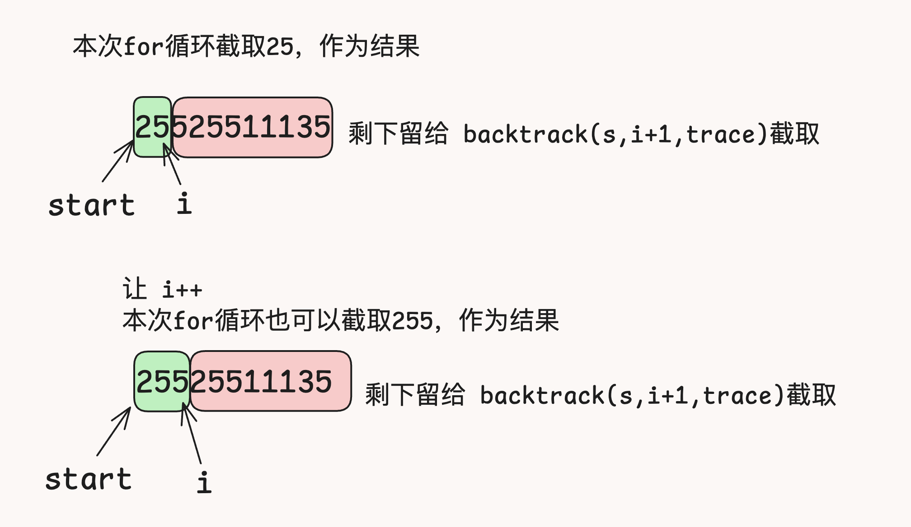

```go

var result []string
func restoreIpAddresses(s string) []string {

    trace := []string{} //记录每个分段
  	
    result = []string{}
    backtrack(s,0,trace)
    return result
}

func backtrack(s string , start int ,trace []string) {
  	// 终止条件
		// 整个字符串s需要正好被完整分割
    if start == len(s) && len(trace) == 4 {
        result = append(result,strings.Join(trace,".")) // 分割程4个部分，拼接成 ip地址的格式
        return
    }

    if len(trace) >= 4 { // 到start位置，如果已经拆分超过了4段，[start,...]后面的位置没必要继续拆分了
        return 
    }

    for i := start;i < len(s);i++ {

        if !isVaild(s,start,i) { // 判断 [start,i] 是否是有效的字符串
            continue // 继续扩大i
        }

        // 选择 [start,i]
        trace = append(trace,s[start:i+1])
        backtrack(s,i+1,trace) // 继续下一个片段的截取
				// 撤销选择
        trace = trace[:len(trace)-1]
    }
}

func isVaild(s string, start ,end int) bool {
    //1.长度只能是1-3之间
    length := end - start+1

    if length > 3|| length == 0 {
        return false
    }
    //2.长度大于1的话，如果前缀出现字符0，是不正确
    if length > 1 &&  s[start] == '0' { 
        return false
    }

    //3. 判断是否在 255 范围内
    val ,_ := strconv.Atoi(s[start:end+1])
    if val > 255 {
        return false
    }
    return true
}
```


## 19.删除链表的倒数第N个结点

给你一个链表，删除链表的倒数第 `n` 个结点，并且返回链表的头结点。

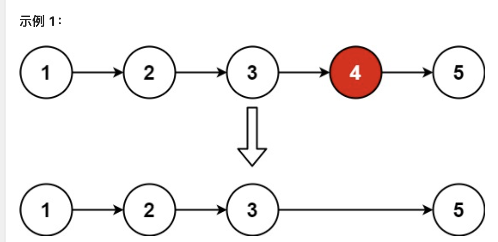

思路：

要删除倒数第 `n` 个节点，就得获得倒数第 `n + 1` 个节点的引用。

- 第一步，我们先让一个指针 `p1` 指向链表的头节点 `head`，然后走 `k` 步：

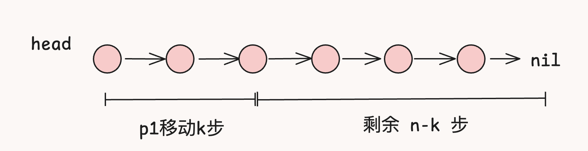

- 第二步，用一个指针 `p2` 指向链表头节点 `head`：

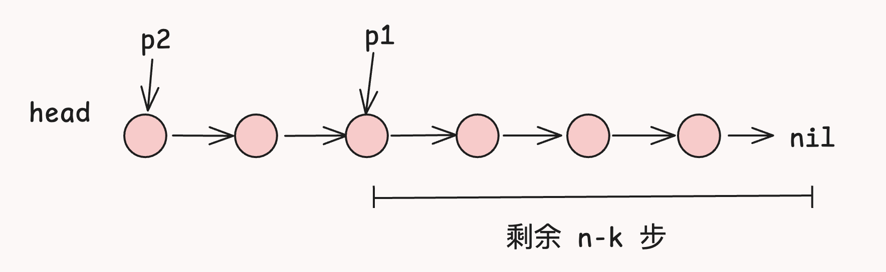

- 第三步，让 `p1` 和 `p2` 同时向前走，`p1` 走到链表末尾的空指针时走了 `n - k` 步，`p2` 也走了 `n - k` 步，也就是链表的倒数第 `k` 个节点：

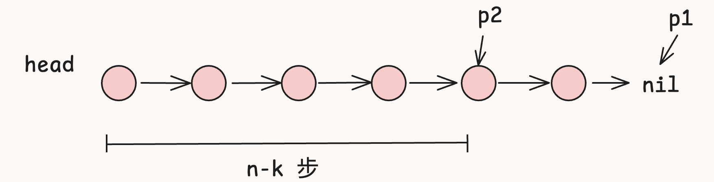

这样，只遍历了一次链表，就获得了倒数第 `k` 个节点 `p2`。

解法中在链表头部接一个虚拟节点 `dummy` 是为了避免删除倒数第一个元素时出现空指针异常，在头部加入 `dummy` 节点并不影响尾部倒数第 `k` 个元素是什么。

```go
/**
 * Definition for singly-linked list.
 * type ListNode struct {
 *     Val int
 *     Next *ListNode
 * }
 */
func removeNthFromEnd(head *ListNode, n int) *ListNode {
    //需要额外加一个虚拟节点
    dummy := &ListNode{Val:0}
    dummy.Next = head

    //查找倒数第N个节点（这里是找n+1节点）
    node := findN(dummy,n+1) 
  	// 删除 n 节点
    node.Next = node.Next.Next
    return dummy.Next
}


func findN(head *ListNode,n int) *ListNode {
  	// a b 都指向链表头部
    a,b := head,head
  	// a 先移动
    for i := 0;i<n;i++{
        a = a.Next
    }
	
    for a != nil {
        a = a.Next //a 到达尾部
        b = b.Next //b 指向的就是第n个节点
    }
    return b
}
```


## 1143.最长公共子序列

给定两个字符串 `text1` 和 `text2`，返回这两个字符串的最长 **公共子序列** 的长度。如果不存在 **公共子序列** ，返回 `0` 。

一个字符串的 **子序列** 是指这样一个新的字符串：它是由原字符串在不改变字符的相对顺序的情况下删除某些字符（也可以不删除任何字符）后组成的新字符串。

- 例如，`"ace"` 是 `"abcde"` 的子序列，但 `"aec"` 不是 `"abcde"` 的子序列。

两个字符串的 **公共子序列** 是这两个字符串所共同拥有的子序列。

思路：

- 动态规划：和 [72. 编辑距离](https://leetcode.cn/problems/edit-distance) 同为经典的双字符串动态规划问题。

- `dp[i][j]`定义：表示`text1`中`[0,i-1]`长度为`i`字符串 和`text2`中`[0,j-1`]长度为`j`字符串，公共子序列的最长长度

- 递推关系：

  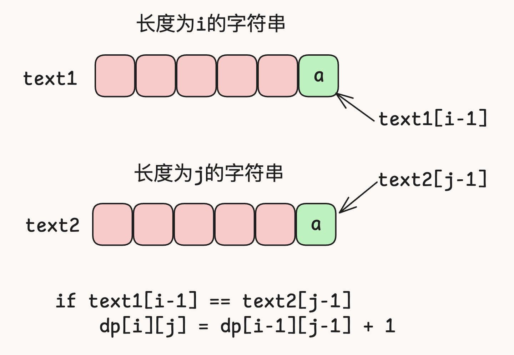

  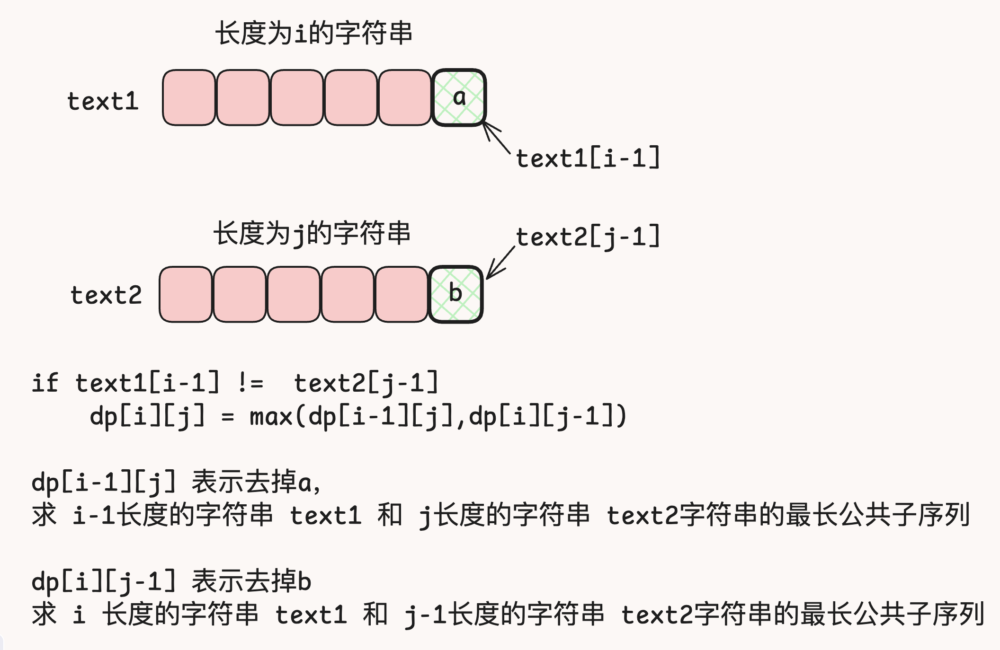

```go
func longestCommonSubsequence(text1 string, text2 string) int {
   
    m := len(text1)
    n := len(text2)
		
  	//base case dp[0][...] = dp[...][0] = 0
    dp := make([][]int,m+1)
    for i := 0;i < m+1 ;i++ {
        dp[i] = make([]int,n+1)
    }
		// //i和j表示字符串长度
    for i := 1;i <= m;i++ { 
        for j := 1;j <=n ;j++ {
            if text1[i-1] == text2[j-1] { //说明尾部的字符相同，算作一个公共字符
                dp[i][j] = 1 + dp[i-1][j-1]
            } else {
                dp[i][j] = max(dp[i-1][j],dp[i][j-1]) //可能[i-1][j]尾部字符相同 或者 [i][j-1]尾部字符相同
            }
        }
    }
    return dp[m][n]
}

func max( a,b int)int{
    if a > b {
        return a
    }
    return b
}
```


## 82.删除排序链表中的重复元素II

给定一个已排序的链表的头 `head` ， *删除原始链表中所有重复数字的节点，只留下不同的数字* 。返回 *已排序的链表* 。

思路：

- 定义虚拟节点 `dummy`，保存不重复的节点
- 找到节点值相同的左右节点指针，`[left,right]`之间就是重复的数字节点（丢弃）

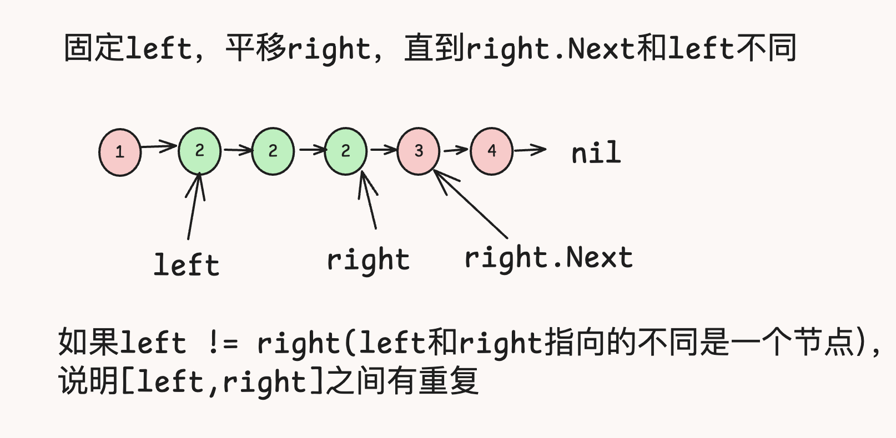

```go
/**
 * Definition for singly-linked list.
 * type ListNode struct {
 *     Val int
 *     Next *ListNode
 * }
 */
func deleteDuplicates(head *ListNode) *ListNode {
    // 说明 没有节点 or 只有一个节点
    if head == nil || head.Next == nil {
        return head
    }
    // 用来保存结果
    dummy := &ListNode{0,nil}
    node := dummy


    for head != nil {

        // 固定左边
        left := head
        // 看是否有下一个节点数值和left相同
        for head.Next != nil && left.Val == head.Next.Val {
            head = head.Next
        }

        //
        // 如果left 和 head 相同，说明没有移动过。否则， 是[left,head]之间的就是重复的元素（舍弃）
        if left == head { // 说明本节点不重复，保存到结果中
            node.Next = left
            node = node.Next
        }
        // head移动一位，从下一个节点，开始继续比较
        head = head.Next
    }
  
    // 【注意】：断开最后一个节点
    node.Next = nil
    return dummy.Next
}
```


## 94. 二叉树的中序遍历

给定一个二叉树的根节点 `root` ，返回 *它的 **中序** 遍历* 。

思路：

中序遍历结果的特点是 `root.val` 在中间，左右子树在两侧：

提供递归 + 迭代两种遍历方法：

- 递归方法：

```go
var result []int
func inorderTraversal1(root *TreeNode) []int {
    result = []int{}
    inorder(root)
    return result
}

func inorder(root *TreeNode) {
    if root == nil {
        return
    }
    inorder(root.Left) // 遍历 root.Left 树
    result = append(result,root.Val) // 当前 root.Val值
    inorder(root.Right) // 遍历 root.Right 树
}
```

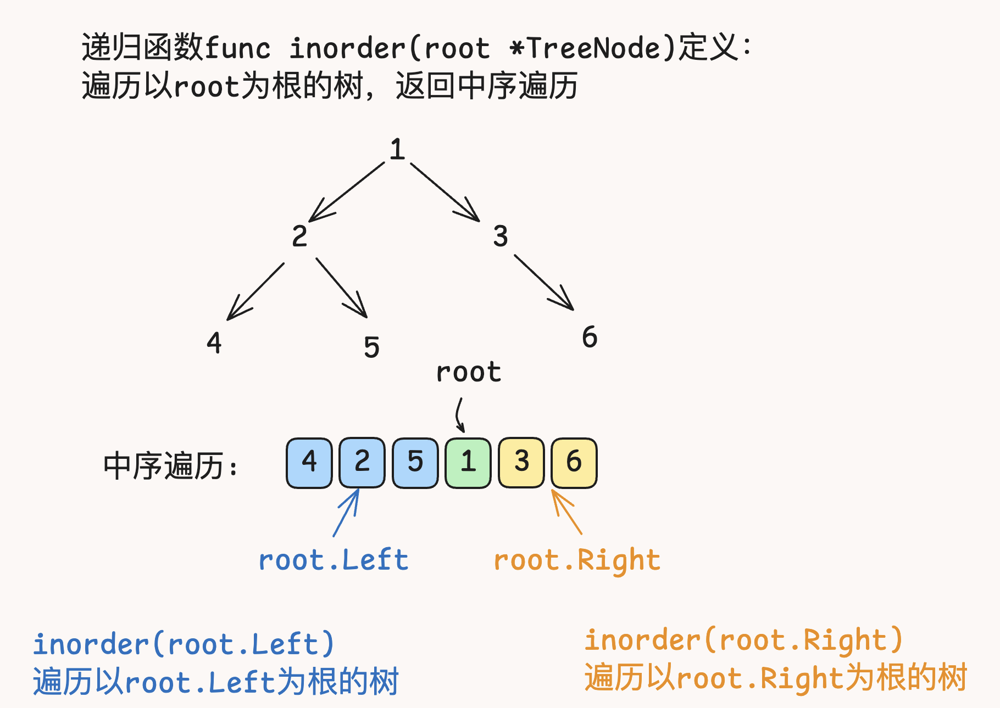

- 迭代方法

利用栈，先将左子树入栈，出栈的时候，记录出栈数值（效果相当于先遍历左子树，得到左树的中序遍历结果）；当左子树为空的时候，再将右子树入栈（等价于遍历右子树，得到右树的中序遍历结果）

```go

func inorderTraversal(root *TreeNode) []int {
    result := make([]int,0)
  	// 栈
    sk := []*TreeNode{}
  
    for len(sk) != 0 || root != nil {
      	
        for root != nil {
            sk = append(sk,root) //入栈： 将左节点不断的追加到 sk 中
            root = root.Left
        }
        // 出栈
        root = sk[len(sk)-1]
        sk = sk[:len(sk)-1]
        result = append(result,root.Val) // 中序遍历值
      	// 右节点继续入栈
        root = root.Right
    }
    return result
}
```

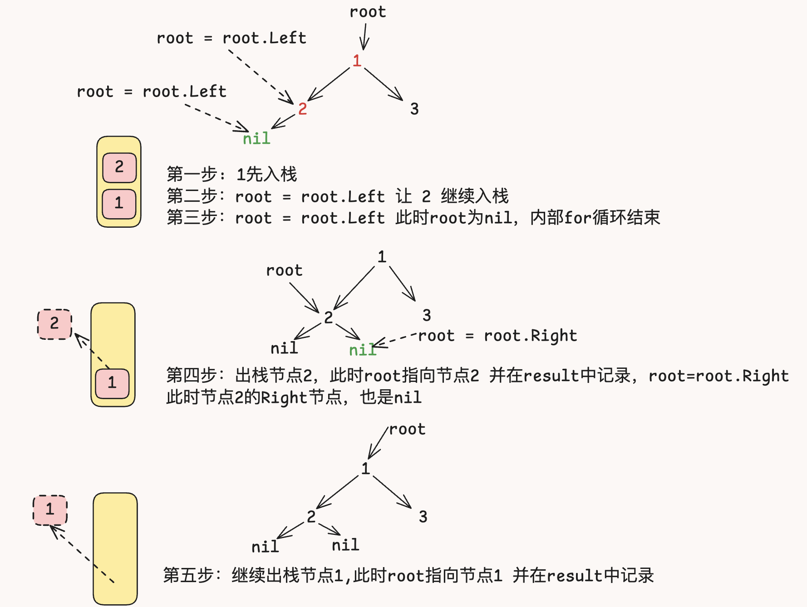

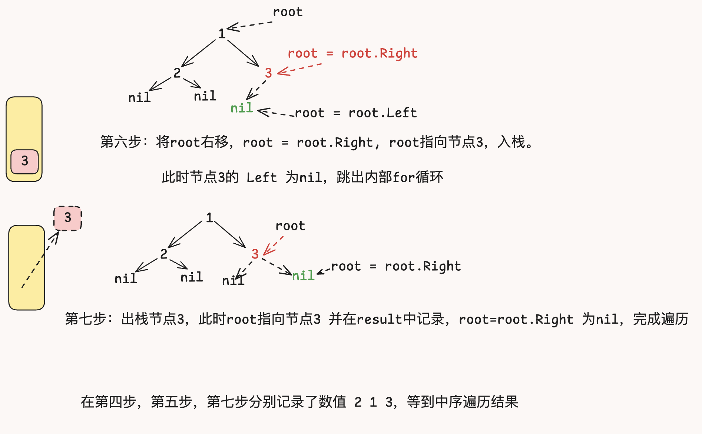

## 199.二叉树的右视图

给定一个二叉树的 **根节点** `root`，想象自己站在它的右侧，按照从顶部到底部的顺序，返回从右侧所能看到的节点值。

思路：

上面出现了多次的层序遍历的题目，这个题目只是要得到每层的最右边的节点值

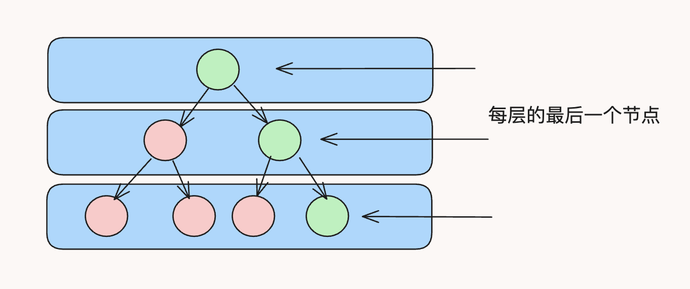

```GO
/**
 * Definition for a binary tree node.
 * type TreeNode struct {
 *     Val int
 *     Left *TreeNode
 *     Right *TreeNode
 * }
 */
func rightSideView(root *TreeNode) []int {
    //层序遍历
    result := []int{}
    if root == nil {
        return result
    }
  	// 初始节点
    nodes := []*TreeNode{}
    nodes = append(nodes,root)

    for len(nodes) != 0 {
      	// 每层的节点数
        count := len(nodes)

        for i := 0;i<count;i++ {
          
            if i == count-1 { // 每层最后一个节点
                result = append(result,nodes[i].Val)
            }

            if nodes[i].Left != nil {
                nodes = append(nodes,nodes[i].Left)
            }
            if nodes[i].Right != nil {
                nodes = append(nodes,nodes[i].Right)
            }
        }
        //!!!弹出nodes中的被遍历过的节点
        nodes = nodes[count:]
    }
    return result
}
```


## 74.二分查找

给定一个 `n` 个元素有序的（升序）整型数组 `nums` 和一个目标值 `target` ，写一个函数搜索 `nums` 中的 `target`，如果目标值存在返回下标，否则返回 `-1`。

思路：

二分搜索算法最基础的题目： 定义`left right`指向数组的两端，通过`target`和 `nums[mid]`值比较，缩小搜索范围，直到找到目标值

```go
func search(nums []int, target int) int {
  	// 定义 left right 
    left,right := 0,len(nums)-1
  
    for left <= right {
      	// 中间索引
        mid := left+(right-left)/2
      	
        if nums[mid] == target { // 找到目标值
            return mid
        } else if nums[mid] > target { // 说明目标值在 [left,mid-1]之间
            right = mid-1
        } else { // 说明目标值在[mid+1,right] 之间
            left = mid+1
        }
    }
    return -1
}
```


## 232.用栈实现队列

请你仅使用两个栈实现先入先出队列。队列应当支持一般队列支持的所有操作（`push`、`pop`、`peek`、`empty`）：

实现 `MyQueue` 类：

- `void push(int x)` 将元素 x 推到队列的末尾
- `int pop()` 从队列的开头移除并返回元素
- `int peek()` 返回队列开头的元素
- `boolean empty()` 如果队列为空，返回 `true` ；否则，返回 `false`


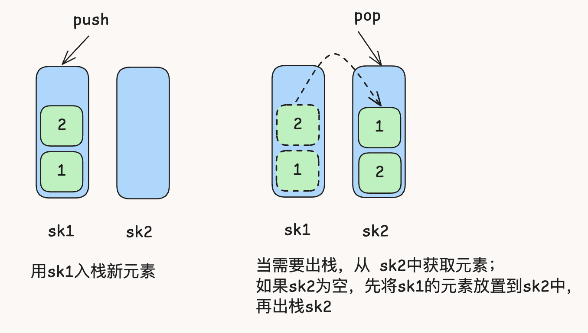

```go
//核心思想：
//入栈：对stack1入栈
//出栈：判断stack2是否为空；不为空：出栈stack2。。。如果为空，需要将stack1中的放入到stack2中

type MyQueue struct {
    sk1 []int
    sk2 []int
}


func Constructor() MyQueue {
    mq := MyQueue{}
    mq.sk1 = make([]int,0)
    mq.sk2 = make([]int,0)
    return mq
}

// 入栈
func (this *MyQueue) Push(x int)  {
    this.sk1 = append(this.sk1,x)
}

// 出栈
func (this *MyQueue) Pop() int {
  	// sk2 不为空，直接出栈
    if len(this.sk2) != 0 {
        val := this.sk2[len(this.sk2)-1]
        this.sk2 = this.sk2[:len(this.sk2)-1]
        return val
    } else if len(this.sk1) != 0 { // sk2为空，但是sk1不为空

        for j := len(this.sk1)-1;j>= 0;j-- { //把sk1中的元素，倒着放入到sk2中
            this.sk2 = append(this.sk2,this.sk1[j])
        }
        //!!!清空
        this.sk1 = []int{}
      	// 出栈 sk2
        val := this.sk2[len(this.sk2)-1]
        this.sk2 = this.sk2[:len(this.sk2)-1]
        return val
    }

    return 0
}

// 预览
func (this *MyQueue) Peek() int {
    if len(this.sk2) != 0 {
        val := this.sk2[len(this.sk2)-1]
        //this.sk2 = this.sk2[:len(this.sk2-1)]
        return val
    } else if len(this.sk1) != 0 {
       for j := len(this.sk1)-1;j>= 0;j-- { //把sk1中的元素，倒着放入到sk2中
            this.sk2 = append(this.sk2,this.sk1[j])
        }
        //!!!清空
        this.sk1 = []int{}
        val := this.sk2[len(this.sk2)-1]
        //this.sk2 = this.sk2[:len(this.sk2)-1]
        return val
    }

    return 0
}

func (this *MyQueue) Empty() bool {
    if len(this.sk2) == 0 && len(this.sk1) == 0 {
        return true
    }
    return false
}
```


## 148. 排序链表

给你链表的头结点 `head` ，请将其按 **升序** 排列并返回 **排序后的链表** 。

思路：

- 利用外慢指针技巧，先找到链表的中间节点
- 利用中间节点，将链表分成两个子链表，分别对子链表进行排序
- 最后再将两个有序子链表，合并成一个最终的结果

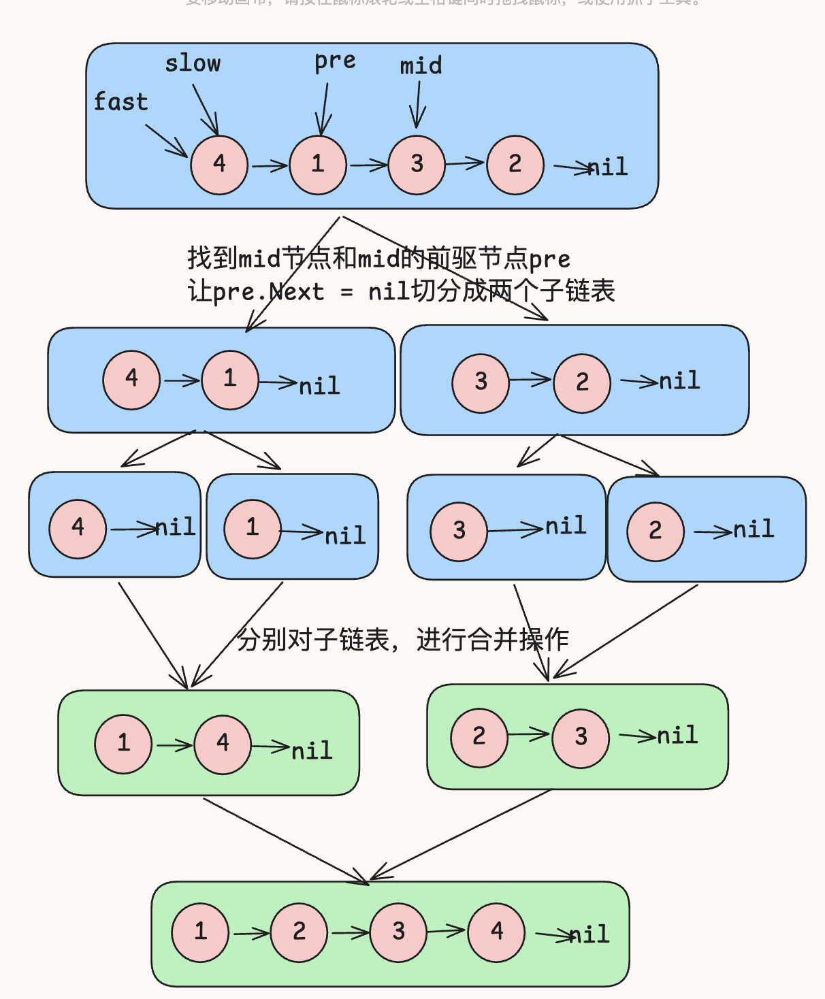

```go

func sortList(head *ListNode) *ListNode {
    
    if head == nil || head.Next == nil { //【空链表】 或者 【只有一个节点的链表】
        return head
    }

    // 快慢指针找到中间节点，并且切开成两个部分
    fast,slow := head,head
    pre := head 
    for fast != nil && fast.Next != nil { 
        fast = fast.Next.Next
        pre = slow  // ！！！这个很重要，存储中点的【前置节点】
        slow = slow.Next
    }
    pre.Next = nil //！！！目的：找到中间节点的前一个节点，使【左右链表断开】
    
    l1 := sortList(head) //左链表
    l2 := sortList(slow) //右链表
    return merge(l1,l2)
}

func merge(l1,l2 *ListNode) *ListNode {
  	//1.创建一个虚拟节点dummy
    dummy := &ListNode{0,nil}
    cur := dummy
		
  	//2.合并两个升序链表，拼接到cur后面
    for l1 != nil && l2 != nil {
        if l1.Val < l2.Val {
            cur.Next = l1
            l1 = l1.Next
        } else {
            cur.Next = l2
            l2 = l2.Next
        }
        cur = cur.Next
    }

    if l1 != nil {
        cur.Next = l1
    }

    if l2 != nil {
        cur.Next = l2
    }

    return dummy.Next
}

```


## 31.下一个排列

整数数组的一个 **排列** 就是将其所有成员以序列或线性顺序排列。

- 例如，`arr = [1,2,3]` ，以下这些都可以视作 `arr` 的排列：`[1,2,3]`、`[1,3,2]`、`[3,1,2]`、`[2,3,1]` 。

整数数组的 **下一个排列** 是指其整数的下一个字典序更大的排列。更正式地，如果数组的所有排列根据其字典顺序从小到大排列在一个容器中，那么数组的 **下一个排列** 就是在这个有序容器中排在它后面的那个排列。如果不存在下一个更大的排列，那么这个数组必须重排为字典序最小的排列（即，其元素按升序排列）。

- 例如，`arr = [1,2,3]` 的下一个排列是 `[1,3,2]` 。
- 类似地，`arr = [2,3,1]` 的下一个排列是 `[3,1,2]` 。
- 而 `arr = [3,2,1]` 的下一个排列是 `[1,2,3]` ，因为 `[3,2,1]` 不存在一个字典序更大的排列。

给你一个整数数组 `nums` ，找出 `nums` 的下一个排列。

必须**[ 原地 ](https://baike.baidu.com/item/原地算法)**修改，只允许使用额外常数空间。

思路：

以 `1,2,3,4,5,6` 为例，其排列依次为：

```go
123456
123465
123546
...
654321
```

可以看到有这样的关系：`123456 < 123465 < 123546 < ... < 654321`。

- 我们希望下一个数 比当前数大，这样才满足 “下一个排列” 的定义。因此只需要 将后面的「大数」与前面的「小数」交换，就能得到一个更大的数。比如 123456，将 5 和 6 交换就能得到一个更大的数 123465

- 我们还希望下一个数 增加的幅度尽可能的小，这样才满足“下一个排列与当前排列紧邻“的要求。为了满足这个要求，我们需要：

  - 在尽可能**靠右的低位**进行交换，需要**从后向前**查找

  - 将一个 尽可能小的「大数」 与前面的「小数」交换。比如 123465，下一个排列应该把 5 和 4 交换而不是把 6 和 4 交换
  - 将「大数」换到前面后，需要将「大数」后面的所有数 重置为升序，升序排列就是最小的排列。以 123465 为例：首先按照上一步，交换 5 和 4，得到 1235 64；然后需要将 5 之后的数重置为升序，得到 1235 46。显然 1235 46 比 1235 64 更小，123546 就是 123465 的下一个排列

这个就是推到下一个排列的基本规则
1. 尽可能的在右边交换
2. 尽可能让尽可能小的【大数】和前面的【小数】交互
3. 交换完成后，对后续的数进行升序排列

```go
func nextPermutation(nums []int)  {
  	///！！！这题的思路一般很难想出来（更多的是找规律）

 	 i := len(nums)-2 // 从倒数第二数字开始（目的：我们要找后面的数【大】 前面的数【小】，比如: 123456中的 5和6）
    for i >= 0 && nums[i] >= nums[i+1] { // 说明从【后向前】是升序排列（比如 654321 也就是说：后面的数【小】，而不是【大】）
        i--
    }
   
		
    if i >= 0 { //说明找到了【后面的数大】前面的数【小】的索引位置,比如 1234 65，中的数值4的位置
        end := len(nums)-1
        for end >= 0 &&  nums[i] >= nums[end] { // 从后向前，找到第一个比i稍微大的数，比如 1234 65，中的数值 5
            end--
        }
        //交换
        nums[i],nums[end] = nums[end],nums[i]
    }

    //对i+1后的数字升序排序[i+1,len(nums)-1] ，比如 1235 64，排序后变成 1235 46
    l,r := i+1,len(nums)-1
    for l < r {
        nums[l],nums[r] = nums[r],nums[l]
        l++
        r--
    }
}
```

## 22.括号生成

数字 `n` 代表生成括号的对数，请你设计一个函数，用于能够生成所有可能的并且 **有效的** 括号组合。

思路：

- 利用回溯算法，在每个位置选择【左括号】或者【右括号】，组成括号组合
- 为了减少不必要的穷举，我们要知道合法括号串有以下性质

  - **一个「合法」括号组合的左括号数量一定等于右括号数量，这个很好理解**。
  - **对于一个「合法」的括号字符串组合 `p`，必然对于任何 `0 <= i < len(p)` 都有：子串 `p[0..i]` 中左括号的数量都大于或等于右括号的数量**。

因为从左往右算的话，肯定是左括号多嘛，到最后左右括号数量相等，说明这个括号组合是合法的。

`backtrack`函数中，`left`表示剩余可选的左括号数量 `right`表示剩余可选的右括号数量

```go

var result []string
func generateParenthesis(n int) []string {
    result = []string{}
    
    track := []byte{}
  	// 1. 默认左右剩余括号都是n个
    backtrack(track,n,n)
    return result
}

//left剩余左括号数量 right剩余右括号数量
func backtrack(track []byte,left,right int) { 
  	// 括号恰好都使用完成
    if left == 0 && right == 0 {
        result = append(result,string(track))
        return
    }
  	// 剩余right < 剩余left，说明right选择多了，不符合题意
    if left < 0 || right < 0  || right < left { 
        return
    }

    track = append(track,'(') // 选择左括号
    backtrack(track,left-1,right)
    track = track[:len(track)-1] // 撤销选择

    track = append(track,')') // 选择右括号
    backtrack(track,left,right-1)
    track = track[:len(track)-1] //撤销选择
}

```


## 8. 字符串转换整数

请你来实现一个 `myAtoi(string s)` 函数，使其能将字符串转换成一个 32 位有符号整数。

函数 `myAtoi(string s)` 的算法如下：

1. **空格：**读入字符串并丢弃无用的前导空格（`" "`）
2. **符号：**检查下一个字符（假设还未到字符末尾）为 `'-'` 还是 `'+'`。如果两者都不存在，则假定结果为正。
3. **转换：**通过跳过前置零来读取该整数，直到遇到非数字字符或到达字符串的结尾。如果没有读取数字，则结果为0。
4. **舍入：**如果整数数超过 32 位有符号整数范围 `[−231, 231 − 1]` ，需要截断这个整数，使其保持在这个范围内。具体来说，小于 `−231` 的整数应该被舍入为 `−231` ，大于 `231 − 1` 的整数应该被舍入为 `231 − 1` 。

返回整数作为最终结果。

思路：

整个字符串的格式是固定 **【空格】+【符号】+ 【数字/字母等等符号】**

这题只需要根据上面的4个条件实现即可

```go
func myAtoi(s string) int {
    count := len(s)
    sign := 1
    result := 0
    index := 0
   
    //1.先去掉前缀 空格
    for index < count && s[index] == ' ' {
        index++
    }

    //2.查看符号位
    if index < count {
        if s[index] == '+' {
            sign = 1
            index++
        } else if s[index] == '-' {
            sign = -1
            index++
        }
    } 

    //3. 把数字全部拿出来（遇到非数字，结束for循环）
    for index < count && s[index] >= '0' && s[index] <= '9' {
        result = result * 10 + int(s[index]-'0')
      	// 4. 舍入（截断）
        if sign * result >= math.MaxInt32 {
            return math.MaxInt32
        } else if sign * result <= math.MinInt32 {
            return math.MinInt32
        } 
        index++
    }
    return sign * result
}
```


## 69. x的平方根

给你一个非负整数 `x` ，计算并返回 `x` 的 **算术平方根** 。由于返回类型是整数，结果只保留 **整数部分** ，小数部分将被 **舍去 。**

**注意：**不允许使用任何内置指数函数和算符，例如 `pow(x, 0.5)` 或者 `x ** 0.5` 。

思路：

- 这里其实是一道数学题。比如 求数字 `4` 的平方根，转换成求两个数的乘积，就是 `2*2=4`。

- 利用二分法，找一个数字 `mid`，让 `mid*mid`的值不断的趋近于 `x`，那么`mid`就是平方根

```go
// x 是整数，求平方根
func mySqrt(x int) int {
    
    left, right := 0,x
    for left <= right {
        mid := left + (right-left)/2
        
        if x == mid * mid {
            return mid
        } else if x  < mid * mid {
            right = mid - 1 // mid 偏大
        } else {
            left = mid + 1 // mid 偏小
        }
    }
    // 执行到这里，left > right ，结果是一个浮点数,比如 2.3434,位于 [right,left]之间，因为只保留整数部分，所以取 right的值
    return right
}


// 有次面试，实际遇到的是这个题目（上面的变形题）
// x是浮点数求平方根，保留3位小数
func mySqrt1(x float64) float64 {
	l, r := 0.0, x
	for l <= r {
		mid := (l + r) /2 
		if x < mid*mid {
			r = mid - 1e-3
		} else {
			l = mid + 1e-3
		}
	}
	return r
}
```


## 2. 两数相加

给你两个 **非空** 的链表，表示两个非负的整数。它们每位数字都是按照 **逆序** 的方式存储的，并且每个节点只能存储 **一位** 数字。

请你将两个数相加，并以相同形式返回一个表示和的链表。你可以假设除了数字 0 之外，这两个数都不会以 0 开头。

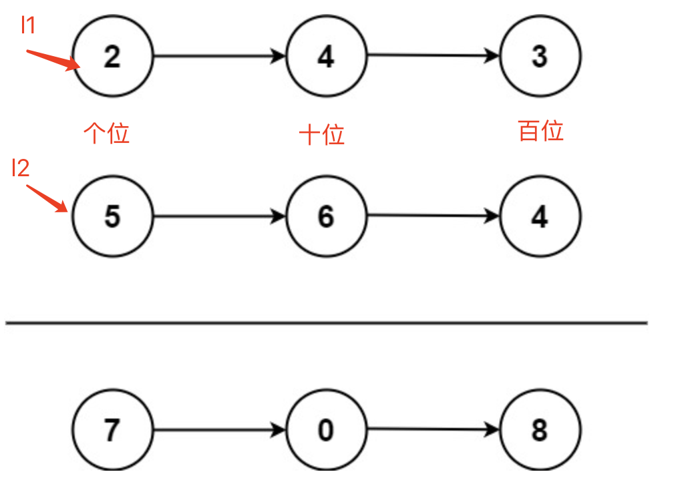

思路：

- 逆序存储很友好了，直接遍历链表就是从【个位】开始的，符合我们计算加法的习惯顺序。如果是正序存储，那倒要费点脑筋了，可能需要翻转链表或者使用栈来辅助。

- 这道题主要考察 链表双指针技巧和加法运算过程中对进位的处理。注意这个 `carry` 变量的处理，在我们手动模拟加法过程的时候会经常用到。

- **代码中还用到一个链表的算法题中是很常见的「虚拟头结点」技巧，也就是 `dummy` 节点**

```go
/**
 * Definition for singly-linked list.
 * type ListNode struct {
 *     Val int
 *     Next *ListNode
 * }
 */
func addTwoNumbers(l1 *ListNode, l2 *ListNode) *ListNode {
  	// dummy 虚拟节点
    dummy := &ListNode{Val:0,Next:nil}
    p := dummy
  
  	// 记录进位
    carry := 0
 
  	// l1 l2 分别指向两个链表的头部，只有有一个不为nil 或者 进位不为0
    for l1 != nil || l2 != nil || carry > 0 { 
        val := carry //进位数

        if l1 != nil {
            val += l1.Val //l1数值
            l1 = l1.Next
        }

        if l2 != nil {
            val += l2.Val//l2数值
            l2 = l2.Next
        }

        carry = val / 10 //下一次的进位
        val = val % 10   //当前结果
        p.Next = &ListNode{Val:val,Next:nil} //拼接到p的Next
        p = p.Next
    }
		// 返回最终的头节点
    return dummy.Next
}
```


## 70. 爬楼梯

假设你正在爬楼梯。需要 `n` 阶你才能到达楼顶。

每次你可以爬 `1` 或 `2` 个台阶。你有多少种不同的方法可以爬到楼顶呢？

思路：

-  动态规划题型
- `dp[i]`含义：到达 `i`阶，可以有 `dp[i]`种不同的方法
- 递推关系：到达 `i-1`阶，有 `dp[i-1]`种方法，到达 `i-2`阶，有 `dp[i-2]`种方法，到达 `i`阶【可以从 `i-1`阶，爬 `1`个台阶直接到达】 或者 【可以从 `i-2`阶，爬 `2`个台阶直接到达】，有 `dp[i] = dp[i-1] + dp[i-2]`种方法

```go
func climbStairs(n int) int {
	// 定义 dp 数组，长度为 n+1
	dp := make([]int, n+1)
	
	for i := 0; i <= n; i++ {
    		// base case
        if i == 0 {
            dp[i] = 1 
        } else if i == 1 { // base case
            dp[i] = 1
        } else {
            dp[i] = dp[i-1] + dp[i-2] //到达dp[i],有两种方法：一种直接从dp[i-1],一种直接从dp[i-2]
        }
	}

    return dp[n]
}
```


## 165. 比较版本号

给你两个 **版本号字符串** `version1` 和 `version2` ，请你比较它们。版本号由被点 `'.'` 分开的修订号组成。**修订号的值** 是它 **转换为整数** 并忽略前导零。

比较版本号时，请按 **从左到右的顺序** 依次比较它们的修订号。如果其中一个版本字符串的修订号较少，则将缺失的修订号视为 `0`。

返回规则如下：

- 如果 `version1 < version2` 返回 `-1`，
- 如果 `version1 > version2` 返回 `1`，
- 除此之外返回 `0`。

思路：

这是一个比较实用的题目，工作中也可能出现

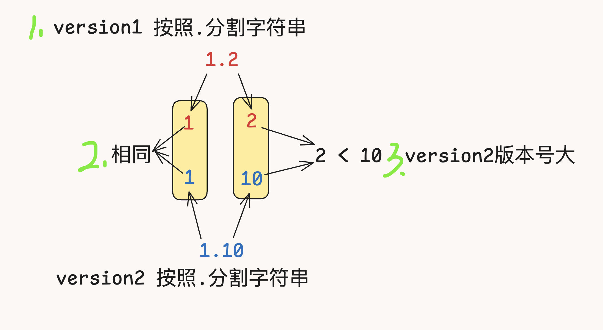

- 将版本号字符串，按照 `.`分割为子字符串
- 利用双指针技巧，定义两个指针分别指向两个 版本号的子字符串，依次比较对应位的整数值（字符串转成整数），缺失的值视为`0`

```go
func compareVersion(version1 string, version2 string) int {
    //1.先按照"." 拆分字符串
    slicev1 := strings.Split(version1,".")
    slicev2 := strings.Split(version2,".")

    //2.对应位置一一对比
    i,j := 0,0 
    for ; i < len(slicev1) && j < len(slicev2);i,j = i+1,j+1 {
        val1 ,_ := strconv.Atoi(slicev1[i])
        val2,_ := strconv.Atoi(slicev2[j])
        if val1 > val2 {
            return 1
        } else if val1 < val2 {
            return -1
        }
    }
		
  	// 说明 version2 字符串比较短
    for i < len(slicev1) {
        val1 ,_ := strconv.Atoi(slicev1[i])
        i++
        if val1 > 0 { // version2 缺失的视为 0
            return 1
        }else if val1 < 0 {
            return -1
        }
    }
		
  	// 说明 version1 字符串比较短
    for j < len(slicev2) {
        val2,_ := strconv.Atoi(slicev2[j])
        j++
        if val2 > 0 { // version1 缺失的视为 0
            return -1
        }else if val2 < 0 {
            return 1
        }
    }

    return 0
}
```


## 239. 滑动窗口最大值

给你一个整数数组 `nums`，有一个大小为 `k` 的滑动窗口从数组的最左侧移动到数组的最右侧。你只可以看到在滑动窗口内的 `k` 个数字。滑动窗口每次只向右移动一位。

返回 *滑动窗口中的最大值* 。

思路：

使用【队列】充当不断滑动的窗口，每次滑动记录【队列】的最大值：

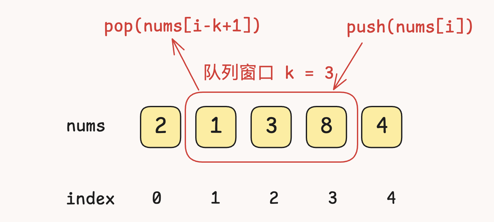

如何在 `O(1)` 时间计算最大值，只需要一个特殊的数据结构「单调队列」，`push` 方法依然在队尾添加元素，但是要把前面比自己小的元素都删掉，直到遇到更大的元素才停止删除。

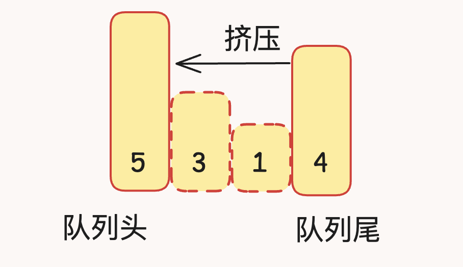

使用单调队列数据结构就能完成本题，队列头部元素就是最大值。

```go
func maxSlidingWindow(nums []int, k int) []int {
    // 利用单调队列，记录窗口内最大值
    var result []int
    
    var q Queue
		
  	// 1. 先加入k个元素
    for i := 0;i<k;i++ {
        q.Push(nums[i])
    }
    result = append(result,q.MaxVal())//记录最大值

    for i := k;i<len(nums);i++ {
        q.Pop(nums[i-k])//队列容量为k，在加入新元素之前，先删除左边 nums[i-k]
        q.Push(nums[i])// 再追加新元素 nums[i]
        result = append(result,q.MaxVal()) //记录最大值
    }
    return result
}


// 单调队列
type Queue struct {
    q []int
}

// Push 队列
func (t *Queue)Push(val int){
    for len(t.q) != 0 && t.q[len(t.q)-1] < val { //队列中比val小的数值，全部删除
        //弹出尾部
        t.q = t.q[:len(t.q)-1]
    }
    t.q = append(t.q,val)//加入队列尾部
}

// 队列中的最大值
func (t *Queue)MaxVal() int {
    return t.q[0]
}

// 如果和队列头部最大元素相同，删除队列头部元素
func (t *Queue)Pop(val int) {
    if val == t.q[0] {
        t.q = t.q[1:] //删除头部
    }
}
```

## 41. 缺失的第一个正数

给你一个未排序的整数数组 `nums` ，请你找出其中没有出现的最小的正整数。请你实现时间复杂度为 `O(n)` 并且只使用常数级别额外空间的解决方案。

思路：

这题如果第一次做，会感觉很绕。其实本质目的就是让数值：比如 `1`放到索引 `0`， `2` 放到索引`1`，数值`3`放到索引`2` 。 这样就形成了，随着索引`i`的递增，元素值也是顺序递增的（并且之间是 `+1` 的关系）

题目要求【缺失的最小正整数】：将数组中的元素，按照 1，2，3，4，5，6.... 这个顺序排列。（同时观察到1,2,3,4,5和数组索引的关系 0,1,2,3,4，是相差`1`的关系）

- 数组的长度为`n`，如果数组中的元素都是按照1，2，3，4，5，6.... 这个顺序排列，也就是【`1～n`】，那么最小的正整数就是`n+1`

- 如果数组中的元素出现跳空（也就是缺失某一个）那么索引位置 `i`对应的元素值 `nums[i]`，之间不满足 `i+1 == nums[i]`

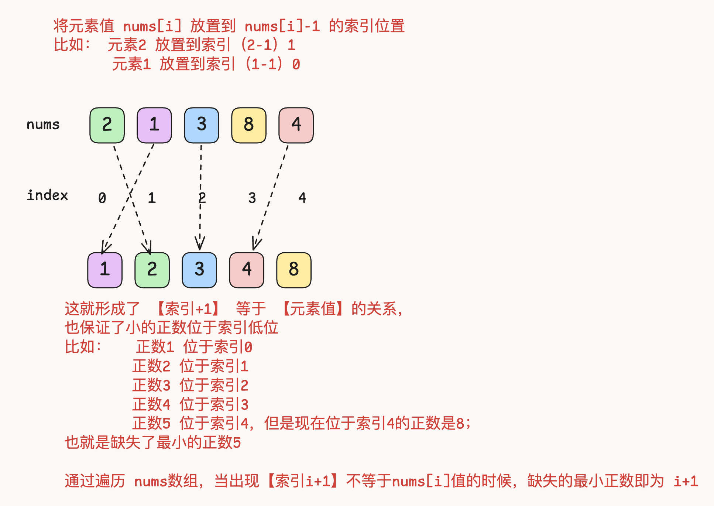

```go
func firstMissingPositive(nums []int) int {
   
    for i := 0;i < len(nums);i++ {
        // 元素值要在[1~n]之间 && nums[i]-1索引处的元素值不是 nums[i]
        for nums[i] >= 1 && nums[i] <= len(nums) && nums[i] != nums[nums[i]-1] {
            // 交换 
            nums[nums[i]-1],nums[i] = nums[i],nums[nums[i]-1]
        }
    }

    // 找到第一个，索引 i 和数值 不是 +1 的关系；
    for i := 0; i < len(nums);i++ {
        if nums[i] != i+1 {
            return i+1
        }
    }
    // 如果上面全部都执行完成，还没有找到，那么这个数值就是数组长度+1
    return len(nums)+1
}
```


## 322. 零钱兑换

给你一个整数数组 `coins` ，表示不同面额的硬币；以及一个整数 `amount` ，表示总金额。计算并返回可以凑成总金额所需的 **最少的硬币个数** 。如果没有任何一种硬币组合能组成总金额，返回 `-1` 。

你可以认为每种硬币的数量是无限的。

思路：

- 动态规划题型

- 定义`dp`数组：`dp[i]`表示凑成金额`i` 所需要的**最少的硬币个数**为 `dp[i]`

- 递推关系：

  为了凑成金额 `i`，可以供我们选择的硬币有`coins[0....]`不同面额的硬币；

  如果选择某个硬币 `coins[j]`，那么剩余金额变为`i - coins[j]` ；

  继续选择某个硬币 `coins[x]`，那么剩余的金额变为 `i -coins[j] - coins[x]`

  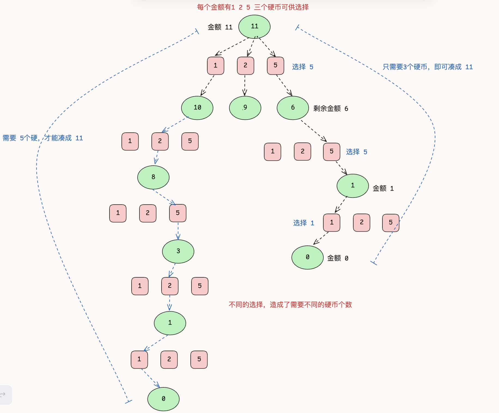

  最终的递推关系为：`dp[i] = min(dp[i], dp[i-coins[0...] + 1])`

  `dp[i-coins[0...] + 1 ` 含义： `coins[0...]` 每次选择，所有的硬币可供选择，如果选择某个硬币`coins[j]`后，凑成剩余金额`i-coins[j]`需要 `dp[i-coins[j]]`最少硬币个数  +1 表示选中了硬币`coins[j]`

  `min`表示，金额 `i`可以选的硬币有很多种`coins[0...]`，我们只需 硬币最小的结果

  *还有个前提，选中的硬币的面额，不能大于要凑的金额`i`*

```go
func coinChange(coins []int, amount int) int {

   
    dp := make([]int,amount+1)
  	// base case
    for k,_ := range dp {
        dp[k] = amount+1 // 因为要求最小值，假设都是1元来凑，最多需要amount个硬币，这里设置大一位，就可以表示很大的数值了
    }
  
    dp[0] = 0 // 没有金额，也就不需要硬币

    for i := 1;i <= amount;i++ { // 金额从1开始
      	// 可供选择的硬币 [0,len(coins)-1]
        for j := 0;j < len(coins);j++ {
            if i - coins[j] >= 0 { //当前选择的硬币金额coins[j]，不能超过金额i（才能选择）
                dp[i] = min(dp[i],dp[i-coins[j]]+1 )
            }
        }
    }

    if dp[amount] == amount+1 {
        // 说明凑不成改金额
        return -1
    }
    return dp[amount]
}

func min(a,b int)int{
    if a < b {
        return a
    }
    return b
}
```


## 32. 最长有效括号

给你一个只包含 `'('` 和 `')'` 的字符串，找出最长有效（格式正确且连续）括号子串的长度。

思路：

- 最值问题：就要想到 动态规划

  `dp[i]`表示以` s[i]` 结尾的字符串的长度

  如果 `s[i] == '(' `，不是一个有效字符串，`dp[i]`长度为`0`

  如果 `s[i] == ')'`，如果能找到 左括号，说明当前的右括号作为字符串的结尾，能找到左括号和自己一起组成一个有效的字符串，否则，右括号，作为结尾，不是一个有效的字符串

- 涉及到括号的问题：就需要想到 **栈**

  当遇到左括号，直接入栈 左括号的索引值

  如果遇到右括号，看下栈中是否为空，不为空，说明可以找到左括号和右括号一起组成有效字符串，否则，不能组成有效字符串（右括号需要入栈）

```go
func longestValidParentheses(s string) int {
  
	stackIndex := []int{} // 因为是括号问题，所以用到栈（栈中存储的是索引值）
	dp := make([]int, len(s))

	maxLen := 0
	// 遍历字符，尝试以每个字符作为【结尾字符】
	for i := 0; i < len(s); i++ {
		if s[i] == '(' {
			stackIndex = append(stackIndex, i) //【左括号】【索引】入栈

			dp[i] = 0 //以左括号结尾的子串，是无效的，所以长度=0
		} else { // 说明是右括号
			if len(stackIndex) != 0 { //说明栈里面有左括号
				leftIndex := stackIndex[len(stackIndex)-1]
				stackIndex = stackIndex[:len(stackIndex)-1] //出栈
				// 当前 右括号索引 i  - 左括号的索引 leftIndex + 1 可以计算出字符串的长度
				len := i + 1 - leftIndex //有效子串长度
       
				if leftIndex-1 >= 0 {  // 如果左括号索引的前一个索引 leftIndex-1，存在
					dp[i] = len + dp[leftIndex-1] // 当前的长度len,还可以和前面的以leftIndex-1为结尾的字符串 拼接成一个更长的有效字符串
				} else {
					dp[i] = len
				}

			} else { // 说明当前的右括号，在栈中找不到左括号，就是一个无效字符串的结尾
				dp[i] = 0
			}
		}
		// 求最值
		maxLen = max(maxLen, dp[i])
	}

	return maxLen
}

func max(a, b int) int {
	if a > b {
		return a
	}
	return b
}
```


## LCR 140. 训练计划 II

给定一个头节点为 `head` 的链表用于记录一系列核心肌群训练项目编号，请查找并返回倒数第 `cnt` 个训练项目编号。

思路：

这题和前面的删除链表中倒数第 n 个节点一样的套路：

`p1`指向链表头部，并且移动 `k`步


`p2`指向链表头部，`p1`继续移动 剩余的 `n-k`步


当 `p1 == nil`的时候，`p2`移动到了倒数的第 `k`个节点


```go

/**
 * Definition for singly-linked list.
 * type ListNode struct {
 *     Val int
 *     Next *ListNode
 * }
 */
func trainingPlan(head *ListNode, cnt int) *ListNode {

    // base case 
	if head == nil {
		return head
	}

	p1 := head // p1 先跳跃 cnt 个节点
	for i := 0; i < cnt; i++ {
		p1 = p1.Next
	}

	p2 := head
	for p1 != nil { //p1 从当前位置到达尾部
		p1 = p1.Next
		p2 = p2.Next //p2 正好移动到距离尾部cnt个节点的位置（倒数）
	}

	return p2
}
```


## 76. 最小覆盖子串

给你一个字符串 `s` 、一个字符串 `t` 。返回 `s` 中涵盖 `t` 所有字符的最小子串。如果 `s` 中不存在涵盖 `t` 所有字符的子串，则返回空字符串 `""` 。

**注意：**

- 对于 `t` 中重复字符，我们寻找的子字符串中该字符数量必须不少于 `t` 中该字符数量。
- 如果 `s` 中存在这样的子串，我们保证它是唯一的答案。

思路：

这题就是典型的滑动窗口类题目，一般来说难度略高，解法框架如下：

```java
nums := []int{1,2,3,4,5,6}
func main() {
  
  //1. 定义 `left right := 0,0` 指向起始位置 `0`
  left, right := 0,0
  
  // right 越界结束
  for right < len(nums) {
    
    // 2.不断移动 right
    val := nums[right]
    right++ 
    
    // do something.....
    
    // 3.当 condition 不符合题意的时候，移动 left，直到满足题意，跳出 condition
    for  condition {
      val := nums[left]
      left++
    }
    
    //.......
  }
}
```

题目要求 返回 `s` 中涵盖 `t` 所有字符的最小子串。

- 需要知道 `t`中有哪些字符

- 在 `s`中找到包含`t`中所有字符的字符串（注意是包含，不是相等），

  比如  `s = abc t = ac`，字符串 `s`是包含 `t`的所有字符的；

  比如 `s = abc   t = aa`，字符串 `s`是不包含 `t`中的所有字符的，因为`t`中有两个 `a`, `s`中只有一个 `a`

```go
func minWindow(s string, t string) string {
    
    // window 记录窗口内【注意：不是窗口内的所有字符，而是t中存在的】字符 + 频率
    // need 记录t中出现的 字符+频率
    need,window := make(map[byte]int),make(map[byte]int)

    for i := 0;i<len(t);i++ {
        need[t[i]]++ //记录t中字符 + 频率
    }

    //记录窗口中 当某个字符数量 已经达到了 t 中 相应字符数量的预期，vaild++ 说明窗口中包含了 t 中的一个有效字符
    vaild := 0
    left,right := 0,0

    start := 0
    length := math.MaxInt

    for right < len(s) {
        val := s[right] //  val 将要进入窗口的字符
        right++

        // 判断该字符是否在need中出现（再强调一遍：window中记录的是在 need中存在的字符数量，不是窗口中的所有字符）
        if _,ok := need[val]; ok {
            window[val]++  // 窗口中字符数量 +1
            if window[val] == need[val] {//说明window中该字符的数量，达到了need中字符的数量
                vaild++ // 窗口中，有一个字符数量达到目标预期
            }
        }

        for vaild == len(need) { //表示window中字符频率和need中的字符频率全部都一样了（也就是包含了t中的所有的字符）
            //找最小的子串，收缩 right
            if right - left < length { 
                start = left
                length = right-left
            }

            //val 将要从窗口删除的字符
            val := s[left]
            left++
            if _,ok := need[val];ok {
              	// 窗口中的字符数量 = need中字符数量一样，一旦字符从窗口中移除，那么窗口中的字符串就不再完全包含 t 中的所有字符了
                if window[val] == need[val] {
                    vaild--
                } 
                window[val]--
            }
        }

    }
  	// 说明不存在完全包含 t 中所有字符的字符串
    if length == math.MaxInt {
        return ""
    }
    return string(s[start:start+length])
}
```


## 105. 从前序与中序遍历序列构造二叉树

给定两个整数数组 `preorder` 和 `inorder` ，其中 `preorder` 是二叉树的**先序遍历**， `inorder` 是同一棵树的**中序遍历**，请构造二叉树并返回其根节点。

思路：

**构造二叉树，第一件事一定是找根节点，然后想办法构造左右子树**。

二叉树的前序和中序遍历结果的特点如下：


```go
/**
 * Definition for a binary tree node.
 * type TreeNode struct {
 *     Val int
 *     Left *TreeNode
 *     Right *TreeNode
 * }
 */
func buildTree(preorder []int, inorder []int) *TreeNode {
  	// 数组为空，返回nil
    if len(preorder) == 0 || len(inorder) == 0 {
        return nil
    }
  	// leftLen 表示左节点的个数
    leftLen := 0
    // 前序的首元素为根节点
    va := preorder[0]
    //在中序遍历中找到对应的位置
    for k,v := range inorder {
        if v == va {
            leftLen = k
            break 
        }
    }
		
  	// 结合下图理解
    root := &TreeNode{Val:preorder[0],Left:buildTree(preorder[1:1+leftLen],inorder[:leftLen]),Right:buildTree(preorder[1+leftLen:],inorder[leftLen+1:])}
    return root
}
```

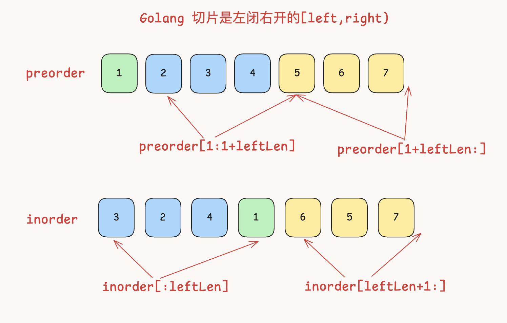


## 78. 子集

给你一个整数数组 `nums` ，数组中的元素 **互不相同** 。返回该数组所有可能的子集（幂集）。解集 **不能** 包含重复的子集。你可以按 **任意顺序** 返回解集。

思路：

回溯算法：类似于遍历这棵树

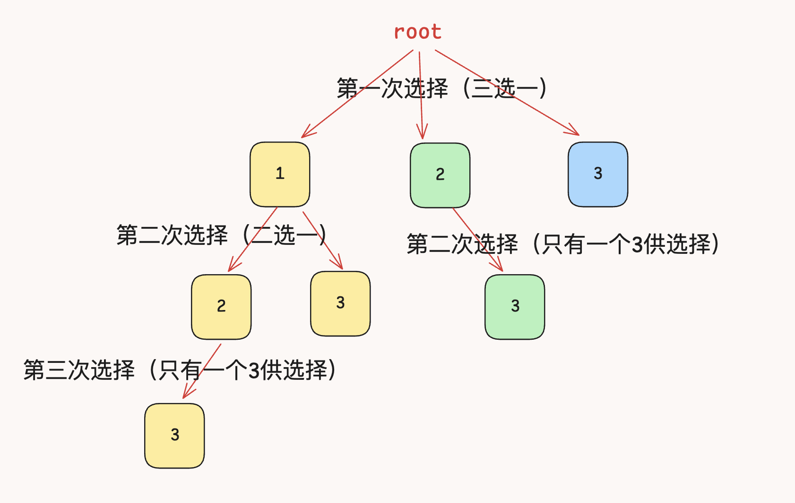

```go

var result [][]int
func subsets(nums []int) [][]int {
  	// 结果
    result = [][]int{}
  	// 遍历路径
    trace := []int{}
    backtrack(nums,trace,0)
    return result
}

func backtrack(nums []int,trace []int,start int) {
		
  	// 将 trace 保存到result中
    temp := make([]int,len(trace))
    copy(temp,trace)
    result = append(result,temp)
	
  	// 选择范围: [start:len(nums)-1]
    for i := start;i < len(nums);i++ {
        //选择
        trace = append(trace,nums[i])
			
      	// 下一层的选择
        backtrack(nums,trace,i+1)
        //撤销
        trace = trace[:len(trace)-1]
    }
}
```

## 43. 字符串相乘

给定两个以字符串形式表示的非负整数 `num1` 和 `num2`，返回 `num1` 和 `num2` 的乘积，它们的乘积也表示为字符串形式。

**注意：**不能使用任何内置的 BigInteger 库或直接将输入转换为整数。

思路：

- 定义两个指针`i j`，分别指向 `num1` 和 `num2`的尾部，从个位开始计算乘积
- 计算的结果累加，保存到 `res`的索引 `i+j+1`位置处

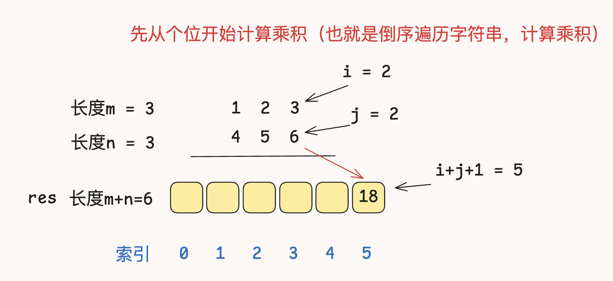

- 最后，将`res`中的结果，从尾部到首部（也就是从个位）依次进位，得到最终的结果

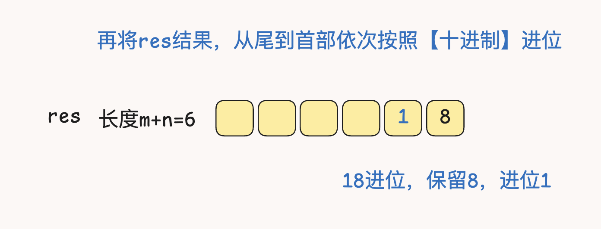

```go
func multiply(num1 string, num2 string) string {
    
  	// 定义result 切片，长度为 m+n
    m,n := len(num1),len(num2)
    result := make([]int,m+n)

    // 1.从后往前【相乘】，（从个位开始进行相乘）
    for i := m-1;i >= 0;i-- {
        for j := n-1;j >= 0;j-- {
            result[i+j+1] += int(num1[i] - '0') * int(num2[j]-'0') // 乘积的结果，累加保存到 result[i+j+1]
        }
    }

    // 2.从后往前【进位】
    for i := len(result)-1;i >= 0;i-- {
        if result[i] >= 10 { // 超过数值10
            result[i-1] += result[i] / 10 // 进位
            result[i] %= 10 //当前取余
        }
    }
	
    
    // 如果题目中两个字符串为 1234 和 0，那么result中全部都是前导 0，都是无意义的 0
    res := ""
  
    zero := true // 从第一个非0的数字，开始记录结果
    for _,v := range result { //遍历数值
        if v == 0 && zero { // 忽略掉，前导 0
            continue
        }
        zero = false // 这个表示，遇到第一个非0的元素，后续的0才认为有效
        res +=  string('0' + rune(v))
    }
    // 没结果，默认是0
    if res == "" { 
        res = "0"
    }
    return  res
}
```


## 151. 反转字符串中的单词

给你一个字符串 `s` ，请你反转字符串中 **单词** 的顺序。**单词** 是由非空格字符组成的字符串。`s` 中使用至少一个空格将字符串中的 **单词** 分隔开。返回 **单词** 顺序颠倒且 **单词** 之间用单个空格连接的结果字符串。

**注意：**输入字符串 `s`中可能会存在前导空格、尾随空格或者单词间的多个空格。返回的结果字符串中，单词间应当仅用单个空格分隔，且不包含任何额外的空格。

**示例 1：**

```
输入：s = "the sky is blue"
输出："blue is sky the"
```

思路：

这题如果做过了，很容易理解+记忆，全是技巧，没有感情。面试华为`OD`岗位有这道原始题目。

- 先去掉多余的空格
- 对整个字符串进行反转
- 然后移动对每个单词进行反转

```go
func reverseWords(s string) string {
    //1.先清理空格
    result := []byte{}
    for i := 0;i<len(s);i++ { //一个字符一个字符的过滤
        if s[i] != ' ' { // 不是空格，保存
            result = append(result,s[i])
        } else {// 是空格，要求必须存在有效字符，并且不是空格
            if len(result) != 0 && result[len(result)-1] != ' ' {
                result = append(result,' ')
            }
        }
    }
    //2.如果存在（去除最后一个空格）
    if result[len(result)-1] == ' ' {
        result = result[:len(result)-1]
    }
    //3.翻转整个字符串
    reverse(result,0,len(result)-1)

    //4.翻转每个单词
    for i := 0;i < len(result); {
        for j := i;j < len(result);j++ {// 找到一个单词
            if j + 1 == len(result) || result[j+1] == ' ' { //找到空格，或者 结尾
                reverse(result,i,j)
                //开始下一个单词（跳过结尾和空格）
                i = j + 2
                break
            }

        }
    }
		// 最终结果
    return string(result)
}

func reverse(word []byte,i,j int){
    for i < j {
        word[i],word[j] = word[j],word[i]
        i++
        j--
    }
}
```


## 155. 最小栈

设计一个支持 `push` ，`pop` ，`top` 操作，并能在常数时间内检索到最小元素的栈。

实现 `MinStack` 类:

- `MinStack()` 初始化堆栈对象。
- `void push(int val)` 将元素val推入堆栈。
- `void pop()` 删除堆栈顶部的元素。
- `int top()` 获取堆栈顶部的元素。
- `int getMin()` 获取堆栈中的最小元素。

思路：

我们知道栈是一种操作受限的数据结构，只能从栈顶插入或弹出元素，所以对于标准的栈来说，如果想实现本题的 `getMin` 方法，只能老老实实把所有元素弹出来然后找最小值。**想提高时间效率，那肯定要通过空间换时间的思路**。

所以这道题的关键就是，**每个元素入栈时，还要记下来当前栈中的最小值**。比方说，可以用一个额外的栈 `minstack` 来记录栈中每个元素入栈时的**栈中的最小元素**是多少，这样每次获取元素时就能快速得到剩余栈中的最小元素了。

```go
type MinStack struct {
    stack []int // 存储所有元素
    minstack []int // 存储最小元素（也就是比栈顶元素还要小的元素，才能保存到 minstack中）
}


func Constructor() MinStack {
    return MinStack {
        stack:make([]int,0),
        minstack:make([]int,0),
    }
}


func (this *MinStack) Push(val int)  {
  	// 入栈
    this.stack = append(this.stack,val)

    if len(this.minstack) == 0 {
        this.minstack = append(this.minstack,val)
    } else {
      	// val 比 minstack 栈顶元素更小，才能保存（记录栈中每个元素入栈时的栈中的最小元素）
        if this.minstack[len(this.minstack)-1] >= val {
            this.minstack = append(this.minstack,val)
        }
    }
}


func (this *MinStack) Pop()  {
		// 如果弹出的元素和最小栈的栈顶元素一样，最小栈也需要弹出
    if this.Top() == this.minstack[len(this.minstack)-1] {
         this.minstack = this.minstack[:len(this.minstack)-1]
    }
		// 弹出栈顶元素
    this.stack = this.stack[:len(this.stack)-1]
}

// 栈顶元素
func (this *MinStack) Top() int {
    return this.stack[len(this.stack)-1]
}

// 最小元素
func (this *MinStack) GetMin() int {
    return this.minstack[len(this.minstack)-1]
}

```


## 129. 求根节点到叶子节点数字之和

给你一个二叉树的根节点 `root` ，树中每个节点都存放有一个 `0` 到 `9` 之间的数字。

每条从根节点到叶节点的路径都代表一个数字：

- 例如，从根节点到叶节点的路径 `1 -> 2 -> 3` 表示数字 `123` 。

计算从根节点到叶节点生成的 **所有数字之和** 。

**叶节点** 是指没有子节点的节点。

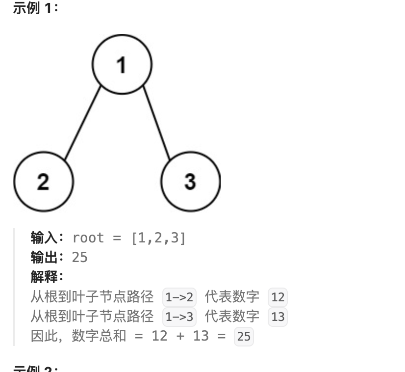

思路：

这题就是标准的二叉树遍历题型，遍历的同时需要累积每个节点的值

```go

func sumNumbers(root *TreeNode) int {
    return traverse(root,0)
}

// root 从根节点到叶节点生成的 所有路径数字之和 
// cur 累积到root 节点，对应的数字
func traverse(root *TreeNode,cur int) int {
    
    if root == nil {
        return 0
    }
    // 遍历到当前节点，对应的路径数字
    cur = 10 * cur + root.Val
   
    if root.Left == nil && root.Right == nil { // 说明当前是叶子节点
        return cur // 返回路径数字
    }
  	// 从 root.Left到叶子节点 路径数字之和 + 从 root.Right 到叶子节点 路径数字之和
    return traverse(root.Left,cur) + traverse(root.Right,cur)
}
```


## 101. 对称二叉树

给你一个二叉树的根节点 `root` ， 检查它是否轴对称。


思路：

- 观察下上面的示例，【对称】就是左右两颗树是镜像。对称的检查过程，就是二叉树的遍历过程。
- 先检查左右两个根节点`root.Left root.Right`是否相同；
- 如果相同，再检查【左节点的左树 和 右节点的右树】 以及【左节点的右树 和 右节点的左树】是否对称

```go
func isSymmetric(root *TreeNode) bool {
  	// 空树，一定对称
   if root == nil {
       return true
   }
	 // 检查左右树是否对称
   return check(root.Left,root.Right)
}

// check 校验左右树对称
func check(left,right *TreeNode) bool {
    // 都是nil
    if left == nil && right == nil {
        return true
    }
    // 有一个是nil
    if left == nil || right == nil {
        return false
    }
  	// 左右节点不相同
    if left.Val != right.Val {
        return false
    }
    // 在【左右树根节点】相同的情况下，继续检查下层的树结构，是否对称
    return check(left.Left,right.Right) && check(left.Right,right.Left)
}
```


## 144. 二叉树的前序遍历

给你二叉树的根节点 `root` ，返回它节点值的 **前序** 遍历。

```go
// 迭代方式前序遍历二叉树 （ 这个解法和上面的【中序遍历】对比看下，可以看到完全一样的写法，只是 【记录数值】的位置不同而已
func preorderTraversal1(root *TreeNode) []int {

    result := []int{}
    if root == nil {
        return result
    }

    sk := []*TreeNode{}
    for len(sk) != 0 || root != nil {
      	// 先处理左节点
        for root != nil {
            result = append(result,root.Val) // 记录数值
            sk = append(sk,root) // 入栈
            root = root.Left
        }
        // 再处理右节点
        root = sk[len(sk)-1]
        sk = sk[:len(sk)-1] // 出栈
        root = root.Right
    }
    return result
}


// 最简单的递归方式遍历二叉树
var res []int
func preorderTraversal(root *TreeNode) []int {

    res = []int{}
    preorder(root)

    return res
}

func preorder(root *TreeNode){
    if root == nil {
        return
    }

    res = append(res,root.Val)
    preorder(root.Left)
    preorder(root.Right)
}
```


## 104. 二叉树的最大深度

给定一个二叉树 `root` ，返回其最大深度。二叉树的 **最大深度** 是指从根节点到最远叶子节点的最长路径上的节点数。

思路：

注意`maxDepth`函数的定义：以 `root`为根节点的二叉树的最大深度

```go
/**
 * Definition for a binary tree node.
 * type TreeNode struct {
 *     Val int
 *     Left *TreeNode
 *     Right *TreeNode
 * }
 */

// 以 `root`为根节点的二叉树的最大深度
func maxDepth(root *TreeNode) int {
  	// 如果节点为nil,深度为0
    if root == nil {
        return 0
    }
  	// 以 root.Left 为根节点的二叉树的最大深度 
  	// 以 root.Right 为根节点的二叉树的最大深度 
    // 取最大值 + 1 作为 以 `root`为根节点的二叉树的最大深度（ +1 表示当前的root这个节点的计数）
    return max(maxDepth(root.Left),maxDepth(root.Right)) + 1
}

func max( a,b int) int{
    if a > b {
        return a
    }
    return b
}
```


## 39. 组合总和

给你一个 **无重复元素** 的整数数组 `candidates` 和一个目标整数 `target` ，找出 `candidates` 中可以使数字和为目标数 `target` 的 所有 **不同组合** ，并以列表形式返回。你可以按 **任意顺序** 返回这些组合。

`candidates` 中的 **同一个** 数字可以 **无限制重复被选取** 。如果至少一个数字的被选数量不同，则两种组合是不同的。 

对于给定的输入，保证和为 `target` 的不同组合数少于 `150` 个。

思路：

利用回溯算法解题：

- 需要指定 `start`限定可选元素的范围（因为是求组合问题），如果是求排列，不用指定形参 `start`（可以看下上面的回溯算法解题套路模板）
- 元素可以重复使用多次

这道题的关键在于 `candidates` 中的**元素可以复用多次**，体现在代码中是下面这段：

```go
func backtrace(candidates []int, start int, trace []int, target int, sum int) {
  
  for i := start; i < len(candidates); i++ {
		// 选择
    
    // 下一层的选择【注意这里：i】
		backtrace(candidates, i , trace, target, sum)
    
    // 撤销
	}
}
```

如果题目要求 `candidates`中的元素【不能】重复多次，体现在代码中是下面这段：

```go
func backtrace(candidates []int, start int, trace []int, target int, sum int) {
  
  for i := start; i < len(candidates); i++ {
		// 选择
    
    // 下一层的选择【注意这里：i+1】
		backtrace(candidates, i+1 , trace, target, sum)
    
    // 撤销
	}
}
```

注意体会先这两种区别。

实际代码如下：

```go
var result [][]int

func combinationSum(candidates []int, target int) [][]int {
	//回溯算法

	result = [][]int{}
	trace := []int{}
	backtrace(candidates, 0, trace, target, 0)

	return result
}

// 因为求组合问题，需要 start来限定元素的选择范围，如果是求排列，就不需要 start参数
func backtrace(candidates []int, start int, trace []int, target int, sum int) {
	
  // 终止条件
	if sum >= target {  // 因为都是正整数（剪枝）
		if sum == target { // 找到一个结果
			temp := make([]int, len(trace))
			copy(temp, trace)
			result = append(result, temp)
		}
		return
	}

	// 执行到这里，说明 sum < target，继续找下一个元素加入到 trace 中
	for i := start; i < len(candidates); i++ {
    // 选择
		trace = append(trace, candidates[i])
		sum += candidates[i]

    // 下一层（元素可以重复选择）的选择范围为 [i:len(nums)-1]
    // 如果不能重复选择，这里应该填写 i+1
		backtrace(candidates, i , trace, target, sum)

    // 撤销
		trace = trace[:len(trace)-1]
		sum -= candidates[i]
	}
}
```


## 101. 平衡二叉树

给定一个二叉树，判断它是否是 平衡二叉树 

思路：

**平衡二叉树** 是指该树所有节点的左右子树的高度相差不超过 1

其实这题是**求树的最大深度**的一个扩展，多了一步求左右子树的高度差

```go
/**
 * Definition for a binary tree node.
 * type TreeNode struct {
 *     Val int
 *     Left *TreeNode
 *     Right *TreeNode
 * }
 */

var isbalance bool = true
func isBalanced(root *TreeNode) bool {
    isbalance = true
    if root == nil {
        return true
    }
    maxDepth(root)
    return isbalance
}

// 求树的最大深度
func maxDepth(root *TreeNode) int {
    if root == nil {
        return 0
    }
		// 左右树的最大深度
    leftVal := maxDepth(root.Left)
    rightVal := maxDepth(root.Right)
  	// 如果高度差，绝对值相差 1，说明不平衡
  if abs(leftVal,rightVal) > 1 {
        isbalance = false
    }
    return 1 + max(leftVal,rightVal)
}

func abs(a,b int) int {
    if a > b {
        return a-b
    }
    return b-a
}
func max(a,b int)int{
    if a>b {
        return a
    }
    return b
}
```

## 48. 旋转图像

给定一个 *n* × *n* 的二维矩阵 `matrix` 表示一个图像。请你将图像顺时针旋转 90 度。你必须在**[ 原地](https://baike.baidu.com/item/原地算法)** 旋转图像，这意味着你需要直接修改输入的二维矩阵。**请不要** 使用另一个矩阵来旋转图像。

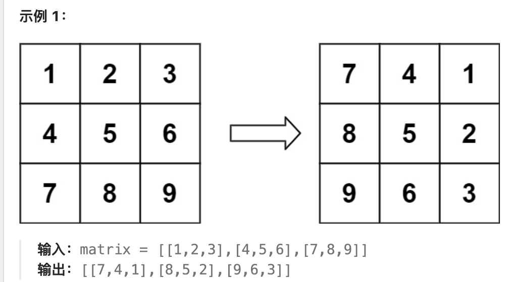

思路：

这题其实就是**瞪眼法**找到数字之间的交换规则。

先把二维矩阵沿对角线反转，然后反转矩阵的每一行，结果就是顺时针反转整个矩阵。

```go
func rotate(matrix [][]int)  {
    ///！！！巧思题：顺时针旋转,从左上角到右下角--对角线交换；如果是逆时针旋转，按照右上角到左下角-对角线交换
    ///1.顺时针旋转,按照从左上角到右下角--对角线交换，结果为
    /*
        1 4 7
        2 5 8
        3 6 9
    */
    n := len(matrix)
    for i := 0;i < n;i++ {
        for j := i+1;j < n;j++ {
            //对角线翻转
            matrix[i][j],matrix[j][i] = matrix[j][i],matrix[i][j]
        }
    }
    
    ///2.再观察，每一行首尾交换，即为结果
    for i := 0;i < n;i++ {
        left ,right := 0,n-1
        for left < right {
            matrix[i][left],matrix[i][right] = matrix[i][right],matrix[i][left]
            left++
            right--
        }
    }
}

```


## 543. 二叉树的直径

给你一棵二叉树的根节点，返回该树的 **直径** 。二叉树的 **直径** 是指树中任意两个节点之间最长路径的 **长度** 。这条路径可能经过也可能不经过根节点 `root` 。

两节点之间路径的 **长度** 由它们之间边数表示。

思路：

所谓二叉树的直径，就是左右子树的最大深度之和，那么直接的想法是对每个节点计算左右子树的最大高度，得出每个节点的直径，从而得出最大的那个直径。

```go

var result int = 0
func diameterOfBinaryTree(root *TreeNode) int {
   
    result = 0
    maxDepth(root)
    return result
}

// 树的最大高度
func maxDepth(root *TreeNode) int{

    if root == nil {
        return 0
    }
    // root左子树最大高度
    leftDepth := maxDepth(root.Left)
    // root右子树最大高度
    rightDepth := maxDepth(root.Right)
    //经过root节点的最大直径（注意：这里不需要对leftDepth + rightDepth 再+1），计算的是边的数目
    result = max(result,leftDepth+rightDepth) 
  
  	// 左右子树高度的最大值 + 1
    return 1 + max(leftDepth,rightDepth) 
}

func max(a,b int) int {
    if a > b {
        return a
    }
    return b
}
```


## 470. 用 Rand7()实现Rand10()


给定方法 `rand7` 可生成 `[1,7]` 范围内的均匀随机整数，试写一个方法 `rand10` 生成 `[1,10]` 范围内的均匀随机整数。

你只能调用 `rand7()` 且不能调用其他方法。请不要使用系统的 `Math.random()` 方法。

每个测试用例将有一个内部参数 `n`，即你实现的函数 `rand10()` 在测试时将被调用的次数。请注意，这不是传递给 `rand10()` 的参数。

思路：

- `(rand7()-1)*7`  等价于 `(【1...7】- 1) * 7 ` 等价于 ` [0...6]*7 ` 也等价于 `【0，7，14，21，28，35，42】`  每个数字只出现的概率为`1/7`
- `(rand7()-1)*7 + rand7() ` 等价于`【0，7，14，21，28，35，42】+ rand7()` 等价于每个数值`(0 , 7 ,14...)`分别 `+ rand7()` 即为`[1...7][8...14][15...21].....[43..49] 每种值出现的概率都是相同的；1/49`
- 转化一下为：`[1...10] [11...20] [21..30] [31....40] [41...49]` 这里少了`50`这个数值，对`10`求余数，少了出现一次`0`的机会
- 比如求【余数1 】分别为 `1 11 21 31 41` 对10求余，可以得到`5`次`1`
- 求【余数0】分别为`10 20 30 40`对10求余，只能得到`4`次`1`

```go
func rand10() int {
   
    for {
        num := (rand7()-1)*7 + rand7() 
        if num <= 40 { // 这里要舍弃[41...49]这些数值
            return num % 10 + 1 // 因为求 [1..10]，所以需要 num%10 + 1
        }
    }
    return 0    
}
```


## 98. 验证二叉搜索树

给你一个二叉树的根节点 `root` ，判断其是否是一个有效的二叉搜索树。

**有效** 二叉搜索树定义如下：

- 节点的左子树只包含小于 当前节点的数。
- 节点的右子树只包含 **大于** 当前节点的数。
- 所有左子树和右子树自身必须也是二叉搜索树。

思路：

初学者做这题很容易有误区：`BST`（二叉搜索树） 不是左小右大么，那我只要检查 `root.val > root.left.val` 且 `root.val < root.right.val` 不就行了？

这样是不对的，因为 `BST` 左小右大的特性是指 `root.val` 要比【左子树的**所有节点**都更大】，要比【右子树的**所有节点**都小】，你只检查左右两个子节点当然是不够的。

正确解法是通过使用辅助函数，增加函数参数列表，在参数中携带额外信息，将这种约束传递给子树的所有节点，这也是二叉搜索树算法的一个小技巧吧。

```go
func isValidBST(root *TreeNode) bool {
    return isValid(root,nil,nil) // 刚开始的root不是任何节点的左子树和右子树，所以不存在min和max节点
}

// 验证 root 树 与 最大节点值和最小节点值
//  min <   root树的节点值  < max
func isValid(root *TreeNode, min *TreeNode,max *TreeNode) bool {
		// 验证节点值
    if root == nil {
        return true
    }
		
  	// min最小值不为空，root的值，如果比最小值还小，说明root节点不满足 BST性质
    if min != nil && root.Val <= min.Val{
        return false
    }
		// max 最小值不为空，root的值，如果比最大值还大，说明root节点不满足 BST性质
    if max != nil && root.Val >= max.Val {
        return false
    }
    // 左子树的最大值就是root节点
  	// 右子树的最小值就是root节点
    return isValid(root.Left,min,root) && isValid(root.Right,root,max)
}
```


## 221. 最大正方形

在一个由 `'0'` 和 `'1'` 组成的二维矩阵内，找到只包含 `'1'` 的最大正方形，并返回其面积。

思路：

动态规划：

- `dp[i][j] `表示 `matrix[i][j]`为正方形右下角的**边长**，上边，左边，左上的边长 `>1`，才能组成一个更大完整的正方形；

- 递推关系：

  如果`matrx[i][j] == 0`，说明无法组成只包含 `'1'` 的正方形，`dp[i][j] = 0`即边长为`0`

  如果 `matrx[i][j] == 1`，看下上边，左边，左上 边长 `> 1`，才能组成一个更大的正方形，所以 `dp[i][j] = min(dp[i-1][j],dp[i][j-1],dp[i-1][j-1]) + 1`

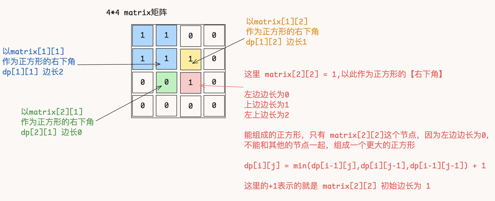

```go
func maximalSquare(matrix [][]byte) int {
	m, n := len(matrix), len(matrix[0])
  // 定义 边长 dp 数组
	dp := make([][]int, m)
	for k, _ := range dp {
		dp[k] = make([]int, n)
	}
	// 最大边长
	length := 0

	for i := 0; i < m; i++ {
		for j := 0; j < n; j++ {
			// base case
			if i == 0 || j == 0 { // 第一行 or 第一列
				dp[i][j] = int(matrix[i][j] - '0')
			} else {

				if matrix[i][j] == '1' { // 当等于1的时候，才能作为正方形的右下角，求取长度
					dp[i][j] = min(dp[i-1][j], min(dp[i][j-1], dp[i-1][j-1])) + 1
				}
			}
			// 题目要求最大正方形，这里记录最大边长 length
			if dp[i][j] > length {
				length = dp[i][j]
			}
		}
	}
	// 边长*边长 = 正方形面积
	return length * length
}

func min(a, b int) int {
	if a < b {
		return a
	}
	return b
}
```


## 34. 在排序数组中查找元素的第一个和最后一个位置

给你一个按照非递减顺序排列的整数数组 `nums`，和一个目标值 `target`。请你找出给定目标值在数组中的开始位置和结束位置。

如果数组中不存在目标值 `target`，返回 `[-1, -1]`。你必须设计并实现时间复杂度为 `O(log n)` 的算法解决此问题。

思路：

二分搜索的难点就在于如何搜索左侧边界和右侧边界，代码的边界的控制非常考验你的微操，这也是很多人知道二分搜索原理但是很难写对代码的原因。写对二分搜索的关键在于搞清楚搜索边界，到底应该往左侧收敛还是应该往右侧收敛？

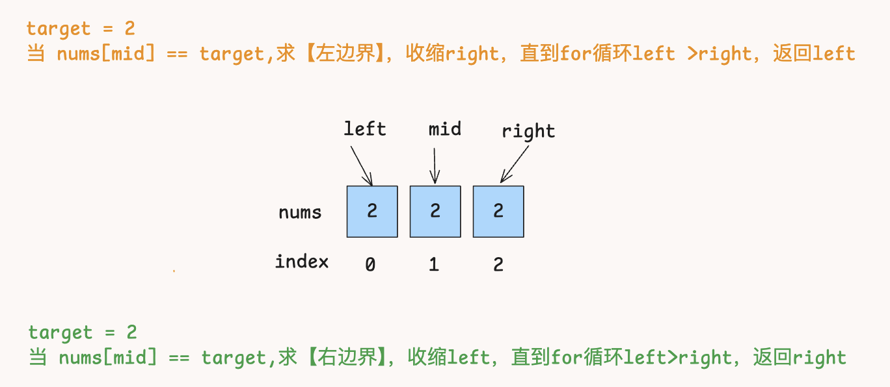

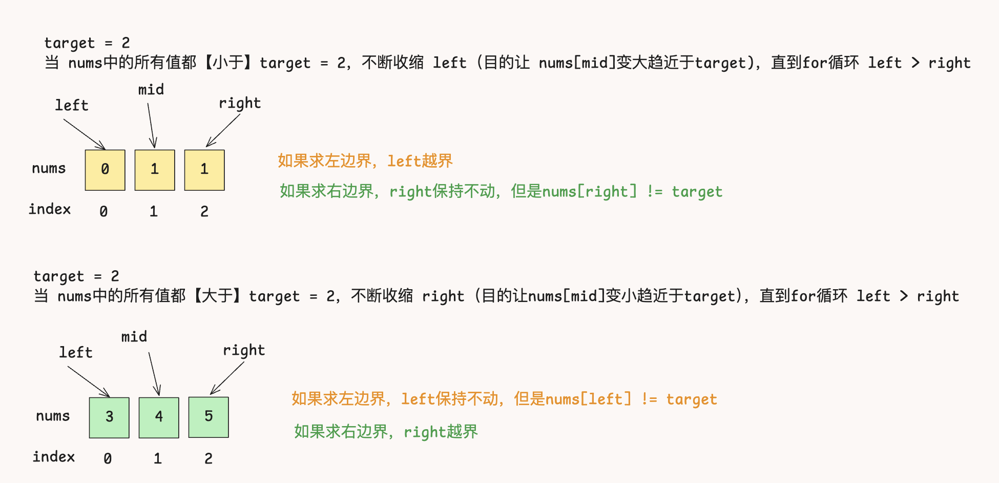

```go
func searchRange(nums []int, target int) []int {

    return []int{left_bound(nums,target),right_bound(nums,target)}
}

// 求左边界
func left_bound(nums []int ,target int) int {

    left,right := 0,len(nums)-1
		// 闭区间[left,right]
    for left <= right {
				// 中间值
        mid := left + (right-left)/2

        if nums[mid] == target { // 相等的时候，收缩right；【因为我们要求的是左边界】
            right = mid -1
        } else if nums[mid] > target { // 说明 target值位于nums[mid]的左侧，收缩right
            right = mid -1
        } else if nums[mid] < target { // 说明 target 位于 nums[mid]的右侧，收缩left
            left = mid + 1
        }
    }
    
    // 当所有的值都比target小的时候，left会越界
    // 当所有的值都比target大的时候，left此时是不会移动，所以要看下left指向的值是否是target
    if left >= len(nums) || nums[left] != target { // 做边界检测
        return -1
    }
    return left
}

// 求右边界
func right_bound(nums []int ,target int) int {

    left,right := 0,len(nums)-1

    for left <= right {
				// 中间值
        mid := left + (right-left)/2

        if nums[mid] == target { // 求右边界，当相等的时候，收缩左边界
            left = mid + 1
        } else if nums[mid] > target { // 说明 target值位于nums[mid]的左侧，收缩right
            right = mid - 1
        } else if nums[mid] < target { // 说明 target 位于 nums[mid]的右侧，收缩left
            left = mid + 1
        }
    }
    
    // 当所有的数都大于target的时候，right就会一直-1，最后会越界
    // 当所有的数都小于target的时候，right保持不动；所以要看下right指向的值是否是target
    if right < 0 || nums[right] != target { // 做边界检测
        return -1
    }
    return right
}
```


## 394. 字符串解码

给定一个经过编码的字符串，返回它解码后的字符串。

编码规则为: `k[encoded_string]`，表示其中方括号内部的 `encoded_string` 正好重复 `k` 次。注意 `k` 保证为正整数。你可以认为输入字符串总是有效的；输入字符串中没有额外的空格，且输入的方括号总是符合格式要求的。此外，你可以认为原始数据不包含数字，所有的数字只表示重复的次数 `k` ，例如不会出现像 `3a` 或 `2[4]` 的输入。

思路：

首先要理解题目的意思：比如`3[a]`解码的结果为`aaa`。 `3`表示 `a`重复的次数。这题如果第一次做，还是挺难，一般遇到字符串带括号的问题，就要想到**栈**。利用栈记录上次的解码结果

这里以 `a6[c]`为例子演示一下：

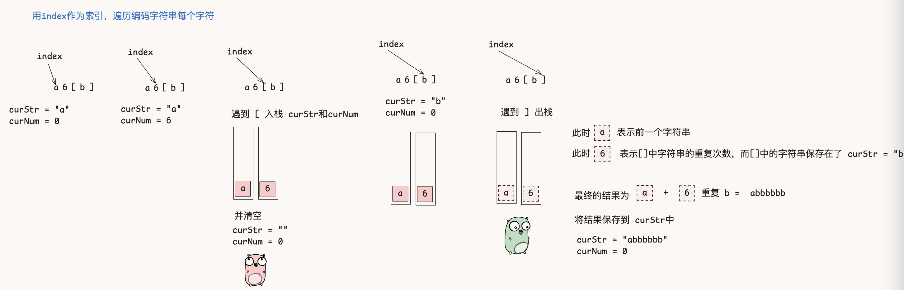

- 从左到右遍历字符串， `curStr`和`curNum` 记录当前的字符串和数值
- 遇到`[ `入栈当前的`curStr`和`curNum`（目的是为了存储上次的结果）同时清空当前`curStr`和`curNum`（目的是为了复用`curStr`和`curNum`用于 `[待处理字符串]` 之间的编码字符串）
- 遇到`] `出栈 ，出栈的字符串（前一个字符串） + 出栈的`num`（表示重复的次数）值和当前的`curStr`组合 = 形成新的字符串，保存到 `curStr`中

```go
func decodeString(s string) string {
   
    curStr,strStack := "",[]string{} // curStr 当前字符串
    curNum,numStack := 0,[]int{} // curNum 当前的数值

    for _,v := range s {
        if v >= '0' && v <= '9' { // 当前的curNum
            curNum = curNum * 10 + int(v-'0')
        } else if v == '[' { // 入栈，记录下当前的curNum和curStr
            strStack = append(strStack,curStr)
            numStack = append(numStack,curNum)
						// 清空
            curStr = ""
            curNum = 0

        } else if v == ']' { //出栈，上次记录下来的curNum和curStr,目的是为了展开[]之间的字符串


            preStr := strStack[len(strStack)-1]
            preNum := numStack[len(numStack)-1] 

            // 例如：a2[c] , preStr = a   preNum = 2   curStr = c，结果为 a+cc = acc
            curStr = preStr + strings.Repeat(curStr,preNum) // 这里对curStr进行重复preNum次
						// 出栈
            strStack = strStack[:len(strStack)-1]
            numStack = numStack[:len(numStack)-1]

        }else { // 当前的curStr
            curStr += string(v)
        }
    }
		// curStr中记录这最终的解码结果
    return curStr
}
```


## 240. 搜索二维矩阵II

编写一个高效的算法来搜索 `m x n` 矩阵 `matrix` 中的一个目标值 `target` 。该矩阵具有以下特性：

- 每行的元素从左到右升序排列。
- 每列的元素从上到下升序排列。

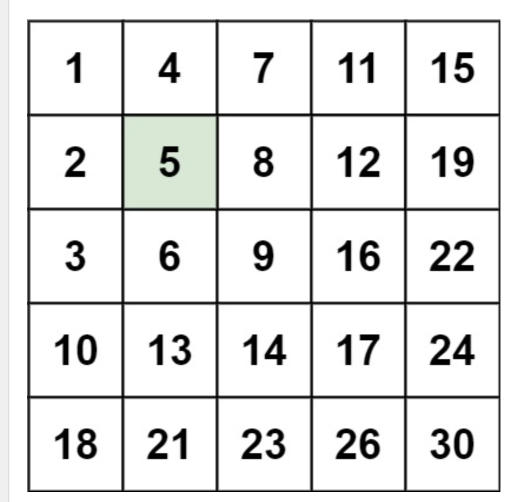

思路：

这道题说 `matrix` 从上到下递增，从左到右递增，显然左上角是最小元素，右下角是最大元素。**我们如果想高效在 `matrix` 中搜索一个元素，肯定需要从某个角开始**，比如说从左上角开始，然后每次只能向右或向下移动，不要走回头路。

如果真从左上角开始的话，就会发现无论向右还是向下走，元素都会增加，那么到底向右还是向下？不确定

但实际上不用这么麻烦，我们不要从左上角开始，而是从右上角开始，规定只能向左或向下移动。

你注意，如果向左移动，元素在减小，如果向下移动，元素在增大，这样的话我们就可以根据当前的元素值和 `target` 的相对大小来判断应该往哪移动，不断接近从而找到 `target` 的位置。

当然，如果你想从左下角开始，规定只能向右或向上移动也可以

```go
func searchMatrix(matrix [][]int, target int) bool {
    // 一般思路：直接遍历二维矩阵；但是并没有很好的利用，每一行和每一列的元素都是有序的这个条件；
    // 进阶思路：那么如果从【左上角】开始比较，当target大于左上角的数值的时候，有两个选择，【向右】或【向下】,不确定？？
    // 那么如果从【右上角】开始比较，当15 > target的时候，说明target比较小，那么只能向左查找，因为如果向下，元素值更大，不符合题意，也就是此时只会有一种选择

    m := len(matrix)
    n := len(matrix[0])
		// 右上角
    i := 0
    j := n-1

    for i < m && j >= 0 {
        if matrix[i][j] == target {
            return true
        } else if matrix[i][j] > target { // 向左移动,找更小值
            j--
        } else if matrix[i][j] < target { // 向下移动，找更大值
            i++
        }
    }

    return false
}
```


## 64.最小路径和

给定一个包含非负整数的 `m x n` 网格 `grid` ，请找出一条从左上角到右下角的路径，使得路径上的数字总和为最小。

**说明：**每次只能向下或者向右移动一步。

思路：

一般来说，让你在二维矩阵中求最优化问题（最大值或者最小值），就要考虑动态规划。先定义 `dp`数组，然后寻找相邻`dp[i] dp[i-1]`之间的关系。

- `dp`数组定义：从`[0,0]`到 `[i,j]`的最小路径和为 `dp[i][j]`

- 递推关系：因为题目说：每次只能向下或者向右移动一步。

  那么到达 `[i,j]`位置有两种选择

  从`[i-1,j]`向下移动一步 

  从`[i,j-1]`向右移动一步

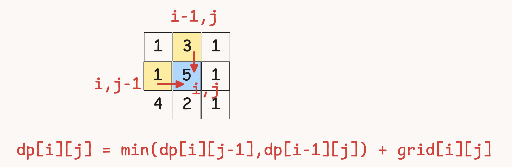

`dp[i][j-1]`表示 从`[0,0]`到 `[i,j-1]`的最小路径和

`dp[i-1][j]`表示 从`[0,0]`到 `[i-1,j]`的最小路径和

取两个中的`min`最小值 `+ grid[i][j]` 即为从`[0,0]`到 `[i,j]`的最小路径和

```go
func minPathSum(grid [][]int) int {
  
    m := len(grid)
    n := len(grid[0])
		// 定义 dp 数组
    dp := make([][]int,m)
    for k := range dp {
        dp[k] = make([]int,n)
    }
   
    for i := 0;i < m;i++ {
        for j := 0;j < n;j++ {
            if i == 0 && j >= 1 { //base case 第一行：只能从左往右，所以第一行就是累加
                dp[i][j] = dp[i][j-1] + grid[i][j]
            } else if j == 0 && i >= 1 { // base case 第一列：只能从上往下，所以第一列就是累加
            1     dp[i][j] = dp[i-1][j] + grid[i][j]
            } else if i == 0 && j == 0 {//base case 左上角第一个元素
                dp[0][0] = grid[0][0]
            } else { // 从i=1 && j=1 开始符合递推公式
                dp[i][j] = min(dp[i-1][j],dp[i][j-1])+ grid[i][j]
            }
        }
    }
  	// 最后返回,从 [0,0] 到 [m-1,n-1] 的最小路径和
    return dp[m-1][n-1]
}

func min(a,b int)int{
    if a < b {
        return a
    }
    return b
}
```


## 113. 路径总和II

给你二叉树的根节点 `root` 和一个整数目标和 `targetSum` ，找出所有 **从根节点到叶子节点** 路径总和等于给定目标和的路径。

**叶子节点** 是指没有子节点的节点。

思路：

二叉树题型，就是递归遍历题型。只是在遍历的过程的中要对数据进行相关处理，处理的位置有讲究，要么前序位置，要么中序位置，要么后序位置。

```go
var result [][]int
func pathSum(root *TreeNode, targetSum int) [][]int {
		// 最终结果存储
    result = [][]int{}
  	// 记录路径
    trace := []int{}
  	// 二叉树遍历
    traverse(root,trace,targetSum,0)
    return result
}

// traverse函数定义： 遍历 root 树，找出目标路径和
func traverse( root *TreeNode, trace []int,targetSum int,sum int) {
    if root == nil {
        return
    }
		// 前序位置，记录路径和
    trace = append(trace,root.Val) 
    sum += root.Val

    if root.Left == nil && root.Right == nil {//表示root是叶子节点（不存在左右子树）
        if sum == targetSum { // 路径和sum 等于 targetSum，找到一个结果
            temp := make([]int,len(trace))
            copy(temp,trace)
            result = append(result,temp)
        }
        return
    }
		// 继续左树遍历
    traverse(root.Left,trace,targetSum,sum)
  	// 继续右树遍历
    traverse(root.Right,trace,targetSum,sum)
}
```


## 14. 最长公共前缀

编写一个函数来查找字符串数组中的最长公共前缀。如果不存在公共前缀，返回空字符串 `""`。

思路：

这个题没什么难度，你把字符串列表看成一个二维数组，然后用一个嵌套 `for` 循环计算这个二维数组前面有多少列的元素完全相同即可。

```go
func longestCommonPrefix(strs []string) string {
  	
  	m,n := len(strs),len(strs[0]) // m行 n列	( 拿第一个字符串作为对比标准（其他的字符串都和他比较）)
		
    for col := 0; col < n; col++ { // col列
        for row := 1;row < m;row++ { // row行
            if col >= len(strs[row]) || strs[row][col] != strs[0][col] { // col的索引位置，不能超过，每个字符串的长度
                //说明col位置，就是出现不同的位置，不能包括
                return string(strs[0][:col])
            }
        }
    }
		// 第一个字符串就是最长的公共前缀
    return strs[0]
}
```


## 128. 最长连续序列

给定一个未排序的整数数组 `nums` ，找出数字连续的最长序列（不要求序列元素在原数组中连续）的长度。请你设计并实现时间复杂度为 `O(n)` 的算法解决此问题。

思路：

这道题最直接的想法就是排序，排序之后连续的序列就很容易找到了。不过排序的时间复杂度是 `O(NlogN)`，而题目要求我们时间复杂度为 `O(N)`，这就得另想办法了。

想找连续序列，首先要找到这个连续序列的开头元素，然后递增，看看之后有多少个元素还在 `nums` 中，即可得到最长连续序列的长度了。可以用空间换时间的思路，把数组元素放到哈希集合里面，然后去寻找连续序列的第一个元素，即可在 `O(N)` 时间找到答案。

这里有疑问，为什么要找连续序列**开头的元素**，然后记录长度？

比方说 `nums = [8,4,9,1,3,2]`，我们先找到 1，然后递增，找到了 2, 3, 4，这就是一个长度为 4 的序列。

如果，先找到2，然后递增，找到 3,4 ，这是一个长度为3的序列。肯定是没有上面的从1 开始的长度长的，也就是干了无效的长度计数。所以，要找开头的元素，再来计数，才有实际意义。

再比如，又找到 8，往上递增找到了 9，这是一个长度为 2 的序列。 8 就是连续序列开头的元素（因为没有比8更小的数字7），这是一个有意的结果。

```go
func longestConsecutive(nums []int) int {

    //1. 先遍历nums数组放入到map中
    m := make(map[int]struct{})
    for i :=0;i < len(nums);i++ {
        m[nums[i]] = struct{}{}
    }

    result := 0
    //2.遍历map，判断元素是否【数字连续】的开头元素，不是则跳过。是的话，就对元素+1，看连续序列的下一个元素在map中是否存在，记录序列长度；

    for k,_ := range m {
      
      	// 通过 k-1的方式，判断有没有前置元素（也就是k是不是【开头元素】）
      	// 比如[100,4,200,1,3,2],假如k=3,k-1=2,有前置的元素2，说明k=3不是数字连续的开头元素，跳过
        if _,ok := m[k-1];!ok { //!ok 说明是第一个
          
            //说明k是数字连续的第一个元素
            maxLen := 1
            
            for {
                k++ //判断连续的下一个元素是否存在
                if _,ok := m[k];!ok {// 不存在
                    break
                }else { //存在
                    maxLen++
                }
            }
						// 记录最大长度
            result = max(result,maxLen)
        }
    }
		// 返回结果
    return result
}

func max(a,b int)int{
    if a > b{
        return a
    }
    return b
}
```


## 112. 路径总和

给你二叉树的根节点 `root` 和一个表示目标和的整数 `targetSum` 。判断该树中是否存在 **根节点到叶子节点** 的路径，这条路径上所有节点值相加等于目标和 `targetSum` 。如果存在，返回 `true` ；否则，返回 `false` 。

**叶子节点** 是指没有子节点的节点。

思路：

这题和上面的 **113. 路径总和II**类似的，只是本题只需要找到一个满足的路径即可（而且也不用记录下来路径值）

```go

func hasPathSum(root *TreeNode, targetSum int) bool {
    return PathSum(root,targetSum,0)
}

// PathSum函数定义： root树是否存在从根节点到叶子节点的路径和 等于 targetSum
func PathSum(root *TreeNode,targetSum int,sum int) bool {
  	// root 为nil，不存在
    if root == nil {
        return false
    }
  	// 前序位置，累加路径和
    sum += root.Val
    if root.Left == nil && root.Right == nil { // 说明 root 是叶子节点
        
        if sum == targetSum { // 找到路径和
            return true
        }
        return false
    }
		// 判断左子树 或者 右子树 是有有满足的路径和（注意：是或的关系，并不需要同时满足）
    return PathSum(root.Left,targetSum,sum) || PathSum(root.Right,targetSum,sum)
}


```


## 662. 二叉树最大宽度

给你一棵二叉树的根节点 `root` ，返回树的 **最大宽度** 。树的 **最大宽度** 是所有层中最大的 **宽度** 。

每一层的 **宽度** 被定义为该层最左和最右的非空节点（即，两个端点）之间的长度。将这个二叉树视作与满二叉树结构相同，两端点间会出现一些延伸到这一层的 `null` 节点，这些 `null` 节点也计入长度。

题目数据保证答案将会在 **32 位** 带符号整数范围内。

思路：

这题是层序遍历的一个应用。我们需要给节点编号，每一层的最左边节点和最右边节点编号的【差值】，即为该层的宽度。题目要求最大宽度，那用一个变量`result`记录下来最值即可。

```go

func widthOfBinaryTree(root *TreeNode) int {
    ///！！！层序遍历：每一层的最右边节点编号 - 最左边节点的编号 + 1 ，表示当前层的宽度
    if root == nil {
        return 0
    }
    type pair struct { //用来记录节点和节点编号
        node *TreeNode
        uid int
    }
  	
    q := []*pair{}
  	// 从根节点root开始，编号为 1
    q = append(q,&pair{root,1})
    result := 0
    leftId, rightId := 0,0 //每一层的最左和最右节点编号
    for len(q) != 0 {
        size := len(q)

        for i := 0;i < size;i++ {
            if i == 0 {
                leftId = q[i].uid //最左边节点
            }
            if i == size-1 { //最右边节点
                rightId = q[i].uid
            }

            //判断左节点是否存在
            if q[i].node.Left != nil {
                q = append(q,&pair{q[i].node.Left,2 * q[i].uid}) //编号为 2*uid
            }
            //判断右节点是否存在
            if q[i].node.Right != nil {
                q = append(q,&pair{q[i].node.Right,2 * q[i].uid + 1}) //编号为 2*uid+1
            }
        }
        ///去掉q头部的size个元素
        q = q[size:]
				// rightId-leftId+1 计算本层宽度， result记录所有层的最大值
        result = max(result,rightId-leftId+1)
    }
    return result
}

func max ( a, b int) int{
    if a > b {
        return a
    }
    return b
}
```


## 695. 岛屿的最大面积

给你一个大小为 `m x n` 的二进制矩阵 `grid` 。

**岛屿** 是由一些相邻的 `1` (代表土地) 构成的组合，这里的「相邻」要求两个 `1` 必须在 **水平或者竖直的四个方向上** 相邻。你可以假设 `grid` 的四个边缘都被 `0`（代表水）包围着。

岛屿的面积是岛上值为 `1` 的单元格的数目。

计算并返回 `grid` 中最大的岛屿面积。如果没有岛屿，则返回面积为 `0` 。

思路：

这题和 **200.岛屿数量**，类似的题目。计算岛屿面积，其实就是在计算相邻的`1`的个数。采用深度遍历`DFS`的方式淹没岛屿的同时，还应该想办法记录这个岛屿的面积。

这里通过形参 `val *int`记录面积

```go
func maxAreaOfIsland(grid [][]int) int {
	m, n := len(grid), len(grid[0])

	maxVal := 0
	for i := 0; i < m; i++ {
		for j := 0; j < n; j++ {
			if grid[i][j] == 1 { // 找到陆地
				val := 0 // 累计陆地的面积
				dfs(grid, i, j, &val) 
       	// 记录最大值
				maxVal = max(maxVal, val)
			}
		}
	}
	return maxVal
}

func max(a, b int) int {
	if a > b {
		return a
	}
	return b
}

func dfs(grid [][]int, i, j int, val *int) {
	m := len(grid)
	n := len(grid[0])

	if i < 0 || i >= m || j < 0 || j >= n { //越界
		return
	}
	
	if grid[i][j] == 0 { // 当前是水面
		return
	}
	// 执行到这里，说明是陆地
	(*val)++ //累计面积
	grid[i][j] = 0	// 淹没陆地（避免了重复计算）
	
 	// 向周围扩散（看下周围还有没有陆地）
	dfs(grid, i+1, j, val)
	dfs(grid, i-1, j, val)
	dfs(grid, i, j+1, val)
	dfs(grid, i, j-1, val)
}
```


## 234. 回文链表

给你一个单链表的头节点 `head` ，请你判断该链表是否为回文链表。如果是，返回 `true` ；否则，返回 `false` 。

思路：

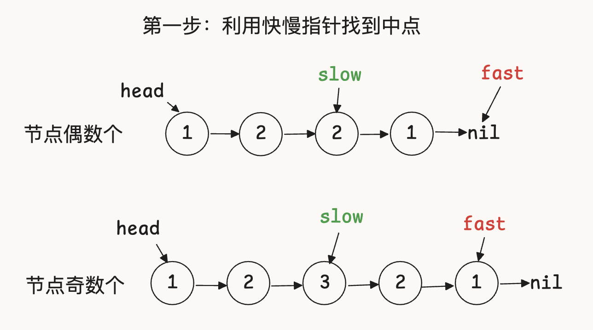

如果 `fast != nil`，说明节点个数为**奇数**，`slow`还需要再移动一步


从 `slow` 开始反转后面的链表，现在就可以开始比较回文串了：

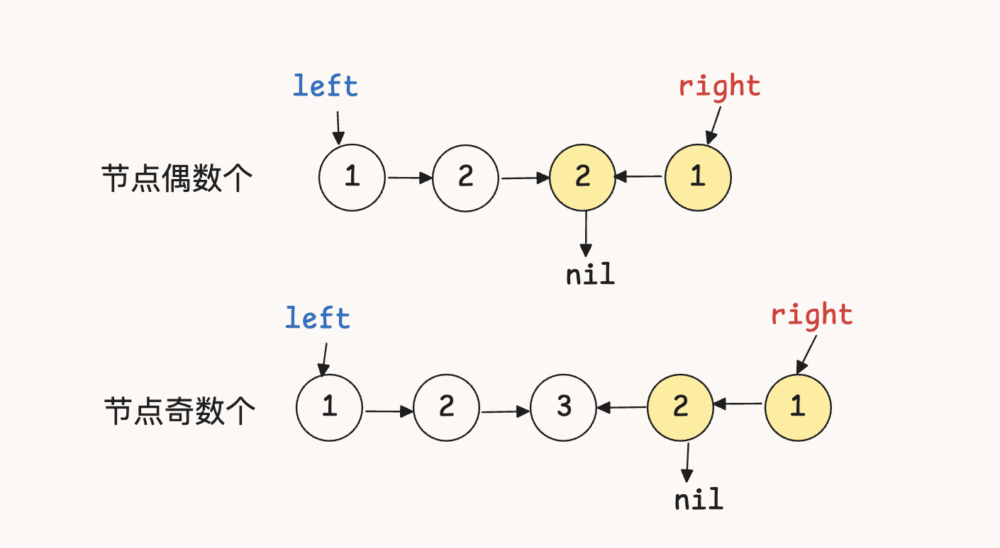

```go

func isPalindrome(head *ListNode) bool {
    //1.先找到链表的中点
   
    fast,slow := head,head

    for fast != nil && fast.Next != nil {
        slow = slow.Next
        fast = fast.Next.Next
    }

    if fast != nil { //说明节点数为奇数个
        slow = slow.Next
    }
		
  	// left 链表
    left := head
  	// right 链表
    right := reverse(slow)

    for right != nil {
        if right.Val != left.Val { // 值不相同，不是回文
            return false
        }
        right = right.Next
        left = left.Next
    }
    return true
}

//翻转链表（递归方式） reverse函数定义：反转root链表，并返回反转后的头节点
func reverse(root *ListNode) *ListNode {
    if root == nil || root.Next == nil {
        return root
    }
  
    head := reverse(root.Next) 
    root.Next.Next = root 
    root.Next = nil
    return head
}

//翻转链表（迭代方式）
func reverse1(root *ListNode) *ListNode {
    cur := root
    var pre *ListNode = nil
    for cur != nil {
        temp := cur.Next //记录下一个节点
        cur.Next = pre //指向pre
        pre = cur //当前cur变成了pre一个了
        cur = temp //继续下一个节点
    }
    return pre
}
```


## 122. 买卖股票的最佳时机II

给你一个整数数组 `prices` ，其中 `prices[i]` 表示某支股票第 `i` 天的价格。

在每一天，你可以决定是否购买和/或出售股票。你在任何时候 **最多** 只能持有 **一股** 股票。你也可以先购买，然后在 **同一天** 出售。

返回 *你能获得的 **最大** 利润* 。

思路：

买卖股票类的题目有一套**通用的解题方案**：

- `dp`数组定义：

> `dp[i][k][0 or 1]` 
>
> `0 <= i <= n - 1, 1 <= k <= K`      
>
> n 为天数，大 K 为完成交易数的上限，0 和 1 代表是否持有股票

所以，`dp[i][k][0 or 1]` 的含义就是：在从 `0`到 `i`天，完成了`k`笔交易，不持有`0` or 持有 `1`股票，能获取的最大利润

- `dp`的递推关系定义：

```go
dp[i][k][0] = max(dp[i-1][k][0], dp[i-1][k][1] + prices[i])
//dp[i][k][0] 表示 从 0 到 第i天，完成k笔交易，不持有股票，能获取的最大利润
分成两种情况：
// dp[i-1][k][0] 								表示 从 0 到i-1天（也就是前一天），也没有持有股票
// dp[i-1][k][1] + prices[i]  	表示 从 0 到i-1天（也就是前一天），持有了股票，但是今天选择卖出，那么今天不就不持有股票了


dp[i][k][1] = max(dp[i-1][k][1], dp[i-1][k-1][0] - prices[i])
// dp[i][k][1]  表示从 0 到第i天，完成k笔交易，持有股票，能获取的最大利润
分成两种情况：
// dp[i-1][k][1] 							 	表示从 0 到 i-1天（也就是前一天），也持有股票
// dp[i-1][k-1][0] - prices[i] 	表示从 0 到 i-1天（也就是前一天），未持有了股票，但是今天选择买入，那么不就持有股票了。因为是今天买入股票，完成了一笔交易，今天的交易次数是k的前提下，那么前一天的交易次数就是 k-1


最终答案：因为要求最大利润，那只有不持有股票的利润最大 dp[n-1][k][0] （从 0到 n-1，完成了k笔交易后，不持有股票）
```

本题答案：

注意：本题是每一天都可以进行交易（可以完成无数次交易 ）。而 121题只能在某一天交易，另外一天卖出（也就是只能完成一次交易）

- 对于本题，去掉`k`这个限定，因为可以进行无数次（没有交易次数上限）

- 最终的地推关系为：

  ```go
  dp[i][0] = max(dp[i-1][0],dp[i-1][1] + prices[i])
  dp[i][1] = max(dp[i-1][1],dp[i-1][0] - prices[i])
  ```

最终题解为：

```go
func maxProfit(prices []int) int {

    n := len(prices)

    dp := make([][]int,n) // 构造dp数组
    for k,_ := range dp {
        dp[k] = make([]int,2)
    }

    for i := 0;i < len(prices);i++ {
				
        if i-1 < 0 { // base case
            dp[i][0] = 0
            dp[i][1] = -prices[i]
        } else { // 一般递推关系
            dp[i][0] = max(dp[i-1][0],dp[i-1][1] + prices[i])
            dp[i][1] = max(dp[i-1][1],dp[i-1][0] - prices[i])
        }
    }
		// 在第 n-1天不持有股票的最大利润
    return dp[n-1][0]
}

func max(a,b int) int {
    if a > b {
        return a
    }
    return b
}
```


## 152. 乘积最大子数组

给你一个整数数组 `nums` ，请你找出数组中乘积最大的非空连续 子数组（该子数组中至少包含一个数字），并返回该子数组所对应的乘积。

测试用例的答案是一个 **32-位** 整数。

思路：

这题和最大子数组和类似（只需要定义最大子数组和），但是本题需要定义最大子数组乘积和最小子数组乘积。

- `dpMax`数组定义：以`i`为结尾的最大乘积
- `dpMin`数组定义：以`i`为结尾的最小乘积

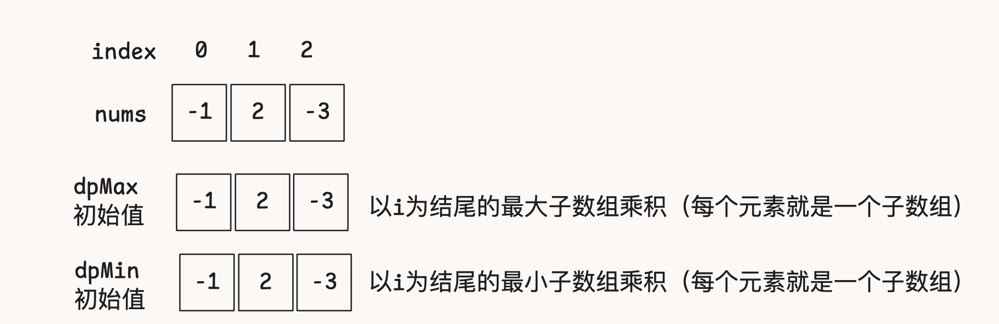


因为当前`nums`是`-3`,乘上一个正数 `2`，只会让结果更小。那如果乘上的是个负数呢？负负得正，那结果不就是变大了。那就要想到负数肯定不是一个最大值，那就是一个最小值。所以额外定义一个最小值的数组乘积

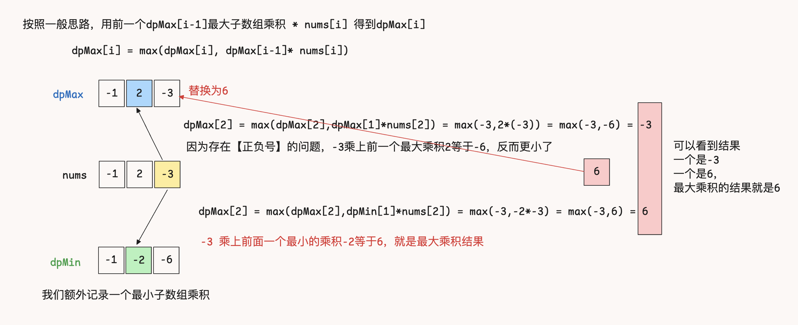

```go
func maxProduct(nums []int) int {
  
		// 定义 dp 数组
    dpMax := make([]int,len(nums))
    dpMin := make([]int,len(nums))


    for i := 0;i < len(nums);i++ { //每个元素值（就是一个子数组），就是初始值
        dpMax[i] = nums[i]
        dpMin[i] = nums[i]
    }

    
    for i := 1;i < len(nums);i++ {
      	// 用 nums[i] * 前一个最大or最小子数组乘积
        maxVal := nums[i]*dpMax[i-1]
        minVal := nums[i]*dpMin[i-1]
      	// 取最大值作为 dpMax
        dpMax[i] = max(dpMax[i], maxVal,minVal )
      	// 取最小值作为 dpMin
        dpMin[i] = min(dpMin[i], maxVal,minVal)
    }
    
    res := math.MinInt
		// 再遍历一遍，dpMax数组，找出最值，返回
    for i := 0;i < len(dpMax);i++ {
        res = max1(res,dpMax[i])
    }
    return res
}

func max1(a,b int) int{
    if a > b{
        return a
    }
    return b
}

func max(a,b ,c int) int{
    if a < b{
        a = b
    }
    if a > c {
        return a
    }
    return c
}

func min(a,b,c int) int{
    if a > b{
        a = b
    }

    if a > c {
        return c
    }
    return a
}
```


## 179. 最大数

给定一组非负整数 `nums`，重新排列每个数的顺序（每个数不可拆分）使之组成一个最大的整数。

**注意：**输出结果可能非常大，所以你需要返回一个字符串而不是整数。

思路：

```go
func largestNumber(nums []int) string {
    // 这题的思路就是排序：按照相邻的两个数字，希望组成最大的数值，比如 3和30；可以组成330和303，符合题目的结果为330；

    // 1.先将int转成字符串保存起来
    strSlice := make([]string,len(nums),len(nums))

    for k, v := range nums {
        strSlice[k] = strconv.Itoa(v)
    }

    // 2.然后对字符串数组排序
    sort.Slice(strSlice,func(i,j int)bool {
      
        // 比如3和30，那就拼接为：330和303 进行比较
        return strSlice[i] + strSlice[j] > strSlice[j] + strSlice[j]
    })

    // 3.corner case 如果数组中都是0，特殊情况的首字符，是0

    if strSlice[0][0] == '0' {
        return "0"
    }

    return strings.Join(strSlice,"")
}
```


## 169. 多数元素

给定一个大小为 `n` 的数组 `nums` ，返回其中的多数元素。多数元素是指在数组中出现次数 **大于** `⌊ n/2 ⌋` 的元素。

你可以假设数组是非空的，并且给定的数组总是存在多数元素。

思路：

这道题的标准解法肯定是用一个哈希表作为计数器记录每个元素出现的次数，然后寻找出现次数最多的那个元素，时间和空间复杂度都是 `O(N)`。

但是由于题目说了这个目标元素（众数）出现的次数**过半**，这就有意思了，其实我们不需要用哈希表来做计数器就能把这个众数找出来。

比方说一群带正电的粒子和一群带负电的粒子，把它们混合起来，得到的这群混合粒子的带电性质是什么？这取决于正电离子多还是负电离子多，如果正负粒子数量恰好相等，则呈电中性。

回到这道题，题目告诉你一定存在一个众数，它出现的次数过半，那么如果你把这个众数元素想象成正电粒子，其他的所有元素都想象成负电粒子，那么它们混合起来会怎样？

**在正负粒子混合的过程中，整体的带电性可能在正负间波动，但最终的结果一定是正电**。

```go
func majorityElement(nums []int) int {
	
	target := 0
	count := 0 // 这里的count可以想象【电子容器】的电性是中性的
	for i := 0; i < len(nums); i++ {
		if count == 0 {
			target = nums[i] // count = 0 表示中性的，将 nums[i] 作为第一个电子，放到容器中
			count++ // 容器电性+1
		} else if target == nums[i] { //发现了target电子相同，电性++
			count++
		} else { //否则电性--
			count--
		}
	}
	return target
}


```


## 62. 不同路径

一个机器人位于一个 `m x n` 网格的左上角 （起始点在下图中标记为 “Start” ）。

机器人每次只能向下或者向右移动一步。机器人试图达到网格的右下角（在下图中标记为 “Finish” ）。

问总共有多少条不同的路径？

思路：

本题和**64.最小路径和**这题有类似之处，都是只能向下、向右移动，一个是计算路径数，一个是计算最小路径。所以，我们只需要修改下 `dp`数组的定义即可。

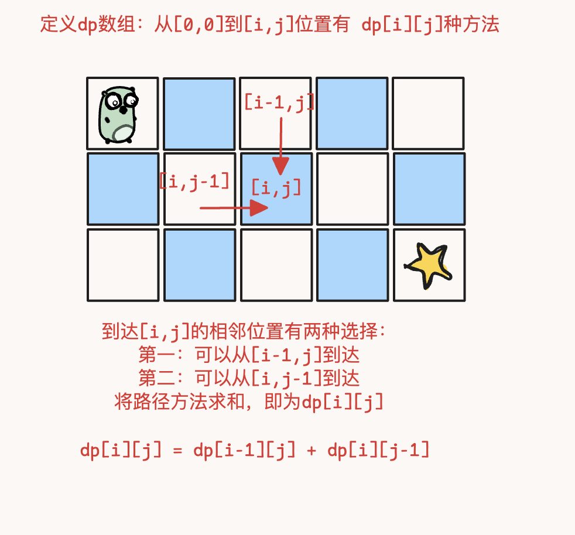

```go
func uniquePaths(m int, n int) int {
   
		// 定义 dp 数组
    dp := make([][]int,m)
    for i := 0;i < m;i++ {
        dp[i] = make([]int,n)
    }


    for i := 0;i < m;i++ {
        for j := 0;j < n;j++ {
            if i == 0 { // base case 第一行 因为只能向右移动
                dp[i][j] = 1
            } else if j == 0 { //base case  第一列 因为只能向下移动
                dp[i][j] = 1
            } else { // 递推关系
                dp[i][j] = dp[i-1][j] + dp[i][j-1]
            }
        }
    }
  	// 最终位置[m-1,n-1]
    return dp[m-1][n-1]
}
```


## 227. 基本计算器II

给你一个字符串表达式 `s` ，请你实现一个基本计算器来计算并返回它的值。整数除法仅保留整数部分。你可以假设给定的表达式总是有效的。所有中间结果将在 `[-231, 231 - 1]` 的范围内。

**注意：**不允许使用任何将字符串作为数学表达式计算的内置函数，比如 `eval()` 。

思路：

第一次做，这题挺难想到，利用栈，模拟计算过程（一回生二回熟，多看几次就记住了）

- 利用两个栈实现，一个存储数值，一个存储符号
- 遇到数值直接入栈
- 遇到符号：需要判断（在栈不为空的情况下），当前符号优先级 <= 栈顶符号优先级（**也就是栈中的符号的优先级比较高**）
- 那么，出栈两个数值，和出栈一个符号，计算结果，把结果存入【栈中】
- 继续比较，是否符合（当前符号优先级 <= 栈顶（且栈不为空）），否则符号直接入栈；

```go
func calculate(s string) int {
    
		// 两个栈
    operands := make([]int,0) //操作数
    operators := make([]byte,0)//操作符
    var result int
  	// index 作为索引，用来遍历每一个字符
    index := 0
    for index < len(s) {
        if isDigit(s[index]) { //判断字符是否是数字
          	// 连续取出多个字符，作为一个完整的整数
            digit := 0
            for index < len(s) && isDigit(s[index]) {
                digit = 10*digit + int((s[index]-'0'))
                index++
            }
          	// 保存到栈中
            operands = append(operands,digit)
        } else if s[index] == ' ' { //空格，跳过
            index++
        } else {
          	// operators 栈不为空，并且栈顶的符号优先级高（先计算栈中的符号）
            for len(operators) != 0 && priority(operators[len(operators)-1],s[index] ) { //栈顶优先级 >= s[i]
                //出栈并运算 -- 运算完成后，继续看下一个操作符号
                if operators[len(operators)-1] == '+' {
                    result =  operands[len(operands)-2] + operands[len(operands)-1]
                }else if operators[len(operators)-1] == '-' {
                    result =  operands[len(operands)-2] - operands[len(operands)-1]
                }else if operators[len(operators)-1] == '*' {
                    result =  operands[len(operands)-2] * operands[len(operands)-1]
                }else if operators[len(operators)-1] == '/' {
                    result =  operands[len(operands)-2] / operands[len(operands)-1]
                }
               
               //出栈数值
               operands = operands[:len(operands)-2]
               operands = append(operands,result) //入栈result结果
               //出栈符号
               operators = operators[:len(operators)-1]
            }

            //直到操作符号为空，或者，不满足优先级关系，入栈操作符
            operators = append(operators,s[index])
            index++ //继续下一个字符
        }
    }
  
  	//如果还有运算符号，说明还需要做最后的运算
    for len(operators) != 0  { 
        //出栈并运算
        if operators[len(operators)-1] == '+' {
            result =  operands[len(operands)-2] + operands[len(operands)-1]
        }else if operators[len(operators)-1] == '-' {
            result =  operands[len(operands)-2] - operands[len(operands)-1]
        }else if operators[len(operators)-1] == '*' {
            result =  operands[len(operands)-2] * operands[len(operands)-1]
        }else if operators[len(operators)-1] == '/' {
            result =  operands[len(operands)-2] / operands[len(operands)-1]
        }
        
        //出栈数值
        operands = operands[:len(operands)-2]
        operands = append(operands,result) //入栈result结果
        //出栈符号
        operators = operators[:len(operators)-1]
    }
    // 最后operands栈中保存的就是结果
    return operands[0]
}

func priority( a, b byte) bool {
    if a == '*' || a == '/' {
        return true
    } else if b == '+' || b== '-' {
        return true
    }
    return false
}

func isDigit( c byte)bool{
    if c >= '0' && c <= '9' {
        return true
    }
    return false
}
```


## 718. 最长重复子数组

给两个整数数组 `nums1` 和 `nums2` ，返回 *两个数组中 **公共的** 、长度最长的子数组的长度* 。

思路：

- `dp`数组定义：`dp[i][j] ` 表示必须以 `i`结尾的子数组和 必须以`j`结尾子数组的公共长度（注意："必须"的含义）

- 递推关系：

  如果`nums1[i] == nums2[j]`，表示两个子数组结尾的数值相同   `dp[i][j] = dp[i-1][j-1] + 1`

  如果 `nums1[i] != nums2[j]`，表示两个子数组结尾的数值不相同，也就是说必须以 `i`结尾的子数组和 必须以`j`结尾子数组的公共长度为`0`

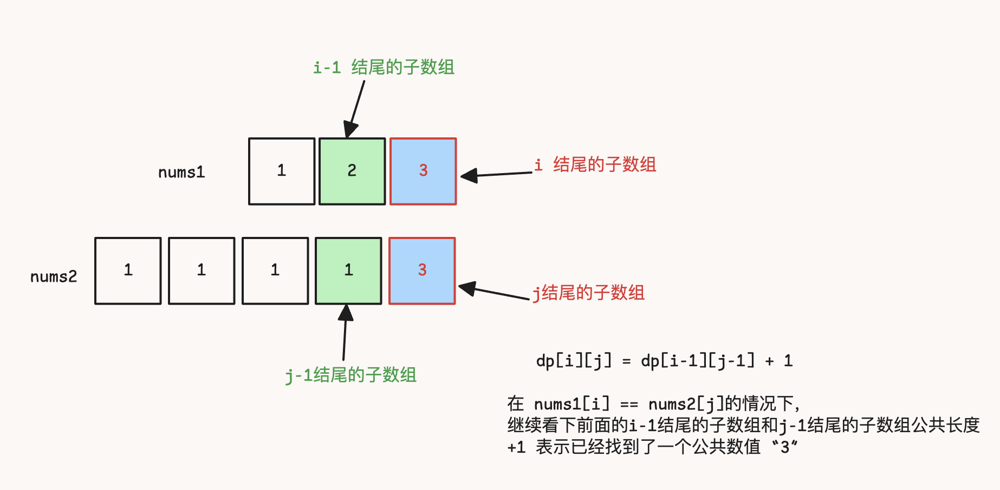

```go
func findLength(nums1 []int, nums2 []int) int {
    // dp 数组定义
    m,n := len(nums1),len(nums2)
    dp := make([][]int,m)
    for k,_ := range dp {
        dp[k] = make([]int,n)
    }

    result := 0
    for i := 0;i < m;i++ {
        for j := 0;j< n;j++ {
            if  i == 0  ||  j == 0 { // base case 当i子数组只有一个元素 or j子数组只有一个元素
                if nums1[i] == nums2[j] {
                    dp[i][j] = 1
                }
            } else if nums1[i] == nums2[j] { // 一般递推关系
                dp[i][j] = dp[i-1][j-1] + 1
            }
						// 题目要求最大长度，dp[i][j]只是记录的每一个的子数组的公共长度
            if dp[i][j] > result {
                result = dp[i][j]
            }
        }
    }
    return result
}
```


## 198. 打家劫舍

你是一个专业的小偷，计划偷窃沿街的房屋。每间房内都藏有一定的现金，影响你偷窃的唯一制约因素就是相邻的房屋装有相互连通的防盗系统，**如果两间相邻的房屋在同一晚上被小偷闯入，系统会自动报警**。

给定一个代表每个房屋存放金额的非负整数数组，计算你 **不触动警报装置的情况下** ，一夜之内能够偷窃到的最高金额。

思路：

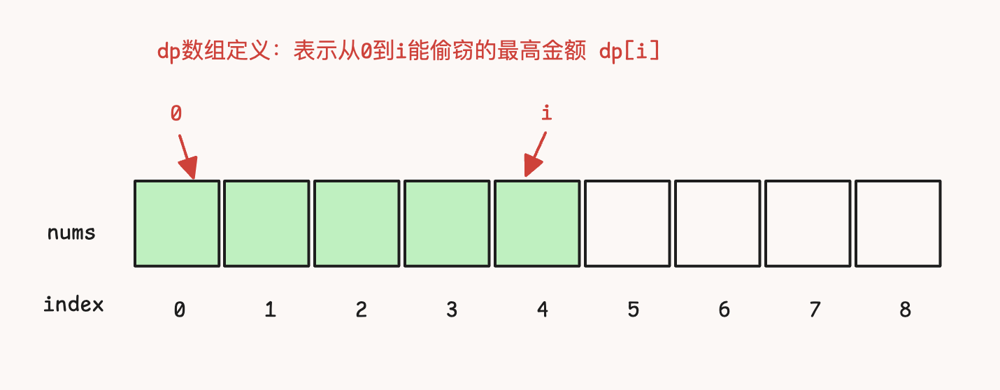

在每间房子前都有两种**选择**：抢或者不抢。

在`i`位置处，我们如果不偷窃，`dp[i] = dp[i-1]`

在`i`位置处，如果偷，`dp[i] = dp[i-2] + nums[i]`

所以，我们的最大金额为： `dp[i] = max(dp[i-1],dp[i-2]+nums[i])`

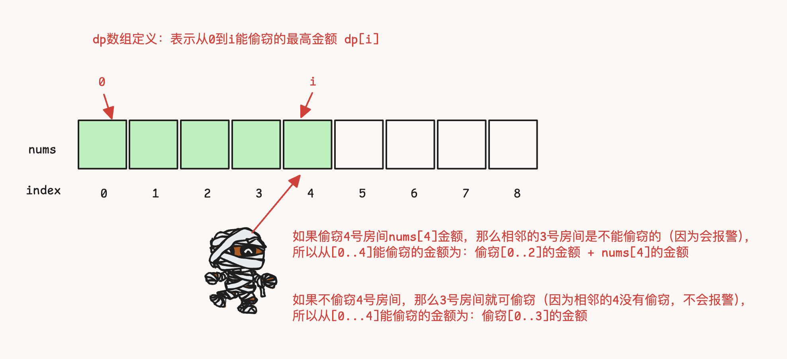

```go
func rob(nums []int) int {
   
		// 定义 dp 数组
    dp := make([]int ,len(nums))
   
    for i := 0; i < len(nums);i++ {
        if i == 0 { // base case 只有一个房间
            dp[i] = nums[0]
        } else if i == 1 { // base 有两个房间
            dp[i] = max(nums[0],nums[1])
        } else { // 一般递推关系
            dp[i] = max(dp[i-1],nums[i]+ dp[i-2])
        }
    }
  	// 最后， dp[len(nums)-1] 表示从[0...len(nums)-1]能偷窃的最大金额（不理解的话，看下dp数组的定义）
    return dp[len(nums)-1]
}

func max(a,b int) int{
    if a > b {
        return a
    }
    return b
}
```


## 83. 删除排序链表中的重复元素

给定一个已排序的链表的头 `head` ， *删除所有重复的元素，使每个元素只出现一次* 。返回 *已排序的链表* 。

思路：

```go
func deleteDuplicates(head *ListNode) *ListNode {

    p := head
    
    for head != nil {
      	// 固定left
        left := head
				// 让 head 移动，保证 [left,head]之间的元素相同
        for head.Next != nil && left.Val == head.Next.Val {
            head = head.Next
        }

        // [left,head] 就是重复的元素，保留一个
        if left != head {
            left.Next = head.Next
        }
        head = head.Next // 同时 head 指向新的一轮链表的起始位置
    }
    return p
}
```

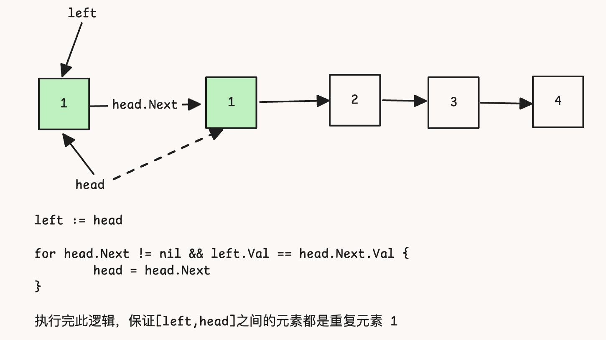

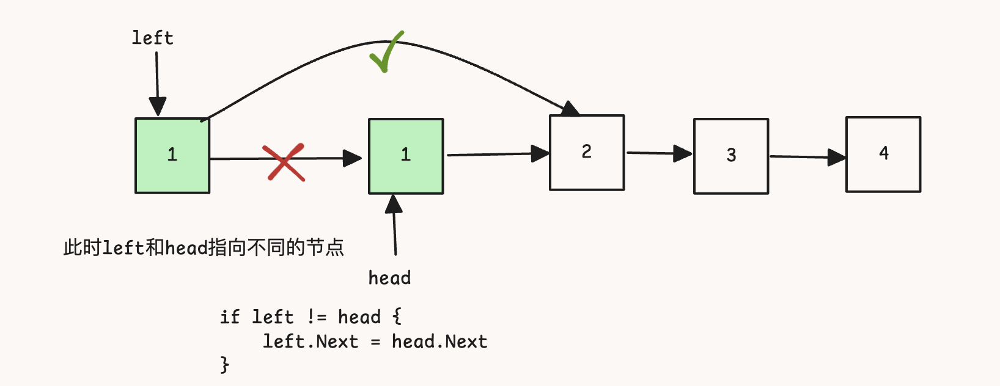


## 226. 翻转二叉树

给你一棵二叉树的根节点 `root` ，翻转这棵二叉树，并返回其根节点。

思路：

这题和**101. 对称二叉树**可以对比看下，都是前序位置进行处理。二叉树的处理，既要以`root`树的整体角度思考，也要从具体的一个`root`节点思考。

如何翻转二叉树？其实就是把二叉树上的每个节点的左右子节点都交换一下

```go
// invertTree函数定义：翻转root二叉树
func invertTree(root *TreeNode) *TreeNode {
    if root == nil {
        return root
    }

    //对root节点，左右子节点交换
    root.Left,root.Right = root.Right,root.Left
  	// 翻转root.Left左树
    invertTree(root.Left)
  	// 翻转root.Right右树
    invertTree(root.Right)
    return root
}

```


## 139. 单词拆分

给你一个字符串 `s` 和一个字符串列表 `wordDict` 作为字典。如果可以利用字典中出现的一个或多个单词拼接出 `s` 则返回 `true`。

**注意：**不要求字典中出现的单词全部都使用，并且字典中的单词可以重复使用。

思路：

动态规划


这里其实有两个字符串`apple 和 pen`供选择。

如果选择 `apple`那么 `dp[i]`的组成就取决于`dp[i-5]`

如果选择 `pen`那么 `dp[i]`的组成就取决于`dp[i-3]`

这两种情况只要有一个满足即可，所以`dp[i]`需要用 `||`来综合`dp[i-5] dp[i-3]`的结果。

很显然，这里只有 `apple`和`applepenapple`尾部匹配

下图演示了，取`apple`的情况下，能否组成的结果，保存到 `dp[i] `中

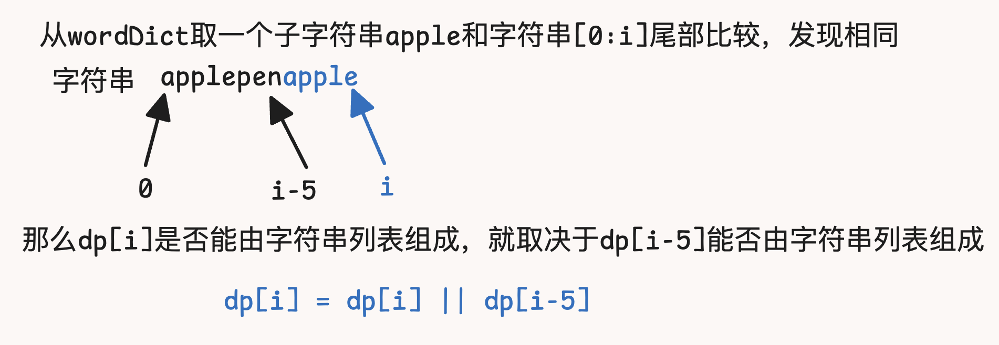

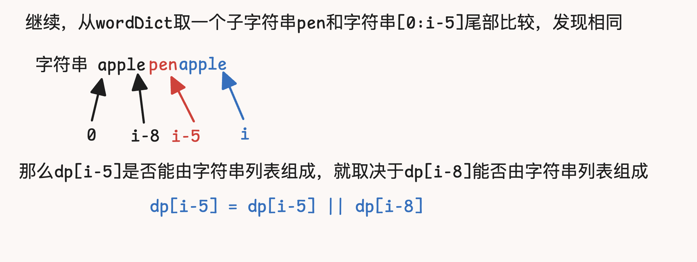

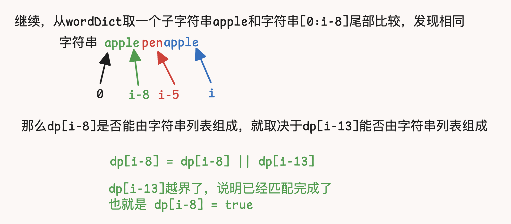

`dp[i] = dp[i] || dp[i-len(word)] ` 这个如果不理解，可以看下这个范例：

比如字符串`dogs` 和字符串列表` [dog,gs,s]`

能和`dogs`尾部匹配的字符串，包括 `gs 和 s`两种情况

- 如果选择`gs`，那么`dp[i]`的结果就取决于`dp[i-2]`，` dp[i] = dp[i] || dp[i-2]` 将结果保存到 `dp[i]`中
- 如果选择`s`，那么`dp[i]`的结果就取决于`dp[i-1]`，` dp[i] = dp[i] || dp[i-1]` 将结果保存到 `dp[i]`中

所以`dp[i]`得最终结果就取决于`dp[i-2] 或者 dp[i-1]`。

```go
func wordBreak(s string, wordDict []string) bool {

    // 定义 dp[i] 表示 [0...i] 能否用字符串列表wordDict拼接出来
    dp := make([]bool,len(s))

    for i := 0; i < len(s);i++ {
			
        for _,word := range wordDict {
            // 字符串长度 >= word 并且 尾部的字符串和 word相等
            if i + 1 >= len(word) && s[i+1-len(word):i+1] == word {
             	 if i - len(word) >= 0 { //没有越界，需要考虑前面的结果dp[i-len(word)]
                     dp[i] = dp[i] || dp[i-len(word)] // 这里用 || 表示要综合考虑字符串尾部，和wordDict的多个字符串都匹配的时候的结果。
                } else {
                    dp[i] = true // 如果越界，说明正好匹配完成
                } 
            }
        }
    }
    return dp[len(s)-1]
}
```


## 209. 长度最小的子数组

给定一个含有 `n` 个正整数的数组和一个正整数 `target` **。**

找出该数组中满足其总和大于等于 `target` 的长度最小的 **子数组**`[numsl, numsl+1, ..., numsr-1, numsr]` ，并返回其长度**。**如果不存在符合条件的子数组，返回 `0` 。

**示例 1：**

```
输入：target = 7, nums = [2,3,1,2,4,3]
输出：2
解释：子数组 [4,3] 是该条件下的长度最小的子数组。
```

思路：

- 要先理解子数组的含义：**子数组** **是数组中连续的** **非空** **元素序列**  。比如上面的示例，`[2,3,1]`是子数组，`[2,1]`就不是子数组

- 这题的解法采用滑动窗口：

  利用`left,right`指针，框住一片连续区域；

  移动`right`保证窗口内的子数组之和大于等于`target`；

  移动`left`保证窗口内的子数组之和大于等于`target`的前提下，窗口的长度减小，寻找最小长度

```go
func minSubArrayLen(target int, nums []int) int {
    // 滑动窗口
    n := len(nums)
  	// left right 窗口的左右指针
    left,right := 0,0

    winSum := 0 // 记录窗口内的总和
    result := math.MaxInt // 设定为最大值（因为要求最小值）

    for right < n {
				// 移动右边界 right
        rightVal := nums[right]
        right++
				// 记录窗口内子数组和
        winSum += rightVal

        for winSum >= target { // 保证窗口的总和 >= target前提下，寻找最小数组长度
            result = min(result,right-left)
          	// 移动左边界 left
            leftVal := nums[left]
            left++
            winSum -= leftVal
        }
    }
    // 表示不存在
    if result == math.MaxInt {
        result = 0
    }
    return result
}

func min(a,b int) int{
    if a < b{
        return a
    }
    return b
}
```


## 560. 和为K的子数组

给你一个整数数组 `nums` 和一个整数 `k` ，请你统计并返回 *该数组中和为 `k` 的子数组的个数* 。

子数组是数组中元素的连续非空序列。

**示例 1：**

```
输入：nums = [1,1,1], k = 2
输出：2
```

**示例 2：**

```
输入：nums = [1,2,3], k = 3
输出：2
```

思路：

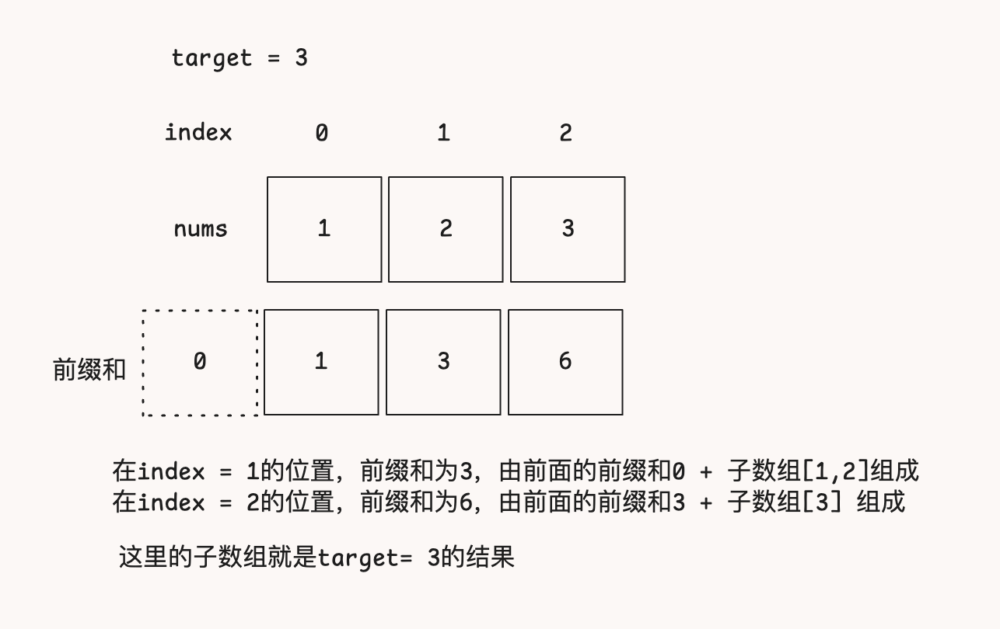

由上图可以得知，这么一个公式` 前缀和 X = 前缀和Y + target（数值等于target子数组）`，也就是 `前缀和 Y = 前缀和X - target（数值等于target子数组）`。由此可知，我们只需要用当前的前缀和 `X - target` ，看下是否存在前缀和`Y` ，如果存在，说明就可以找到一个满足条件的子数组，和 `Y`一起，组成`X`的值。

这里的`Y`的值可能会重复多次

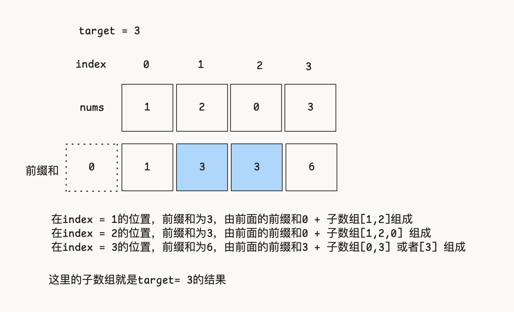

在 `index= 3`的位置，前缀和`6`，可以由前面的一个前缀和`3 + [0,3]`组成，也可以是后面的一个前缀和`3 + [3]`组成，也就是这里的`前缀和Y=3`出现了两次（代表子数组也有两种方案）

最终实现代码如下：`map`用来记录前缀和 + 出现的次数

```go
func subarraySum(nums []int, k int) int {
    // 用map记录前缀和 + 出现次数

    m := make(map[int]int)

		// 默认的前缀和0，出现1次
    nSum := 0
    m[nSum]++

    result := 0

    for i := 0;i < len(nums);i++ {
				// 当前的前缀和x
        nSum += nums[i] 
				// 前缀和x - target = 前缀和Y，在 m中查找Y出现的次数
        result += m[nSum-k]

        // 累积前缀和x出现的次数
        m[nSum]++
    }

    return result
}
```


## 24. 两两交换链表中的节点

给你一个链表，两两交换其中相邻的节点，并返回交换后链表的头节点。你必须在不修改节点内部的值的情况下完成本题（即，只能进行节点交换）。

思路：

这题是 `25. K个一组翻转链表`的特例题型，即 两个一组翻转链表

- 明确递归函数的定义：**swapPairs函数定义：对链表进行两两节点翻转，并返回头节点**
- 在递归函数内部，先针对一小段链表（2个节点的链表）进行翻转，将翻转后的链表，拼接上通过递归函数`swapParis`翻转的链表的头节点

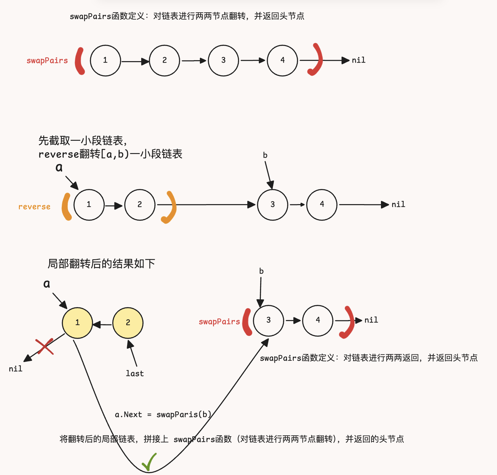

```go
// swapPairs函数定义：翻转以head 为头节点的链表，并返回翻转后的头节点
func swapPairs(head *ListNode) *ListNode {
  	// 截取一小段链表
    a,b := head,head
    for i := 0;i < 2;i++ {
        if b == nil {
            return a
        }
        b = b.Next
    }
		// 对这段链表进行翻转
    last := reverse(a,b)
  	// 将翻转后的尾部节点a拼接上， swapPairs(b) 翻转后的头节点
    a.Next = swapPairs(b)
    return last
}


func reverse(a *ListNode, b *ListNode) *ListNode {
    
    var pre *ListNode = nil 
    for a != b {
        temp := a.Next

        a.Next = pre
        pre = a

        a = temp
    }
    return pre
}
```


## 283. 移动零

给定一个数组 `nums`，编写一个函数将所有 `0` 移动到数组的末尾，同时保持非零元素的相对顺序。

**请注意** ，必须在不复制数组的情况下原地对数组进行操作。

思路：

利用双指针，`slow`指向待存储元素的位置，`fast`负责遍历所有的元素（查看所有的元素）

当 `fast`指向的元素不为`0`的时候，保存到`slow`指向的存储位置

```go
func moveZeroes(nums []int)  {

    slow , fast := 0,0
    for fast < len(nums) {
        if nums[fast] != 0 {
            nums[slow],nums[fast] = nums[fast],nums[slow]
            slow++
        }
        fast++
    }
}
```

这题和 **[905. 按奇偶排列数组](https://leetcode.cn/problems/sort-array-by-parity/)**是一样的解题方案。

给你一个整数数组 `nums`，将 `nums` 中的的所有偶数元素移动到数组的前面，后跟所有奇数元素。返回满足此条件的 **任一数组** 作为答案。

思路：

双指针方案：`slow`指向待存储元素的位置，`fast`负责遍历所有的元素（查看所有的元素）。当 `fast`指向的元素为偶数的时候，保存到`slow`指向的存储位置。

```go
func sortArrayByParity(nums []int) []int {
    slow,fast := 0,0
    // 类似于，283. 移动零 交换 0 和 >0的数字，让0都放到尾部
    for fast < len(nums) {
        if nums[fast] % 2 == 0 { // 偶数
            nums[slow],nums[fast] = nums[fast],nums[slow]
            slow++
        }
        fast++
    }
    return nums
}

//这是另外一种方案（有点类似于快速排序中的一点点逻辑）：定义 left right 指针分别指向数组的两端
func sortArrayByParity(nums []int) []int { 

    left,right := 0,len(nums)-1
		// 保证从[0...left]范围都是偶数元素
  	// 保证从 [right...len(nums)-1]范围的都是奇数元素
    for left < right {
        
        for left < right && nums[left] % 2 == 0 { // left指向偶数，直到碰到奇数停止
            left++
        }

        for left < right && nums[right] % 2 != 0 { // right指向奇数，直到碰到偶数停止
            right--
        }

        if left >= right {
            break
        }
				// 交换 left right指向的元素
        nums[left],nums[right] = nums[right],nums[left]
    }

    return nums
}
```


## 224. 基本计算器

给你一个字符串表达式 `s` ，请你实现一个基本计算器来计算并返回它的值。

注意:不允许使用任何将字符串作为数学表达式计算的内置函数，比如 `eval()` 。

思路：

下图演示了`1-(2+3)`的计算过程。建议边看代码，边看图片，理解整个过程

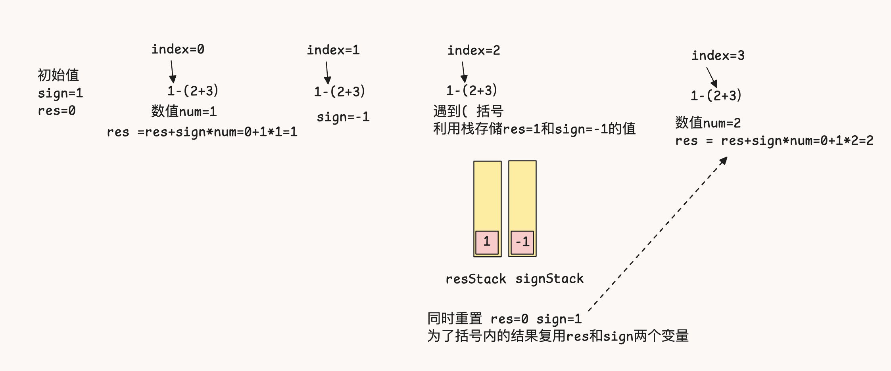

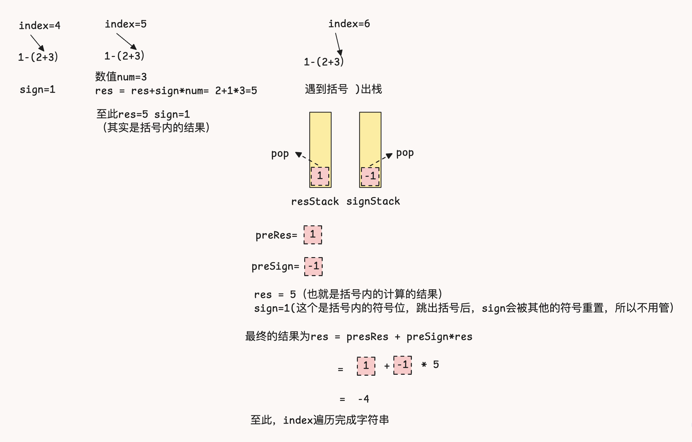

```go
func calculate(s string) int {
    // 例如： 1 + (2 + 3 )

    n := len(s)
    index := 0
    
    sign := 1 // 默认的符号
    res := 0  // 默认结果

    // 记录括号外面，上次的结果 和 符号
    resStack := []int{}
    signStack := []int{}
		
  	// index 用来遍历每一个字符
    for index < n {
       
        if isDigit(s[index]) { // 数字
            num := 0
          	// 连续取出多个数字
            for index < n && isDigit(s[index]) {
                num = num * 10 + int(s[index] - '0')
                index++
            }
            // 符号*num，保存到res中
            res += sign * num
            
        } else if s[index] == '+' { // 记录符号 +
            sign = 1
            index++
        } else if s[index] == '-' { // 记录符号 -
            sign = -1
            index++
        } else if s[index] == '(' { // 保存括号外的 结果res 和 符号sign
            resStack = append(resStack,res)
            signStack = append(signStack,sign)

            // 重置
            res = 0 
            sign = 1
            index++
        } else if s[index] == ')' { // 遇到 ） 说明 括号内计算结束了
            // 弹出上次的结果
            preRes := resStack[len(resStack)-1]
            // 弹出上次的符号 
            preSign := signStack[len(signStack)-1] 
            // 例如： 1+（2+3）范例， preRes = 1  presign = 1   res = 5
            res = preRes + preSign * res
            // 清理
            resStack = resStack[:len(resStack)-1]
            signStack = signStack[:len(signStack)-1]

            index++
        } else if s[index] == ' ' {
            index++
        }
    }
    return res
}

func isDigit(c byte) bool{

    if c >= '0' && c <= '9' {
        return true
    }
    return false
}
```


## 739. 每日温度

给定一个整数数组 `temperatures` ，表示每天的温度，返回一个数组 `answer` ，其中 `answer[i]` 是指对于第 `i` 天，下一个更高温度出现在几天后。如果气温在这之后都不会升高，请在该位置用 `0` 来代替。

思路：

利用单调栈记录数组`temperatures`的索引，每来一个新元素，都和栈顶元素进行对比，如果栈顶元素小，弹出（直到不符合规则）

```go
func dailyTemperatures(temperatures []int) []int {
     // 单调栈
     sk := make([]int,0) // 保存索引
     answer := make([]int,len(temperatures))

     for i := 0;i < len(temperatures);i++ {

        // 栈不为空 && 当前的温度 比 栈顶中的温度大
         for len(sk) != 0 && temperatures[i] > temperatures[sk[len(sk)-1]]  {
             answer[sk[len(sk)-1]] = i - sk[len(sk)-1]

             // 出栈 
             sk = sk[:len(sk)-1]
         }
         sk = append(sk,i) // 记录索引
     }
     return answer
}
```


## 153. 寻找旋转排序数组中的最小值

已知一个长度为 `n` 的数组，预先按照升序排列，经由 `1` 到 `n` 次 **旋转** 后，得到输入数组。例如，原数组 `nums = [0,1,2,4,5,6,7]` 在变化后可能得到：

- 若旋转 `4` 次，则可以得到 `[4,5,6,7,0,1,2]`
- 若旋转 `7` 次，则可以得到 `[0,1,2,4,5,6,7]`

注意，数组 `[a[0], a[1], a[2], ..., a[n-1]]` **旋转一次** 的结果为数组 `[a[n-1], a[0], a[1], a[2], ..., a[n-2]]` 。

给你一个元素值 **互不相同** 的数组 `nums` ，它原来是一个升序排列的数组，并按上述情形进行了多次旋转。请你找出并返回数组中的 **最小元素** 。

你必须设计一个时间复杂度为 `O(log n)` 的算法解决此问题。

- `nums` 中的所有整数 **互不相同**

思路：

二分搜索算法，本质就是将不符合题意的结果搜索范围，通过收缩`left right`的方式，丢弃。只保留符合题意的搜索范围`[left,right]`，供下一次二分搜索。

结合图片理解代码

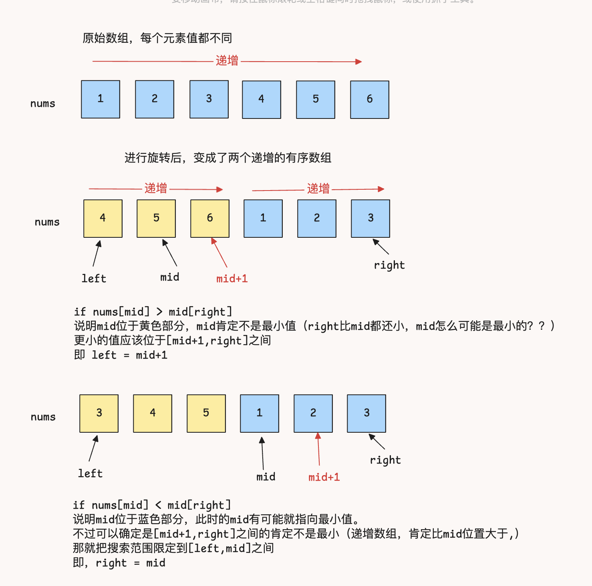

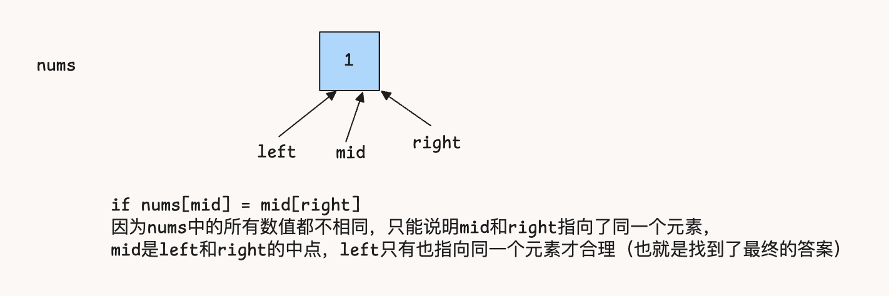

```go
func findMin(nums []int) int {

    left, right := 0,len(nums)-1
    for left <= right {
        mid := left + (right - left)/2

        if nums[mid] > nums[right] { // 说明最小值在 右边数组
            left = mid+1
        } else if nums[mid] < nums[right] {
            right = mid // mid 可能就是最小值
        } else {
            return nums[mid]
        }
    }

    return -1
}
```


## 297. 二叉树的序列化和反序列化

序列化是将一个数据结构或者对象转换为连续的比特位的操作，进而可以将转换后的数据存储在一个文件或者内存中，同时也可以通过网络传输到另一个计算机环境，采取相反方式重构得到原数据。

请设计一个算法来实现二叉树的序列化与反序列化。这里不限定你的序列 / 反序列化算法执行逻辑，你只需要保证一个二叉树可以被序列化为一个字符串并且将这个字符串反序列化为原始的树结构。

思路：

序列化问题其实就是遍历问题，你能遍历，顺手把遍历的结果转化成字符串的形式，不就是序列化了么？

前序遍历的特点是根节点在开头，然后接着左子树的前序遍历结果，然后接着右子树的前序遍历结果：

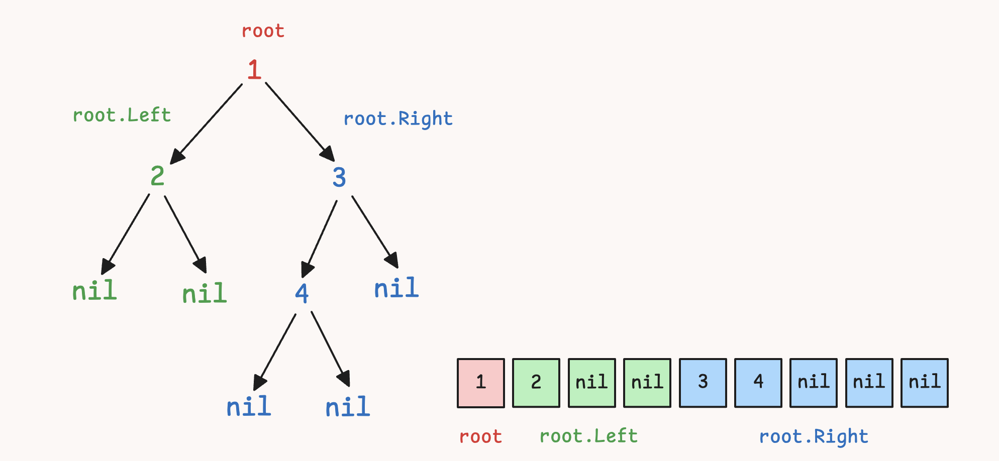

所以如果按照前序遍历顺序进行反序列化的时候，就知道第一个元素是根节点的值，然后递归调用反序列化左右子树，接到根节点上即可，上述思路翻译成代码即可解决本题。

```go

type Codec struct {
    index int
    data []string
}

func Constructor() Codec {
    return Codec{}
    
}

// 前序遍历（序列化）
func (this *Codec) serialize(root *TreeNode) string {
    if root == nil {
        return "nil"
    }
  	// 利用 "," 分割
    return strconv.Itoa(root.Val)+","+ this.serialize(root.Left) +","+this.serialize(root.Right)
}

//反序列化
func (this *Codec) deserialize(data string) *TreeNode {    
  	// 初始化 index值
    this.index = 0
  	// 拆分字符串
    this.data = strings.Split(data,",")
    return this.deser()
}

func (this *Codec)deser() *TreeNode {
  	// 越界返回 nil
    if this.index >= len(this.data) {
        return nil
    }
  	
    val := this.data[this.index] //从头到尾，递归遍历this.data切片
    this.index++
    if val == "nil" { // 如果是nil字符串，返回nil
        return nil
    }  
		
  	// 说明是一个有效的节点值
    v ,_ := strconv.Atoi(val)
		
    root := &TreeNode{Val:v,Left:nil,Right:nil} //构造TreeNode根节点
    root.Left = this.deser() //反序列化，构造左节点
    root.Right = this.deser() //反序列化，构造右节点
    return root
}
```


## 468. 验证IP地址

给定一个字符串 `queryIP`。如果是有效的 IPv4 地址，返回 `"IPv4"` ；如果是有效的 IPv6 地址，返回 `"IPv6"` ；如果不是上述类型的 IP 地址，返回 `"Neither"` 。

**有效的IPv4地址** 是 `“x1.x2.x3.x4”` 形式的IP地址。 其中 `0 <= xi <= 255` 且 `xi` **不能包含** 前导零。例如: `“192.168.1.1”` 、 `“192.168.1.0”` 为有效IPv4地址， `“192.168.01.1”` 为无效IPv4地址; `“192.168.1.00”` 、 `“192.168@1.1”` 为无效IPv4地址。

**一个有效的IPv6地址** 是一个格式为`“x1:x2:x3:x4:x5:x6:x7:x8”` 的IP地址，其中:

- `1 <= xi.length <= 4`
- `xi` 是一个 **十六进制字符串** ，可以包含数字、小写英文字母( `'a'` 到 `'f'` )和大写英文字母( `'A'` 到 `'F'` )。
- 在 `xi` 中允许前导零。

例如 `"2001:0db8:85a3:0000:0000:8a2e:0370:7334"` 和 `"2001:db8:85a3:0:0:8A2E:0370:7334"` 是有效的 IPv6 地址，而 `"2001:0db8:85a3::8A2E:037j:7334"` 和 `"02001:0db8:85a3:0000:0000:8a2e:0370:7334"` 是无效的 IPv6 地址。

思路：

这题没有技巧，就是对整个字符串，按照题目要求的格式，进行验证即可

```go
func validIPAddress(queryIP string) string {
    // 1. 判断是ip4 ip6
    isIp4,isIp6 :=  strings.Contains(queryIP,"."),strings.Contains(queryIP,":")
    // 2.ip4 分成4份，每份的数值大小为 [0,255],不能有前导0

    if isIp4 && !isIp6 && ip4Check(queryIP) {
        return "IPv4"
    }

    // 3.ip6 分成8份，每份长度为[1,4]，是一个16进制数字
    if !isIp4 && isIp6 && ip6Check(queryIP) {
        return "IPv6"
    }

    return "Neither"
}

func ip4Check(queryIP string) bool {
    if ipSlice := strings.Split(queryIP,"."); len(ipSlice) == 4 { // 4份
        // 对每个片段进行 检查
        for _, val := range ipSlice {
            // 字符串长度 大于3 等于 0 无效，剩下 1 2 3范围的长度，如果长度大于1，表示有2位or3位数字，那么不能有前导0
            if len(val) > 3 || len(val) == 0 || (len(val) > 1 && val[0] == '0') {
                return false
            }
            // 数值需要 <= 255
            if v ,err := strconv.Atoi(val);err != nil || v > 255 {
                return false
            }
        }
        return true
    }
    return false
}


func ip6Check(queryIP string) bool {
    if ipSlice := strings.Split(queryIP,":"); len(ipSlice) == 8 {// 8份

        for _, val := range ipSlice {
          	// 长度在[1~4]之间
            if len(val) < 1 || len(val) > 4 {
                return false
            }
            // 将16进制数字，转换成64位的整数（能转成，说明是有效的16进制数字）
            if _,err:=strconv.ParseUint(val,16,64);err != nil {
                return false
            }
        }
        return true
    }
    return false
}
```


## 460. LFU缓存

请你为 [最不经常使用（LFU）](https://baike.baidu.com/item/缓存算法)缓存算法设计并实现数据结构。

实现 `LFUCache` 类：

- `LFUCache(int capacity)` - 用数据结构的容量 `capacity` 初始化对象
- `int get(int key)` - 如果键 `key` 存在于缓存中，则获取键的值，否则返回 `-1` 。
- `void put(int key, int value)` - 如果键 `key` 已存在，则变更其值；如果键不存在，请插入键值对。当缓存达到其容量 `capacity` 时，则应该在插入新项之前，移除最不经常使用的项。在此问题中，当存在平局（即两个或更多个键具有相同使用频率）时，应该去除 **最久未使用** 的键。

为了确定最不常使用的键，可以为缓存中的每个键维护一个 **使用计数器** 。使用计数最小的键是最久未使用的键。

当一个键首次插入到缓存中时，它的使用计数器被设置为 `1` (由于 put 操作)。对缓存中的键执行 `get` 或 `put` 操作，使用计数器的值将会递增。

函数 `get` 和 `put` 必须以 `O(1)` 的平均时间复杂度运行。

思路：

总结下题目的要求：

1、调用 `get(key)` 方法时，要返回该 `key` 对应的 `val`。

2、只要用 `get` 或者 `put` 方法访问一次某个 `key`，该 `key` 的 `freq` 就要加一。

3、如果在容量满了的时候进行插入，则需要将 `freq` 最小的 `key` 删除，如果最小的 `freq` 对应多个 `key`，则删除其中最旧的那一个。


建议边看代码，边参考上图。代码不难，就是细节很多**很细细细细细细细细细**

```go
type Data struct {
    val int // 值

    // freq记录频率，
    freq int
    // ele 记录在freq频率下，链表中的节点
    ele *list.Element
}


type LFUCache struct {
    keyToData map[int]Data // key 映射 Data

    freqToKey map[int]*list.List  // 频率freq映射key，目的在于记录相同频率的key先来后到顺序，方便删除最早的key（按照正常情况下，在出现频率相同的情况下，删除访问时间最早的key，这里没有用时间戳，而是用一个列表，因为链表存放顺序，就有时间的含义）
    cap int // 容量
    minFreq int // 始终指向最小频率，通过freqToKey，找到最早的key，然后删除（目的在于删除）
}


func Constructor(capacity int) LFUCache {
  	// 初始化
    return LFUCache{
        keyToData : make(map[int]Data),
        freqToKey : make(map[int]*list.List),
        cap :capacity,
        minFreq : 0,
    }
}


func (this *LFUCache) Get(key int) int {
  	// 如果key存在
    if data ,ok := this.keyToData[key];ok {
        this.increaseFreq(key) // 升频
        return data.val // 返回数据
    }
    return -1
}

/*
increaseFreq 本函数执行两件事情：
第一个，用 freq 找到旧链表，并删除节点（额外注意：如果freq == minFreq 将最小频率+1）
第二个，将 freq++ 找到新链表，并新增节点
*/
func (this *LFUCache)increaseFreq(key int) {
  	//1.先取出源数据
    data := this.keyToData[key] 

    //2.通过频率，找到链表，然后从链表中删除节点
    l := this.freqToKey[data.freq]
    l.Remove(data.ele)

  	if l.Len() == 0 { // 如果链表为空，说明链表中没有数据了
        delete(this.freqToKey,data.freq) // 释放（节约内存）
        if data.freq == this.minFreq { // 如果频率恰好和最小频率相同（说明最小的频率已经被删除了，最小频率升频为次小频率）
            this.minFreq++
        }
    }

    //3.加入新的列表
    data.freq += 1 // 频率+1
    if _,ok := this.freqToKey[data.freq];!ok{ //新频率对应的链表不存在
        this.freqToKey[data.freq] = list.New() // 创建链表
    }
    data.ele = this.freqToKey[data.freq].PushBack(key) // 将key加入链表，返回节点，保存在data中
    this.keyToData[key] = data // 修改keyToData中的数据
}

func (this *LFUCache) Put(key int, value int)  {
    if this.cap <= 0 {
        return
    }

    // 1. 判断key是否存在
    if _,ok := this.keyToData[key];ok {
        //2. key存在，key对应的频率+1
        this.increaseFreq(key)
        // 更新key的val
        data := this.keyToData[key]
        data.val = value
        this.keyToData[key] = data
        return
    }

    //2.key 不存在
    if len(this.keyToData) >= this.cap { //容量超过预期，先删除一个
        this.removeKey()
    }

    //3. 【新】插入：频率肯定是1

    data := Data{val:value,freq:1} // 数值 + 频率
    if _,ok := this.freqToKey[1];!ok {
        this.freqToKey[1] = list.New()
    }
    data.ele = this.freqToKey[1].PushBack(key) // 对应链表中的元素
    this.keyToData[key] = data
    this.minFreq = 1 // 注意：最小频率变成1
}

func (this *LFUCache)removeMinFreqKey() {
    l := this.freqToKey[this.minFreq] // 找到最小频率链表

    deletedKey := l.Remove(l.Front()) // 删除链表的首部（因为最新的数据都是直接放入到尾部 PushBack(key） ）
    if l.Len() == 0 {
        delete(this.freqToKey,this.minFreq)
      	// this.minFreq++ // 这里这个写不写都无所谓，当要新增节点的时候，一定是因为容量不足，才执行的函数。当后续新增节点的是时候，节点是第一次加入， this.minFreq会被设定为1
    }
    delete(this.keyToData,deletedKey.(int)) // 删除key对应的数值
}

```


## 207. 课程表

你这个学期必须选修 `numCourses` 门课程，记为 `0` 到 `numCourses - 1` 。

在选修某些课程之前需要一些先修课程。 先修课程按数组 `prerequisites` 给出，其中 `prerequisites[i] = [ai, bi]` ，表示如果要学习课程 `ai` 则 **必须** 先学习课程 `bi` 。

- 例如，先修课程对 `[0, 1]` 表示：想要学习课程 `0` ，你需要先完成课程 `1` 。

请你判断是否可能完成所有课程的学习？如果可以，返回 `true` ；否则，返回 `false` 。

**示例 1：**

```
输入：numCourses = 2, prerequisites = [[1,0]]
输出：true
解释：总共有 2 门课程。学习课程 1 之前，你需要完成课程 0 。这是可能的。
```

思路：

比如 课程1依赖课程2 课程3，课程3又依赖课程1，这样就形成了循环依赖的关系。课程是无法完成学习的。

通过下图可以理解 `onPath`变量的意义，以及整个检测的可视化过程。建议边看代码边看图理解

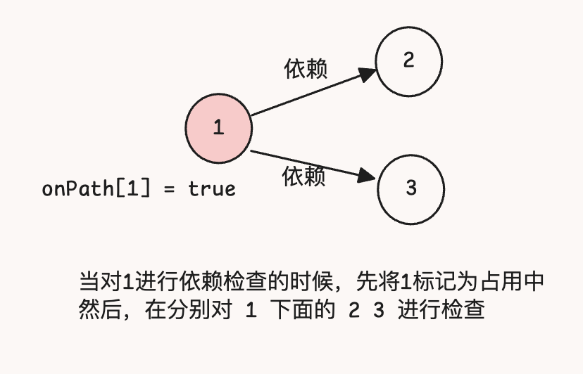

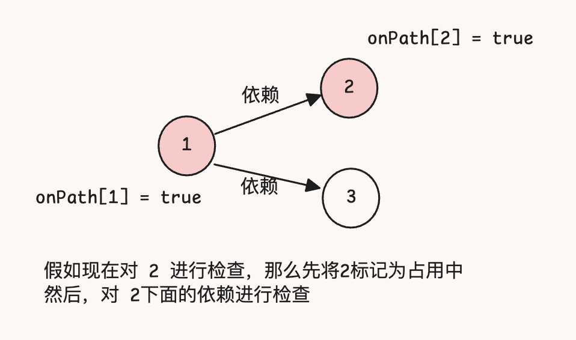

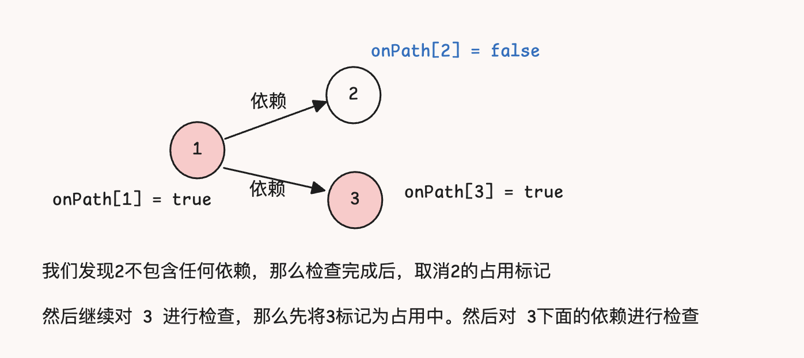

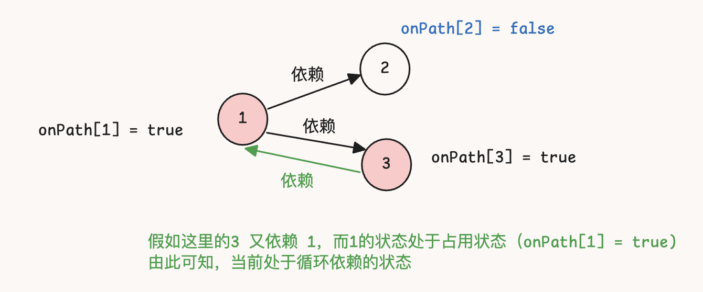

```go
var isCircle bool // 表示课程是否存在循环依赖
var visited []bool // 表示课程已经做过检查了，不用重复检查
var onPath []bool  // 标记课程是否正在被占用
func canFinish(numCourses int, prerequisites [][]int) bool {

    visited = make([]bool,numCourses)
    onPath = make([]bool,numCourses)

    isCircle = false
    //1.先构建有向图；用临接表的方式
    graph := make([][]int,numCourses) // 总共有numCourses个课程，graph的目的是记录下每个课程依赖的课程列表

    for i := 0;i < len(prerequisites);i++ { // 课程prerequisites[i][0] 依赖于 课程prerequisites[i][1] 
        graph[prerequisites[i][0]] = append(graph[prerequisites[i][0]],prerequisites[i][1])
    }

    // 2. 遍历有向图中的所有节点 i 从 [0... numCoures-1] 表示每个课程id
    for i := 0; i < numCourses;i++ { 
        dfs(graph,i) // 从 每个课程 i 出发，检测依赖关系
    }

    return !isCircle // 没环，表示可以学习完所有的课程
}

// 这里的i可以理解为课程id（可以理解成向周围 散播的感觉），onPath用来记录课程已经被占中了
func dfs(graph [][]int,i int) {
  	// 现在访问的课程i，标记为占用中，说明课程被重复依赖了（标记有环）
    if onPath[i] {
        isCircle = true
    }

    if visited[i] || isCircle { // 课程已经检测过了，或者已经存在环，没必要继续下去了，尽快结束
        return
    }

    visited[i] = true // 表示课程i 已经检测过了（没必要重复检查了，为了剪枝，加快算法速度）
    onPath[i] = true // 标记课程i被占用了

    // 继续向周围散播
    // 看下课程i 依赖的课程列表graph[i]
    for j := 0;j < len(graph[i]);j++ { // i 下面的所有课程
        dfs(graph,graph[i][j]) // graph[i][j] 表示子课程
    }   

    onPath[i] = false // 取消占用标记
}
```


## 138. 随机链表的复制

给你一个长度为 `n` 的链表，每个节点包含一个额外增加的随机指针 `random` ，该指针可以指向链表中的任何节点或空节点。

构造这个链表的 **[深拷贝](https://baike.baidu.com/item/深拷贝/22785317?fr=aladdin)**。 深拷贝应该正好由 `n` 个 **全新** 节点组成，其中每个新节点的值都设为其对应的原节点的值。新节点的 `next` 指针和 `random` 指针也都应指向复制链表中的新节点，并使原链表和复制链表中的这些指针能够表示相同的链表状态。**复制链表中的指针都不应指向原链表中的节点** 。

例如，如果原链表中有 `X` 和 `Y` 两个节点，其中 `X.random --> Y` 。那么在复制链表中对应的两个节点 `x` 和 `y` ，同样有 `x.random --> y` 。

返回复制链表的头节点。

用一个由 `n` 个节点组成的链表来表示输入/输出中的链表。每个节点用一个 `[val, random_index]` 表示：

- `val`：一个表示 `Node.val` 的整数。
- `random_index`：随机指针指向的节点索引（范围从 `0` 到 `n-1`）；如果不指向任何节点，则为 `null` 。

你的代码 **只** 接受原链表的头节点 `head` 作为传入参数。

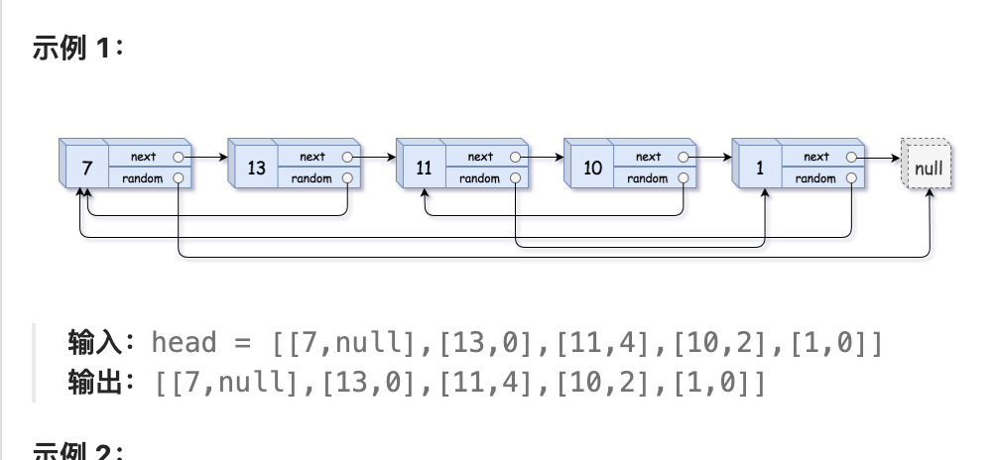

思路：

这道题目，就属于会者不难，难者不会的那类题。

**对于数据结构复制，甭管他怎么变，你就记住最简单的方式：一个哈希表 + 两次遍历**。

第一次遍历专门克隆节点，借助哈希表把【原始节点和克隆节点】的映射存储起来；

第二次专门组装节点，照着原数据结构的样子，把克隆节点的指针组装起来。

```go
/**
 * Definition for a Node.
 * type Node struct {
 *     Val int
 *     Next *Node
 *     Random *Node
 * }
 */

func copyRandomList(head *Node) *Node {
    // hash表，存储 原始节点 -> 克隆节点 的映射
    origin2Clone := make(map[*Node]*Node)
    //1.遍历链表，创建 old -> new 映射关系
    for p := head;p != nil;p = p.Next {
        if _,ok := origin2Clone[p];!ok {
            origin2Clone[p] = &Node{Val:p.Val} // 老节点 -> 新节点
        }
    }

    //2. 进行映射
    // p表示旧节点 origin2Clone[p] 表示新节点
    for p := head;p != nil ;p = p.Next {
        origin2Clone[p].Next = origin2Clone[p.Next]
        origin2Clone[p].Random = origin2Clone[p.Random]
    }
		// 返回新头节点 origin2Clone[head]
    return origin2Clone[head]
}
```


## 402. 移掉K位数字

给你一个以字符串表示的非负整数 `num` 和一个整数 `k` ，移除这个数中的 `k` 位数字，使得剩下的数字最小。请你以字符串形式返回这个最小的数字。

思路：

我们以局部的视角看问题，**让相邻的两两数字，小的在前面，大的在后面**

比如`54`，相邻的两个数字，如果要想变小，肯定要让小的数字占据高位，那就是`45`这种格式。如果是移除，那就移除`5`只保留`4`即可。

再比如`541`，移除1位，让数值最小。按照上面的方案，我们移除`5`就可以得到`41`。可能会觉得`541`之间，1更小呀，为啥不移除 4。

我们只能进行1次移除操作，当从左到右遍历，也就是从高位到低位遍历，我们需要优先将高位变小，再让低位变小。如果高位不变小，只是把低位变小，那就是`541`去掉 4 变成 `51`。还是比上面的`41`结果更大的。

所以，结论就是**先让高位变小（用小的数字），然后再让后面的位变小**

再例如`1432219`，移除3位得到最小数值。

我们从左到右遍历字符串，来演示这个过程

- 先比较 14，高位 1已经很小了（保持不变），所以结果为  1432219

- 再比较 43，3更小，【去掉4】（注意是两两比较，一旦去掉了4，那么3就和1相邻的，其实这里也要比较下 13的关系，显然 1 更小），结果为 132219

-  32比较，【去掉3】，结果为 12219

- 22比较，相等，所以保持不变，结果为 12219

- 21比较，1更小，【去掉2】结果为 1219（这时候前一个2和1相邻的了，按照上面的理论1更小，应该【再去掉一个2】，结果为119）因为我们只需要3次移除操作，如果再移除一个2，就是4次移除操作了。

实际实现的时候，利用栈来存储数字。遍历到的数字和栈顶的数字比较（也就实现了两两比较的关系），让小的数字占据高位即可。

```go
func removeKdigits(num string, k int) string {
    
    stack := make([]rune,0)

    for _,c := range num { // 遍历字符串中的每个字符

      // 删除k个数字，并且栈里面有数字 并且 入栈字符c比栈顶元素小(也就是两两比较，让小的占据高位)
        for k > 0 && len(stack) != 0 && c < stack[len(stack)-1] { // 注意这里是个for循环
            //踢出栈顶元素
            stack = stack[:len(stack)-1]
            k-- // 每踢出一个元素，个数-1
        }
				
      	// 比如：102 这种格式， 10比较，0更小，如果让0入栈，最终的结果就是 02，实际应该是2
        if c == '0' && len(stack) == 0 { //前导0【忽略】
            continue
        }
        
        stack = append(stack,c) // 最后入栈
    }
		
  	// 特殊情况
    if k >= len(stack) { // 例如：100  k=2，只会执行1次移除操作（还缺少一次），并且最后的stack为空。直接返回 0
        return "0"
    } else {
        stack = stack[:len(stack)-k] // 例如：123456这种递增的格式，上面for循环不会移除任何字符，题目要求必须剔除k个 	1234 56 去掉尾部最大的数，余下的就是最小的值
    }
    return string(stack)
}
```


## 136. 只出现一次的数字

给你一个 **非空** 整数数组 `nums` ，除了某个元素只出现一次以外，其余每个元素均出现两次。找出那个只出现了一次的元素。

你必须设计并实现线性时间复杂度的算法来解决此问题，且该算法只使用常量额外空间。

思路：

记住异或运算，就是半加运算。也就是只做加法，但是不进位。所以相同的数字进行异或的结果就是`0`

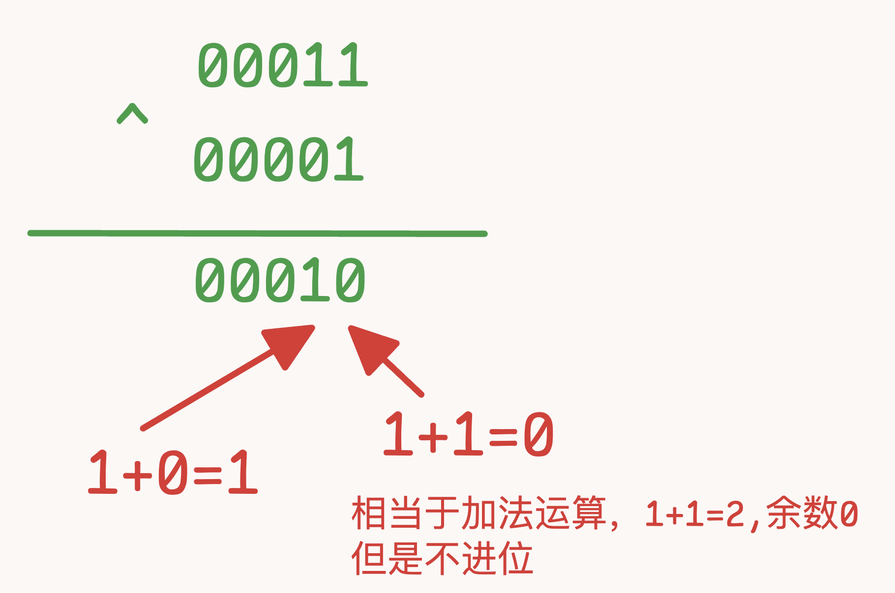

```go
func singleNumber(nums []int) int {
    // 这题的思路：异或运算 a^a = 0  a ^ 0 = a
    // 重复元素出现两次,异或后都是0，最后的结果就是那个只出现一次的元素
    result := 0
    for _ ,num := range nums {
        result ^= num
    }
    return result
}
```


## 11. 盛最多水的容器

给定一个长度为 `n` 的整数数组 `height` 。有 `n` 条垂线，第 `i` 条线的两个端点是 `(i, 0)` 和 `(i, height[i])` 。

找出其中的两条线，使得它们与 `x` 轴共同构成的容器可以容纳最多的水。

返回容器可以储存的最大水量。

**说明：**你不能倾斜容器。

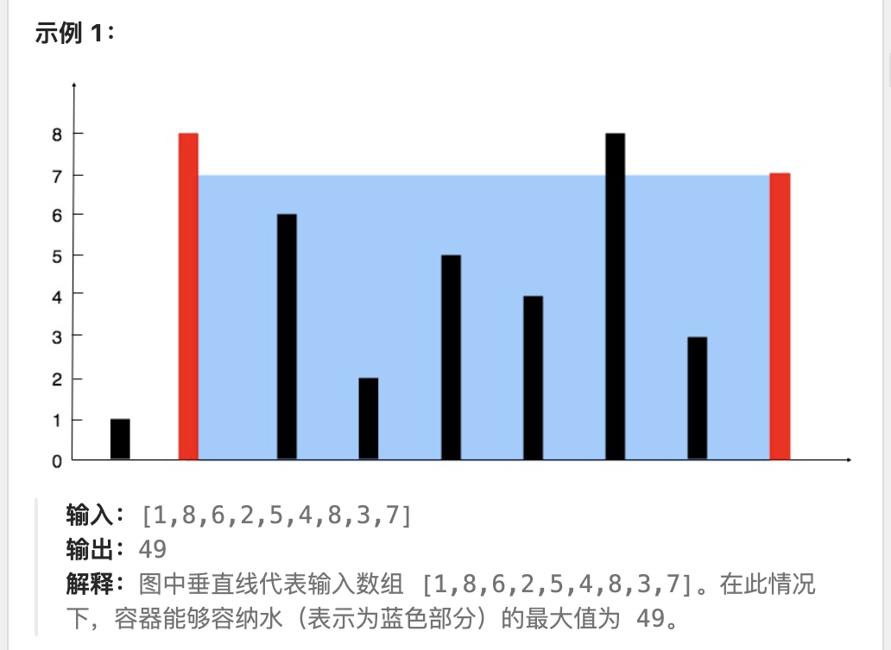

思路：

**用 `left` 和 `right` 两个指针从两端向中心收缩，一边收缩一边计算 `[left, right]` 之间的矩形面积，取最大的面积值即是答案**。

不过肯定有读者会问，下面这段 if 语句为什么要移动较低的一边：

```java
// 双指针技巧，移动较低的一边
if (height[left] < height[right]) {
    left++;
} else {
    right--;
}
```

**其实也好理解，因为矩形的高度是由 `min(height[left], height[right])` 即较低的一边决定的**：

你如果移动较低的那一边，那条边可能会变高，使得矩形的高度变大，进而就「有可能」使得矩形的面积变大；相反，如果你去移动较高的那一边，矩形的高度是无论如何都不会变大的（因为低的那一边决定了高度上限，也就是短板效应），所以不可能使矩形的面积变得更大。

```go

// 双指针技巧
func maxArea(height []int) int {
    left,right := 0,len(height)-1
		// 最终结果
    maxVal := 0
    for left < right {
        // 计算两条边围成的面积 高度的最小值 * 底边长度

        maxVal = max(maxVal,min(height[left],height[right]) * (right-left)) 

        if height[left] < height[right] { // left/right两条边，left边比较短，因为容器盛水，短边会限制容器的高度，如果移动right，即使找到更高的right，因为left比较短，最后可能容器的高度还是left高度
            left++

        } else {
            right--
        }
    }
    return maxVal
}

func max(a ,b int) int{
    if a > b {
        return a
    }
    return b
}

func min(a,b int) int {
    if a < b {
        return a
    }
    return b
}
```


## 47. 全排列II

给定一个可包含重复数字的序列 `nums` ，***按任意顺序*** 返回所有不重复的全排列。

思路:

请先做前置题目「[46. 全排列](https://leetcode.cn/problems/permutations/solutions/2363882/46-quan-pai-lie-hui-su-qing-xi-tu-jie-by-6o7h/)」

本题和上一题的区别是数组中“存在重复元素”。当数组存在重复元素时，排列方案中也存在重复的方案。

重复的排列方案，主要是因为重复的元素造成的。

比如：数字序列`[1,1]`，假如我们将第一个1叫做  1'  第二个1叫做 1"，那么数字序列我们改写为`[1' 1"]`。如果我们进行排列，那就包括了`[1' 1"]和[1" 1']`两种排列方案，其实这两种方案就是一种方案。

为了保证不重复，我们设定一个条件，就是要求 1' 必须要在1"的前面，那么`[1" 1']`这种方案自然也就不成立了。

那么怎么才能实现这个条件呢？

-  我们需要对数组进行排序，让相同的元素都相邻在一起
- 在每次选择一个元素的时候，都要保证相邻的【前一个】**相同**元素，出现的情况下，自己才能出现（也就是相对顺序要保证不变）。比如上面的 1" 要想出现，必须 1'先出现的情况下。。。而`[1" 1']`这种格式，1' 是在 1"后面出现的。

具体看下面代码

```go

var used []bool
var track []int
var result [][]int
func permuteUnique(nums []int) [][]int {

    // 1.排序
    sort.Slice(nums,func(i,j int)bool{
        return nums[i] < nums[j]
    })
    // 回溯算法
    used = make([]bool,len(nums)) //用来记录元素是否已经被使用过
    track = []int{}
    result = [][]int{}
    backtrack(nums)
    return result
}

func backtrack(nums []int) {

    if len(track) == len(nums) {
        tmp := make([]int,len(track))
        copy(tmp,track)
        result = append(result,tmp)
        return
    }

    for i := 0;i < len(nums);i++ {
        if used[i] {
            continue
        }

        // 保证重复的元素的【相对顺序】不变，例如前一个1没有被使用，后面的重复元素1也不能被使用，这样其实就保证重复元素的相对顺序不变。再例如：1 1' ，保证1'被选中的前提 1先被使用，这样就可以保证1 1'的顺序不变
        //当前选择的元素和前一个元素相同,如果前一个元素没有被使用，当前的这个元素也不能被使用
        if i > 0 && nums[i] == nums[i-1] && !used[i-1] {
            continue
        }

        //选择
        used[i] = true
        track = append(track,nums[i])
        backtrack(nums)

        //撤销选择
        used[i] = false
        track = track[:len(track)-1]
    }
}
```


## 79. 单词搜索

给定一个 `m x n` 二维字符网格 `board` 和一个字符串单词 `word` 。如果 `word` 存在于网格中，返回 `true` ；否则，返回 `false` 。

单词必须按照字母顺序，通过相邻的单元格内的字母构成，其中“相邻”单元格是那些水平相邻或垂直相邻的单元格。同一个单元格内的字母不允许被重复使用。

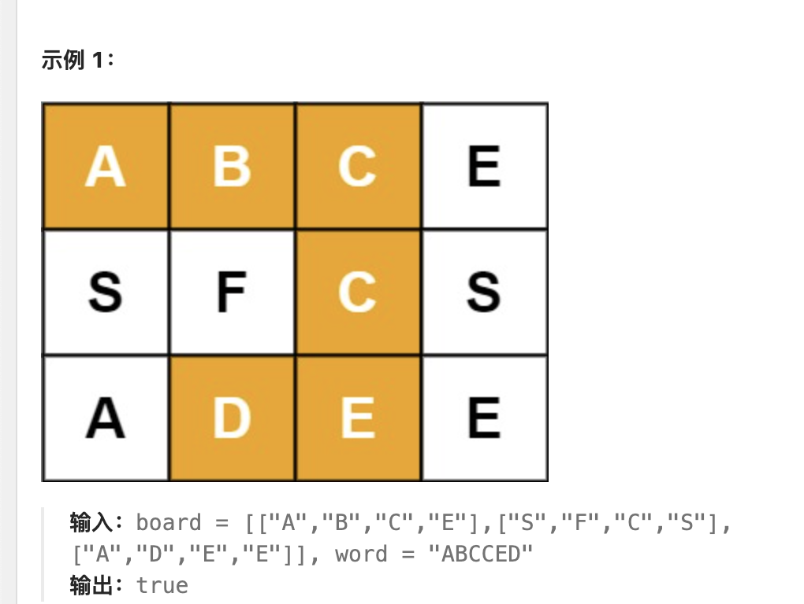

思路:

采用 DFS 算法暴力搜索，这题和岛屿问题有类似之处，可以对比看下。

注意我们要对已经匹配过的字符做标记，比如用一个额外的 `visited` 布尔数组，或者使用其他方法标记 `board` 中已经匹配过的字符。

如果不做标记的话会出现错误的结果，比如这个测试用例：

```java
[["A","B","C","E"],
 ["S","F","C","S"],
 ["A","D","E","E"]]
```

你如果在其中搜索 `"ABCB"`，按道理不应该搜到，但如果你不对已经匹配过的字符做标记的话，算法可能匹配了第一行前三列的 `"ABC"` 之后又回头匹配了第二列的 `"B"`，导致出现错误的结果。

代码如下：

```go
var found bool
func exist(board [][]byte, word string) bool {
		// 记录是否已经搜索到了
    found = false

    m ,n := len(board),len(board[0])
    for i := 0;i < m;i++ {
        for j := 0;j < n ;j++ {
          	// 从每一个字符board[i][j]开始，进行搜索
            dfs(board,i,j,m,n,word,0)
            if found {
                return true
            }
        }
    }
    return false
}

//  board从i，j位置开始，word从p位置开始，寻找匹配的字符，最后判断能否完成匹配
func dfs (board [][]byte,i,j,m,n int,word string ,p int ) {
  	
    if p == len(word) { // 说明整个p完成了搜索，找到了尾部
        found = true
        return
    }
  	// 如果已经有匹配的结果，就不用继续下去了（为了剪枝）
    if found {
        return
    }

    if i < 0 || i >= m || j < 0 || j >=n { // 说明越界
        return
    }

    if board[i][j] != word[p] { // 不相同，忽略
        return
    }


    // 执行到这里，说明p位置的字符和board[i][j]位置的字符相同
  	board[i][j] = board[i][j] ^ byte(0x80) // 这个的目的就是把byte的最高位设置为1，就变成了一个其他的字符(肯定不是大小写字母,等价于打上了特殊标记)
		
  	// 扩展到周边字符 和 p+1 字符 比较
    dfs(board,i+1,j,m,n,word,p+1)
    dfs(board,i-1,j,m,n,word,p+1)
    dfs(board,i,j+1,m,n,word,p+1)
    dfs(board,i,j-1,m,n,word,p+1)


    board[i][j] = board[i][j] ^ byte(0x80) // 撤销标记

}
```


## LCR 155. 将二叉搜索树转化为排序的双向链表

将一个 **二叉搜索树** 就地转化为一个 **已排序的双向循环链表** 。

对于双向循环列表，你可以将左右孩子指针作为双向循环链表的前驱和后继指针，第一个节点的前驱是最后一个节点，最后一个节点的后继是第一个节点。

特别地，我们希望可以 **就地** 完成转换操作。当转化完成以后，树中节点的左指针需要指向前驱，树中节点的右指针需要指向后继。还需要返回链表中最小元素的指针。

思路：

**树中节点的左指针`left`需要指向前驱，树中节点的右指针`right`需要指向后继**

- 二叉搜索树的中序遍历为 **递增序列** 
- **排序链表：** 节点应从小到大排序，因此应使用 **中序遍历** “从小到大”访问树的节点
- **双向链表**： 在构建相邻节点的引用关系时，设前驱节点 pre 和当前节点 cur ，不仅应构建 pre.right = cur ，也应构建 cur.left = pre 
- **循环链表：** 设链表头节点 `head` 和尾节点 `tail` ，则应构建 `head.left = tail` 和 `tail.right = head`

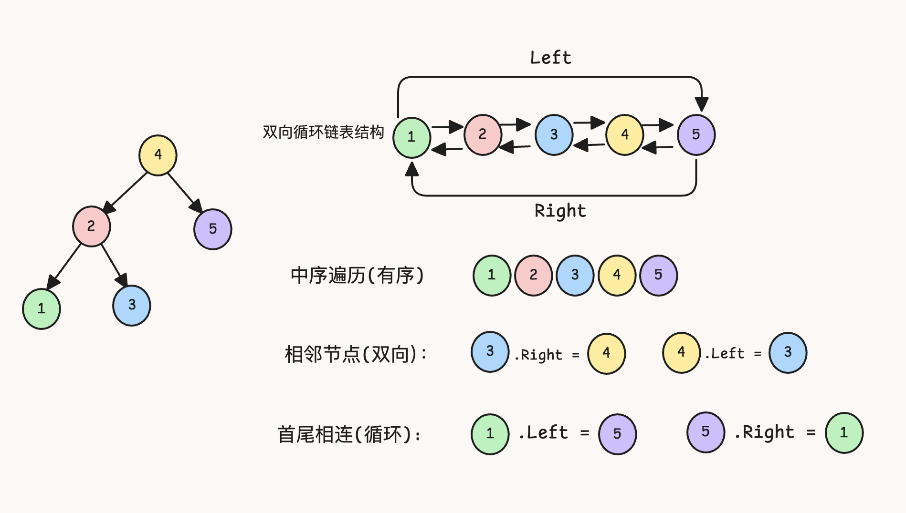

因为 `leetcode`没有`Go`的代码编辑器，这里提供`C++`的代码

```go
/*
// Definition for a Node.
class Node {
public:
    int val;
    Node* left;
    Node* right;

    Node() {}

    Node(int _val) {
        val = _val;
        left = NULL;
        right = NULL;
    }

    Node(int _val, Node* _left, Node* _right) {
        val = _val;
        left = _left;
        right = _right;
    }
};
*/
class Solution {
public:
    Node* pre = NULL;  // 前驱节点
    Node* head = NULL; // 头部节点
public:
    // right 用来往后面指 left用来往前面指
    Node* treeToDoublyList(Node* root) {

        if (root == NULL) {
            return head;
        }
			
        doublyList(root);
        // 首尾相连（循环）
        head->left = pre;
        pre->right = head;
				// 返回链表的头节点
        return head;
    }

  	// 中序遍历	
    void doublyList(Node* root) {
        
        if (root == NULL) {
            return;
        }
      
        doublyList(root->left);
        if (head == NULL) {
            head = root; // 记录下头部节点,作为链表的头节点
            pre = root;  // 记录下前驱节点
        } else {
          	// 相邻节点(双向)  root表示当前节点（等价于上图中的节点4）， pre是前一个节点（等价于上图中的节点3）
            root->left = pre;
            pre->right = root;
            pre = root;
        }
        doublyList(root->right);
    }
};
```


## LCR 125. 图书管理

读者来到图书馆排队借还书，图书管理员使用两个书车来完成整理借还书的任务。书车中的书从下往上叠加存放，图书管理员每次只能拿取书车顶部的书。排队的读者会有两种操作：

- `push(bookID)`：把借阅的书籍还到图书馆。
- `pop()`：从图书馆中借出书籍。

为了保持图书的顺序，图书管理员每次取出供读者借阅的书籍是 **最早** 归还到图书馆的书籍。你需要返回 **每次读者借出书的值** 。

如果没有归还的书可以取出，返回 `-1` 。

思路：

这题有些绕，其实就是让你用栈实现队列，与[232. 用栈实现队列](https://leetcode.cn/problems/implement-queue-using-stacks) 相同

```go
type CQueue struct {
    sk1 []int
    sk2 []int
}


func Constructor() CQueue {

    return CQueue {
        sk1 : make([]int,0), // sk1用来保存最新的数据（看作 队列的尾部）
        sk2 : make([]int,0), // sk2用来出栈数据（看作 队列的首部）
    }
    
}


func (this *CQueue) AppendTail(value int)  { // 插入尾部
    this.sk1 = append(this.sk1,value)
}


func (this *CQueue) DeleteHead() int { // 删除头部
  	// 如果栈为空，说明没有书
    if len(this.sk1) == 0 && len(this.sk2) == 0 {
        return -1
    }
		
  	// 如果sk2为空，将栈sk2的内容，放入到栈sk1中
    if len(this.sk2) == 0 { 
        for len(this.sk1) != 0 {
            tempval := this.sk1[len(this.sk1)-1]
            this.sk2 = append(this.sk2,tempval)
            this.sk1 = this.sk1[:len(this.sk1)-1]
        }
    }

    // 出栈sk2（
    val := this.sk2[len(this.sk2)-1]
    this.sk2 = this.sk2[:len(this.sk2)-1]

    return val
}
```


## 498. 对角线遍历

给你一个大小为 `m x n` 的矩阵 `mat` ，请以对角线遍历的顺序，用一个数组返回这个矩阵中的所有元素。

思路：

这题主要是观察矩阵

- 找出边界位置的【行、列】的变化关系
- 通过`(r+c)%2 == 0`知道当前是【从左下到右上，还是从右上到左下】
- 在具体的的左下右上的移动中，知道行列的变动特点，是+1，还是-1

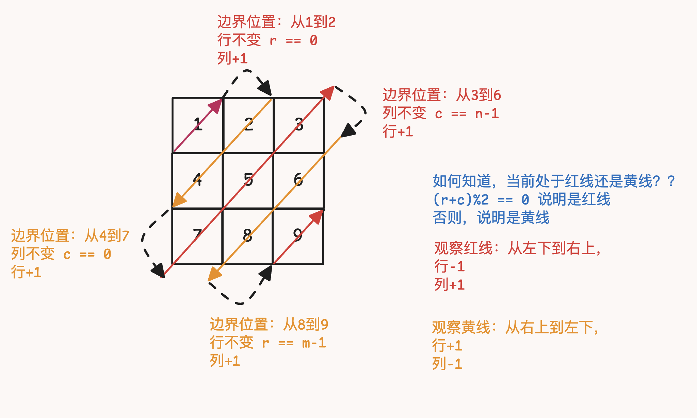

📢注意：上图中的第一个红线和第二个红线，其实都是`r==0`。但是第二个红线 `c==n-1`已经是最后一列了（如果还对列+1，那就越界了）。所以，在判断的时候，要优先以`c==n-1`作为判断条件，再以`r==0`作为判断条件。注意看代码体会这个。

```go
func findDiagonalOrder(mat [][]int) []int {
    
    m,n := len(mat),len(mat[0])
    result := make([]int,m*n)

    r,c := 0,0 // r是行 c是列

    for i := 0;i < m*n;i++ {

        result[i] = mat[r][c]

        if (r+c) %2 == 0 { // 说明从左下到右上
             // 【注意这里的顺序】
            if c == n-1 { // 边界位置：列不变，行+1
                r++
            } else if r == 0 { // 边界位置:行不变，列+1
                c++
            } else {
                r--
                c++
            }
        } else { // 说明从右上到左下
            // 【注意这里的顺序】
            if r == m-1 { // 边界位置：行不变，列+1
                c++
            } else if c == 0 {// 边界位置：列不变，行+1
                r++
            }   else {
                r++
                c--
            }
        }
    }
    return result
}
```


## 958. 二叉树的完全性检验

给你一棵二叉树的根节点 `root` ，请你判断这棵树是否是一棵 **完全二叉树** 。

在一棵 **[完全二叉树](https://baike.baidu.com/item/完全二叉树/7773232?fr=aladdin)** 中，除了最后一层外，所有层都被完全填满，并且最后一层中的所有节点都尽可能靠左。最后一层（第 `h` 层）中可以包含 `1` 到 `2h` 个节点。

思路：

层序遍历：当遇到`nil`节点，后续不能再出现`【非nil】`节点，才能满足完全二叉树.

```go
/**
 * Definition for a binary tree node.
 * type TreeNode struct {
 *     Val int
 *     Left *TreeNode
 *     Right *TreeNode
 * }
 */
func isCompleteTree(root *TreeNode) bool {
    
    if root == nil {
        return true
    }

    nodes := []*TreeNode{}
    nodes = append(nodes,root)//加入第一个节点
    end := false
    for len(nodes) != 0 {
        size := len(nodes)
        //层序遍历
        for i := 0;i < size;i++ {
            if nodes[i] == nil {
                end = true //遇到第一个nil时候，end就为true，说明后续就不应该出现【非nil】节点
            } else { //遇到非nil节点
                if end {
                    return false
                }
                //不判断是否为nil，直接加入
                nodes = append(nodes,nodes[i].Left)
                nodes = append(nodes,nodes[i].Right)
            }
        }
        nodes = nodes[size:]//踢出已经遍历过的节点
    }
    return true
}
```


## 55. 跳跃游戏

给你一个非负整数数组 `nums` ，你最初位于数组的 **第一个下标** 。数组中的每个元素代表你在该位置可以跳跃的最大长度。

判断你是否能够到达最后一个下标，如果可以，返回 `true` ；否则，返回 `false` 。

思路：

从尾部开始倒序遍历；要想到达尾部，看下前面的某个节点能否达到尾部；比如某个节点`x`可以到达尾部；那就继续看`x`之前的某个节点能否到达`x`，间接的等价于可以到达尾部；

```go
func canJump(nums []int) bool {
  
    targetIdx := len(nums)-1 //期望到达的位置
  
  	// i 从倒数第二个索引 targetIdx-1开始
    for i := targetIdx-1;i >= 0;i-- {
      
        if nums[i] +i >= targetIdx { // 从位置i能到达 targetIdx 位置
            // 那么期望到达的新位置为i，只要前面的其他的节点到达i, 等价于间接的可以到达尾部
            targetIdx = i 
        }
    }
    return targetIdx == 0 // 期望到达的位置为0的时候，而此时我们要从0的位置出发，所以就可以表明我们能到达尾部；
}
```


## 补充题23：检测循环依赖

直接看这篇文章即可  https://mp.weixin.qq.com/s/pCRscwKqQdYYN7M1Sia7xA  文章采用`BFS`的方式来寻找依赖关系，也就是拓扑排序。

如果有印象的话，这题其实和 **207. 课程表**是类似的题目，不过采用的是`DFS`的写法。**210. 课程表 II**建议也看下，你会发现和**207. 课程表**答案几乎一样。


## LCR 170. 交易逆序对的总数

在股票交易中，如果前一天的股价高于后一天的股价，则可以认为存在一个「交易逆序对」。请设计一个程序，输入一段时间内的股票交易记录 `record`，返回其中存在的「交易逆序对」总数。

**示例 1：**

```
输入：record = [9, 7, 5, 4, 6]
输出：8
解释：交易中的逆序对为 (9, 7), (9, 5), (9, 4), (9, 6), (7, 5), (7, 4), (7, 6), (5, 4)。
```

思路：

本题是**归并排序**的应用。

归并排序套路：


- 将数组不断的拆分成两两子数组（并进行排序），最后再不断的两两合并有序子数组，变成一个更大的有序子数组

逆序对的记录，就是在合并的过程中，对有序数组，多一个比较的过程。

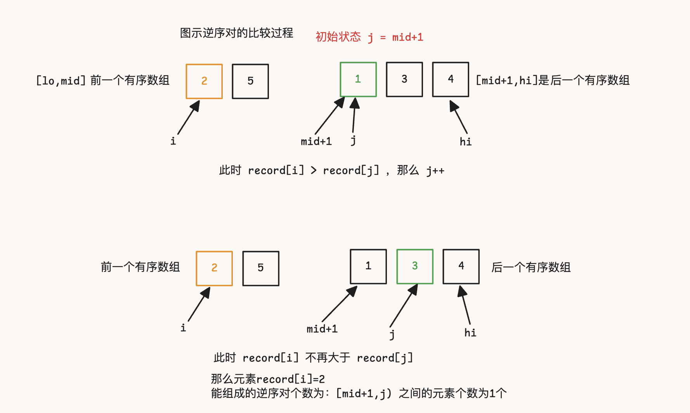

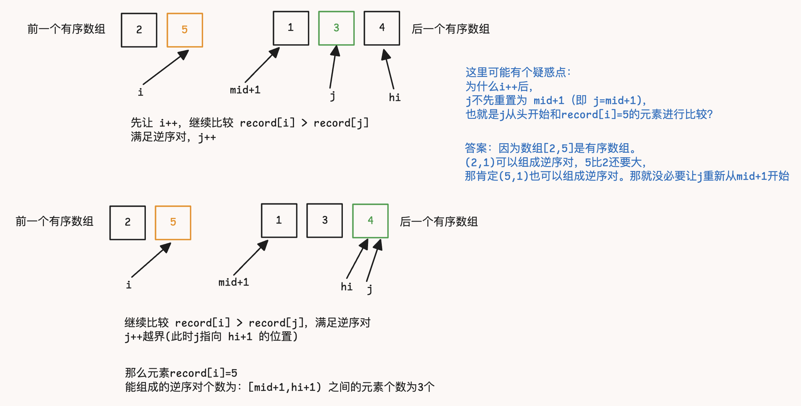

具体看下面代码

```go

var temp []int
var count int
func reversePairs(record []int) int {
    count = 0

    n := len(record)
    if n == 0 { // 空数组，不用排序
        return count
    }
    // 归并排序
    temp = make([]int,len(record))
    sort(record,0,len(record)-1)
    return count
}

// sort函数定义： 对数组record [lo,hi]范围内的元素进行排序（升序）
func sort(record []int, lo,hi int) { 
    if lo == hi { // 说明只有一个元素
        return
    }
    // 拆分成两个子数组
    mid := lo + (hi-lo)/2
    sort(record,lo,mid) //对前半部分进行排序
    sort(record,mid+1,hi)// 对后半部分进行排序
    merge(record,lo,mid,hi) // 合并两个有序数组

}

func merge(record []int, lo ,mid ,hi int) {
    // lo 指向前半部分的有序数组，首部
    // mid+1 指向后半部分的有序数组，首部

    //1.先将有序数组record，放到temp中保存（复制一份），此时的record和temp是完全一样的；
    for i := lo;i <= hi;i++ {
        temp[i] = record[i]
    }


   	
    // 这里就是计算逆序对的代码逻辑
  
    j := mid+1 //表示后面的子数组指针
    for i := lo;i <= mid;i++ { // i表示前面的子数组指针
        for j <= hi && record[i] > record[j] { // 说明 【前面的元素 > 后面的元素】，是一个【逆序对】
            j++
        }
      	// 执行到这里，说明[mid+1,j) 之间的元素，和record[i]位置的元素，都可以构成逆序对
        count += j - (mid+1) // 逆序对的个数
    }


    //2.然后合并两个有序数组temp，将结果保存到record中

    left := lo // temp中的左边子数组
    right := mid+1 // temp中的右边子数组

    for p := lo;p <= hi;p++ { //这里的p表示record的位置

        if left == mid+1 { // 说明temp左边的子数组已经遍历完了
            record[p] = temp[right] // 剩下temp右边的，放入进去
            right++
        } else if right == hi+1 { // 说明temp右边的子数组已经遍历完了
            record[p] = temp[left]/// 剩下temp左边的，放入进去
            left++
        } else if temp[left] > temp[right] {
            record[p] = temp[right] // 放小的进去
            right++
        } else {
            record[p] = temp[left] // 放小的进去
            left++
        }
    }

}
```


## 7. 整数反转

给你一个 32 位的有符号整数 `x` ，返回将 `x` 中的数字部分反转后的结果。

如果反转后整数超过 32 位的有符号整数的范围 `[−231, 231 − 1]` ，就返回 0。

**假设环境不允许存储 64 位整数（有符号或无符号）。**

**示例 1：**

```
输入：x = 123
输出：321
```

**示例 2：**

```
输入：x = -123
输出：-321
```

 思路：

这题其实就是考察**取余**

```go
func reverse(x int) int {
    res := 0
    for x != 0 {
        res = res * 10 + x % 10 // x % 10求余 
        x = x / 10
    }
		// 题目要求
    if res >= math.MaxInt32 || res <= math.MinInt32 {
        return 0
    }
    return res
}
```


## 40. 组合总和II

给定一个候选人编号的集合 `candidates` 和一个目标数 `target` ，找出 `candidates` 中所有可以使数字和为 `target` 的组合。

`candidates` 中的每个数字在每个组合中只能使用 **一次** 。

**注意：**解集不能包含重复的组合。 

思路：

建议和**39. 组合总和**对比学习下。

本题解题的关键点在于下面几个条件的限制：

- 元素存在重复

- 组合不能有重复的结果
- 每个数字在每个组合中只能使用一次

```go
var result [][]int

func combinationSum2(candidates []int, target int) [][]int {
	// 回溯算法
	result = [][]int{}
	// 1.排序 ，非常重要一点，必须整个数组是有序的（因为包含重复的数字，为了判断）
	sort.Ints(candidates)
	// 2.回溯
	path := []int{}
	backtrack(0, candidates, path, 0, target)
	return result
}

// start保证每次选择元素的起始范围，不用每次都是从start==0开始，因为要找的是组合，而不是排列
func backtrack(start int, candidates, path []int, sum int, target int) {

	if sum >= target { // 这里的  1 <= candidates[i] <= 50 都是正数，所以 sum > target 就可以退出了
		if sum == target {
			// 一个组合结果
			t := make([]int, len(path))
			copy(t, path)
			result = append(result, t)
		}
		return
	}

	for i := start; i < len(candidates); i++ {
		// 【本次循环】重复的数字不再选择（保证解集不包含重复的组合）
    // 例如  1 1 2 求target = 3,第一个1使用过了，第二个1就不用再使用了。
		if i-1 >= start && candidates[i-1] == candidates[i] {
			continue
		}
        
		path = append(path, candidates[i])
    sum += candidates[i]
    // 下一个元素为 i+1，保证每个元素在一个组合中只能使用一次
		backtrack( i+1, candidates, path, sum, target)
		path = path[:len(path)-1]
    sum -= candidates[i]
	}
}
```


## 16. 最接近的三数之和

给你一个长度为 `n` 的整数数组 `nums` 和 一个目标值 `target`。请你从 `nums` 中选出三个整数，使它们的和与 `target` 最接近。

返回这三个数的和。

假定每组输入只存在恰好一个解。

思路：

- 先排序（排序的目的是为了使用二分搜索，因为二分搜索需要数据是有序的）
- 固定第一个数`nums[i]`，再去 `nums[i+1..]` 中寻找另外两个数字，使三数之和无限接近`target`

解释下代码片段的含义

```go
 // 这里只是为了减枝（避免多次计算）
if i-1 >= 0 && nums[i-1] == nums[i] { // 表示当前数字 nums[i]和前一个数字nums[i-1]相同，直接跳过
  	continue
}
```

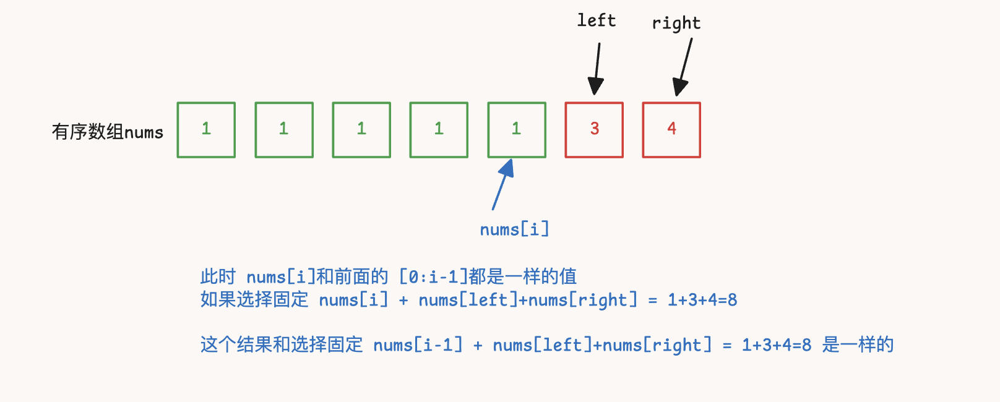

```go
for left < right && nums[left] == leftValue { // 重复的数值，直接跳过
  	left++ // left++ 目的让 sum变大一些
}
```

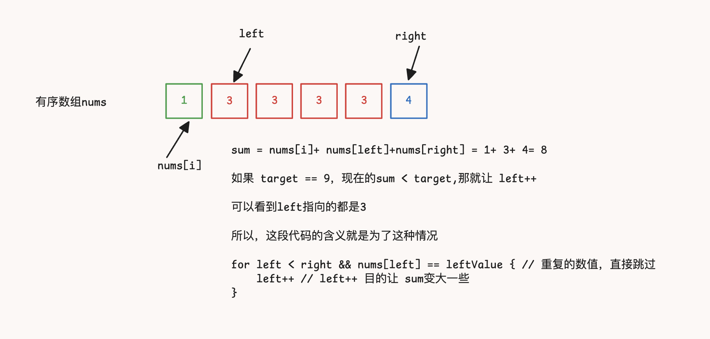

这题的答案和之前的求**15. 三数之和**的部分代码是雷同的（不记得可以去复习下）

```go
func threeSumClosest(nums []int, target int) int {

    sort.Ints(nums)// 正向排序

    result := math.MaxInt
   
    for i := 0;i < len(nums);i++ {

        // 这里只是为了减枝（避免多次计算）
      	if i-1 >= 0 && nums[i-1] == nums[i] { // 表示当前数字 nums[i]和前一个数字nums[i-1]相同，直接跳过
            continue
        }
      // 固定数字nums[i], 在 [i+1:len(nums)-1] 范围找另外两个数字
        left ,right := i+1, len(nums)-1 
        for left < right {
            
            leftValue := nums[left]
            rightValue := nums[right]
            sum := nums[i] + leftValue + rightValue

            // 说明sum更接近于target，记录下来
            if abs(sum - target) < abs(result- target) {
                result = sum
            }

            if sum < target { 

                for left < right && nums[left] == leftValue { // 重复的数值，直接跳过
                    left++ // left++ 目的让 sum变大一些
                }
                
            } else { 
                for left < right && nums[right] == rightValue { // 重复的数值，直接跳过
                    right-- // right-- 目的让sum变小一些
                }
            }
        }
    }
    return result
}

func abs(a int) int {
    if a < 0 {
        return -a
    }
    return a
}
```


## 61. 旋转链表

给你一个链表的头节点 `head` ，旋转链表，将链表每个节点向右移动 `k` 个位置。

```go
/**
 * Definition for singly-linked list.
 * type ListNode struct {
 *     Val int
 *     Next *ListNode
 * }
 */
func rotateRight(head *ListNode, k int) *ListNode {
    // 初始：空/只有一个/移动0位
    if head == nil || head.Next == nil || k == 0{
        return head
    }

    //1.链表长度 && p 指向链表尾部
    count := 1
    p := head
    for p.Next != nil {
        count++
        p = p.Next
    }

    k = k % count
    if k == 0 { // k是count的整数倍，等价于不移动
        return head
    }

    // 2.首位串成环
    p.Next = head

    // 3. 找到，需要断开的节点
    count = count - k
    for count > 0 {
        p = p.Next
        count--
    }
    // 此时p是结果的 尾部节点
		// p.Next才是新链表的头节点
    result := p.Next // 链表头节点
    p.Next = nil // 断开

    return result
}
```


## 123.买卖股票的最佳时机 III

给定一个数组，它的第 `i` 个元素是一支给定的股票在第 `i` 天的价格。设计一个算法来计算你所能获取的最大利润。你最多可以完成 **两笔** 交易。

**注意：**你不能同时参与多笔交易（你必须在再次购买前出售掉之前的股票）。

思路：

上面已经写了**买卖股票的 121  122 题**，关键点在与理解动态规划中`dp`数组的定义。

`dp[i][k][0 or 1]` 的含义就是：`i`表示 在从 `0`到 `i`天，完成了`k`笔交易，此时不持有`0` or 持有 `1`股票，能获取的最大利润为`dp[i][k][0 or 1]`

一定要理解 `i`不是指的仅仅第`i`天，而是时间段从`0`到`i`

`k`表示在这个时间内已经完成了`k`笔交易（如果题目没有对交易次数进行限定，可以不要这个）

`0 和 1`的含义：此时手中的股票是持有还是不持有（意思就是，我买了股票我可以一直拿着不卖，也可以卖掉），到了第`i`天此时股票是拿着还是已经卖了。

注意题目中有个**注意事项**：你不能同时参与多笔交易，也就是你如果现在持有股票，此时如果还想买，就需要先卖掉之前的股票保证是空仓的状态，才能去买其他的（当然，你可以一直空仓，不去进行任何交易）

接下来请理解下面的状态转移方程（其实很简单，用日常的思维去理解）

```go
状态转移方程：
// 不持有股票
// dp[i][k][0] 从 0..i天,完成k笔交易，0表示此时手中没有股票
dp[i][k][0] = max(dp[i-1][k][0],dp[i-1][k][1] + prices[i]) 
// 要达成  dp[i][k][0] 这个状态，其实有两种情况
// 第一种： 从 0...i-1天，完成了k笔交易，并且此时手中也没有股票，到了第i天，我继续保持不交易的不就是 dp[i][k][0]
// 第二种： 从 0...i-1天，完成了k笔交易，并且此时手中持有股票，到了第i天，我要想不持有股票，怎么办？那就在第i天卖掉呀。。既然是卖掉，那利润就要加上 prices[i]的价格即可。


// 持有股票
// dp[i][k][1] 从 0..i天,完成k笔交易，1表示此时手中持有股票
dp[i][k][1] = max(dp[i-1][k][1], dp[i-1][k-1][0] - prices[i] ) 
// 要达成  dp[i][k][1] 这个状态，其实有两种情况
// 第一种： 从 0...i-1天，完成了k笔交易，并且此时手中持有股票，到了第i天（因为题目中说了不能同时参与多笔交易），所以继续保持持有状态（不可能卖，卖了就不是持有状态了，你也可能说，我当天卖当天买，那不就等于不买不卖吗，是吧。）
// 第二种：从 0...i-1天，完成了 k-1 笔交易，此时手中没有持有股票，到了第i天，买入股票，那么第i天不就可以持有股票了，此时的交易次数 从 k-1 变成了 k 次（买入算一次交易次数，卖出就不用再算交易次数了），既然是买入，利润减去 prices[i]的价格即可
 
```

最终的实现代码如下：

```go
func maxProfit(prices []int) int {
  
    n := len(prices)
  	// 定义 dp数组
    dp := make([][][]int,n) //n天

    for k,_ := range dp {
        dp[k] = make([][]int,3) // 2次交易 0 1 2

        for k1,_:= range dp[k] {
            dp[k][k1] = make([]int,2) // 持有or不持有
        }
    }

   

    for i := 0;i < n;i++ {
      	// k == 0 表示完成0次交易，也就是不会进行交易肯定都是0了，不需赋值了
        for k := 1;k <= 2;k++ {
            if i == 0 {
                dp[0][k][0] = 0 // 不持有
                dp[0][k][1] = -prices[0] // 持有
                continue
            }
            dp[i][k][0] = max(dp[i-1][k][0],dp[i-1][k][1] + prices[i])
            dp[i][k][1] = max(dp[i-1][k][1], dp[i-1][k-1][0] - prices[i] )
        }
    }
		
  	// 要想利润最大，那肯定是完成多次交易，并且手中不持有股票
    return dp[n-1][2][0] // 在第n-1天，完成2笔交易，并且不持有股票的最大利用
}

func max(a,b int) int {
    if a > b{
        return a
    }
    return b
}
```


## 238. 奇偶链表

给定单链表的头节点 `head` ，将所有索引为奇数的节点和索引为偶数的节点分别组合在一起，然后返回重新排序的列表。

**第一个**节点的索引被认为是 **奇数** ， **第二个**节点的索引为 **偶数** ，以此类推。请注意，偶数组和奇数组内部的相对顺序应该与输入时保持一致。

你必须在 `O(1)` 的额外空间复杂度和 `O(n)` 的时间复杂度下解决这个问题。

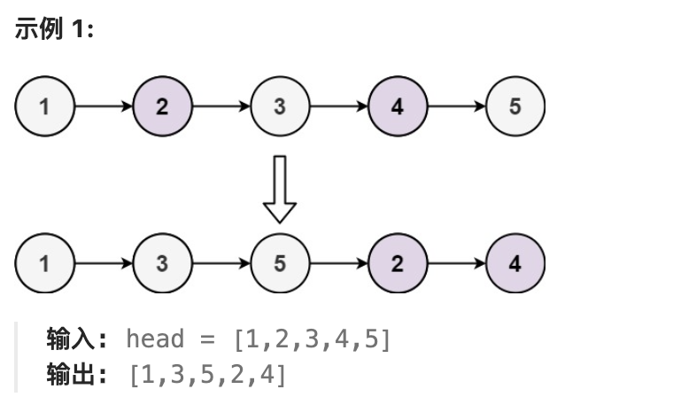

思路：

将原始链表拆分成两个子链表，然后拼接到一起即可。

这里利用 `fast`一次跳跃两个节点：

- `fast`指向的就是奇数索引节点
- `fast.Next`指向的就是偶数索引节点

特殊情况，当`fast`指向尾部最后一个节点时候，`fast.Next`为`nil`,所以需要将这个`fast`指向的节点额外处理，作为奇数索引节点，拼接到`p1.Next`

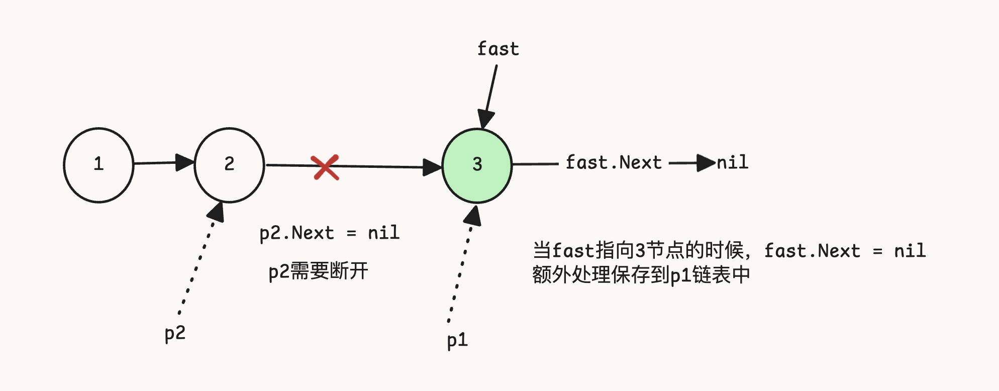

```go
/**
 * Definition for singly-linked list.
 * type ListNode struct {
 *     Val int
 *     Next *ListNode
 * }
 */
func oddEvenList(head *ListNode) *ListNode {

    p1 := &ListNode{} // 定义头节点，记录奇数节点
    recordP1 := p1

    p2 := &ListNode{} // 定义头节点，记录偶数节点
    recordP2 := p2

    fast := head

    // fast 节点 + fast.Next 都存在的情况下，进行奇偶拼接
    for fast != nil && fast.Next != nil {

        p1.Next = fast // 奇数索引拼接到 p1
        p1 = p1.Next

        p2.Next = fast.Next // 偶数索引拼接到 p2
        p2 = p2.Next

        // 每次跳跃两个节点
        fast = fast.Next.Next
    }

    // 特殊情况，只剩下一个节点的时候（也就是没有 fast.Next,上面的逻辑是不会执行的）
    if fast != nil { // 也可能 fast == nil ，所以不用执行拼接
        p1.Next = fast
        p1 = p1.Next
    }
    // p2需要断开尾部
    p2.Next = nil
    
    p1.Next = recordP2.Next // p1的尾部 拼接上 p2的头部
    return recordP1.Next // 返回p1的头部
}
```

这里再扩展一个变形题：字节跳动常考

给定一个奇数位升序，偶数位降序的链表，将其重新排序。

```
输入: 1->8->3->6->5->4->7->2->NULL
输出: 1->2->3->4->5->6->7->8->NULL
```

题目意思就是偶数索引位置的是降序的，奇数位置是升序的；需要将整个链表排序为升序

解法：

```
1. 按奇偶位置拆分链表，得1->3->5->7->NULL和8->6->4->2->NULL
2. 反转偶链表，得1->3->5->7->NULL和2->4->6->8->NULL
3. 合并两个有序链表，得1->2->3->4->5->6->7->8->NULL
```

按照上面的方法，我们已经可以得到升序的奇数链表和 降序的偶数链表；只需要将偶数链表反转，然后合并两个有序链表为一个升序链表。

链表反转上面已经做过类似的题目，合并两个升序链表也做过，大家可以用来练下手，试试。


## 518. 零钱兑换II

给你一个整数数组 `coins` 表示不同面额的硬币，另给一个整数 `amount` 表示总金额。请你计算并返回可以凑成总金额的硬币组合数。如果任何硬币组合都无法凑出总金额，返回 `0` 。假设每一种面额的硬币有无限个。 题目数据保证结果符合 32 位带符号整数。

思路：

我们可以把这个问题转化为背包问题的描述形式：

有一个背包，最大容量为 `amount`，有一系列物品 `coins`，每个物品的重量为 `coins[i]`，**每个物品的数量无限**。请问有多少种方法，能够把背包恰好装满？

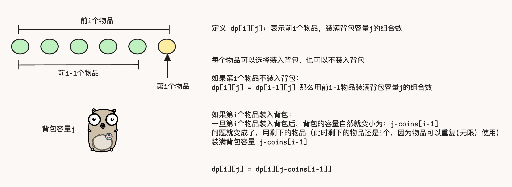

注意：`i`表示物品的个数，如果要取到该物品，需要`i-1`得到索引


```go
func change(amount int, coins []int) int {
	
		// 定义 dp 数组
    n := len(coins) // n个物品
    dp := make([][]int,n+1)
    for i := 0;i < n+1;i++ {
        dp[i] = make([]int,amount+1) // 背包容量 amount
    }

    // base case
    // 背包容量为0，也就是不需要选择物品，即可完成填充
    for i := 0;i <= n;i++ {
        dp[i][0] = 1 // i个物品，背包容量为0（也就是全都不选择物品，即可完成填充），默认都是1种组合
    }
    // 物品个数为0，肯定就是0，所以不用额外初始化，所以i从1开始
    for i := 1;i <= n;i++ {
        for j := 1;j <= amount;j++ {
						// 看第i个物品，能否装入背包（注意：第i个物品，对应 coins中的i-1的索引）
            if j - coins[i-1] >= 0 { // 说明物品可以装入背包（可以选择装入 or 不装入） 两种组合求和
                dp[i][j] = dp[i-1][j] + dp[i][j-coins[i-1]]
            } else { // 说明物品太大，无法装入（即，选择不装入）
                dp[i][j] = dp[i-1][j]
            }
        }
    }
  
    // n个物品，装满背包amount的组合
    return dp[n][amount]
}
```


## 26. 删除有序数组中的重复项

给你一个 **非严格递增排列** 的数组 `nums` ，请你**[ 原地](http://baike.baidu.com/item/原地算法)** 删除重复出现的元素，使每个元素 **只出现一次** ，返回删除后数组的新长度。元素的 **相对顺序** 应该保持 **一致** 。然后返回 `nums` 中唯一元素的个数。

考虑 `nums` 的唯一元素的数量为 `k` ，你需要做以下事情确保你的题解可以被通过：

- 更改数组 `nums` ，使 `nums` 的前 `k` 个元素包含唯一元素，并按照它们最初在 `nums` 中出现的顺序排列。`nums` 的其余元素与 `nums` 的大小不重要。
- 返回 `k` 。

思路：

有序数组中删除重复出现的元素，利用快慢指针的技巧。

我们让慢指针 `slow` 走在后面，快指针 `fast` 走在前面探路，找到一个不重复的元素就告诉 `slow` 并让 `slow` 前进一步。这样当 `fast` 指针遍历完整个数组 `nums` 后，**`nums[0..slow]` 就是不重复元素**。

```go
func removeDuplicates(nums []int) int {
  	
  	//注意理解：slow指向的元素是最终结果的尾部元素，fast 用来遍历整个数组
    slow,fast := 0,0

    for fast < len(nums) {
        if nums[fast] != nums[slow] { // 当slow 和 fast指向的元素不相同
            slow++ // slow先前进一步
            nums[slow] = nums[fast] // 然后在slow位置处，保存下来最新不重复元素
        }
        fast++ // fast一直不断的移动
    }
    // [0,slow]指向的就是最终的结果

    return slow+1
}
```


## 75. 颜色分类

给定一个包含红色、白色和蓝色、共 `n` 个元素的数组 `nums` ，**[原地](https://baike.baidu.com/item/原地算法)** 对它们进行排序，使得相同颜色的元素相邻，并按照红色、白色、蓝色顺序排列。

我们使用整数 `0`、 `1` 和 `2` 分别表示红色、白色和蓝色。

必须在不使用库内置的 sort 函数的情况下解决这个问题。

- 你能想出一个仅使用常数空间的一趟扫描算法吗？

思路：

这题是上面一题快慢指针技巧的进阶。`slow`用来维护最终的结果，`fast`用来遍历整个数组，最后整个数组分成了两个部分，一部分是最终结果，另外一部分是其他数据。（这样只能分成两个部分）

本题，需要将数组分割成3个部分。可以考虑，在数组的左右都维护一个 `slow`指针，用来记录结果。依然用`fast`指针来遍历整个数组。这样，就可以将整个数组分割成3个部分。

本题可以当做一个结论记住即可，这种排序方法也叫三色排序算法。

- `fast`遇到 0 ，和左边交换
- `fast`遇到 1，不交换
- `fast`遇到 2，和右边交换 

```go
func sortColors(nums []int)  {
    // 三色排序；这题我个人觉得解法还是挺实用的
    // 用三个指针，分别指向，头/尾/中

    leftSlow,fast,rightSlow := 0,0,len(nums)-1
    for fast <= rightSlow { // fast 和 rightSlow相遇
      
        if nums[fast] == 0 { // 将0和左边交换
          	
            nums[leftSlow],nums[fast] = nums[fast],nums[leftSlow]
            fast++
            leftSlow++ // 此时 leftSlow指向下一个待保存位置
          
        } else if nums[fast] == 1 { // 1 继续遍历
            fast++
        } else if nums[fast] ==2 { //将2和右边交换
            nums[fast],nums[rightSlow] = nums[rightSlow],nums[fast]
            //index++ 这里注意（一个坑）：2和 rightSlow 位置的元素交换以后，index位置的元素可能是0或1也可能是2 ，从上面知道1  fast++,如果是0，还要和leftSlow 交换，如果是2，那就需要继续和 rightSlow交换
            rightSlow-- // 此时 rightSlow指向下一个待保存位置
        }
    }
}
```

看完算法，估计很多的疑问，我觉得可以对照下图再思考下

本图针对 `nums[fast] ==2`进行解释

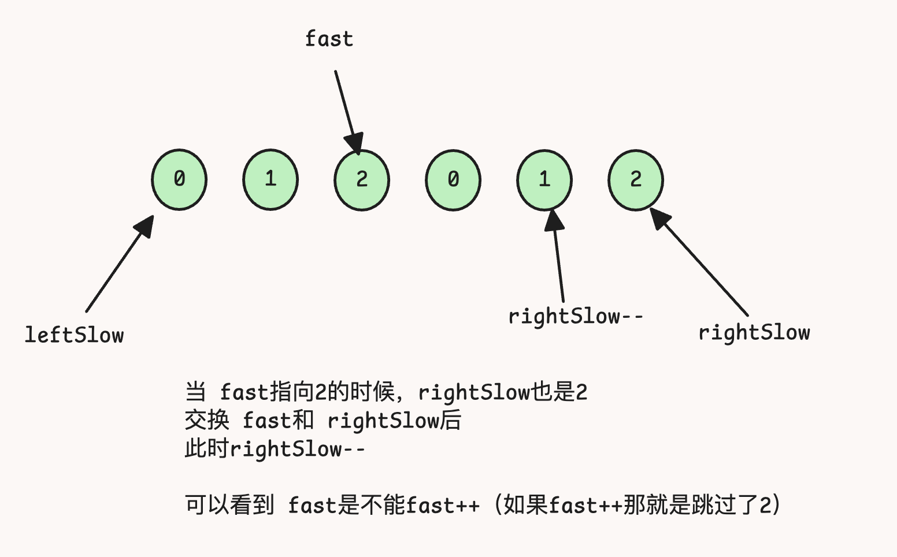

本图针对 `nums[fast] == 0 `

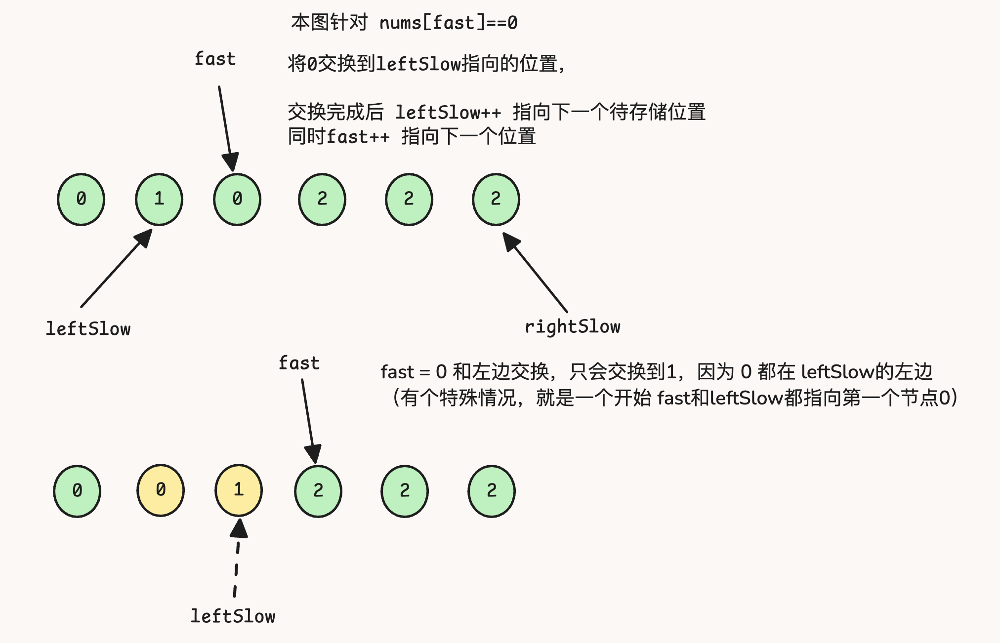


## LCR 159. 库存管理 III

仓库管理员以数组 `stock` 形式记录商品库存表，其中 `stock[i]` 表示对应商品库存余量。请返回库存余量最少的 `cnt` 个商品余量，返回 **顺序不限**。

**示例 1：**

```
输入：stock = [2,5,7,4], cnt = 1
输出：[2]
```

**示例 2：**

```
输入：stock = [0,2,3,6], cnt = 2
输出：[0,2] 或 [2,0]
```

思路：

本题就是求，在无序的数组中，如何查找最小的两个数字

利用大根堆，堆大小限定为2，当堆容量超过2的时候，弹出堆顶的最大元素，剩下的就是较小的两个元素。当所有的元素遍历一遍，并且都经过大根堆的过滤后，此时大根堆中剩余的两个元素，就是要找的元素。

```go
func inventoryManagement(stock []int, cnt int) []int {
	// 本质就是找，在有序数组中，获取最小的cnt个数值

    maxHeap := &MaxHeap{}

    heap.Init(maxHeap)
    for i := 0;i < len(stock);i++ { // 遍历所有元素

        heap.Push(maxHeap,stock[i]) // 保存到大根堆中
       	
      	// 保证堆中数据为cnt个
       if maxHeap.Len() > cnt { // 超出cnt个，就弹出
            heap.Pop(maxHeap)
       }
    }

    return maxHeap.data // 最后剩下的就是结果（最小的）
}

// 维护大根堆，最后剩下的就是最小的cnt个数

type MaxHeap struct {
    data []int
}

func (t *MaxHeap)Len() int {
    return len(t.data)
}

func (t *MaxHeap)Swap(i,j int) {
    t.data[i],t.data[j] = t.data[j],t.data[i]
}

func (t *MaxHeap)Less(i,j int) bool {
    return t.data[i] > t.data[j]
}

func (t *MaxHeap)Push(x any) {
    t.data = append(t.data,x.(int))
}

func (t *MaxHeap)Pop() any {
    x := t.data[len(t.data)-1]
    t.data = t.data[:len(t.data)-1]
    return x
}
```


## 59. 螺旋矩阵 II

给你一个正整数 `n` ，生成一个包含 `1` 到 `n^2` 所有元素，且元素按顺时针顺序螺旋排列的 `n x n` 正方形矩阵 `matrix` 。

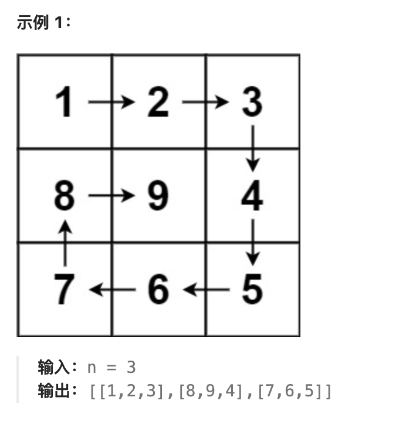


思路：

本题和 **54.螺旋矩阵**相似。

- 先构建二维数组
- 转圈的方式将数据保存到二维数组中

```go
func generateMatrix(n int) [][]int {


    // 构建 n*n 矩阵
    matrix := make([][]int,n)
    for k := range matrix {
        matrix[k] = make([]int,n)
    }

    left,right := 0,n-1
    top,end := 0,n-1

    val := 1
		
  	// 填入 n*n 个数值
    for val <= n*n {

        if top <= end { // 保证 top 和end不越界
          
            for i:= left;i <=right;i++ { //在上面top 从左到右
                matrix[top][i] = val
                val++
            }
        }
        top++

        if left <=right { // 保证 left 和 right 不越界
            for i := top;i <= end;i++ { //在右边right 从上到下
                matrix[i][right] = val
                val++
            }
        }
        right--


        if top <= end {  // 保证 top 和end不越界
            for i := right; i>=left;i-- { // 在底部end，从右到左
                matrix[end][i] = val
                val++
            }
        }
        end--

        if left <= right { // 保证 left 和 right 不越界
            for i := end;i>= top;i-- { // 在左边 left，从下到上
                matrix[i][left]= val
                val++
            }
        }
        left++
    }
		// 返回二维数组
    return matrix
}
```


## 145. 二叉树的后序遍历

给你一棵二叉树的根节点 `root` ，返回其节点值的 **后序遍历** 。

思路：

尽可能地将左子节点压入栈，直到最左边。然后处理栈顶元素，如果有右子节点且未被处理过，就转向处理右子节点。否则，处理当前节点，并记录pre，防止重复处理。

这样通过栈来模拟递归的过程，同时利用pre变量来标记已经处理过的右子树，避免重复入栈。整个过程能够正确地按照后序遍历的顺序访问所有节点。

那pre的作用是什么呢？比如在处理完某个节点的右子树后，当再次回到该节点时，可以通过pre判断右子树是否已经处理过。比如在例子中的节点2，第一次处理时发现右子节点5未被处理，所以压回栈，然后处理5。当再次处理2时，pre是5，也就是右子节点已经被处理过了，这时候就可以处理节点2自己了。

代码执行示例

```go
树结构：

     1
    / \
   2   3
  / \
 4   5

初始状态:
stack = []
root = 1, pre = nil

步骤1: 1,2,4 入栈
stack = [1->2->4]
root = nil

步骤2: 弹出4 (无右子节点)
result = [4]
pre = 4
stack = [1->2]

步骤3: 弹出2 (发现右子节点5未访问)
stack重新压入2，转向5
stack = [1->2]
root = 5

步骤4: 5入栈后弹出
result = [4,5]
pre = 5
stack = [1->2]

步骤5: 再次弹出2 (右子节点已访问)
result = [4,5,2]
pre = 2
stack = [1]

...（后续步骤类似）
```


```go
/**
 * Definition for a binary tree node.
 * type TreeNode struct {
 *     Val int
 *     Left *TreeNode
 *     Right *TreeNode
 * }
 */
func postorderTraversal(root *TreeNode) []int {
    result := []int{}
    stack := []*TreeNode{}
		
  	// 目的在于避免右节点重复入栈
    var pre *TreeNode = nil
  
    for len(stack) > 0 || root != nil {
        // 入栈
        for root != nil {
            stack = append(stack,root)
            root = root.Left
        }
      
        // 出栈
        root = stack[len(stack)-1] //栈尾
        stack = stack[:len(stack)-1]
      
        if root.Right == nil || root.Right == pre { //如果发现没有右边节点、或，右边节点重复前一个节点
            //保存结果
            result = append(result,root.Val)
            pre = root // 记录前一个节点
            root = nil // （注意这里：root = nil）再出栈一个新元素
        }else {
            stack = append(stack,root) //入栈
            root = root.Right
        }
    }
    return result
}
```


思路二：

通过递归的方式，这种最简单

```go
/**
 * Definition for a binary tree node.
 * type TreeNode struct {
 *     Val int
 *     Left *TreeNode
 *     Right *TreeNode
 * }
 */

var result []int
func postorderTraversal(root *TreeNode) []int {
    result = []int{}
    traversal(root)
    return result
}

func traversal(root *TreeNode) {

    if root == nil {
        return
    }

    traversal(root.Left)
    traversal(root.Right)
    result = append(result,root.Val)
}
```


## 50. Pow(x,n)

实现 [pow(*x*, *n*)](https://www.cplusplus.com/reference/valarray/pow/) ，即计算 `x` 的整数 `n` 次幂函数（即，`xn` ）。

**示例 1：**

```
输入：x = 2.00000, n = 10
输出：1024.00000
```

**示例 2：**

```
输入：x = 2.10000, n = 3
输出：9.26100
```

思路：

要计算n 个 x相乘，可以先结算 n/2 个x相乘（将问题的规模缩小），知道了 n/2个x相乘的结果 `result`后，只需要将 `result*result`即可。比如我们要求 2 的4次方，可以先去求 2 的 2次方。

要注意：n可能是奇数，所以如果是奇数，需要额外处理一下，将n变成偶数，才能除以2，具体请看下面代码。

```go
func myPow(x float64, n int) float64 {

    if n == 0 {
        return 1 
    }

    if n == 1 {
        return x
    }
    
    if n < 0 {
        return myPow(1/x ,-n) // 转成正数
    }
   
    if n & 1 == 1 { // n%2 == 1 表示奇数
        return  x * myPow(x,n-1)

    } 
    
    // 表示偶数
    result := myPow(x,n/2)
    return result * result
}
```


## LCR 174. 寻找二叉搜索树中的目标节点

某公司组织架构以二叉搜索树形式记录，节点值为处于该职位的员工编号。请返回第 `cnt` 大的员工编号。

思路：

树为二叉搜索树，节点上的数据如果按照中序遍历的方式（左中右），数据是按照递增排列的，方便找第`cnt`小的数

注意题目，要找到第 `cnt`大的数值（不是第 `cnt`小的数值），大的数据在尾部。所以我们可以采用（右中左）的中序遍历方式，让数据按照倒序排列

本题就是考一下逆向的思维，缺失容易让人想当然。

具体看下面代码

```go
/**
 * Definition for a binary tree node.
 * type TreeNode struct {
 *     Val int
 *     Left *TreeNode
 *     Right *TreeNode
 * }
 */

// 方法一：利用递归
var result int
func findTargetNode(root *TreeNode, cnt int) int {
    result = 0
    dfs(root,&cnt)
    return result
}

// cnt的目的在于计数，当 cnt = 0 表示找到了
func dfs(root *TreeNode,cnt *int) {

    if root == nil || *cnt == 0{
        return
    }
		// 中序遍历
    dfs(root.Right,cnt) // 右
  	// 中
    (*cnt)--
    if *cnt == 0 { // 找到数值
        result = root.Val
        return
    }
    dfs(root.Left,cnt) // 左
}

// 方法二：利用栈，迭代的方式
func findTargetNode11(root *TreeNode, cnt int) int {

    stack := []*TreeNode{}

    for root != nil || len(stack) > 0 {
        if root != nil { 
            stack = append(stack,root)
            root = root.Right  // 右节点入栈（正常情况下，应该是左节点入栈）
        } else {
            // 出栈
            root = stack[len(stack)-1]
            stack = stack[:len(stack)-1]
						// 在这里对cnt进行计数
            cnt--
            if cnt == 0 {
                return root.Val
            }
            root = root.Left
        }
    }
    return 0
}
```


## 114. 二叉树展开为链表

给你二叉树的根结点 `root` ，请你将它展开为一个单链表：

- 展开后的单链表应该同样使用 `TreeNode` ，其中 `right` 子指针指向链表中下一个结点，而左子指针始终为 `null` 。
- 展开后的单链表应该与二叉树 [**先序遍历**](https://baike.baidu.com/item/先序遍历/6442839?fr=aladdin) 顺序相同。

思路：

这题的关键在于理解 `flatten`函数的定义

**给 `flatten` 函数输入一个节点 `root`，那么以 `root` 为根的二叉树就会被拉平为一条链表**。

如何利用这个定义来完成算法？你想想怎么把以 `root` 为根的二叉树拉平为一条链表？

很简单，以下流程：

1、将 `root` 的左子树和右子树拉平。

2、将 `root` 的右子树接到左子树下方，然后将整个左子树作为右子树。

至于如何把 `root` 的左右子树拉平，不用你操心，`flatten` 函数的定义就是这样，交给他做就行了。

所以，在用递归方式解题的关键，就在于递归函数的定义，将复杂问题，简化为一个子问题，只要把子问题解决了，整个问题全部解决了。

```go
/**
 * Definition for a binary tree node.
 * type TreeNode struct {
 *     Val int
 *     Left *TreeNode
 *     Right *TreeNode
 * }
 */

//定义：flatten 以 root为根的树拉平为链表
func flatten(root *TreeNode)  {
    if root == nil {
        return
    }
    //把左子树拉平为链表
    flatten(root.Left)
    //把右子树拉平为链表
    flatten(root.Right)

    
    l := root.Left
    r := root.Right

    root.Left = nil //左边设置为空
    root.Right = l //左边代替右边

    //把剩下的右边r拼接到root.Right（这个其实就是原来的左边）链表的尾部
    p := root
    for p.Right != nil { //找到链表的最后一个节点
        p = p.Right
    }
    p.Right = r //拼接
}
```


## 572. 另一棵树的子树

给你两棵二叉树 `root` 和 `subRoot` 。检验 `root` 中是否包含和 `subRoot` 具有相同结构和节点值的子树。如果存在，返回 `true` ；否则，返回 `false` 。

二叉树 `tree` 的一棵子树包括 `tree` 的某个节点和这个节点的所有后代节点。`tree` 也可以看做它自身的一棵子树。

思路：

注意：题目要求和`subRoot` 具有相同结构和节点值的子树，而不是存在和 `subRoot`重叠的部分。注意看下示例`2`的例子，只是有重叠，而不是相同的子树。

-  将 `subRoot`进行序列化为一个字符串
- 分别对`root`中的各个子树进行序列化，对比字符串是否相同

```go
/**
 * Definition for a binary tree node.
 * type TreeNode struct {
 *     Val int
 *     Left *TreeNode
 *     Right *TreeNode
 * }
 */

func isSubtree(root *TreeNode, subRoot *TreeNode) bool {
    return isSub(root,encodeTree(subRoot))  // encodeTree(subRoot) 对 subRoot进行序列化
}

func isSub(root *TreeNode, str string) bool {
    
  	// 对 root 进行序列化，判断是否和 str 相同
    if encodeTree(root) == str {
        return true
    }
		// root == nil 就不存在左右子树
    if root == nil {
        return false
    }
  	// 分别对 root.Left  root.Right  序列化 结果和 str 比较
    return isSub(root.Left,str) || isSub(root.Right,str)
}


// 对树序列化
func encodeTree(root *TreeNode) string {
    if root == nil {
        return "#"
    }
    return strconv.Itoa(root.Val) +"," + encodeTree(root.Left) +","+ encodeTree(root.Right)
}
```


## 440. 字典序的第K小数字

给定整数 `n` 和 `k`，返回 `[1, n]` 中字典序第 `k` 小的数字。

**示例 1:**

```
输入: n = 13, k = 2
输出: 10
解释: 字典序的排列是 [1, 10, 11, 12, 13, 2, 3, 4, 5, 6, 7, 8, 9]，所以第二小的数字是 10。
```

**示例 2:**

```
输入: n = 1, k = 1
输出: 1
```

思路：

这题确实挺难，建议多看几遍记住即可。边看代码边对照逻辑示例对比看

        这里用举例的方式解释代码的逻辑：
        
        比如n = 13 k=8 
        字典序： 1 10 11 12 13 2 3 4 5 6 7 8 9 
        按照上面的字典序，k=8的位置，就是数字 4
        
        实际的解法：就是构建一个多叉树的结构
        树的根部为：虚拟的节点0
                   0
                1     2
             [0..9] [0..9]   
    
        1和2相当于0的两个子树（分叉）；
        左子树都是以1开头的数字（也就是以1开头的数字都在1树下）；构成 1 10 11 12 13 ...
        右子树都是以2开头的数字（也就是以2开头的数字都在2树下）; 构成 2 ...
        
        题目要求找第k个数值
        那么就需要知道数值，在哪个树里面（也就需要知道子树中节点的个数）如果k=8;以1为根的子树，里面只有5个节点（即 1 10 11 12 13）；说明要找的数值不在左子树中，那就从1的右边树找，那就是以2为根的子树；
    
        1树中共有5个节点；我要找第8个，那等价于在2树中 找8-5= 3（第3个）相当于把问题，落在了每一个子树中找对应的节点；
    
        怎么知道一棵树有多少个节点呢？只需要知道每一层有多少个节点（所有的层加一起，就是整个树的节点数）；【找每一层的最小节点值和最大节点值 求差】，这里还有一个限制条件，就是 题目给定的整数n（不能超过n+1） 
        
         													0
               			 		1     							2
              0 1 2 3 4 5 6 7 8 9   0 1 2 3 4 5 6 7 8 9
        比如：左子树1，根节点为1，最左边节点为1，最右边节点为2，本层也就是 2-1=1个节点
        继续下一层本层的最左边节点为10，最右边的节点为 20，所以 20-10=10个节点
        所以，得出左子树1中，一共有 11 个节点（即： 1  10 11 12 13 14 15 16 17 18 19）
    

```go
func findKthNumber(n int, k int) int {
   

    cur := 1 // cur 看作每棵树的根节点

    for k != 1 { // k表示我们要第k个数值，当k==1的时候，就是要找的数值
        //计算以当前的cur作为根节点的数值有多少个，是否满足k的个数
        left,right := cur,cur+1 // left表示每一层的最左边的节点，right表示每一层的最右边的节点
        nodeNum := 0 // 计算出以cur为起点的节点个数，包括cur这个节点
        for left <= n { // left没有超过n，说明层数还没有找完；
          // right的值，不能越界 n+1 (也就是整个数值最大值就是n)
           nodeNum +=  min(n+1,right) - left // 这个计算每一层的节点数
           // 下一层
           left *= 10
           right *= 10
        }

        if nodeNum < k { // 说明当前cur节点，拥有的节点个数太少了；我们需要换棵树；
            k -= nodeNum
            cur++ // 换到另外一棵树（比如上面例子的 右子树 2）
        } else {
            // 执行到这里，说明cur为节点的树中包括k个节点；
            k-- // 表示去掉cur节点；
            cur *= 10 // 然后去本树的下层节点开始找第k个节点；首先当前cur节点肯定不是要找的，如果是要找的k== 1,那就跳出循环了；这里就是以1下面的0作为新的根节点，同时对于1下面的0节点而言，他旁边的1就算是其他的树了；
       /*
           1       
        [0..1 9] 
        */     
        }
    }
  
    return cur
}

func min(a ,b int) int{
    if a < b{
        return a
    }

    return b
}
```


## 450. 删除二叉搜索树中的节点

给定一个二叉搜索树的根节点 **root** 和一个值 **key**，删除二叉搜索树中的 **key** 对应的节点，并保证二叉搜索树的性质不变。返回二叉搜索树（有可能被更新）的根节点的引用。

一般来说，删除节点可分为两个步骤：

1. 首先找到需要删除的节点；
2. 如果找到了，删除它。

思路：

1. 先找到`key`节点

2. 删除节点 分成3种情况
   节点没有子节点（直接删除）
   节点仅有一个子节点（子节点代替自己）
   节点有两个子节点（选择左子树最大值 or 右子树最小值 代替自己保证BST的性质不变）

```go
/**
 * Definition for a binary tree node.
 * type TreeNode struct {
 *     Val int
 *     Left *TreeNode
 *     Right *TreeNode
 * }
 */

 // 在root树中删除key节点，返回树的根节点
func deleteNode(root *TreeNode, key int) *TreeNode {
    
    if root == nil {
        return root
    }
    // 当前的根节点，就是要找的key
    if root.Val == key { 

        // 没有左子树
        if root.Left == nil {
            return root.Right 
        }
        // 没有右子树
        if root.Right == nil {
            return root.Left
        }

        // 执行到这里，说明左右子树都不为nil,从右子树找到最小节点（目的：作为当前节点的替换节点）
        minNode := getMin(root.Right)
        // 先从右子树中删除 minNode节点
        root.Right = deleteNode(root.Right,minNode.Val)

        // 用minNode节点，替换root位置
        minNode.Left = root.Left
        minNode.Right = root.Right
				// 将 minNode作为新的root
        root = minNode

    } else if root.Val > key { // 要找的 key 在左子树中
        root.Left = deleteNode(root.Left,key) // 从左子树中删除key，并将新的根节点和 root.Left拼接到一起
    } else { // 要找的 key 在右子树中
        root.Right = deleteNode(root.Right,key)// 从右子树中删除key，并将新的根节点和 root.Right 拼接到一起
    }
    return root
}

// 找右子树的最小节点
func getMin(root *TreeNode) *TreeNode {

    for root.Left != nil {
        root = root.Left
    }
    return root
}
```


## 125. 验证回文串

如果在将所有大写字符转换为小写字符、并移除所有非字母数字字符之后，短语正着读和反着读都一样。则可以认为该短语是一个 **回文串** 。

字母和数字都属于字母数字字符。

给你一个字符串 `s`，如果它是 **回文串** ，返回 `true` ；否则，返回 `false` 。

**示例 1：**

```
输入: s = "A man, a plan, a canal: Panama"
输出：true
解释："amanaplanacanalpanama" 是回文串。
```

**示例 2：**

```
输入：s = "race a car"
输出：false
解释："raceacar" 不是回文串。
```

思路：

这道题很简单，只要先把所有字符转化成小写，并过滤掉空格和标点这类字符，然后对剩下的字符执行 **两端向中心的双指针算法**即可。

```go
func isPalindrome(s string) bool {
    // 1.大写转小写，并去掉 非【字母+数字】字符
		
  	// tempStr 存储转换后的结果
    tempStr := []byte{}
    for i := 0;i < len(s);i++ {
        c := 	convert(s[i]) 
        if c != ' ' { // 不是空字符，存储到 tempStr中
            tempStr = append(tempStr,c)
        }
    }

    // 双指针技巧
    left,right := 0,len(tempStr)-1
    for left <= right {
        if tempStr[left] == tempStr[right] {
            left++
            right--
        } else {
            return false
        }
    }

    return true
}

func convert(c byte) byte {
		// 小写原样
    if c >= 'a' && c <= 'z' {
        return c
    }
		// 大写转小写
    if c >= 'A' && c <= 'Z' {

        return 'a' + (c - 'A')
    }
    // 数字原样
    if c >= '0' && c <='9' {
        return c
    }
		// 其他字符输出空
    return ' '
}
```


## 91. 解码方法

一条包含字母 `A-Z` 的消息通过以下映射进行了 **编码** ：

```
"1" -> 'A' "2" -> 'B' ... "25" -> 'Y' "26" -> 'Z'
```

然而，在 **解码** 已编码的消息时，你意识到有许多不同的方式来解码，因为有些编码被包含在其它编码当中（`"2"` 和 `"5"` 与 `"25"`）。

例如，`"11106"` 可以映射为：

- `"AAJF"` ，将消息分组为 `(1, 1, 10, 6)`
- `"KJF"` ，将消息分组为 `(11, 10, 6)`
- 消息不能分组为 `(1, 11, 06)` ，因为 `"06"` 不是一个合法编码（只有 "6" 是合法的）。

注意，可能存在无法解码的字符串。

给你一个只含数字的 **非空** 字符串 `s` ，请计算并返回 **解码** 方法的 **总数** 。如果没有合法的方式解码整个字符串，返回 `0`。

题目数据保证答案肯定是一个 **32 位** 的整数。

**示例 1：**

```
输入：s = "12"
输出：2
解释：它可以解码为 "AB"（1 2）或者 "L"（12）。
```

**示例 2：**

```
输入：s = "226"
输出：3
解释：它可以解码为 "BZ" (2 26), "VF" (22 6), 或者 "BBF" (2 2 6) 。
```

思路：

本次采用动态规划的思路：核心在于理解`dp`数组的定义（也就是先思考局部的解码问题，然后推广为一般的解法）

```go
dp的定义：

dp[i][0]: i表示从[0,i]的字符串，0表示把s[i]作为一个字符进行解码，那么能得到的解码方法的总数
dp[i][1]: i表示从[0,i]的字符串，1表示把s[i-1]s[i]两个字符一起进行解码，那么能得到的解码方法的总数

即： 从[0,i]的字符串,尾部单独解码（还剩下前面的i-1个）的解码方法数 or 两个一起解码（还剩下前面的i-2个）的解码方法数，【求和】

// 一般递推关系
// i单独解码的解码总数 = i-1 可以单独 加上  i-2 i-1一起解码
dp[i][0] = dp[i-1][0] + dp[i-1][1] 

// i-1和i一起解码总数 = i-2单独解码  加上   i-3 i-2一起解密
dp[i][1] = dp[i-2][0] + dp[i-2][1]

// 特殊情况
当i单独解码，并且s[i] == 0,是不对的解码方式，dp[i][0] = 0
当 i-1/i一起解码，并且s[i-1]s[i]的取值范围不在【10，26】，是不对的解码方式 dp[i][1] = 0

```

具体请看下面代码（本题看完代码不难理解，但是细节比较多）

```go
func numDecodings(s string) int {

   
    n := len(s)
    dp := make([][]int,n)
    for k := range dp {
        dp[k] = make([]int,2)
    }

    // base case
		
  	// 单独编码
    if s[0] == '0' { // 注意 字符是 0的情况
        dp[0][0] = 0
    } else {
        dp[0][0] = 1 
    }
  	// 联合解码
    dp[0][1] = 0 // 没有s[-1]所以为0


    for i := 1;i < n;i++ { // 这里从1开始【注意】

        // 单独编码
        if s[i] == '0' { 
            dp[i][0] = 0
        } else {
            dp[i][0] = dp[i-1][0] + dp[i-1][1] 
        }
        
        // 联合编码
        num := s[i-1:i+1] 
        // 当获取两个字符的时候，这两个字符一定处于 [10...26]之间的数字，可以用字符串进行比较
        if num >= "10" && num <= "26" { // 过滤了 "06"的情况

            if i == 1 { // 越界的特殊情况
                dp[i][1] = 1
            } else {
                dp[i][1] = dp[i-2][0] + dp[i-2][1]
            }
        } else {
            dp[i][1] = 0
        }
    }

    return dp[n-1][0] + dp[n-1][1]
}
```


## LCR 143. 子结构判断

给定两棵二叉树 `tree1` 和 `tree2`，判断 `tree2` 是否以 `tree1` 的某个节点为根的子树具有 **相同的结构和节点值** 。
注意，**空树** 不会是以 `tree1` 的某个节点为根的子树具有 **相同的结构和节点值** 。

思路：

这题注意和 **572. 另一棵树的子树**进行区别。这里只需要存在相同的结构和节点值即可，不需要完全一模一样的子树结构。

```go
/**
 * Definition for a binary tree node.
 * type TreeNode struct {
 *     Val int
 *     Left *TreeNode
 *     Right *TreeNode
 * }
 */
// 函数定义：A中是否包含B这个子结构 (子结构：表示存在相同部分，而不需要完全一模一样的子树)
func isSubStructure(A *TreeNode, B *TreeNode) bool {

    if A == nil && B == nil { // 同时是空
        return true
    } 

    if A == nil || B == nil { // 约定空树不是任意一个树的子结构
        return false
    }
    // 执行到这里，说明A和B都不为空

    // isSame(A,B) 判断A和B是否相同（如果相同，说明是子结构）；如果不相同没关系，同时看下A的【左边或者右边】是否存在B这个子结构，只要有一个满足即可
    return isSame(A,B) || isSubStructure(A.Left,B) || isSubStructure(A.Right,B)

}


// 定义递归函数：以a和b作为【起点】的两棵树是否重叠（相同）
func isSame( a,b *TreeNode) bool {
    if b == nil { // 说明b树是空，不管a是否有值，说明都是a包含b的关系
        return true
    }
    if a == nil && b != nil {
        return false
    }

    if a.Val != b.Val { // 执行到这里a和b一定都不是nil，如果两个节点值不同，说明不重叠
        return false
    }

    return isSame(a.Left,b.Left) && isSame(a.Right,b.Right) // 如果a和b相同，再分别看下左右节点是否也相同
}
```


## LCR 127. 跳跃训练

今天的有氧运动训练内容是在一个长条形的平台上跳跃。平台有 `num` 个小格子，每次可以选择跳 **一个格子** 或者 **两个格子**。请返回在训练过程中，学员们共有多少种不同的跳跃方式。

结果可能过大，因此结果需要取模 1e9+7（1000000007），如计算初始结果为：1000000008，请返回 1。

**示例 1：**

```
输入：n = 2
输出：2
```

**示例 2：**

```
输入：n = 5
输出：8
```

思路：

本题和 **70. 爬楼梯** 是相同题目

`dp[i]`表示：跳到第`i`个格子的方式。我们可以选择从第`i-1`个格子跳跃一次到 `i`，也可以选择中第`i-2`个格子跳跃一次到`i`。

```go
func trainWays(num int) int {

    // dp[i] = dp[i-1] + dp[i-2]
    // num 表示格子个数

    dp := make([]int,num+1)

    for i := 0;i < num+1;i++ {
        if i == 0 {
            dp[i] = 1 // 第0个格子，其实就是没有格子（所以不要跳跃，即默认1种跳跃方式）
        } else if i == 1 {
            dp[i] = 1
        } else {
            dp[i] = (dp[i-1] + dp[i-2]) % 1000000007 
        }
    }
    return dp[num] 
}
```


## 329. 矩阵中的最长递增路径

给定一个 `m x n` 整数矩阵 `matrix` ，找出其中 **最长递增路径** 的长度。

对于每个单元格，你可以往上，下，左，右四个方向移动。 你 **不能** 在 **对角线** 方向上移动或移动到 **边界外**（即不允许环绕）。

思路：

- 理解 `dp[i][j]`的含义：作为备忘录，用来记录从 `i,j` 出发，最长递增路经的值（避免重复计算）
- 理解`dfs`函数的定义： 从 `i,j` 出发的最长递增路经长度

一般递推关系

```tex

在保证【上下左右】不越界的情况下，如果【上下左右】的值比 matrix[i][j] 大，说明递增路径可以+1

	// 上
	if i-1 >= 0 && matrix[i-1][j] > matrix[i][j] {
		dp[i][j] = max(dp[i][j], dfs(matrix,i-1,j,m,n,dp) + 1)
	}

	// 下
	if i+1 < m && matrix[i+1][j] > matrix[i][j] {
		dp[i][j] = max(dp[i][j], dfs(matrix,i+1,j,m,n,dp) + 1)
	}

	// 左
	if j-1 >= 0 && matrix[i][j-1] > matrix[i][j] {
		dp[i][j] = max(dp[i][j], dfs(matrix,i,j-1,m,n,dp) + 1)
	}

	// 右
	if j+1 < n && matrix[i][j+1] > matrix[i][j] {
		dp[i][j] = max(dp[i][j], dfs(matrix,i,j+1,m,n,dp) + 1)
	}
```

这题其实和岛屿问题有点点类似，只是这里额外定义了一个`dp`数组，用来记录每个`i,j`位置的，最大递增长度

```go

var result int

func longestIncreasingPath(matrix [][]int) int {
	

	m, n := len(matrix), len(matrix[0])
    // 定义 dp 数组
	dp := make([][]int, m)
	for i := range dp {
		dp[i] = make([]int, n)
	}

	result := 0
  
	for i := 0; i < m; i++ {
		for j := 0; j < n; j++ {
			// 从每个i,j元素出发，在resut中记录下 最最最最最最 大的路径值
			result = max(result, dfs(matrix, i, j, m, n,dp))
		}
	}
	return result
}

//dfs函数的定义： 从 i,j 出发的最长递增路经长度
func dfs(matrix [][]int, i, j, m, n int, dp [][]int) int {

  // 默认 dp[i][j] 中的值为0
	if dp[i][j] != 0 {  // 说明已经处理过了
		return dp[i][j] // 直接返回
	}

	// dp[i][j] == 0 说明是第一次处理该节点，默认长度为1（也就是i,j这个数字本身）
	dp[i][j] = 1

	// 上
	if i-1 >= 0 && matrix[i-1][j] > matrix[i][j] {
		dp[i][j] = max(dp[i][j], dfs(matrix,i-1,j,m,n,dp) + 1) // 上面的最大长度 + 1 和 dp[i][j] 比较，作为最大值
	}

	// 下
	if i+1 < m && matrix[i+1][j] > matrix[i][j] {
		dp[i][j] = max(dp[i][j], dfs(matrix,i+1,j,m,n,dp) + 1)// 下面的最大长度 + 1 和 dp[i][j] 比较，作为最大值
	}

	// 左
	if j-1 >= 0 && matrix[i][j-1] > matrix[i][j] {
		dp[i][j] = max(dp[i][j], dfs(matrix,i,j-1,m,n,dp) + 1)// 左面的最大长度 + 1 和 dp[i][j] 比较，作为最大值
	}

	// 右
	if j+1 < n && matrix[i][j+1] > matrix[i][j] {
		dp[i][j] = max(dp[i][j], dfs(matrix,i,j+1,m,n,dp) + 1)// 右面的最大长度 + 1 和 dp[i][j] 比较，作为最大值
	}

    // dp[i][j] 中保存的就是遍历过上下左右，得到的i，j位置的最大长度
    return dp[i][j]
}

func max(a, b int) int {
	if a > b {
		return a
	}
	return b
}
```


## 445. 两数相加 II

给你两个 **非空** 链表来代表两个非负整数。数字最高位位于链表开始位置。它们的每个节点只存储一位数字。将这两数相加会返回一个新的链表。

你可以假设除了数字 0 之外，这两个数字都不会以零开头。

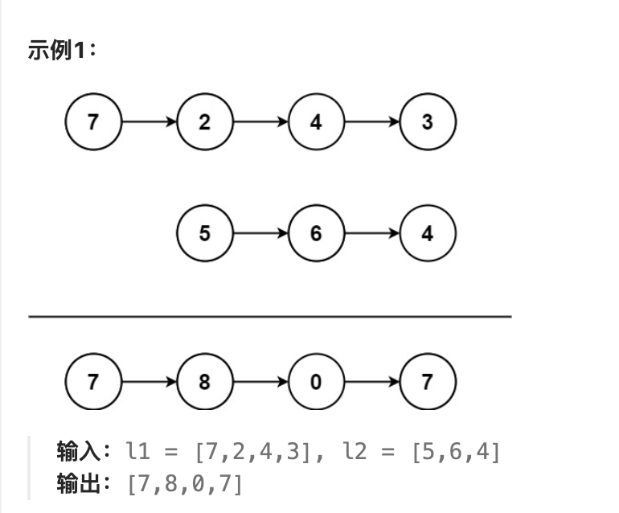

思路：

这道题是** 2. 两数相加 **的进阶问题，我们模拟加法运算当然是从最低位开始加，这样才能正确的处理进位。但现在单链表的开头是最高位，那么最直接的想法就是先  翻转链表，这样就可以继续玩第 2 题那一套了，没什么难度。

不过本题也说了，如果不让你反转链表怎么办？其实也好办，我们可以利用栈这种先进后出的数据结构，把链表节点从头到尾放进栈中，再从栈拿出来就是从尾到头的顺序，相当于是反转链表的效果，然后又回到了第 2 题的加法逻辑。

还有一个需要注意的是，计算结果的高位也应该放在结果链表的左侧，也就是插入到 `dummy` 节点的后面。具体看代码吧。

```go
/**
 * Definition for singly-linked list.
 * type ListNode struct {
 *     Val int
 *     Next *ListNode
 * }
 */
func addTwoNumbers(l1 *ListNode, l2 *ListNode) *ListNode {
    

    sk1,sk2 := []int{},[]int{}
		
  	// 入栈 l1链表
    p1 := l1
    for p1 != nil {

        sk1 = append(sk1,p1.Val)
        p1 = p1.Next
    }
		// 入栈 l2 链表
    p2 := l2
    for p2 != nil {

        sk2 = append(sk2,p2.Val)
        p2 = p2.Next
    }
	
  
  	// 定义 dummy节点
    dummy := &ListNode{Val:0,Next:nil}
    

    carry := 0 // 进位

    for len(sk1) != 0 || len(sk2) != 0 || carry != 0 {

        sum := 0
      	
        sum += carry
     		// 出栈求和
        if len(sk1) != 0 {
            sum += sk1[len(sk1)-1]
            sk1 = sk1[:len(sk1)-1]
        }
				// 出栈求和
        if len(sk2) != 0 {
            sum += sk2[len(sk2)-1]
            sk2 = sk2[:len(sk2)-1]
        }
       
        carry = sum / 10 // 进位
        val := sum % 10 // 余数
        
        // 将节点拼接到 dummy 后面（注意这里放置的位置）
        node := &ListNode{Val:val,Next:nil}
        node.Next = dummy.Next
        dummy.Next = node
    }
		
    return dummy.Next
}
```


## 442. 数组中重复的数据

给你一个长度为 `n` 的整数数组 `nums` ，其中 `nums` 的所有整数都在范围 `[1, n]` 内，且每个整数出现 **最多****两次** 。请你找出所有出现 **两次** 的整数，并以数组形式返回。

你必须设计并实现一个时间复杂度为 `O(n)` 且仅使用常量额外空间（不包括存储输出所需的空间）的算法解决此问题。

**示例 1：**

```
输入：nums = [4,3,2,7,8,2,3,1]
输出：[2,3]
```

**示例 2：**

```
输入：nums = [1,1,2]
输出：[1]
```

思路：

这道题就用常规的解法做吧，用哈希集合（也就是`map`)很容易找到 `nums` 中那些重复的元素。

但是题目要求使用常量的额外空间（看到这个，就是要我们直接在原始数组上做文章）

因为题目说 `nums` 中的元素取值都在 `[1, n]` 之间，即元素本身就和索引成映射关系，所以可以用 `nums` 本身模拟哈希集合的效果

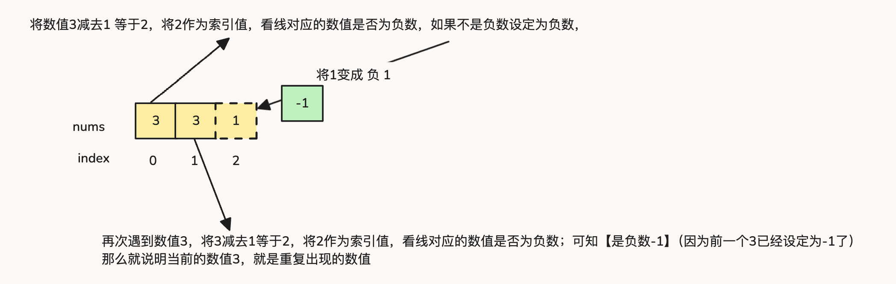

注意：用乘 -1 的方式给索引做标记的前提是，`nums` 中的元素都为正数，不能包含 0，否则无法区分该索引是否被标记。

```go
func findDuplicates(nums []int) []int {

	res := []int{}

   // 将每个数减 1 当作索引值，看下索引对应的 数值是否是负数，如果是负数，说明已经存在相同的数值，否则将值设定为负
	for i := 0; i < len(nums); i++ {
		
		idx := abs(nums[i]) - 1
		if nums[idx] > 0 { // 不是负数，要标记为负数；
			nums[idx] = -nums[idx]
		} else { // 是负数，说明当前元素是重复元素
			res = append(res, abs(nums[i]))
		}
	}
	return res
}

// 因为设定负数的原因，需要先转成正数
func abs(a int) int {
	if a < 0 {
		return -a
	}
	return a
}
```


## 45. 跳跃游戏 II

给定一个长度为 `n` 的 **0 索引**整数数组 `nums`。初始位置为 `nums[0]`。

每个元素 `nums[i]` 表示从索引 `i` 向后跳转的最大长度。换句话说，如果你在 `nums[i]` 处，你可以跳转到任意 `nums[i + j]` 处:

- `0 <= j <= nums[i]` 
- `i + j < n`

返回到达 `nums[n - 1]` 的最小跳跃次数。生成的测试用例可以到达 `nums[n - 1]`。

思路：

本题采用动态规划的思路，最简单容易理解

- 定义`dp[i]`：表示从`0`跳跃到`i`位置的最小跳跃次数
- 当前如果就处于`0`位置，就不需要跳跃，所以`dp[0] = 0`
- 当位于`i`位置的时候，我可以选择从`[0,i-1]`任意位置（前提能跳跃到`i`)跳跃到`i`位置，当然我们只需要记录下最小的次数即可

```go
func jump(nums []int) int {
   

    n := len(nums)
    
    // 定义dp数组
    dp := make([]int,n)
    //初始化dp数组，跳跃的次数为无穷大的数（n即可）跳跃次数肯定是不会大于n的
    for k,_ := range dp { 
        dp[k] = n
    }

    dp[0] = 0 // base case 不用跳跃

    for i := 1;i < n;i++ {
        for j :=0;j < i ;j++ { // i之前的j跳跃到i位置(找最小的记录下来)

            if j + nums[j] >= i { // 说明从j位置可以跳跃到i位置
                dp[i] = min(dp[j]+1,dp[i])
            }
        }
    }
    return dp[n-1]
}

func min(a,b int) int {
    if a < b {
        return a
    }
    return b
}
```


## LCR 121. 寻找目标值-二维数组

`m`*`n` 的二维数组 `plants` 记录了园林景观的植物排布情况，具有以下特性：

- 每行中，每棵植物的右侧相邻植物不矮于该植物；
- 每列中，每棵植物的下侧相邻植物不矮于该植物。

 请判断 `plants` 中是否存在目标高度值 `target`。

思路：

本题和 **240. 搜索二维矩阵II**相同。

我们不要从左上角开始，而是从右上角开始，规定只能向左或向下移动。

你注意，如果向左移动，元素在减小，如果向下移动，元素在增大，这样的话我们就可以根据当前位置的元素和 `target` 的相对大小来判断应该往哪移动，不断接近从而找到 `target` 的位置。

```go
func findTargetIn2DPlants(plants [][]int, target int) bool {
    row := len(plants) // 获取行数
    if row == 0 { // 特殊情况，如果row=0,直接不存在二维数组，直接返回
        return false
    }
    
    column := len(plants[0]) //获取列数

    i,j := 0,column-1 // 第0行第n-1列(从右上角开始遍历二维数组)

    for i <  row && j >= 0 {

        if plants[i][j] == target {
            return true
        } else if plants[i][j]  < target {
            i++ // 下行的数据更大
        } else {
           j-- // 左列的数据更小
        }
    }
    // 没找到，默认返回 false
    return false
}
```


## LCR 161. 连续天数的最高销售额

某公司每日销售额记于整数数组 `sales`，请返回所有 **连续** 一或多天销售额总和的最大值。

要求实现时间复杂度为 `O(n)` 的算法。 

**示例 1：**

```
输入：sales = [-2,1,-3,4,-1,2,1,-5,4]
输出：6
解释：[4,-1,2,1] 此连续四天的销售总额最高，为 6。
```

**示例 2：**

```
输入：sales = [5,4,-1,7,8]
输出：23
解释：[5,4,-1,7,8] 此连续五天的销售总额最高，为 23。
```


